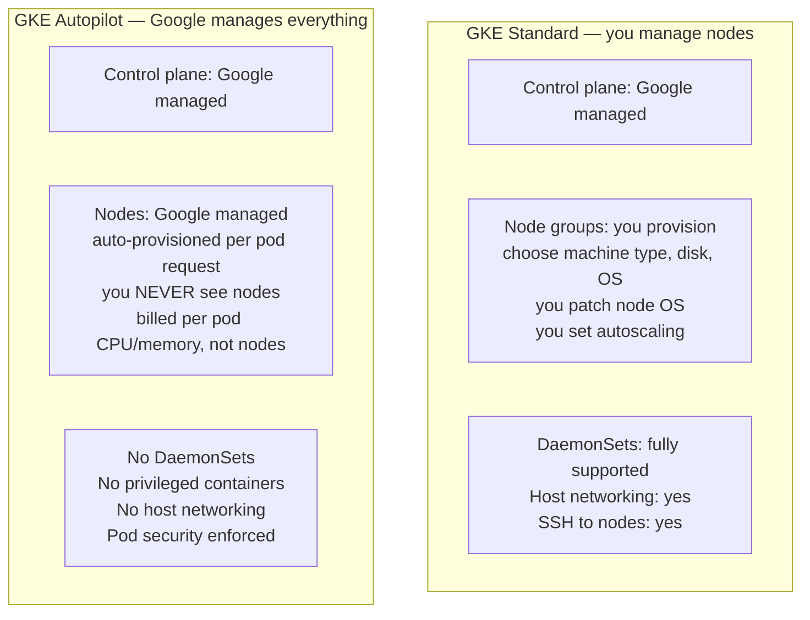
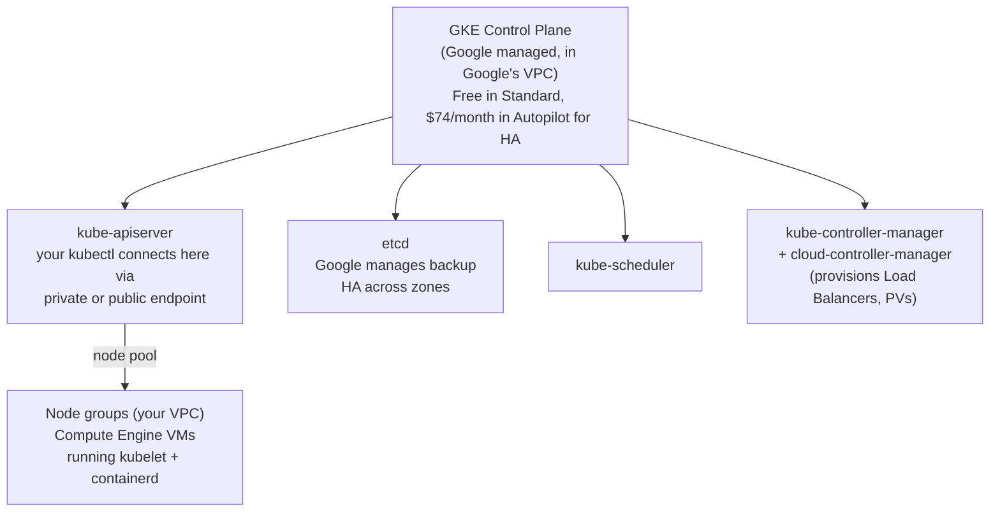
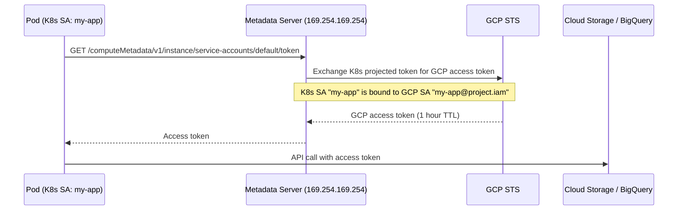
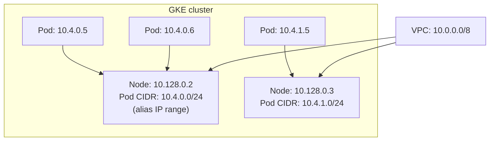
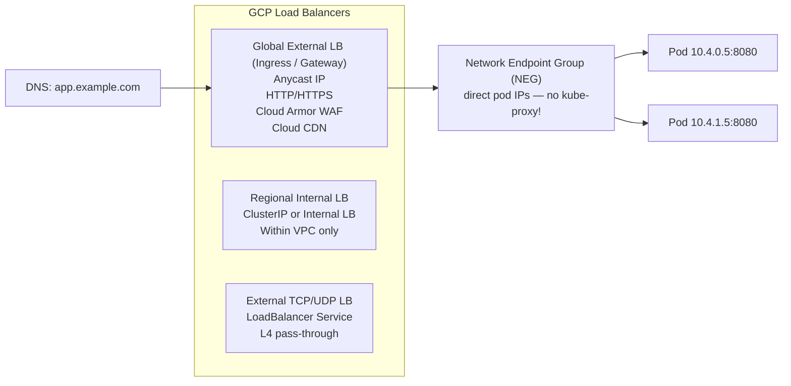

# GKE — Google Kubernetes Engine

GKE is GCP's managed Kubernetes. Google invented Kubernetes, so GKE gets features before any other cloud (Autopilot, Workload Identity, GKE Gateway, etc.).

---

## GKE Modes



| Feature | Standard | Autopilot |
|---------|---------|-----------|
| Node management | You | Google |
| Billing | Per node (whether idle or not) | Per pod (only what you use) |
| DaemonSets | Yes | No |
| Privileged pods | Yes | No |
| Custom node images | Yes | No |
| Best for | Complex workloads, AI/GPU, custom OS | Typical microservices, cost efficiency |

---

## Control Plane



**Regional vs Zonal cluster:**
- **Zonal:** control plane in one zone. Zone outage = no API (but running workloads continue). Free.
- **Regional:** control plane replicated across 3 zones. Survives zone outage. +$74/month.

---

## Workload Identity — The Right Way to Access GCP APIs

Never put service account keys in pods. Workload Identity maps a K8s ServiceAccount to a GCP IAM Service Account.



```bash
# Setup Workload Identity
gcloud iam service-accounts create my-app-sa

# Bind K8s SA → GCP SA
gcloud iam service-accounts add-iam-policy-binding \
  my-app-sa@PROJECT.iam.gserviceaccount.com \
  --role roles/iam.workloadIdentityUser \
  --member "serviceAccount:PROJECT.svc.id.goog[NAMESPACE/KSA_NAME]"

# Annotate the K8s ServiceAccount
kubectl annotate serviceaccount KSA_NAME \
  iam.gke.io/gcp-service-account=my-app-sa@PROJECT.iam.gserviceaccount.com
```

---

## GKE Networking — VPC-Native (Alias IPs)



**Alias IPs:** Pod IPs are real VPC IPs — no overlay network, no encapsulation. Pods are directly routable from any VM in the VPC. No VXLAN overhead.

**This is different from EKS:** EKS VPC CNI also gives pods real VPC IPs (similar), but the default pod CIDR is a secondary range rather than alias IPs.

---

## GKE Load Balancing



**Container-native load balancing (NEG):** GCP LB talks directly to pod IPs — bypasses kube-proxy and NodePort entirely. Lower latency, better health checking, pods visible directly in GCP console.

```yaml
# Ingress with container-native LB
apiVersion: networking.k8s.io/v1
kind: Ingress
metadata:
  annotations:
    kubernetes.io/ingress.class: "gce"
    cloud.google.com/neg: '{"ingress": true}'  # enable NEG
spec:
  rules:
  - host: app.example.com
    http:
      paths:
      - path: /*
        backend:
          service:
            name: my-service
            port:
              number: 8080
```

---

## Node Pools and GPU

```bash
# Add a GPU node pool
gcloud container node-pools create gpu-pool \
  --cluster my-cluster \
  --region us-central1 \
  --machine-type n1-standard-4 \
  --accelerator type=nvidia-tesla-t4,count=1 \
  --num-nodes 0 \        # start at 0
  --enable-autoscaling \
  --min-nodes 0 \        # scale to zero when no GPU workloads
  --max-nodes 4 \
  --node-taints nvidia.com/gpu=present:NoSchedule

# Install NVIDIA drivers automatically (GKE manages this)
kubectl apply -f https://raw.githubusercontent.com/GoogleCloudPlatform/container-engine-accelerators/master/nvidia-driver-installer/cos/daemonset-preloaded.yaml
```

---

## GKE Autopilot Limits

```yaml
# Autopilot: minimum pod resource requests enforced
resources:
  requests:
    cpu: 250m      # minimum 250m (Autopilot enforces)
    memory: 512Mi  # minimum 512Mi
  limits:
    cpu: 250m      # requests == limits (Guaranteed QoS — Autopilot requirement)
    memory: 512Mi

# No: DaemonSets, hostNetwork, privileged, hostPID
# No: node selectors for specific machine types
# Yes: GPU workloads (Autopilot provisions GPU nodes automatically)
```

---

## GKE Upgrade Strategy

```bash
# Check available versions
gcloud container get-server-config --region us-central1

# Enable auto-upgrade (recommended)
gcloud container node-pools update default-pool \
  --cluster my-cluster \
  --region us-central1 \
  --enable-autoupgrade

# Use release channels (tracks stable/regular/rapid)
gcloud container clusters update my-cluster \
  --region us-central1 \
  --release-channel regular  # regular = ~monthly, stable = ~quarterly

# Maintenance windows: only upgrade during specific hours
gcloud container clusters update my-cluster \
  --maintenance-window-start 2024-01-15T02:00:00Z \
  --maintenance-window-end 2024-01-15T06:00:00Z \
  --maintenance-window-recurrence "FREQ=WEEKLY;BYDAY=SA,SU"
```
