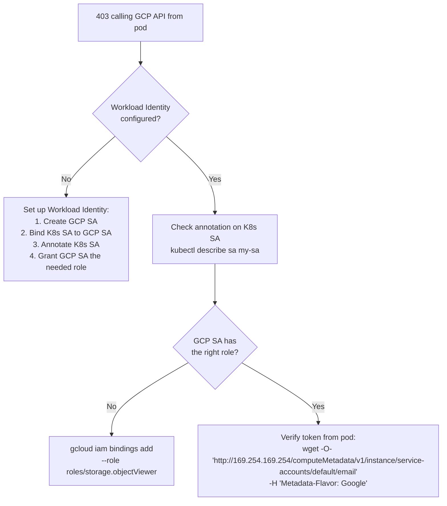
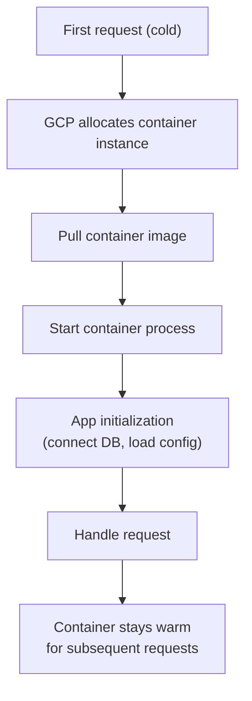

# GCP Debugging Scenarios

---

## 1. GKE Pod Can't Access Cloud Storage / BigQuery

**Symptom:** Pod gets `403 Permission Denied` calling GCP APIs.



```bash
# Step 1: Verify Workload Identity is enabled on cluster
gcloud container clusters describe my-cluster --region us-central1 \
  --format="value(workloadIdentityConfig)"

# Step 2: Check K8s SA annotation
kubectl describe serviceaccount my-app -n my-namespace
# Annotations: iam.gke.io/gcp-service-account=my-app@project.iam.gserviceaccount.com

# Step 3: Check IAM binding
gcloud iam service-accounts get-iam-policy my-app@project.iam.gserviceaccount.com
# Should show: serviceAccount:project.svc.id.goog[namespace/ksa-name] with workloadIdentityUser

# Step 4: Test from inside pod
kubectl exec -it my-pod -- curl -H "Metadata-Flavor: Google" \
  "http://169.254.169.254/computeMetadata/v1/instance/service-accounts/default/email"
# Should return: my-app@project.iam.gserviceaccount.com

# Prevention: always use Workload Identity — never mount service account JSON keys
```

---

## 2. GKE Node Pool Scaling Not Working

**Symptom:** Pods stuck Pending despite Cluster Autoscaler configured, nodes not adding.

```bash
# Check autoscaler logs
kubectl -n kube-system logs -l component=cluster-autoscaler --tail=50

# Common messages:
# "Scale-up blocked by group minimum"  → min nodes = current count
# "Node pool has reached max size"      → increase max-nodes
# "No pending pods"                     → pods have tolerations but no requests

# Check node pool limits
gcloud container node-pools describe default-pool \
  --cluster my-cluster --region us-central1 \
  --format="yaml(autoscaling)"

# Check if autoscaler is enabled
gcloud container clusters describe my-cluster --region us-central1 \
  --format="value(autoscaling.enableNodeAutoprovisioning)"

# Prevention: set explicit resource requests on ALL pods
# HPA/CA both require resource requests to function
```

---

## 3. BigQuery Query Costs Unexpectedly High

**Symptom:** Daily BigQuery bill much higher than expected.

```sql
-- Find expensive queries in last 24 hours
SELECT
  job_id,
  user_email,
  query,
  total_bytes_processed / 1e12 AS tb_scanned,
  (total_bytes_processed / 1e12) * 5 AS cost_usd,
  creation_time
FROM `region-us`.INFORMATION_SCHEMA.JOBS_BY_PROJECT
WHERE creation_time > TIMESTAMP_SUB(CURRENT_TIMESTAMP(), INTERVAL 1 DAY)
  AND job_type = 'QUERY'
  AND statement_type != 'SCRIPT'
ORDER BY total_bytes_processed DESC
LIMIT 20;

-- Find tables without partitioning (most common cause)
SELECT table_name, row_count, size_bytes/1e9 AS size_gb
FROM `project.dataset`.INFORMATION_SCHEMA.TABLE_STORAGE
WHERE total_partitions = 0 AND size_bytes > 1e10  -- >10GB unpartitioned
ORDER BY size_bytes DESC;
```

```bash
# Fix: require partition filters on large tables
bq update --require_partition_filter project:dataset.orders

# Set billing cap per query (prevents runaway queries)
# In BigQuery console: Project → Edit → Maximum bytes billed
bq query --maximum_bytes_billed=10000000000 \   # 10GB max
  'SELECT ...'

# Prevention:
# 1. Partition all large tables by date
# 2. Set require_partition_filter=true
# 3. Grant BigQuery Job User (not Data Owner) to analysts
```

---

## 4. Cloud Run Service Cold Start Latency

**Symptom:** First request to Cloud Run takes 10+ seconds.



```bash
# Check cold start frequency
gcloud logging read \
  'resource.type="cloud_run_revision" AND textPayload:"Cold start"' \
  --limit 50

# Mitigations:
# 1. Minimum instances (keep N instances warm, costs money)
gcloud run services update my-service \
  --min-instances 1 \
  --region us-central1

# 2. Reduce image size (faster pull)
# Use distroless or scratch base images

# 3. Optimize startup (lazy initialization — connect DB on first request, not at startup)

# 4. Use CPU boost (GCP gives extra CPU during startup)
gcloud run services update my-service \
  --cpu-boost

# 5. Use startup probe correctly — Cloud Run doesn't use K8s probes
# but Cloud Run waits for the container to listen on $PORT before routing
```

---

## 5. Spanner High Latency or Hotspot

**Symptom:** Spanner p99 latency spikes, or one node has much higher CPU than others.

```bash
# Check for hotspots using Key Visualizer
# GCP Console → Spanner → Instance → Key Visualizer
# Bright spots indicate hot row ranges

# Common causes of hotspots in Spanner:
# 1. UUID-based primary keys with sequential generation → monotonic inserts
# 2. Timestamp as leading key → all recent inserts on same split
# 3. Low cardinality leading key column

# Fix: use UUIDs generated randomly (not sequentially)
# Or use bit-reversed sequences:
# Spanner auto-shards on boundary values — random UUIDs distribute naturally

# Check Spanner metrics
gcloud monitoring read \
  'metric.type="spanner.googleapis.com/instance/cpu/utilization_by_priority"' \
  --start="2024-01-15T00:00:00Z" --end="2024-01-15T01:00:00Z"

# Prevention: design schema to avoid hotspots
# Use INTERLEAVE for parent-child relationships (not FK joins)
```

---

## 6. Pub/Sub Messages Piling Up (High Backlog)

**Symptom:** `subscription/num_undelivered_messages` metric growing, consumers not keeping up.

```bash
# Check subscription backlog
gcloud pubsub subscriptions describe my-subscription \
  --format="value(numUndeliveredMessages,oldestUnackedMessage)"

# Check if messages are being nacked (errors)
# High nack rate = consumer processing errors
gcloud logging read \
  'resource.type="pubsub_subscription" AND labels.subscription_id="my-subscription"' \
  --limit 20

# Scale up consumers
kubectl scale deployment my-consumer --replicas=10

# Tune subscription settings:
gcloud pubsub subscriptions modify-push-config my-subscription \
  --ack-deadline=60  # give consumers more time (default 10s)

# Dead letter topic: failed messages after N retries go here
gcloud pubsub subscriptions modify-dead-letter-policy my-subscription \
  --dead-letter-topic=my-dlq \
  --max-delivery-attempts=5

# Prevention:
# 1. Use push subscriptions → Pub/Sub pushes to Cloud Run (auto-scales)
# 2. Use BigQuery subscriptions → messages written directly to BQ table
# 3. Set appropriate ack deadline (longer than max processing time)
```

---

## 7. GCS Bucket Access Denied from External

**Symptom:** `gsutil` or SDK call returns 403 from outside GCP.

```bash
# Check bucket IAM
gcloud storage buckets get-iam-policy gs://my-bucket

# Check if object is public
gsutil acl get gs://my-bucket/my-file.txt

# Grant specific access
gcloud storage buckets add-iam-policy-binding gs://my-bucket \
  --member="serviceAccount:my-app@project.iam.gserviceaccount.com" \
  --role="roles/storage.objectViewer"

# Generate signed URL for temporary public access (no IAM needed for requester)
gsutil signurl -d 1h -m GET my-service-account-key.json gs://my-bucket/file.txt

# Check if uniform bucket-level access is enabled (disables ACLs)
gcloud storage buckets describe gs://my-bucket \
  --format="value(iamConfiguration.uniformBucketLevelAccess)"
# If true: can't use object ACLs, only bucket-level IAM
```

---

## Quick Reference: GCP Debug Commands

| Problem | First command |
|---------|--------------|
| GKE pod can't access GCP API | `kubectl exec -- curl -H "Metadata-Flavor: Google" http://169.254.169.254/...` |
| GKE node not scaling | `kubectl -n kube-system logs -l component=cluster-autoscaler` |
| BigQuery cost spike | `SELECT ... FROM INFORMATION_SCHEMA.JOBS_BY_PROJECT ORDER BY total_bytes_processed DESC` |
| Pub/Sub backlog | `gcloud pubsub subscriptions describe ... --format="value(numUndeliveredMessages)"` |
| Cloud Run cold start | `gcloud run services update --min-instances 1` |
| Permission denied | `gcloud projects get-iam-policy PROJECT --flatten="bindings[].members" --filter="bindings.members:USER"` |
| Spanner hotspot | GCP Console → Spanner → Key Visualizer |
