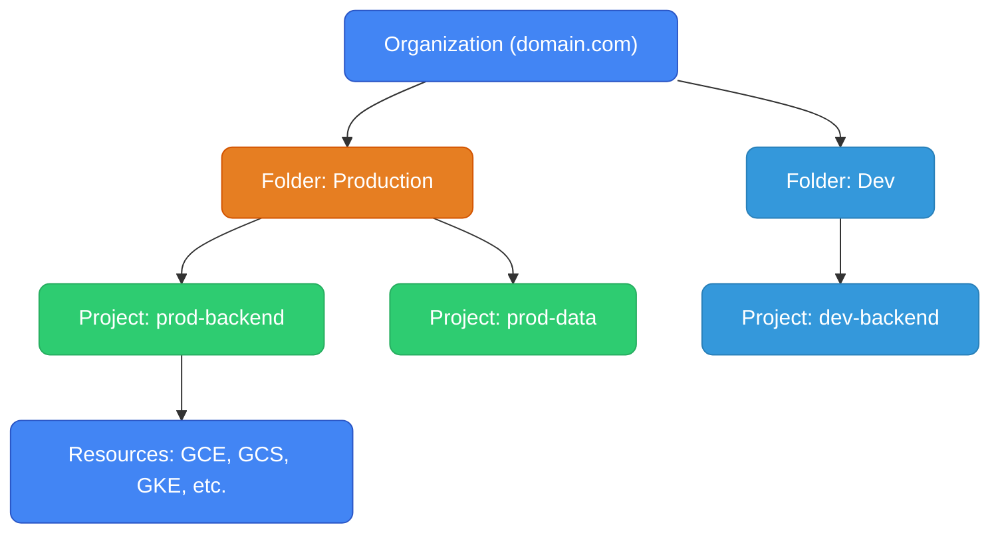
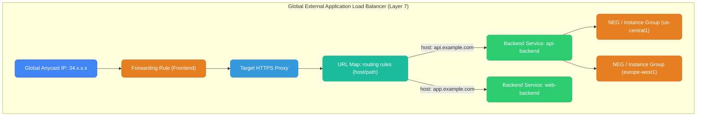
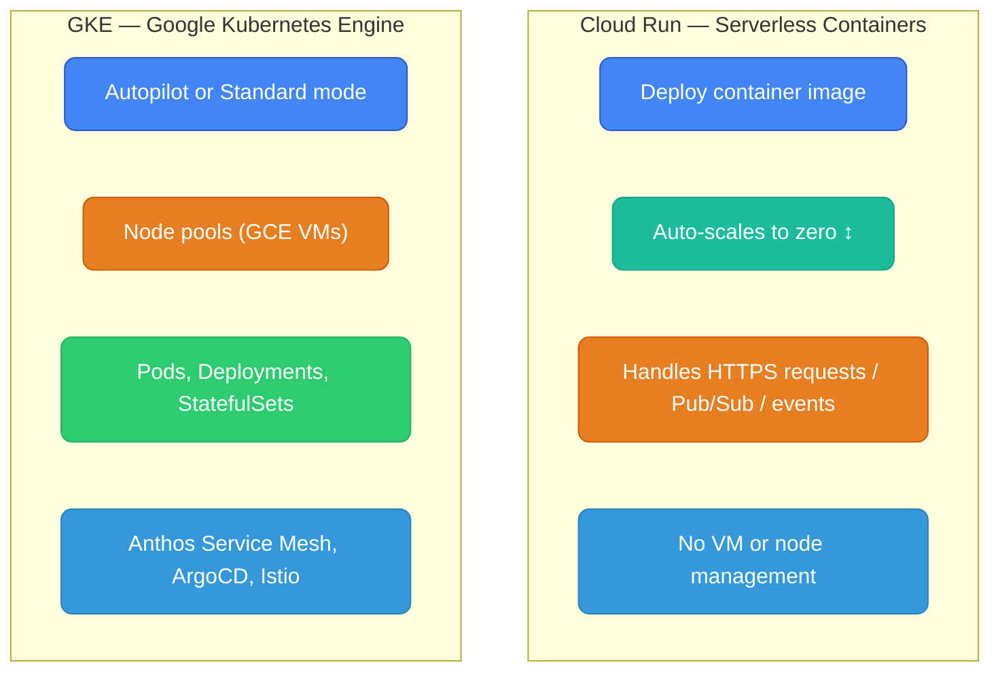
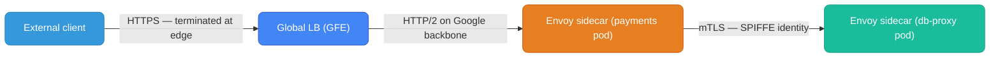

# GCP Services Overview

IAM, load balancers, DNS, and compute orchestration — GCP building blocks every backend engineer works with.

---

## IAM (Identity and Access Management)

GCP IAM controls **who** (member) can do **what** (role/permission) on **which** resource. The model is `member + role → resource`.

### Core Concepts

**Members (Identities):**
- `user:` — Google account (human)
- `serviceAccount:` — machine identity for apps/VMs/GKE pods
- `group:` — Google Group (collection of users)
- `allUsers` / `allAuthenticatedUsers` — public access (use carefully)

**Roles (what they can do):**
- **Primitive** — `roles/owner`, `roles/editor`, `roles/viewer` — broad, avoid in prod
- **Predefined** — e.g. `roles/storage.objectViewer`, `roles/container.developer` — fine-grained, Google-managed
- **Custom** — you define exact permissions, e.g. `compute.instances.get` only

**Policy binding:** Attaches a member to a role on a resource.

```json
{
  "bindings": [
    {
      "role": "roles/storage.objectViewer",
      "members": ["serviceAccount:my-app@my-project.iam.gserviceaccount.com"]
    }
  ]
}
```

### Resource Hierarchy



IAM policies **inherit downward** — a binding at the Organization level applies to all folders, projects, and resources within it. This is additive; you can't deny at a lower level what's allowed higher up (no deny overrides like AWS explicit deny).

**AWS parallel:** AWS doesn't have a native Organization → Folder → Account hierarchy at the IAM policy level in the same way. GCP's hierarchy maps loosely to AWS Organizations + SCPs.

### Service Accounts

Service accounts are both an **identity** (for IAM bindings) and a **credential source** (for apps). A GCE VM or GKE pod runs as a service account automatically.

```bash
# Create a service account
gcloud iam service-accounts create my-app-sa \
  --display-name="My App Service Account"

# Grant it a role on a specific resource
gcloud storage buckets add-iam-policy-binding gs://my-bucket \
  --member="serviceAccount:my-app-sa@my-project.iam.gserviceaccount.com" \
  --role="roles/storage.objectViewer"
```

### Workload Identity (for GKE)

GKE pods authenticate to GCP APIs as a service account without any key files — using **Workload Identity**. A Kubernetes Service Account is bound to a GCP Service Account.

```
K8s Pod → K8s Service Account → bound to → GCP Service Account → IAM roles → GCP APIs
```

```bash
# Bind K8s SA to GCP SA
gcloud iam service-accounts add-iam-policy-binding my-app-sa@project.iam.gserviceaccount.com \
  --role="roles/iam.workloadIdentityUser" \
  --member="serviceAccount:project.svc.id.goog[namespace/k8s-sa-name]"
```

**AWS parallel:** AWS IRSA (IAM Roles for Service Accounts) via OIDC token exchange. GCP Workload Identity is GCP's equivalent — both eliminate the need for credential files in pods.

### IAM: GCP vs AWS

| | GCP IAM | AWS IAM |
|--|---------|---------|
| **Model** | member + role → resource | principal + policy (identity or resource-based) |
| **Deny rules** | No explicit deny (additive only) | Yes — explicit Deny overrides Allow |
| **Resource hierarchy** | Org → Folder → Project → Resource | Account → Resource (no Folder concept) |
| **Cross-account** | Workload Identity Federation | AssumeRole via STS |
| **Machine identity** | Service Account (vm/pod runs as SA) | IAM Role (EC2 instance profile, IRSA) |
| **Policy attachment** | Binding on resource | Policy attached to identity or resource |

---

## Cloud Load Balancing

GCP load balancers are **globally distributed** using Google's anycast network — a single IP serves traffic from the nearest PoP worldwide. This is fundamentally different from AWS where ALBs are regional.



### Load Balancer Types

| Type | Layer | Scope | SSL | Use case |
|------|-------|-------|-----|----------|
| **Global Ext App LB** | L7 HTTP/HTTPS | Global | Terminates | Web apps, APIs, CDN offload |
| **Regional Ext App LB** | L7 HTTP/HTTPS | Regional | Terminates | Regional isolation, VPC Service Controls |
| **Internal App LB** | L7 HTTP/HTTPS | Regional | Terminates | Service mesh, internal microservices |
| **Ext Proxy NLB** | L4 TCP/SSL | Global | Pass-through/terminate | TCP apps, gaming, global static IPs |
| **Internal Passthrough NLB** | L4 TCP/UDP | Regional | None | Internal TCP/UDP services |
| **Ext Passthrough NLB** | L4 TCP/UDP | Regional | None | Legacy regional TCP/UDP |

### Backend Types

GCP load balancers support multiple backend types:

| Backend | Description | AWS analog |
|---------|-------------|-----------|
| **Instance Group** (Managed/Unmanaged) | GCE VMs in a group | Auto Scaling Group |
| **NEG — Zonal** | Specific GCE VM IPs/ports | IP target type |
| **NEG — Serverless** | Cloud Run / App Engine | Lambda target |
| **NEG — Internet** | External endpoint (outside GCP) | Weighted target group |
| **NEG — Private Service Connect** | PSC endpoint | PrivateLink endpoint |

### GCP ALB vs AWS ALB

| | GCP Global App LB | AWS ALB |
|--|---|---|
| **Scope** | Global anycast, single IP | Regional (multi-AZ within one region) |
| **Routing** | Host/path/header | Host/path/header |
| **SSL termination** | Yes | Yes |
| **Backend** | Instance Groups, NEGs, Cloud Run | EC2, ECS/EKS (IP target), Lambda |
| **WAF** | Google Cloud Armor | AWS WAF |
| **CDN** | Cloud CDN integrated | CloudFront (separate) |
| **Cost** | Per forwarding rule + data | Per LCU + data |

### Cloud Armor (WAF)

```bash
# Create a security policy
gcloud compute security-policies create my-waf-policy

# Block a CIDR range
gcloud compute security-policies rules create 1000 \
  --security-policy=my-waf-policy \
  --src-ip-ranges="1.2.3.0/24" \
  --action=deny-403

# Attach to backend service
gcloud compute backend-services update my-backend \
  --security-policy=my-waf-policy \
  --global
```

---

## Cloud DNS

Cloud DNS is a **managed authoritative DNS** service — equivalent to AWS Route 53 (private and public zones).

### Zone Types

| Zone | Purpose |
|------|---------|
| **Public zone** | Serves DNS queries from the internet |
| **Private zone** | Serves DNS only from specified VPCs |
| **Forwarding zone** | Forwards queries for a domain to external nameservers (on-prem DNS) |
| **Peering zone** | Delegates a zone from one VPC to another VPC's DNS |

```bash
# Create a public zone
gcloud dns managed-zones create my-zone \
  --dns-name="example.com." \
  --visibility=public \
  --description="Production zone"

# Add an A record
gcloud dns record-sets create api.example.com. \
  --zone=my-zone \
  --type=A \
  --ttl=300 \
  --rrdatas="34.1.2.3"
```

### DNS Record Types

| Type | Purpose |
|------|---------|
| `A` | Domain → IPv4 |
| `AAAA` | Domain → IPv6 |
| `CNAME` | Alias to another domain (not at apex) |
| `MX` | Mail server |
| `TXT` | SPF, DKIM, verification |
| `SRV` | Service location |

**Note:** GCP Cloud DNS does NOT have an ALIAS record type like AWS Route 53. For apex domains pointing to a GCP load balancer, use an `A` record with the load balancer's static IP. (GCP's Global LB gives you a static anycast IP — so you can use a plain `A` record at the apex, unlike AWS where the ALB has a dynamic IP requiring ALIAS.)

### Private DNS for GKE

```bash
# Private zone scoped to your VPC
gcloud dns managed-zones create internal-zone \
  --dns-name="internal.example.com." \
  --visibility=private \
  --networks=my-vpc
```

### GCP Cloud DNS vs AWS Route 53

| | GCP Cloud DNS | AWS Route 53 |
|--|---|---|
| **Routing policies** | Weighted, Geo, Failover (via routing policies) | Weighted, Latency, Geolocation, Failover, Multi-value |
| **Health checks** | Via uptime checks integrated separately | Native, tightly coupled to routing |
| **Apex domain** | A record (LB has static IP) | ALIAS record (LB has dynamic DNS) |
| **Private DNS** | Private zones per VPC | Private hosted zones per VPC |
| **DNS forwarding** | Forwarding zones (to on-prem) | Resolver endpoints (Route 53 Resolver) |
| **Cost** | $0.20/zone/month + queries | $0.50/zone/month + queries |

---

## Cloud Run vs GKE

GCP's serverless container service and managed Kubernetes — the GCP parallel to AWS ECS Fargate vs EKS.



### Cloud Run Deep Dive

- Deploy a container image, Cloud Run handles infrastructure entirely
- **Scales to zero** — no requests = no cost (unlike ECS which keeps tasks running)
- **Concurrency model:** each container instance handles multiple concurrent requests (configurable, default 80)
- Supports HTTP, gRPC, WebSockets, Pub/Sub push subscriptions
- **Cloud Run Jobs** — for batch/one-shot workloads (parallel to ECS Tasks with `--launch-type=FARGATE`)

```bash
gcloud run deploy my-service \
  --image=gcr.io/my-project/my-app:latest \
  --region=us-central1 \
  --platform=managed \
  --allow-unauthenticated \
  --min-instances=0 \
  --max-instances=100
```

### GKE Modes

| Mode | Description |
|------|-------------|
| **Autopilot** | Google manages nodes, node pools, scaling. You only define Pods. Billed per pod resource request. Recommended default. |
| **Standard** | You manage node pools. Full control over machine types, taints, GPUs, custom OS images. |

```bash
# GKE Autopilot cluster (no node management)
gcloud container clusters create-auto my-cluster \
  --region=us-central1

# GKE Standard with a node pool
gcloud container clusters create my-cluster \
  --zone=us-central1-a \
  --machine-type=n2-standard-4 \
  --num-nodes=3
```

### GKE Autopilot vs Standard

| | Autopilot | Standard |
|--|-----------|----------|
| **Node management** | Google-managed | You manage |
| **Billing** | Per pod (CPU/memory requested) | Per node (VM cost regardless of usage) |
| **DaemonSets** | No (Autopilot runs Google-managed DS only) | Yes |
| **Node access (SSH)** | No | Yes |
| **GPU nodes** | Limited | Yes |
| **Best for** | Most workloads, lower ops overhead | Custom hardware, DaemonSets, tuning |

### Cloud Run vs GKE vs AWS

| | Cloud Run | GKE Autopilot | GKE Standard | AWS ECS Fargate | AWS EKS |
|--|-----------|---------------|--------------|-----------------|---------|
| **Scale to zero** | Yes | No | No | No | No |
| **Kubernetes API** | No | Yes | Yes | No | Yes |
| **Node management** | None | None | Full control | None | Partial (managed node groups) |
| **DaemonSets** | No | No | Yes | No | Yes |
| **Concurrency/request model** | Per request, concurrent | Per pod | Per pod | Per task | Per pod |
| **Cold start** | Yes (~100ms-2s) | No | No | No | No |
| **Best for** | Stateless HTTP/event workloads | K8s without node ops | Full platform engineering | Simple containers, AWS-native | Microservices, platform eng |

---

## TLS and mTLS on GCP

### TLS Termination at Cloud Load Balancer

The Global External Application LB terminates TLS at Google's edge PoPs worldwide — closer to users than a regional ALB.

```
External client (London)
    │  HTTPS (TLS 1.3)
    ▼
Google Edge PoP (Frankfurt) — terminates TLS, holds Google-managed cert
    │  HTTP/2 (encrypted on Google backbone)
    ▼
Backend: GCE/GKE/Cloud Run (us-central1)
```

Google-managed certificates auto-renew with no manual action:

```bash
gcloud compute ssl-certificates create my-cert \
  --domains=api.example.com \
  --global
# GCP auto-provisions and renews via Let's Encrypt/Google CA
```

### Anthos Service Mesh / Cloud Service Mesh (mTLS)

GCP's managed Istio service mesh. Provides mTLS between services inside GKE with automatic certificate rotation — equivalent to AWS App Mesh or self-managed Istio on EKS.



**Key GCP advantage:** Cloud Service Mesh manages the Istio control plane — no Istiod to operate. SPIFFE certs are rotated automatically via Google Certificate Authority Service.
