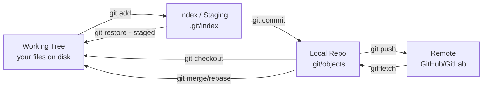
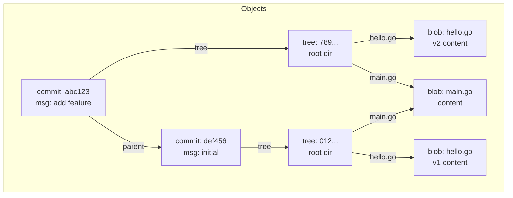
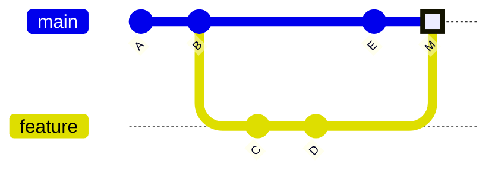

# Git Internals

## 1. Object Model

Git stores everything as **content-addressed objects** in `.git/objects/`. Four types:

| Object | Contains | Created by |
|---|---|---|
| **blob** | raw file content (no name/path) | `git add` |
| **tree** | directory listing: mode + name + SHA → blob/tree | `git commit` |
| **commit** | tree SHA + parent SHA(s) + author + message | `git commit` |
| **tag** | annotated tag: object SHA + tagger + message | `git tag -a` |

**Content-addressed**: SHA = `sha1(type + space + size + \0 + content)`. Same content = same SHA always.

```
SHA-1: 40 hex chars (160-bit). Legacy, still default.
SHA-256: 64 hex chars (256-bit). Enable with: git init --object-format=sha256
```

Storage: `.git/objects/ab/cdef1234...` — first 2 chars = directory, rest = filename.

```bash
# Inspect any object
git cat-file -t <sha>      # type
git cat-file -p <sha>      # pretty-print content

# Example:
git cat-file -p HEAD       # shows commit object
git cat-file -p HEAD^{tree} # shows root tree
git ls-tree HEAD            # list tree entries
```

---

## 2. Working Tree → Index → Local Repo → Remote



| Command | Transition |
|---|---|
| `git add` | working tree → index |
| `git commit` | index → local repo |
| `git push` | local repo → remote |
| `git fetch` | remote → local repo (FETCH_HEAD) |
| `git pull` | fetch + merge/rebase |
| `git checkout / restore` | local repo / index → working tree |

---

## 3. Refs

Refs are files in `.git/refs/` containing a SHA (or another ref for symbolic refs).

| Ref | Location | Meaning |
|---|---|---|
| `HEAD` | `.git/HEAD` | current branch or detached commit |
| `main` | `.git/refs/heads/main` | tip of main branch |
| `origin/main` | `.git/refs/remotes/origin/main` | last known remote tip |
| `ORIG_HEAD` | `.git/ORIG_HEAD` | pre-merge/rebase HEAD (for undo) |
| `FETCH_HEAD` | `.git/FETCH_HEAD` | last fetched SHA |
| `MERGE_HEAD` | `.git/MERGE_HEAD` | SHA being merged (during merge) |

**HEAD** is a symbolic ref: `ref: refs/heads/main`. In detached state it contains a raw SHA.

**Lightweight tag**: just a ref pointing to a commit SHA. No object created.  
**Annotated tag**: creates a tag object (has tagger, message, signature). Points to commit.

```bash
git tag v1.0              # lightweight
git tag -a v1.0 -m "msg"  # annotated (creates tag object)
git cat-file -t v1.0      # "commit" vs "tag"
```

---

## 4. Pack Files

**Loose objects**: one file per object. Fine for small repos.  
**Pack files**: Git bundles objects together for efficiency.

```
git gc                          → pack loose objects
git gc --aggressive             → more compression
git count-objects -v            → see loose vs packed counts
```

Pack format:
- `.git/objects/pack/pack-<sha>.pack` — the objects (delta-compressed)
- `.git/objects/pack/pack-<sha>.idx`  — index for fast lookup by SHA

Delta compression: similar objects stored as base + delta. A file's history stores diffs, not full copies. Git stores the **newest version** as the base and older versions as deltas (reverse delta).

```bash
git verify-pack -v .git/objects/pack/pack-*.idx | sort -k3 -n | tail -10
# Shows largest objects in pack by size
```

---

## 5. Index (Staging Area) Internals

The index is a **binary file** at `.git/index`. It is a snapshot of the working tree ready for the next commit.

Each entry contains:
- file mode, UID/GID, file size, mtime
- SHA of the blob
- file path (relative to repo root)
- flags (merge stage: 0=normal, 1/2/3=conflict stages)

```bash
git ls-files --stage          # dump index entries
git ls-files -u               # show conflict (unmerged) entries
```

During a merge conflict, the index holds **3 stages** for conflicted files:
- Stage 1: common ancestor (base)
- Stage 2: ours (HEAD)
- Stage 3: theirs (MERGE_HEAD)

---

## 6. Merge vs Rebase Internals

### 3-Way Merge

Git finds the **merge base** (common ancestor commit), then applies changes from both branches:

```
merge base = git merge-base branch1 branch2
```

If the same lines changed in both → conflict. Git writes conflict markers to the working tree.

**Fast-forward merge**: when no divergence exists (one branch is an ancestor of the other). HEAD pointer just moves forward. No merge commit created.

```bash
git merge --ff-only feature   # fail if not fast-forwardable
git merge --no-ff feature     # always create merge commit
```

### Rebase Internals

Rebase **replays commits** one by one onto a new base:

1. Find common ancestor of current branch and target
2. Extract patches (diffs) for each commit on current branch
3. Reset current branch to target
4. Apply each patch in order as new commits (new SHAs!)

```
git rebase main
# Equivalent to:
# git checkout main && git cherry-pick <commit1> <commit2> ...
```

**Key difference**: rebase rewrites history (new SHAs). Never rebase shared/public branches.

---

## 7. Reflog

The reflog records every movement of a ref (HEAD, branches). It is **local only** and expires after 90 days by default.

```bash
git reflog                    # HEAD reflog
git reflog show main          # main branch reflog
git reflog --all              # all refs
```

### Recover Deleted Branch

```bash
# 1. Find the SHA of the deleted branch tip
git reflog | grep "branch-name"
# or: git log --walk-reflogs --oneline

# 2. Recreate the branch
git checkout -b branch-name <sha>
# or: git branch branch-name <sha>
```

### Recover Deleted Commits (reset --hard undo)

```bash
git reflog                    # find SHA before reset
git reset --hard <sha>        # restore HEAD to that point
# or: git checkout -b recovery <sha>
```

---

## Object DAG & Commit Graph




