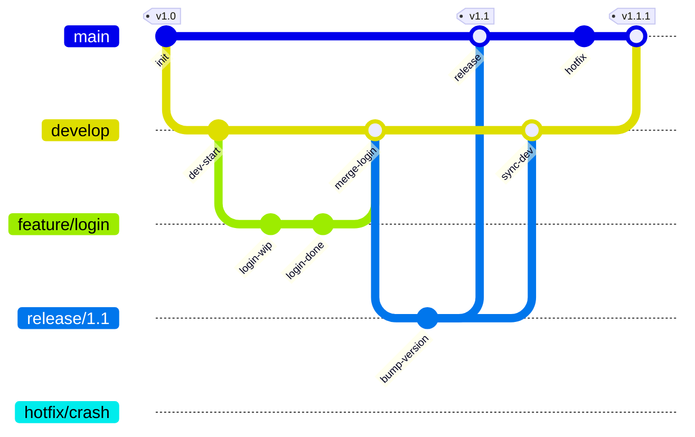
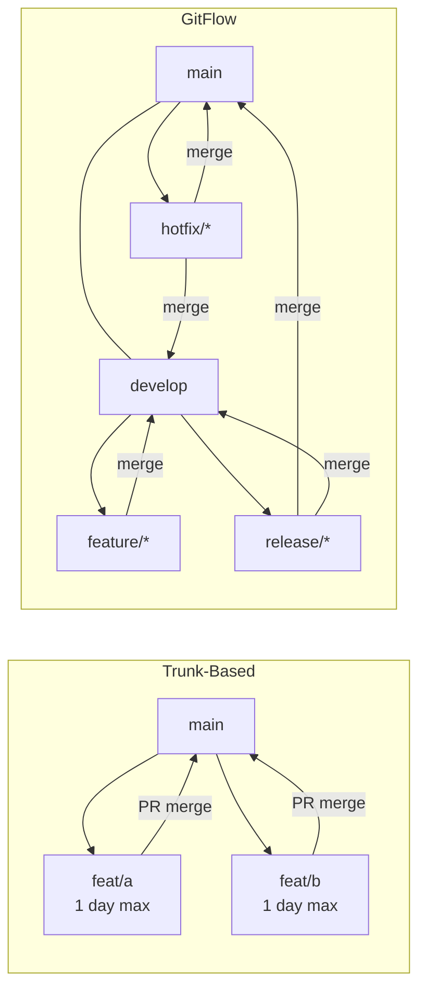

# Git Workflows

## 1. Workflow Comparison

| | Trunk-Based | GitHub Flow | GitFlow |
|---|---|---|---|
| **Main branches** | `main` only | `main` | `main` + `develop` |
| **Feature branches** | short-lived (< 1 day) | any length | feature/* |
| **Release process** | continuous deploy | deploy on merge | release/* branch |
| **Hotfix** | fix on trunk | fix on main | hotfix/* branch |
| **Complexity** | low | low | high |
| **Best for** | CI/CD, small teams | SaaS / web apps | versioned releases |
| **Merge to main** | direct / tiny PR | PR only | via develop only |
| **History** | linear, clean | linear | complex merge graph |

---

## 2. GitFlow

Five branch types:

| Branch | Purpose | Branches from | Merges into |
|---|---|---|---|
| `main` | production code, tags | — | — |
| `develop` | integration branch | `main` | — |
| `feature/*` | new features | `develop` | `develop` |
| `release/*` | release prep, bugfixes | `develop` | `main` + `develop` |
| `hotfix/*` | urgent prod fixes | `main` | `main` + `develop` |

```bash
# Feature
git checkout -b feature/login develop
# ... work ...
git checkout develop && git merge --no-ff feature/login

# Release
git checkout -b release/1.2 develop
# ... bump version, fix bugs ...
git checkout main && git merge --no-ff release/1.2
git tag -a v1.2
git checkout develop && git merge --no-ff release/1.2

# Hotfix
git checkout -b hotfix/fix-crash main
git checkout main && git merge --no-ff hotfix/fix-crash
git tag -a v1.1.1
git checkout develop && git merge --no-ff hotfix/fix-crash
```



---

## 3. Trunk-Based Development

All developers commit to `main` (trunk) daily. Feature branches live < 1–2 days.

**Key practices:**
- **Feature flags**: merge incomplete code behind a flag, enable in production when ready
- **Branch by abstraction**: refactor in place without long-lived branches
- **CI gates**: tests must pass before merge; no broken trunk ever

```bash
# Short-lived feature branch
git checkout -b feat/add-cache
# ... small focused change ...
git push origin feat/add-cache
# PR → review → merge same day
```

**Feature flags** (Go example):
```go
var featureFlags = map[string]bool{
    "new-checkout": os.Getenv("FF_NEW_CHECKOUT") == "true",
}

if featureFlags["new-checkout"] {
    return newCheckoutFlow(ctx, cart)
}
return legacyCheckoutFlow(ctx, cart)
```

---

## 4. GitHub Flow

Simplest workflow for teams with continuous deployment:

1. `main` is always deployable
2. Create a descriptive branch from `main`
3. Push commits, open a PR early (Draft PR for WIP)
4. Review, CI checks, iterate
5. Merge to `main` → auto-deploy

```bash
git checkout -b feature/user-auth
# ... commits ...
git push -u origin feature/user-auth
gh pr create --title "Add user auth" --body "Closes #42"
# After approval:
gh pr merge --squash
```

---

## 5. Monorepo Patterns

### Sparse Checkout
Check out only the subdirectory you need:
```bash
git clone --filter=blob:none --sparse https://github.com/org/monorepo
git sparse-checkout set services/api services/shared
```

### git worktree
Multiple working trees from one repo (no re-clone):
```bash
git worktree add ../repo-feature feature/my-feature
git worktree list
git worktree remove ../repo-feature
```

### Path-Based CI Triggers
Only run CI for changed paths (GitHub Actions):
```yaml
on:
  push:
    paths:
      - 'services/api/**'
      - 'services/shared/**'
```

---

## 6. Branch Protection & CODEOWNERS

**Branch protection rules** (GitHub):
```
Settings → Branches → Add rule for "main":
☑ Require pull request before merging
☑ Require approvals: 1
☑ Require status checks to pass (CI)
☑ Require branches to be up to date
☑ Do not allow bypassing the above settings
```

**CODEOWNERS** (`.github/CODEOWNERS`):
```
# Global owner
*                     @org/platform-team

# Service-specific
services/payments/    @org/payments-team
services/auth/        @org/security-team @org/auth-team

# Infrastructure
*.tf                  @org/infra-team
```

---

## 7. Conventional Commits & Semantic Versioning

**Conventional Commits** format:
```
<type>[optional scope]: <description>

[optional body]

[optional footer(s)]
```

| Type | Meaning | SemVer bump |
|---|---|---|
| `feat` | new feature | MINOR |
| `fix` | bug fix | PATCH |
| `feat!` or `BREAKING CHANGE` | breaking API change | MAJOR |
| `chore` | maintenance | none |
| `docs` | documentation | none |
| `refactor` | code change, no feature/fix | none |
| `perf` | performance improvement | PATCH |
| `ci` | CI config changes | none |

```bash
git commit -m "feat(auth): add OAuth2 login"
git commit -m "fix(db): handle nil connection gracefully"
git commit -m "feat!: remove deprecated /v1 API endpoints"
```

**Semantic Versioning**: `MAJOR.MINOR.PATCH`
- `1.0.0` → `1.0.1` (fix)
- `1.0.1` → `1.1.0` (feat)
- `1.1.0` → `2.0.0` (breaking)

Tools: `semantic-release`, `release-please`, `conventional-changelog`.

---

## 8. Merge Strategies

| Strategy | Command | Pros | Cons |
|---|---|---|---|
| **Merge commit** | `git merge --no-ff` | preserves full history, shows branch | noisy graph, merge commits |
| **Squash merge** | `git merge --squash` | clean linear history, one commit per PR | loses individual commits |
| **Rebase merge** | `git rebase main` + fast-forward | linear history, preserves commits | rewrites SHAs, can confuse |

```bash
# Merge commit
git checkout main && git merge --no-ff feature/x

# Squash
git checkout main && git merge --squash feature/x
git commit -m "feat: add x (#42)"

# Rebase merge
git checkout feature/x && git rebase main
git checkout main && git merge --ff-only feature/x
```

**Rule of thumb:**
- OSS/library: rebase (linear history, blame works well)
- Team SaaS: squash (clean log, each PR = one commit)
- GitFlow: merge commit (preserve branch structure)

---

## Workflow Comparison


