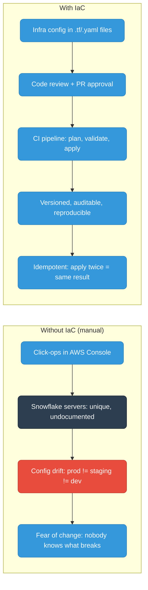
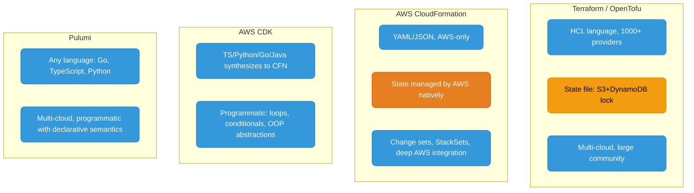
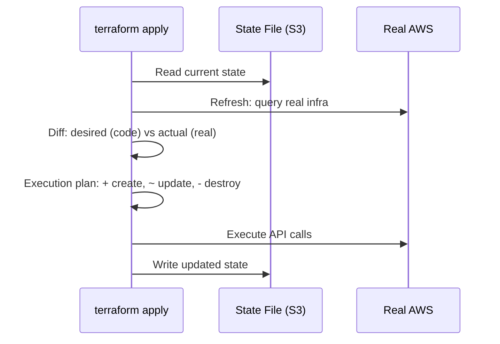
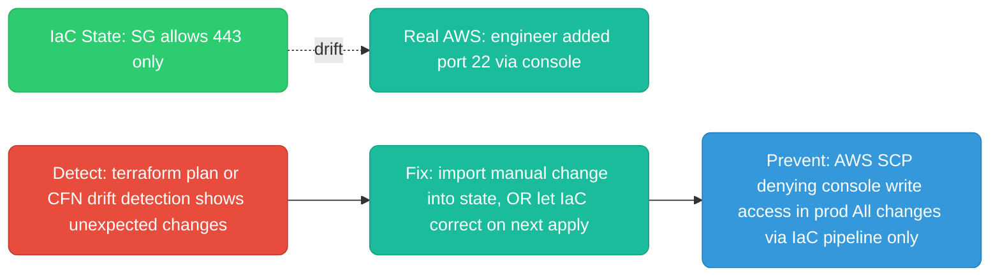
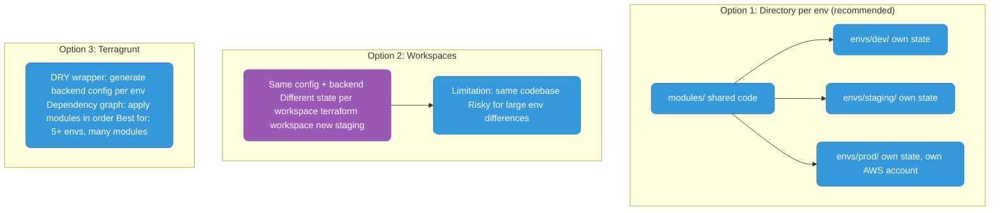

# Infrastructure as Code (IaC)

Managing infrastructure through versioned, reviewable code — the same discipline applied to application code.

---

## Why IaC



---

## Declarative vs Imperative

```mermaid
graph TD
    classDef blue fill:#3498db,stroke:#2980b9,color:#fff,rx:8
    classDef green fill:#2ecc71,stroke:#27ae60,color:#fff,rx:8
    classDef red fill:#e74c3c,stroke:#c0392b,color:#fff,rx:8
    classDef orange fill:#e67e22,stroke:#d35400,color:#fff,rx:8
    classDef purple fill:#9b59b6,stroke:#8e44ad,color:#fff,rx:8
    classDef teal fill:#1abc9c,stroke:#16a085,color:#fff,rx:8
    classDef dark fill:#2c3e50,stroke:#1a252f,color:#fff,rx:8
    classDef yellow fill:#f39c12,stroke:#d68910,color:#000,rx:8
    classDef k8s fill:#326ce5,stroke:#254ea8,color:#fff,rx:8
    classDef aws fill:#ff9900,stroke:#cc7a00,color:#000,rx:8
    subgraph Declarative["Declarative: Terraform, CloudFormation, Pulumi"]
        D1["Describe desired end state"]:::blue --> D2["Tool figures out HOW to get there"]:::blue
        D2 --> D3["Tool tracks state internally"]:::blue
    end

    subgraph Imperative["Imperative: Ansible, shell scripts, AWS CLI"]
        I1["Describe the steps in order"]:::blue --> I2["Order matters, idempotency is your problem"]:::blue
        I2 --> I3["Running twice may break things"]:::green
    end
```



| | Declarative | Imperative |
|--|-------------|-----------|
| You specify | What you want | How to do it |
| Idempotency | Built-in | Your responsibility |
| Diff/preview | Native (terraform plan, cdk diff) | Manual |
| Best for | Static infra (VPCs, DBs, LBs) | Config management, bootstrapping |

---

## Tools Comparison



| | Terraform | CloudFormation | CDK | Pulumi |
|--|-----------|---------------|-----|--------|
| Language | HCL | YAML/JSON | TS/Python/Go/Java | Any language |
| State | S3+DynamoDB (recommended) | AWS-managed | AWS-managed (via CFN) | Pulumi Cloud / self-hosted |
| Cloud | Multi-cloud | AWS only | AWS only | Multi-cloud |
| Preview | `terraform plan` | Change sets | `cdk diff` | `pulumi preview` |
| Best for | Multi-cloud, OSS ecosystem | AWS-native, managed service preferred | Devs preferring real code over YAML | Teams wanting full language features |

---

## State Management

State tracks what the tool thinks currently exists. Without it, the tool can't compute what to create, update, or destroy.



**Remote state with locking:**

```hcl
terraform {
  backend "s3" {
    bucket         = "my-tf-state"
    key            = "prod/terraform.tfstate"
    region         = "us-east-1"
    encrypt        = true
    dynamodb_table = "tf-state-lock"  # prevents concurrent applies corrupting state
  }
}
```

---

## Drift

Drift = actual infra differs from what IaC thinks it is. Caused by manual console/CLI changes outside the IaC workflow.



**Prevention is the goal:** SCPs (Service Control Policies) that deny all manual writes in production accounts. No human IAM write permissions in prod — changes must go through the pipeline.

---

## Environment Isolation



| Option | State isolation | DRY | Separate AWS accounts | Best for |
|--------|----------------|-----|----------------------|----------|
| Directories | Full | Partial | Yes | Small-medium teams |
| Workspaces | Yes (per workspace) | Full | No | Similar envs, simple configs |
| Terragrunt | Full | Full | Yes | Large teams, many environments |

**Recommendation:** Directories + shared modules. Terragrunt when you hit 5+ environments.

---

## Secrets in IaC

```mermaid
graph LR
    classDef blue fill:#3498db,stroke:#2980b9,color:#fff,rx:8
    classDef green fill:#2ecc71,stroke:#27ae60,color:#fff,rx:8
    classDef red fill:#e74c3c,stroke:#c0392b,color:#fff,rx:8
    classDef orange fill:#e67e22,stroke:#d35400,color:#fff,rx:8
    classDef purple fill:#9b59b6,stroke:#8e44ad,color:#fff,rx:8
    classDef teal fill:#1abc9c,stroke:#16a085,color:#fff,rx:8
    classDef dark fill:#2c3e50,stroke:#1a252f,color:#fff,rx:8
    classDef yellow fill:#f39c12,stroke:#d68910,color:#000,rx:8
    classDef k8s fill:#326ce5,stroke:#254ea8,color:#fff,rx:8
    classDef aws fill:#ff9900,stroke:#cc7a00,color:#000,rx:8
    BAD["Hardcoded in .tf or tfvars committed to git"]:::green -->|"never do this"| GOOD
    subgraph GOOD["Secure patterns"]
        ENV["TF_VAR_x env var: set by CI from vault"]:::blue
        SENS["sensitive=true: hides from plan output"]:::blue
        DATASRC["data source: pull from SSM/Vault at apply time"]:::yellow
        SOPS["SOPS+KMS: encrypted tfvars safe to commit"]:::blue
    end
```



```hcl
variable "db_password" {
  type      = string
  sensitive = true   # hidden from CLI output and logs
}

# Pull from AWS SSM at apply time — never stored in config
data "aws_ssm_parameter" "db_password" {
  name            = "/prod/db/password"
  with_decryption = true
}
```

```bash
# .gitignore
*.tfvars
terraform.tfstate
terraform.tfstate.backup
.terraform/
```

---

## count vs for_each

```mermaid
graph TD
    classDef blue fill:#3498db,stroke:#2980b9,color:#fff,rx:8
    classDef green fill:#2ecc71,stroke:#27ae60,color:#fff,rx:8
    classDef red fill:#e74c3c,stroke:#c0392b,color:#fff,rx:8
    classDef orange fill:#e67e22,stroke:#d35400,color:#fff,rx:8
    classDef purple fill:#9b59b6,stroke:#8e44ad,color:#fff,rx:8
    classDef teal fill:#1abc9c,stroke:#16a085,color:#fff,rx:8
    classDef dark fill:#2c3e50,stroke:#1a252f,color:#fff,rx:8
    classDef yellow fill:#f39c12,stroke:#d68910,color:#000,rx:8
    classDef k8s fill:#326ce5,stroke:#254ea8,color:#fff,rx:8
    classDef aws fill:#ff9900,stroke:#cc7a00,color:#000,rx:8
    subgraph CountDanger["count: index-based — dangerous for removals"]
        C1["users = [alice, bob, carol]"]:::blue --> C2["index 0=alice, 1=bob, 2=carol"]:::blue
        C2 --> C3["Remove bob: index 1 shifts to carol Destroy+recreate carol and alice!"]:::yellow
    end

    subgraph ForEachSafe["for_each: key-based — safe for removals"]
        F1["users = {alice, bob, carol}"]:::blue --> F2["key alice, key bob, key carol"]:::blue
        F2 --> F3["Remove bob: only bob's resource destroyed alice and carol untouched"]:::blue
    end
```



**Rule:** Always `for_each` for dynamic resources. Only `count` for simple enable/disable: `count = var.enable_monitoring ? 1 : 0`.

---

## Lifecycle Rules

```hcl
resource "aws_instance" "web" {
  lifecycle {
    create_before_destroy = true   # new resource created BEFORE old destroyed (zero downtime)
    prevent_destroy       = true   # blocks destroy — protects prod DBs, S3 buckets
    ignore_changes        = [tags] # ignore attrs managed externally (AWS auto-tags)
    replace_triggered_by  = [aws_security_group.web.id]  # force replace when dependency changes
  }
}
```

| Rule | Use for |
|------|---------|
| `create_before_destroy` | EC2, ECS services — must have no downtime during replacement |
| `prevent_destroy` | Production databases, S3 buckets — protect from accidental destroy |
| `ignore_changes` | Tags/attrs managed by AWS or external tools |
| `replace_triggered_by` | Force replacement when a dependency changes but Terraform wouldn't detect it |
