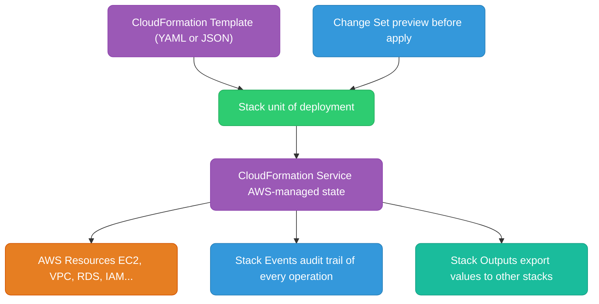
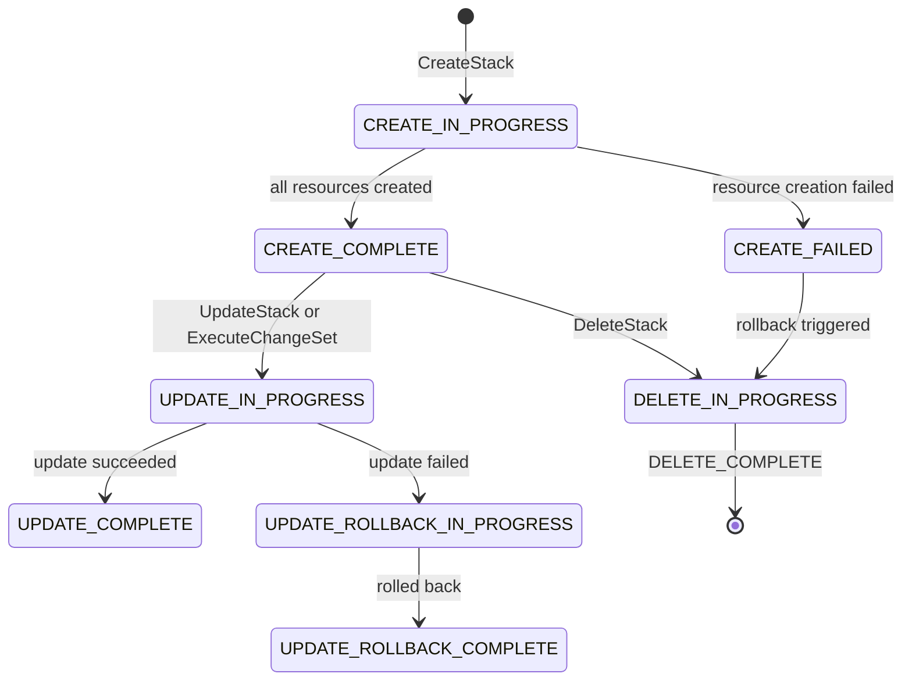
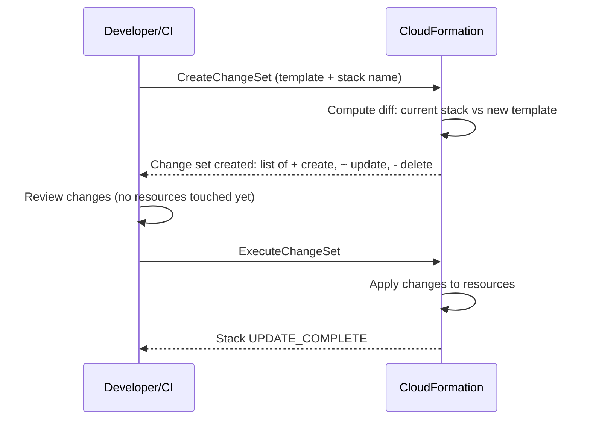
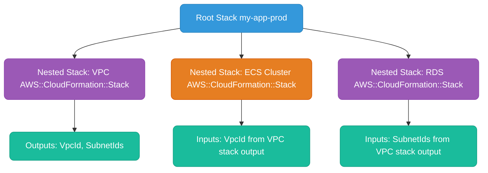
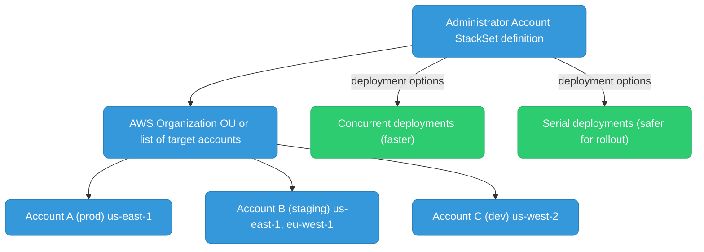
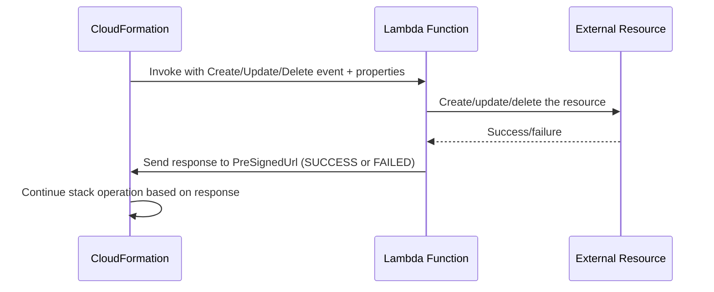

# AWS CloudFormation

CloudFormation is AWS's native IaC service. Unlike Terraform, state is fully managed by AWS — no state files to backup, no DynamoDB lock tables. Deep integration with every AWS service.

---

## Architecture



---

## Stack Lifecycle



**Rollback behavior:** If any resource fails during stack creation or update, CloudFormation automatically rolls back all changes in that operation. You see `ROLLBACK_COMPLETE` — all changes are undone.

---

## Template Structure

```yaml
AWSTemplateFormatVersion: "2010-09-09"
Description: "My application stack"

Parameters:
  Environment:
    Type: String
    AllowedValues: [dev, staging, prod]
    Default: dev
  InstanceType:
    Type: String
    Default: t3.micro

Mappings:
  EnvToAMI:
    us-east-1:
      prod: ami-0abcdef1234567890
      dev:  ami-0fedcba9876543210

Conditions:
  IsProd: !Equals [!Ref Environment, prod]

Resources:
  WebServer:
    Type: AWS::EC2::Instance
    Properties:
      InstanceType: !Ref InstanceType
      ImageId: !FindInMap [EnvToAMI, !Ref AWS::Region, !Ref Environment]
      Tags:
        - Key: Environment
          Value: !Ref Environment

  # Conditional resource — only created in prod
  BackupBucket:
    Type: AWS::S3::Bucket
    Condition: IsProd
    Properties:
      BucketName: !Sub "${AWS::StackName}-backup-${AWS::AccountId}"

Outputs:
  WebServerPublicIP:
    Value: !GetAtt WebServer.PublicIp
    Export:
      Name: !Sub "${AWS::StackName}-WebServerIP"
```

**Intrinsic functions:**

| Function | Use |
|----------|-----|
| `!Ref` | Reference parameter or resource logical ID |
| `!GetAtt` | Get attribute of a resource (`!GetAtt MyBucket.Arn`) |
| `!Sub` | String substitution (`!Sub "arn:aws:s3:::${BucketName}/*"`) |
| `!FindInMap` | Look up value in Mappings |
| `!If` | Conditional value based on Condition |
| `!ImportValue` | Import output exported by another stack |
| `!Join` | Join strings (`!Join [":", [a, b, c]]` → `a:b:c`) |
| `!Select` | Select by index from a list |

---

## Change Sets

Change sets are CloudFormation's equivalent of `terraform plan` — preview what will happen before executing.



```bash
# Create a change set
aws cloudformation create-change-set \
  --stack-name my-stack \
  --template-body file://template.yaml \
  --change-set-name my-changes \
  --parameters ParameterKey=Environment,ParameterValue=prod

# Review the change set
aws cloudformation describe-change-set \
  --stack-name my-stack \
  --change-set-name my-changes

# Execute (actually apply)
aws cloudformation execute-change-set \
  --stack-name my-stack \
  --change-set-name my-changes
```

**Replacement vs Update:** Change sets show if a change requires replacement (resource destroyed and recreated) vs in-place update. A replacement of an RDS instance = data loss risk — the change set warns you.

---

## Nested Stacks

Break large templates into smaller reusable components using `AWS::CloudFormation::Stack`.



```yaml
Resources:
  VPCStack:
    Type: AWS::CloudFormation::Stack
    Properties:
      TemplateURL: https://s3.amazonaws.com/my-bucket/vpc.yaml
      Parameters:
        CIDR: "10.0.0.0/16"

  ECSStack:
    Type: AWS::CloudFormation::Stack
    Properties:
      TemplateURL: https://s3.amazonaws.com/my-bucket/ecs.yaml
      Parameters:
        VpcId: !GetAtt VPCStack.Outputs.VpcId
        SubnetIds: !GetAtt VPCStack.Outputs.PrivateSubnets
```

**Cross-stack references (alternative to nested stacks):**

```yaml
# Stack A exports
Outputs:
  VpcId:
    Export:
      Name: my-app-prod-VpcId
    Value: !Ref VPC

# Stack B imports
Resources:
  Subnet:
    Properties:
      VpcId: !ImportValue my-app-prod-VpcId
```

Cross-stack references create a hard dependency — you cannot delete Stack A while Stack B imports its value.

---

## StackSets

Deploy a single CloudFormation template across **multiple AWS accounts and/or regions** from one operation.



**Use cases:**
- Deploy security baselines (CloudTrail, GuardDuty, Config Rules) to all accounts
- Enforce IAM password policy across an organization
- Deploy shared networking (Transit Gateway attachments) to all accounts

```bash
aws cloudformation create-stack-set \
  --stack-set-name security-baseline \
  --template-body file://baseline.yaml \
  --capabilities CAPABILITY_NAMED_IAM

aws cloudformation create-stack-instances \
  --stack-set-name security-baseline \
  --deployment-targets OrganizationalUnitIds=["ou-xxxx-yyyyyyy"] \
  --regions us-east-1 eu-west-1
```

---

## Drift Detection

```bash
# Detect drift on a stack
aws cloudformation detect-stack-drift --stack-name my-stack

# Check drift status
aws cloudformation describe-stack-drift-detection-status \
  --stack-drift-detection-id <detection-id>

# See which resources drifted and how
aws cloudformation describe-stack-resource-drifts \
  --stack-name my-stack \
  --stack-resource-drift-status-filters MODIFIED DELETED
```

CFN drift detection compares the current live resource configuration against what the template defines. Drifted resources show `MODIFIED` or `DELETED`.

**Fix:** Remediate by either updating the template to match reality and re-deploying, or manually fixing the resource to match the template.

---

## Custom Resources

When CloudFormation doesn't natively support a resource type, use Custom Resources backed by Lambda.



```yaml
Resources:
  # Lambda function that handles the custom logic
  MyCustomResourceFunction:
    Type: AWS::Lambda::Function
    Properties:
      Handler: index.handler
      Runtime: python3.12
      Code:
        ZipFile: |
          import boto3, cfnresponse
          def handler(event, context):
            if event['RequestType'] == 'Create':
              # do something with event['ResourceProperties']
              cfnresponse.send(event, context, cfnresponse.SUCCESS, {'OutputKey': 'value'})

  # The custom resource that triggers the Lambda
  MyCustomResource:
    Type: Custom::MyResource
    Properties:
      ServiceToken: !GetAtt MyCustomResourceFunction.Arn
      MyParam: "some-value"

# Use the output
Outputs:
  CustomOutput:
    Value: !GetAtt MyCustomResource.OutputKey
```

**Common use cases:** DNS record creation in external providers, database schema initialization, Slack/PagerDuty notifications on stack events, resource types not yet in CloudFormation.
