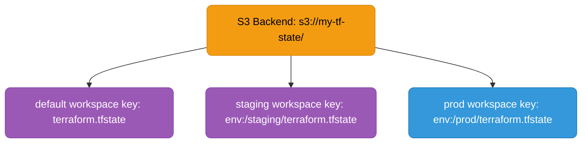
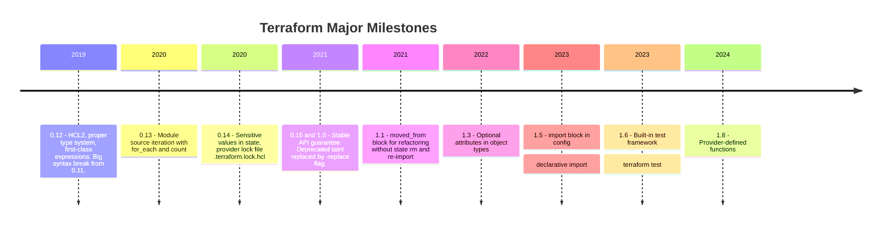

# Terraform Deep-Dive

---

## How Terraform Works

```mermaid
graph LR
    classDef blue fill:#3498db,stroke:#2980b9,color:#fff,rx:8
    classDef green fill:#2ecc71,stroke:#27ae60,color:#fff,rx:8
    classDef red fill:#e74c3c,stroke:#c0392b,color:#fff,rx:8
    classDef orange fill:#e67e22,stroke:#d35400,color:#fff,rx:8
    classDef purple fill:#9b59b6,stroke:#8e44ad,color:#fff,rx:8
    classDef teal fill:#1abc9c,stroke:#16a085,color:#fff,rx:8
    classDef dark fill:#2c3e50,stroke:#1a252f,color:#fff,rx:8
    classDef yellow fill:#f39c12,stroke:#d68910,color:#000,rx:8
    classDef k8s fill:#326ce5,stroke:#254ea8,color:#fff,rx:8
    classDef aws fill:#ff9900,stroke:#cc7a00,color:#000,rx:8
    HCL[".tf files: desired state"]:::blue --> INIT["terraform init download providers, init backend"]:::blue
    INIT --> PLAN["terraform plan read state + refresh + compute diff"]:::purple
    PLAN --> DIFF["Execution plan + create, ~ update, - destroy"]:::blue
    DIFF --> APPLY["terraform apply API calls to provider"]:::blue
    APPLY --> STATE["terraform.tfstate record of what was created"]:::purple
    STATE --> PLAN
```



---

## Core Commands

| Command | What it does |
|---------|-------------|
| `terraform init` | Download providers, initialize backend |
| `terraform plan` | Show what changes will be made (implicitly refreshes state) |
| `terraform apply` | Apply the plan (prompts for confirmation) |
| `terraform apply -auto-approve` | Apply without prompt (CI use only) |
| `terraform destroy` | Destroy all managed resources |
| `terraform apply -refresh-only` | Sync state with real infra without making changes (replaces deprecated `terraform refresh`) |
| `terraform fmt` | Format HCL files |
| `terraform validate` | Validate config syntax |
| `terraform output` | Show output values |

---

## Workspaces

Workspaces give you isolated state files within the **same backend and same codebase**. Each workspace has its own state.



```bash
terraform workspace new staging      # create workspace
terraform workspace select prod      # switch to prod
terraform workspace list             # list all workspaces
terraform workspace show             # current workspace
```

```hcl
# Use workspace name to vary resources
locals {
  instance_type = terraform.workspace == "prod" ? "t3.large" : "t3.micro"
}

resource "aws_instance" "web" {
  instance_type = local.instance_type
  tags = {
    Environment = terraform.workspace
  }
}
```

**Limitation:** Workspaces share the same backend and codebase. For true env isolation (separate AWS accounts, different backend configs), use **separate directories** or **Terragrunt**.

---

## State Operations

### terraform import

Bring an existing real resource under Terraform management:

```bash
# Classic syntax
terraform import aws_instance.web i-1234567890abcdef0

# Declarative import (Terraform 1.5+) — define in config, then run apply
import {
  to = aws_instance.web
  id = "i-1234567890abcdef0"
}
```

Use when: resource was created manually, you need to adopt it without recreating it. After import, write matching config to avoid plan showing changes.

### terraform state rm

Remove a resource from state without destroying the real resource:

```bash
terraform state rm aws_instance.web
terraform state rm 'module.vpc.aws_subnet.public[0]'  # escape brackets in shell
```

Use when: module refactoring (remove from one module, re-import to another), or stop managing a resource.

### terraform apply -replace

Force destroy + recreate of a specific resource:

```bash
terraform apply -replace="aws_instance.web"
terraform apply -replace="module.ecs.aws_ecs_service.app"
```

Use when: resource is subtly broken but Terraform thinks it's healthy. Replaced the deprecated `terraform taint` command (v0.15.2+).

### State file operations

```bash
terraform state list                          # list all resources in state
terraform state show aws_instance.web         # show details of one resource
terraform state mv aws_instance.old aws_instance.new  # rename/move resource
terraform state pull > backup.tfstate         # backup state
```

---

## Drift Detection and Fix

```bash
# Detect drift: shows resources that changed outside Terraform
terraform plan   # unexpected changes = drift

# Sync state without making changes (inspect what drifted)
terraform apply -refresh-only

# Fix option 1: let Terraform correct it
terraform apply   # Terraform reverts manual change back to desired state

# Fix option 2: accept the manual change
terraform apply -refresh-only   # update state to match reality
# Then update your .tf config to match
```

---

## DB User Management Example

Full example: create multiple DB users with `for_each`, random passwords stored in Secrets Manager.

```hcl
terraform {
  required_providers {
    mysql = {
      source  = "petoju/mysql"
      version = "~> 3.0"
    }
  }
}

locals {
  # Set is stable — adding/removing one user only affects that user
  db_users = toset(["svc_payments", "svc_reporting", "svc_audit"])
}

resource "random_password" "passwords" {
  for_each = local.db_users
  length   = 24
  special  = false
}

resource "mysql_user" "app_users" {
  for_each = local.db_users

  user               = each.key
  host               = "%"
  plaintext_password = random_password.passwords[each.key].result
}

resource "aws_secretsmanager_secret" "db_passwords" {
  for_each = local.db_users
  name     = "db/${each.key}/password"
}

resource "aws_secretsmanager_secret_version" "db_passwords" {
  for_each      = local.db_users
  secret_id     = aws_secretsmanager_secret.db_passwords[each.key].id
  secret_string = random_password.passwords[each.key].result
}
```

**Key points:**
- `for_each` not `count` — keyed by username, safe to remove a user without cascading destroy
- `random_password` IS stored in state — **encrypt your state file** (S3 SSE + KMS)
- Passwords stored in Secrets Manager — apps use IRSA to fetch at runtime, never in environment variables

---

## Version History



```bash
terraform version   # check current version
```

**Current stable:** Terraform 1.x (1.6–1.9 range as of 2025–2026). OpenTofu is the OSS fork maintained by the community after HashiCorp's BSL license change in 2023.

---

## HCL Patterns

### Dynamic blocks

```hcl
# Instead of repeating ingress blocks
resource "aws_security_group" "web" {
  dynamic "ingress" {
    for_each = var.allowed_ports
    content {
      from_port   = ingress.value
      to_port     = ingress.value
      protocol    = "tcp"
      cidr_blocks = ["0.0.0.0/0"]
    }
  }
}
```

### Local values

```hcl
locals {
  common_tags = {
    Project     = var.project
    Environment = terraform.workspace
    ManagedBy   = "terraform"
  }
}

resource "aws_instance" "web" {
  tags = merge(local.common_tags, { Name = "web-server" })
}
```

### Data sources

```hcl
# Reference existing resources not managed by this config
data "aws_vpc" "main" {
  filter {
    name   = "tag:Name"
    values = ["prod-vpc"]
  }
}

resource "aws_subnet" "app" {
  vpc_id = data.aws_vpc.main.id
  # ...
}
```

### Module outputs and dependencies

```hcl
module "vpc" {
  source = "./modules/vpc"
  cidr   = "10.0.0.0/16"
}

module "ecs" {
  source    = "./modules/ecs"
  vpc_id    = module.vpc.vpc_id          # implicit dependency
  subnet_ids = module.vpc.private_subnets
}
```
