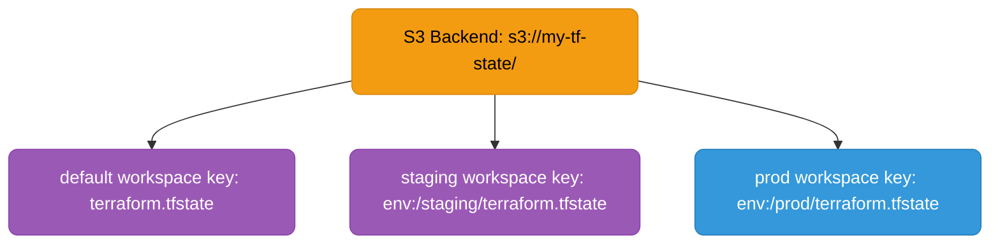
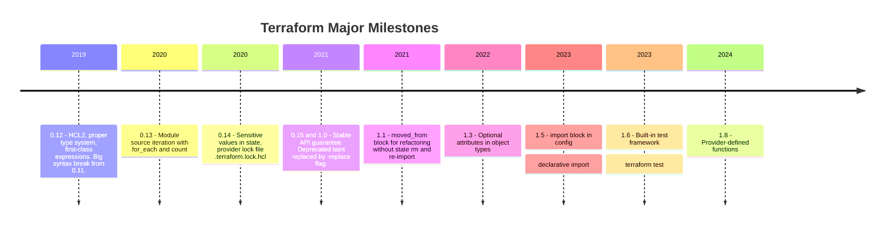

# Terraform Deep-Dive

---

## How Terraform Works

```mermaid
graph LR
    classDef blue fill:#3498db,stroke:#2980b9,color:#fff,rx:8
    classDef green fill:#2ecc71,stroke:#27ae60,color:#fff,rx:8
    classDef red fill:#e74c3c,stroke:#c0392b,color:#fff,rx:8
    classDef orange fill:#e67e22,stroke:#d35400,color:#fff,rx:8
    classDef purple fill:#9b59b6,stroke:#8e44ad,color:#fff,rx:8
    classDef teal fill:#1abc9c,stroke:#16a085,color:#fff,rx:8
    classDef dark fill:#2c3e50,stroke:#1a252f,color:#fff,rx:8
    classDef yellow fill:#f39c12,stroke:#d68910,color:#000,rx:8
    classDef k8s fill:#326ce5,stroke:#254ea8,color:#fff,rx:8
    classDef aws fill:#ff9900,stroke:#cc7a00,color:#000,rx:8
    HCL[".tf files: desired state"]:::blue --> INIT["terraform init download providers, init backend"]:::blue
    INIT --> PLAN["terraform plan read state + refresh + compute diff"]:::purple
    PLAN --> DIFF["Execution plan + create, ~ update, - destroy"]:::blue
    DIFF --> APPLY["terraform apply API calls to provider"]:::blue
    APPLY --> STATE["terraform.tfstate record of what was created"]:::purple
    STATE --> PLAN
```



---

## Core Commands

| Command | What it does |
|---------|-------------|
| `terraform init` | Download providers, initialize backend |
| `terraform plan` | Show what changes will be made (implicitly refreshes state) |
| `terraform apply` | Apply the plan (prompts for confirmation) |
| `terraform apply -auto-approve` | Apply without prompt (CI use only) |
| `terraform destroy` | Destroy all managed resources |
| `terraform apply -refresh-only` | Sync state with real infra without making changes (replaces deprecated `terraform refresh`) |
| `terraform fmt` | Format HCL files |
| `terraform validate` | Validate config syntax |
| `terraform output` | Show output values |

---

## Workspaces

Workspaces give you isolated state files within the **same backend and same codebase**. Each workspace has its own state.



```bash
terraform workspace new staging      # create workspace
terraform workspace select prod      # switch to prod
terraform workspace list             # list all workspaces
terraform workspace show             # current workspace
```

```hcl
# Use workspace name to vary resources
locals {
  instance_type = terraform.workspace == "prod" ? "t3.large" : "t3.micro"
}

resource "aws_instance" "web" {
  instance_type = local.instance_type
  tags = {
    Environment = terraform.workspace
  }
}
```

**Limitation:** Workspaces share the same backend and codebase. For true env isolation (separate AWS accounts, different backend configs), use **separate directories** or **Terragrunt**.

### When NOT to use workspaces

| Use case | Use workspaces? | Better alternative |
|----------|----------------|--------------------|
| Same infra, same account, different env sizes | ✅ Yes | — |
| Different AWS accounts per env | ❌ No | Separate directories + Terragrunt |
| Completely different infra per env | ❌ No | Separate root modules |
| Feature branch infra | ✅ Yes (ephemeral) | — |

**The workspace-per-env anti-pattern:** Many teams use workspaces for prod/staging/dev with the same codebase. This works until prod needs a different module version, different provider config, or different backend credentials. At that point, separate directories win.

### Workspaces for ephemeral environments (correct use)

```bash
# Create per-PR environment
terraform workspace new "pr-${PR_NUMBER}"
terraform apply -var="suffix=pr-${PR_NUMBER}"

# Destroy after PR merge
terraform workspace select "pr-${PR_NUMBER}"
terraform destroy -auto-approve
terraform workspace select default
terraform workspace delete "pr-${PR_NUMBER}"
```

### Terragrunt — true env isolation

Terragrunt wraps Terraform, giving each environment its own backend config and variable file without duplicating HCL:

```
infra/
├── modules/vpc/          # shared module (DRY)
├── prod/
│   ├── terragrunt.hcl    # prod backend + inputs
│   └── vpc/terragrunt.hcl
└── staging/
    ├── terragrunt.hcl    # staging backend + inputs
    └── vpc/terragrunt.hcl
```

```hcl
# staging/terragrunt.hcl
remote_state {
  backend = "s3"
  config = {
    bucket = "my-tf-state-staging"
    key    = "${path_relative_to_include()}/terraform.tfstate"
    region = "us-east-1"
  }
}

inputs = {
  environment = "staging"
  instance_type = "t3.micro"
}
```

```bash
cd staging/vpc
terragrunt apply   # uses staging backend, staging inputs automatically
```

---

## Remote Backend (S3 + DynamoDB)

Every production Terraform config must use a remote backend — local state is never safe in teams.

```hcl
terraform {
  backend "s3" {
    bucket         = "my-company-tf-state"
    key            = "services/api/terraform.tfstate"
    region         = "us-east-1"
    encrypt        = true                       # SSE-S3 or SSE-KMS
    kms_key_id     = "arn:aws:kms:..."          # optional: use CMK
    dynamodb_table = "terraform-state-lock"     # lock table
  }
}
```

**Bootstrap the backend (one-time):**

```bash
# Create the S3 bucket
aws s3api create-bucket --bucket my-company-tf-state --region us-east-1
aws s3api put-bucket-versioning --bucket my-company-tf-state \
  --versioning-configuration Status=Enabled
aws s3api put-bucket-encryption --bucket my-company-tf-state \
  --server-side-encryption-configuration \
  '{"Rules":[{"ApplyServerSideEncryptionByDefault":{"SSEAlgorithm":"AES256"}}]}'
aws s3api put-public-access-block --bucket my-company-tf-state \
  --public-access-block-configuration "BlockPublicAcls=true,IgnorePublicAcls=true,BlockPublicPolicy=true,RestrictPublicBuckets=true"

# Create the DynamoDB lock table
aws dynamodb create-table \
  --table-name terraform-state-lock \
  --attribute-definitions AttributeName=LockID,AttributeType=S \
  --key-schema AttributeName=LockID,KeyType=HASH \
  --billing-mode PAY_PER_REQUEST
```

**State key conventions:**

```
# Per-service, per-environment
services/api/prod/terraform.tfstate
services/api/staging/terraform.tfstate
services/worker/prod/terraform.tfstate
infra/vpc/prod/terraform.tfstate
```

**Migrate from local to remote:**

```bash
# Add backend config to main.tf, then:
terraform init -migrate-state
# Terraform uploads local .tfstate to S3 automatically
```

---

## `moved` Block — Safe Refactoring

When renaming a resource or moving it to a module, use `moved` to tell Terraform the resource is the same — no destroy + recreate.

```hcl
# Before: resource "aws_instance" "server"
# After:  resource "aws_instance" "web_server"

moved {
  from = aws_instance.server
  to   = aws_instance.web_server
}
```

```hcl
# Moving a resource into a module
moved {
  from = aws_security_group.api
  to   = module.api.aws_security_group.main
}
```

```hcl
# Moving a for_each resource
moved {
  from = aws_iam_user.legacy["alice"]
  to   = aws_iam_user.app_users["alice"]
}
```

**Workflow:**

```bash
# 1. Add moved block to config
# 2. Run plan — should show 0 resources to add/destroy
terraform plan
# Output: # aws_instance.web_server has moved to aws_instance.server
#           No changes. Your infrastructure matches the configuration.

# 3. Apply (updates state file only, no real changes)
terraform apply

# 4. Remove the moved block after apply (it's a one-shot migration)
```

**Why not `terraform state mv`?**
`state mv` modifies state directly without a plan step and leaves no record in code. `moved` blocks are code-reviewable, repeatable, and self-documenting.

---

## `check` Block — Continuous Assertions

`check` blocks validate assumptions about your infrastructure on every plan/apply. Unlike `precondition`/`postcondition`, they warn rather than error.

```hcl
# Assert that the ALB responds with 200 (non-blocking warning)
check "alb_health" {
  data "http" "alb" {
    url = "https://${aws_lb.api.dns_name}/health"
  }

  assert {
    condition     = data.http.alb.status_code == 200
    error_message = "ALB health check returned ${data.http.alb.status_code}"
  }
}

# Assert an S3 bucket is not publicly accessible
check "s3_not_public" {
  assert {
    condition     = aws_s3_bucket_public_access_block.api.block_public_acls == true
    error_message = "S3 bucket must have public access blocked"
  }
}
```

Checks appear in `terraform plan` output as warnings — they do not prevent apply. Use them for invariants you want surfaced every run.

---

## `terraform test` Framework (1.6+)

Write unit/integration tests for Terraform modules in `.tftest.hcl` files.

```
modules/
└── s3-bucket/
    ├── main.tf
    ├── variables.tf
    ├── outputs.tf
    └── tests/
        ├── defaults.tftest.hcl
        └── versioning_enabled.tftest.hcl
```

```hcl
# modules/s3-bucket/tests/defaults.tftest.hcl

# Variables for this test run
variables {
  bucket_name = "test-bucket-abc123"
  environment = "test"
}

# Test 1: verify default outputs
run "default_configuration" {
  command = plan   # plan-only (no real resources created)

  assert {
    condition     = output.bucket_name == "test-bucket-abc123"
    error_message = "Bucket name output incorrect"
  }

  assert {
    condition     = aws_s3_bucket.this.tags["Environment"] == "test"
    error_message = "Environment tag not set correctly"
  }
}

# Test 2: actually create the bucket and verify
run "apply_and_verify" {
  command = apply   # creates real resources

  assert {
    condition     = aws_s3_bucket.this.bucket == "test-bucket-abc123"
    error_message = "Bucket not created with correct name"
  }
}
```

```bash
# Run all tests in the module
terraform test

# Run a specific test file
terraform test -filter=tests/defaults.tftest.hcl

# Output:
# defaults.tftest.hcl... in progress
#   run "default_configuration"... pass
#   run "apply_and_verify"... pass
# Success! 2 passed, 0 failed.
```

**Test isolation:** Each `run` block that uses `apply` creates and destroys real resources in a temporary workspace. Add `-var="environment=test"` or use mock providers to avoid hitting real AWS.

```hcl
# Mock provider for fast plan-only tests (no AWS calls)
mock_provider "aws" {}

run "plan_only_with_mock" {
  command = plan
  # Uses mock provider — instant, free, no AWS credentials needed
}
```

---

### terraform import

Bring an existing real resource under Terraform management:

```bash
# Classic syntax
terraform import aws_instance.web i-1234567890abcdef0

# Declarative import (Terraform 1.5+) — define in config, then run apply
import {
  to = aws_instance.web
  id = "i-1234567890abcdef0"
}
```

Use when: resource was created manually, you need to adopt it without recreating it. After import, write matching config to avoid plan showing changes.

### terraform state rm

Remove a resource from state without destroying the real resource:

```bash
terraform state rm aws_instance.web
terraform state rm 'module.vpc.aws_subnet.public[0]'  # escape brackets in shell
```

Use when: module refactoring (remove from one module, re-import to another), or stop managing a resource.

### terraform apply -replace

Force destroy + recreate of a specific resource:

```bash
terraform apply -replace="aws_instance.web"
terraform apply -replace="module.ecs.aws_ecs_service.app"
```

Use when: resource is subtly broken but Terraform thinks it's healthy. Replaced the deprecated `terraform taint` command (v0.15.2+).

### State file operations

```bash
terraform state list                          # list all resources in state
terraform state show aws_instance.web         # show details of one resource
terraform state mv aws_instance.old aws_instance.new  # rename/move resource
terraform state pull > backup.tfstate         # backup state
```

---

## Drift Detection and Fix

```bash
# Detect drift: shows resources that changed outside Terraform
terraform plan   # unexpected changes = drift

# Sync state without making changes (inspect what drifted)
terraform apply -refresh-only

# Fix option 1: let Terraform correct it
terraform apply   # Terraform reverts manual change back to desired state

# Fix option 2: accept the manual change
terraform apply -refresh-only   # update state to match reality
# Then update your .tf config to match
```

---

## DB User Management Example

Full example: create multiple DB users with `for_each`, random passwords stored in Secrets Manager.

```hcl
terraform {
  required_providers {
    mysql = {
      source  = "petoju/mysql"
      version = "~> 3.0"
    }
  }
}

locals {
  # Set is stable — adding/removing one user only affects that user
  db_users = toset(["svc_payments", "svc_reporting", "svc_audit"])
}

resource "random_password" "passwords" {
  for_each = local.db_users
  length   = 24
  special  = false
}

resource "mysql_user" "app_users" {
  for_each = local.db_users

  user               = each.key
  host               = "%"
  plaintext_password = random_password.passwords[each.key].result
}

resource "aws_secretsmanager_secret" "db_passwords" {
  for_each = local.db_users
  name     = "db/${each.key}/password"
}

resource "aws_secretsmanager_secret_version" "db_passwords" {
  for_each      = local.db_users
  secret_id     = aws_secretsmanager_secret.db_passwords[each.key].id
  secret_string = random_password.passwords[each.key].result
}
```

**Key points:**
- `for_each` not `count` — keyed by username, safe to remove a user without cascading destroy
- `random_password` IS stored in state — **encrypt your state file** (S3 SSE + KMS)
- Passwords stored in Secrets Manager — apps use IRSA to fetch at runtime, never in environment variables

---

## Version History



```bash
terraform version   # check current version
```

**Current stable:** Terraform 1.x (1.6–1.9 range as of 2025–2026). OpenTofu is the OSS fork maintained by the community after HashiCorp's BSL license change in 2023.

---

## HCL Patterns

### Dynamic blocks

```hcl
# Instead of repeating ingress blocks
resource "aws_security_group" "web" {
  dynamic "ingress" {
    for_each = var.allowed_ports
    content {
      from_port   = ingress.value
      to_port     = ingress.value
      protocol    = "tcp"
      cidr_blocks = ["0.0.0.0/0"]
    }
  }
}
```

### Local values

```hcl
locals {
  common_tags = {
    Project     = var.project
    Environment = terraform.workspace
    ManagedBy   = "terraform"
  }
}

resource "aws_instance" "web" {
  tags = merge(local.common_tags, { Name = "web-server" })
}
```

### Data sources

```hcl
# Reference existing resources not managed by this config
data "aws_vpc" "main" {
  filter {
    name   = "tag:Name"
    values = ["prod-vpc"]
  }
}

resource "aws_subnet" "app" {
  vpc_id = data.aws_vpc.main.id
  # ...
}
```

### Module outputs and dependencies

```hcl
module "vpc" {
  source = "./modules/vpc"
  cidr   = "10.0.0.0/16"
}

module "ecs" {
  source    = "./modules/ecs"
  vpc_id    = module.vpc.vpc_id          # implicit dependency
  subnet_ids = module.vpc.private_subnets
}
```
