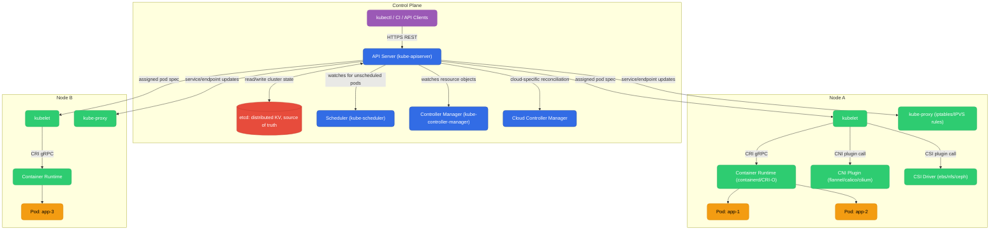
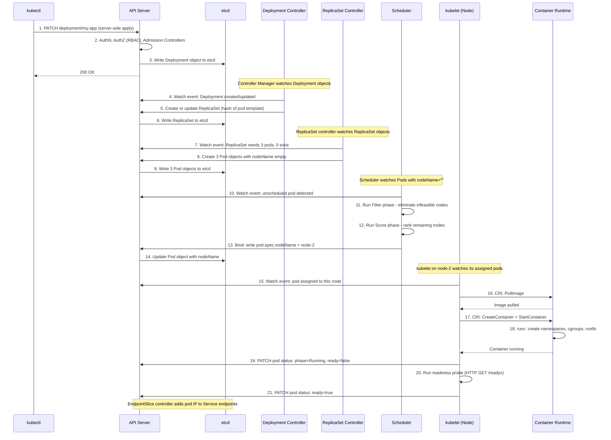
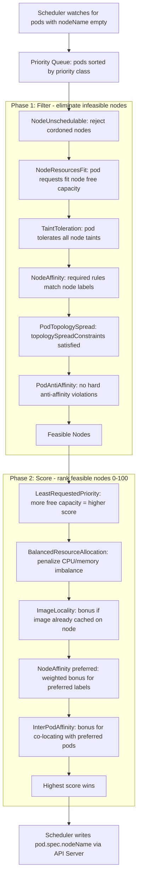
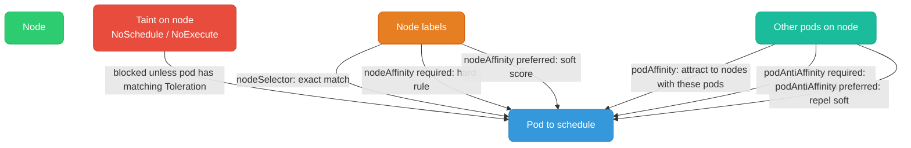
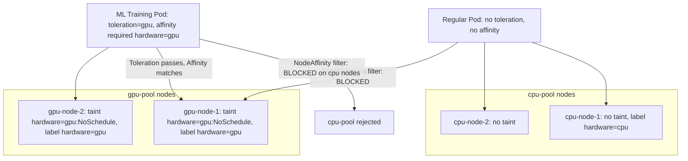

# Kubernetes Architecture & Internals

| File | Topics |
|------|--------|
| [README.md](./README.md) | Architecture, kubectl apply flow, scheduler, taints/affinity |
| [networking.md](./networking.md) | Services, ClusterIP internals, DNS, Ingress, NetworkPolicy |
| [workloads.md](./workloads.md) | Pod lifecycle, probes, QoS, rolling updates, StatefulSet, DaemonSet, Jobs |
| [storage.md](./storage.md) | PV/PVC/StorageClass, dynamic provisioning, CSI, volume snapshots |
| [autoscaling.md](./autoscaling.md) | HPA, VPA, KEDA, Cluster Autoscaler |
| [rbac.md](./rbac.md) | ServiceAccount, Role/ClusterRole, RoleBinding, auth chain |
| [eks-architecture.md](./eks-architecture.md) | EKS managed control plane, VPC CNI, IRSA, node groups |
| [resource-limits.md](./resource-limits.md) | Requests vs limits, CFS throttling, QoS classes, LimitRange, ResourceQuota, node allocatable chain |
| [coredns.md](./coredns.md) | Corefile plugins, ndots:5 problem, forwarding, caching, debugging, NodeLocal DNSCache |
| [pod-lifecycle.md](./pod-lifecycle.md) | Startup sequence (sandbox→CNI→image→probes), admission controller chain, server-side apply, termination race |
| [kube-proxy-modes.md](./kube-proxy-modes.md) | iptables O(n) problem, IPVS O(1) + LB algorithms, Cilium/eBPF socket-level LB, comparison table |
| [cross-node-networking.md](./cross-node-networking.md) | Same-node packet walk, VXLAN overlay, Calico BGP direct routing, AWS VPC CNI flat network, MTU |
| [node-shutdown.md](./node-shutdown.md) | Graceful shutdown (systemd inhibitor), pod eviction ordering, node drain, non-graceful shutdown, lifecycle taints |

---

## Architecture

Kubernetes has two logical planes: the **Control Plane** (the brain — decides what should happen) and the **Data Plane / Worker Nodes** (the muscle — makes it happen).



**Control Plane components and what they do:**

| Component | Role |
|-----------|------|
| **API Server** | Only component that reads/writes etcd. Every other component communicates through it. Runs AuthN → AuthZ → Admission → Validation on every request. |
| **etcd** | Raft-based distributed KV store. Stores all cluster state: nodes, pods, secrets, RBAC, endpoint slices. Keys are at `/registry/<type>/<namespace>/<name>`. |
| **Scheduler** | Watches for pods with `nodeName=""`. Runs Filter → Score → Bind. Writes `spec.nodeName` back to the pod via API Server. |
| **Controller Manager** | 50+ reconciliation loops in one binary. Deployment controller, ReplicaSet controller, Node controller, Job controller, EndpointSlice controller. |
| **Cloud Controller Manager** | Cloud-specific logic decoupled from core K8s. Provisions cloud LBs for `LoadBalancer` services, manages VPC routes for pod CIDRs. |

**Node components and what they do:**

| Component | Role |
|-----------|------|
| **kubelet** | Agent on every node. Watches pods assigned to this node. Calls CRI/CNI/CSI, runs probes, reports status back to API Server. |
| **kube-proxy** | Programs iptables/IPVS rules for Service ClusterIP routing. Does NOT proxy traffic itself — only sets up kernel NAT rules. |
| **Container Runtime (CRI)** | `containerd` or `CRI-O`. Pulls images, creates containers via `runc`, manages cgroups and namespaces. |
| **CNI Plugin** | Called by kubelet on pod creation. Sets up veth pair, assigns pod IP, configures routes. |
| **CSI Driver** | Called by kubelet to attach/mount persistent volumes into pod filesystem. |

---

## `kubectl apply -f deployment.yaml` — End-to-End Flow

What actually happens when you run this command? Here is every step, every component:



Key insights:
- `kubectl apply` uses **server-side apply** — the server tracks field ownership per manager, enabling safe multi-actor management
- Deployment controller never creates Pods directly — it creates ReplicaSets. ReplicaSet controller creates Pods. This is why rollback works: just point the Deployment at an older ReplicaSet
- Scheduler only writes `spec.nodeName` — it does not start containers. kubelet is the one that actually runs the container
- **Nothing communicates directly** — every component watches the API Server and reacts to state changes. This is the level-triggered reconciliation model

---

## Scheduler Internals

The scheduler's job: given an unscheduled pod, find the best node. It runs a **two-phase pipeline** implemented as a plugin framework.



### Filter Phase (Predicates)

| Plugin | What it checks |
|--------|---------------|
| `NodeUnschedulable` | Rejects nodes with `spec.unschedulable: true` (cordoned nodes) |
| `NodeResourcesFit` | Pod `requests` must fit: `node.allocatable - Σ(running pod requests) ≥ pod requests` |
| `TaintToleration` | Every `NoSchedule`/`NoExecute` taint on the node must have a matching toleration in the pod |
| `NodeAffinity` | `requiredDuringSchedulingIgnoredDuringExecution` rules must match node labels |
| `PodTopologySpread` | Enforces `topologySpreadConstraints` with `whenUnsatisfiable: DoNotSchedule` |
| `PodAntiAffinity` | Rejects nodes that violate hard (`required`) pod anti-affinity rules |
| `VolumeBinding` | Node must have access to all volumes the pod requests (zone matching for PVs) |

After filtering, if zero nodes remain → pod goes `Pending`. Events will show `FailedScheduling`.

### Score Phase (Priorities)

Each remaining node gets a score 0–100 from each plugin. Final score = weighted sum.

**LeastRequestedPriority** (most important for bin-packing vs spreading):

```
cpuScore  = (node.allocatable.cpu - Σ requests.cpu) / node.allocatable.cpu * 100
memScore  = (node.allocatable.mem - Σ requests.mem) / node.allocatable.mem * 100
nodeScore = (cpuScore + memScore) / 2
```

A node with MORE free resources scores HIGHER. This spreads pods across nodes.

**BalancedResourceAllocation**: penalizes nodes where CPU and memory utilization are imbalanced (e.g., 90% CPU but 10% memory used). Encourages balanced consumption.

**ImageLocality**: adds a small bonus if the container image is already cached on the node, reducing pull latency.

---

## Scheduler Worked Example

**Setup:**
- Node Alpha: 4 CPU allocatable, 8 GB allocatable. Currently running pods consuming 1 CPU, 2 GB.
- Node Beta: 8 CPU allocatable, 16 GB allocatable. Currently running pods consuming 1 CPU, 2 GB.
- New pod: `requests: {cpu: "1", memory: "4Gi"}`, `limits: {cpu: "2", memory: "6Gi"}`

> **Important:** The scheduler uses `requests` for placement decisions, not `limits`. Limits are enforced by the kernel (cgroups) at runtime, not by the scheduler.

### Filter Phase

| Check | Node Alpha | Node Beta |
|-------|-----------|----------|
| NodeResourcesFit (CPU) | Free: 4-1=3 CPU. Need: 1. ✅ | Free: 8-1=7 CPU. Need: 1. ✅ |
| NodeResourcesFit (Memory) | Free: 8-2=6 GB. Need: 4 GB. ✅ | Free: 16-2=14 GB. Need: 4 GB. ✅ |

Both nodes pass. Proceed to scoring.

### Score Phase — LeastRequestedPriority

**Node Alpha:**
```
cpuFraction  = (4 - 1 - 1) / 4   = 2/4   = 0.50
memFraction  = (8 - 2 - 4) / 8   = 2/8   = 0.25
score        = (0.50 + 0.25) / 2 * 100 = 37.5
```

**Node Beta:**
```
cpuFraction  = (8 - 1 - 1) / 8   = 6/8   = 0.75
memFraction  = (16 - 2 - 4) / 16 = 10/16 = 0.625
score        = (0.75 + 0.625) / 2 * 100 = 68.75
```

**Winner: Node Beta** with score ~68.75 vs Alpha's ~37.5.

### Q&A: Why does Node Beta win even though the pod fits on both?

**Q:** We have Node Alpha (4 CPU / 8 GB) and Node Beta (8 CPU / 16 GB). Our pod requests 1 CPU and 4 GB memory (limits: 2 CPU / 6 GB). Both nodes have enough room. Which node does the scheduler pick?

**A:** The scheduler picks **Node Beta**, and here's the exact reasoning:

The `LeastRequestedPriority` plugin scores nodes by how much free capacity they'd have *after* placing the pod. More free capacity = higher score. This **spreads** pods across nodes rather than packing them — leaving headroom for spikes, avoiding noisy-neighbor effects, and preserving rolling-update capacity.

Node Alpha after placement: 2/4 CPU used (50%), 6/8 GB used (75%). Low remaining fraction → low score (~37.5).
Node Beta after placement: 2/8 CPU used (25%), 6/16 GB used (37.5%). High remaining fraction → high score (~68.75).

**Critical detail about limits:** The `limits` (2 CPU / 6 GB) are irrelevant to scheduling. They are enforced by cgroups at runtime — if the container tries to use more than 2 CPU it gets throttled; if it exceeds 6 GB memory the kernel OOM-kills it. The scheduler only cares about `requests` because that is the reserved capacity on the node.

If you need the pod to land on Node Alpha instead, use `nodeSelector`, `nodeAffinity`, or a `PodTopologySpread` constraint with `maxSkew`.

---

## Taints, Tolerations & Node Affinity

These three mechanisms control which pods can/prefer to run on which nodes.

### Taints (node-side repellent)

A **taint** on a node says: "Don't schedule pods here unless the pod explicitly tolerates this."

| Effect | Meaning |
|--------|---------|
| `NoSchedule` | New pods without a matching toleration will NOT be scheduled here. Existing pods stay. |
| `PreferNoSchedule` | Scheduler tries to avoid placing pods here, but will if no other node fits. |
| `NoExecute` | New pods rejected AND existing pods without toleration are evicted (after optional `tolerationSeconds`). |

```bash
kubectl taint nodes gpu-node-1 hardware=gpu:NoSchedule
kubectl taint nodes gpu-node-1 hardware=gpu:NoSchedule-   # remove taint
```

### Tolerations (pod-side permission slip)

A **toleration** says: "I can tolerate this taint — don't block me because of it." It removes the barrier but does NOT attract the pod to that node.

```yaml
spec:
  tolerations:
    - key: "hardware"
      operator: "Equal"
      value: "gpu"
      effect: "NoSchedule"
```

### nodeSelector (simplest node targeting)

`nodeSelector` is the original, simple way to constrain a pod to nodes with specific labels. It's a hard requirement — no match, no schedule.

```yaml
spec:
  nodeSelector:
    hardware: gpu          # pod only schedules on nodes with this exact label
    zone: us-east-1a       # AND this label (all keys must match)
```

```bash
kubectl label node gpu-node-1 hardware=gpu zone=us-east-1a
```

**Limitation:** AND-only logic, no OR, no `NotIn`, no expressions. That's why `nodeAffinity` exists.

---

### Node Affinity (pod-side attraction)

`nodeAffinity` is `nodeSelector` with full expression power. Two modes:

| Mode | Keyword | Behavior |
|------|---------|----------|
| **Hard** | `requiredDuringSchedulingIgnoredDuringExecution` | Pod won't schedule if no node matches. Like `nodeSelector` but with expressions. |
| **Soft** | `preferredDuringSchedulingIgnoredDuringExecution` | Scheduler *tries* to match, places elsewhere if needed. Uses a weight (1–100). |

`IgnoredDuringExecution` — if the node's labels change after the pod is running, the pod is **not** evicted.

#### Hard affinity (must match)

```yaml
affinity:
  nodeAffinity:
    requiredDuringSchedulingIgnoredDuringExecution:
      nodeSelectorTerms:
      - matchExpressions:
        - key: hardware
          operator: In          # In | NotIn | Exists | DoesNotExist | Gt | Lt
          values: ["gpu", "gpu-high"]
        - key: zone
          operator: In
          values: ["us-east-1a", "us-east-1b"]
```

Multiple `matchExpressions` in the same term = AND. Multiple `nodeSelectorTerms` = OR (any term can match).

#### Soft affinity (prefer, but not required)

```yaml
affinity:
  nodeAffinity:
    preferredDuringSchedulingIgnoredDuringExecution:
    - weight: 80              # higher weight = stronger preference (1-100)
      preference:
        matchExpressions:
        - key: zone
          operator: In
          values: ["us-east-1a"]   # prefer AZ-a
    - weight: 20
      preference:
        matchExpressions:
        - key: hardware
          operator: In
          values: ["ssd"]          # also prefer SSD nodes, but less important
```

The scheduler adds the weights of matching preferences to a node's score. The highest-scoring node wins — but any node can still be chosen if none match.

#### Combining hard + soft

```yaml
affinity:
  nodeAffinity:
    requiredDuringSchedulingIgnoredDuringExecution:   # MUST be on gpu nodes
      nodeSelectorTerms:
      - matchExpressions:
        - key: hardware
          operator: In
          values: ["gpu"]
    preferredDuringSchedulingIgnoredDuringExecution:  # PREFER AZ-a within gpu nodes
    - weight: 100
      preference:
        matchExpressions:
        - key: topology.kubernetes.io/zone
          operator: In
          values: ["us-east-1a"]
```

---

### nodeSelector vs nodeAffinity

| | `nodeSelector` | `nodeAffinity` |
|--|---------------|---------------|
| **Logic** | AND only, exact match | AND / OR, full expressions |
| **Operators** | `=` only | `In`, `NotIn`, `Exists`, `DoesNotExist`, `Gt`, `Lt` |
| **Soft preference** | No | Yes (`preferred...`) |
| **Multiple terms (OR)** | No | Yes (multiple `nodeSelectorTerms`) |
| **Future-proof** | Being deprecated eventually | Recommended |

Use `nodeSelector` only for simple single-label targeting. Use `nodeAffinity` for everything else.

---

### DaemonSet: run on all nodes despite taints

There is **no global taint**. Taints are per-node. If you have multiple node groups each with different taints, the DaemonSet needs a toleration for each — or use the wildcard:

```yaml
spec:
  tolerations:
  - operator: "Exists"    # matches ALL keys, values, and effects — tolerate everything
```

This is what system DaemonSets (kube-proxy, CNI, node-exporter) use to guarantee they run on every node.

**Note on `NoExecute`:** The wildcard also tolerates `NoExecute` without a `tolerationSeconds`, so the pod is never evicted. Fine for infrastructure DaemonSets, but be intentional about it.

### DaemonSet: exclude specific nodes

Since DaemonSets target all nodes by default, exclusion is done by **not scheduling**, not by taint:

```yaml
# Option 1: opt-in label — only schedule on nodes that have the label
spec:
  template:
    spec:
      affinity:
        nodeAffinity:
          requiredDuringSchedulingIgnoredDuringExecution:
            nodeSelectorTerms:
            - matchExpressions:
              - key: daemonset/my-agent
                operator: Exists   # label must exist (any value)
```

```bash
# Only label the nodes you want the DaemonSet on
kubectl label node node-1 node-2 daemonset/my-agent=enabled
# node-3 has no label → DaemonSet pod never scheduled there
```

```yaml
# Option 2: add a dedicated taint to nodes to exclude, don't tolerate it
# (don't add this taint to the DaemonSet tolerations)
kubectl taint node node-3 skip-my-agent=true:NoSchedule
```

---

---

## Pod Affinity & Pod Anti-Affinity

While `nodeAffinity` attracts/repels pods to/from **nodes**, `podAffinity` and `podAntiAffinity` attract/repel pods relative to **other pods** — based on what's already running on a node (or in a topology zone).

The scheduler checks the labels of **existing pods** on nodes to decide placement.

### podAffinity — co-locate with other pods

**Use case:** Place a caching sidecar or a latency-sensitive service on the same node as the pods it serves.

```yaml
affinity:
  podAffinity:
    requiredDuringSchedulingIgnoredDuringExecution:   # hard
    - labelSelector:
        matchExpressions:
        - key: app
          operator: In
          values: ["redis"]
      topologyKey: "kubernetes.io/hostname"   # "same node"
```

`topologyKey` defines what "together" means:
| `topologyKey` | Meaning |
|--------------|---------|
| `kubernetes.io/hostname` | Same node |
| `topology.kubernetes.io/zone` | Same AZ |
| `topology.kubernetes.io/region` | Same region |

### podAntiAffinity — spread away from other pods

**Use case:** Ensure replicas of the same app land on different nodes (or AZs) for HA.

#### Hard anti-affinity (guaranteed spread)

```yaml
affinity:
  podAntiAffinity:
    requiredDuringSchedulingIgnoredDuringExecution:
    - labelSelector:
        matchExpressions:
        - key: app
          operator: In
          values: ["api-server"]
      topologyKey: "kubernetes.io/hostname"   # no two api-server pods on same node
```

Pod stays **Pending** if the only available nodes already have a matching pod. Use with caution on small clusters.

#### Soft anti-affinity (prefer spread, allow stacking if necessary)

```yaml
affinity:
  podAntiAffinity:
    preferredDuringSchedulingIgnoredDuringExecution:
    - weight: 100
      podAffinityTerm:
        labelSelector:
          matchExpressions:
          - key: app
            operator: In
            values: ["api-server"]
        topologyKey: "topology.kubernetes.io/zone"   # prefer different AZs
```

If no other AZ is available, pods still schedule — no Pending.

### Hard vs Soft summary

| | Hard (`required...`) | Soft (`preferred...`) |
|--|---------------------|----------------------|
| **Affinity** | Must co-locate, else Pending | Prefer co-location, not required |
| **AntiAffinity** | Must spread, else Pending | Prefer spread, stacking allowed |
| **Risk** | Pods stuck Pending if unsatisfiable | Safe fallback |
| **Use for** | Security isolation, strict HA | Best-effort AZ spread, latency opt |

### Common patterns

```yaml
# Pattern 1: spread replicas across nodes (hard) — HA guarantee
podAntiAffinity:
  requiredDuringSchedulingIgnoredDuringExecution:
  - labelSelector:
      matchLabels:
        app: my-service
    topologyKey: "kubernetes.io/hostname"

# Pattern 2: prefer different AZs (soft) — safe for small clusters
podAntiAffinity:
  preferredDuringSchedulingIgnoredDuringExecution:
  - weight: 100
    podAffinityTerm:
      labelSelector:
        matchLabels:
          app: my-service
      topologyKey: "topology.kubernetes.io/zone"

# Pattern 3: co-locate app with its cache (hard)
podAffinity:
  requiredDuringSchedulingIgnoredDuringExecution:
  - labelSelector:
      matchLabels:
        app: redis-cache
    topologyKey: "kubernetes.io/hostname"
```

### Real-world Examples

#### Example 1 — `nodeSelector`: run only on SSD nodes

```yaml
# kubectl label node node-1 node-2 disk=ssd
apiVersion: apps/v1
kind: Deployment
metadata:
  name: postgres
spec:
  replicas: 1
  selector:
    matchLabels:
      app: postgres
  template:
    metadata:
      labels:
        app: postgres
    spec:
      nodeSelector:
        disk: ssd
      containers:
      - name: postgres
        image: postgres:16
```

#### Example 2 — `nodeAffinity` hard: restrict to specific AZs

```yaml
# Scenario: data residency — must stay in us-east-1a or us-east-1b
spec:
  affinity:
    nodeAffinity:
      requiredDuringSchedulingIgnoredDuringExecution:
        nodeSelectorTerms:
        - matchExpressions:
          - key: topology.kubernetes.io/zone
            operator: In
            values: [us-east-1a, us-east-1b]
  containers:
  - name: api
    image: my-org/api:v2
```

#### Example 3 — `nodeAffinity` soft: prefer spot, fall back to on-demand

```yaml
# kubectl label node spot-node-{1..5} node-lifecycle=spot
# kubectl label node od-node-{1..3}   node-lifecycle=on-demand
spec:
  affinity:
    nodeAffinity:
      preferredDuringSchedulingIgnoredDuringExecution:
      - weight: 80
        preference:
          matchExpressions:
          - key: node-lifecycle
            operator: In
            values: [spot]
      - weight: 20
        preference:
          matchExpressions:
          - key: node-lifecycle
            operator: In
            values: [on-demand]
  containers:
  - name: worker
    image: my-org/worker:v1
```

#### Example 4 — `podAntiAffinity` hard: one replica per node

```yaml
# Scenario: 3 replicas, guaranteed on different nodes
# ⚠️ Needs at least 3 nodes — 4th replica goes Pending if only 3 exist
apiVersion: apps/v1
kind: Deployment
metadata:
  name: api-server
spec:
  replicas: 3
  selector:
    matchLabels:
      app: api-server
  template:
    metadata:
      labels:
        app: api-server
    spec:
      affinity:
        podAntiAffinity:
          requiredDuringSchedulingIgnoredDuringExecution:
          - labelSelector:
              matchLabels:
                app: api-server
            topologyKey: kubernetes.io/hostname
      containers:
      - name: api
        image: my-org/api:v2
        ports:
        - containerPort: 8080
```

#### Example 5 — `podAntiAffinity` soft: prefer different AZs

```yaml
# Scenario: 6 replicas, prefer spread across AZs but don't block
apiVersion: apps/v1
kind: Deployment
metadata:
  name: payment-service
spec:
  replicas: 6
  selector:
    matchLabels:
      app: payment-service
  template:
    metadata:
      labels:
        app: payment-service
    spec:
      affinity:
        podAntiAffinity:
          preferredDuringSchedulingIgnoredDuringExecution:
          - weight: 100
            podAffinityTerm:
              labelSelector:
                matchLabels:
                  app: payment-service
              topologyKey: topology.kubernetes.io/zone
      containers:
      - name: payment
        image: my-org/payment:v3
```

#### Example 6 — `podAffinity` hard: co-locate app with its local cache

```yaml
# Scenario: app must land on same node as redis-cache DaemonSet pod
apiVersion: apps/v1
kind: Deployment
metadata:
  name: realtime-processor
spec:
  replicas: 3
  selector:
    matchLabels:
      app: realtime-processor
  template:
    metadata:
      labels:
        app: realtime-processor
    spec:
      affinity:
        podAffinity:
          requiredDuringSchedulingIgnoredDuringExecution:
          - labelSelector:
              matchLabels:
                app: redis-cache
            topologyKey: kubernetes.io/hostname
      containers:
      - name: processor
        image: my-org/processor:v1
```

#### Example 7 — DaemonSet on ALL nodes (multiple tainted node groups)

```yaml
# Scenario: Fluentd must run everywhere
# Node groups: team=gpu:NoSchedule, team=spot:NoSchedule, dedicated=infra:NoSchedule
apiVersion: apps/v1
kind: DaemonSet
metadata:
  name: fluentd
spec:
  selector:
    matchLabels:
      app: fluentd
  template:
    metadata:
      labels:
        app: fluentd
    spec:
      tolerations:
      - operator: Exists        # tolerate ALL taints on ALL nodes
      containers:
      - name: fluentd
        image: fluent/fluentd-kubernetes-daemonset:v1
        volumeMounts:
        - name: varlog
          mountPath: /var/log
      volumes:
      - name: varlog
        hostPath:
          path: /var/log
```

#### Example 8 — DaemonSet on SOME nodes (opt-in label)

```yaml
# Scenario: GPU metrics exporter — only on gpu nodes
# kubectl label node gpu-node-{1..3} collect-gpu-metrics=true
apiVersion: apps/v1
kind: DaemonSet
metadata:
  name: gpu-metrics-exporter
spec:
  selector:
    matchLabels:
      app: gpu-metrics-exporter
  template:
    metadata:
      labels:
        app: gpu-metrics-exporter
    spec:
      tolerations:
      - key: hardware
        operator: Equal
        value: gpu
        effect: NoSchedule
      affinity:
        nodeAffinity:
          requiredDuringSchedulingIgnoredDuringExecution:
            nodeSelectorTerms:
            - matchExpressions:
              - key: collect-gpu-metrics
                operator: Exists
      containers:
      - name: exporter
        image: nvidia/dcgm-exporter:3.1.7
```

#### Example 9 — everything combined: ML training job

```yaml
# Must: land on gpu nodes (hard nodeAffinity + toleration)
# Prefer: AZ-a for cheaper inter-node bandwidth (soft nodeAffinity)
# Must: no two training pods on same node (hard podAntiAffinity)
apiVersion: apps/v1
kind: Deployment
metadata:
  name: ml-training
spec:
  replicas: 4
  selector:
    matchLabels:
      app: ml-training
  template:
    metadata:
      labels:
        app: ml-training
    spec:
      tolerations:
      - key: hardware
        operator: Equal
        value: gpu
        effect: NoSchedule
      affinity:
        nodeAffinity:
          requiredDuringSchedulingIgnoredDuringExecution:
            nodeSelectorTerms:
            - matchExpressions:
              - key: hardware
                operator: In
                values: [gpu]
          preferredDuringSchedulingIgnoredDuringExecution:
          - weight: 60
            preference:
              matchExpressions:
              - key: topology.kubernetes.io/zone
                operator: In
                values: [us-east-1a]
        podAntiAffinity:
          requiredDuringSchedulingIgnoredDuringExecution:
          - labelSelector:
              matchLabels:
                app: ml-training
            topologyKey: kubernetes.io/hostname
      containers:
      - name: trainer
        image: my-org/ml-trainer:v2
        resources:
          limits:
            nvidia.com/gpu: "1"
            memory: 16Gi
```



## GPU Node Group Scenario

**Objective:** `cpu-pool` nodes for general workloads, `gpu-pool` nodes for ML training only. ML pods must land only on GPU nodes; GPU nodes must not run regular workloads.

**Strategy:** Taint GPU nodes + add toleration to ML pod + add required node affinity to ML pod. All three are needed:
- Taint alone → blocks regular pods from GPU nodes ✅ but ML pod still might land on CPU nodes
- Toleration alone → removes the barrier but doesn't attract ✅
- Node affinity → actively forces ML pod onto GPU nodes ✅

**Step 1: Label and taint GPU nodes**

```bash
kubectl label nodes gpu-node-1 gpu-node-2 hardware=gpu
kubectl taint nodes gpu-node-1 gpu-node-2 hardware=gpu:NoSchedule
```

**Step 2: ML pod spec**

```yaml
apiVersion: apps/v1
kind: Deployment
metadata:
  name: ml-training
spec:
  replicas: 2
  selector:
    matchLabels:
      app: ml-training
  template:
    metadata:
      labels:
        app: ml-training
    spec:
      tolerations:
        - key: "hardware"
          operator: "Equal"
          value: "gpu"
          effect: "NoSchedule"
      affinity:
        nodeAffinity:
          requiredDuringSchedulingIgnoredDuringExecution:
            nodeSelectorTerms:
              - matchExpressions:
                  - key: hardware
                    operator: In
                    values:
                      - gpu
      containers:
        - name: trainer
          image: my-org/ml-trainer:v1
          resources:
            limits:
              nvidia.com/gpu: 1
              memory: "16Gi"
              cpu: "4"
            requests:
              nvidia.com/gpu: 1
              memory: "16Gi"
              cpu: "4"
```


