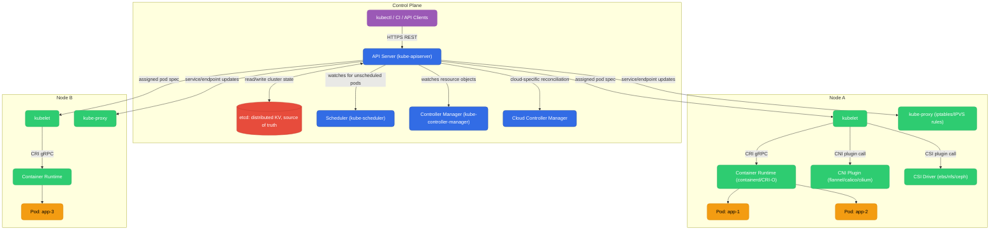
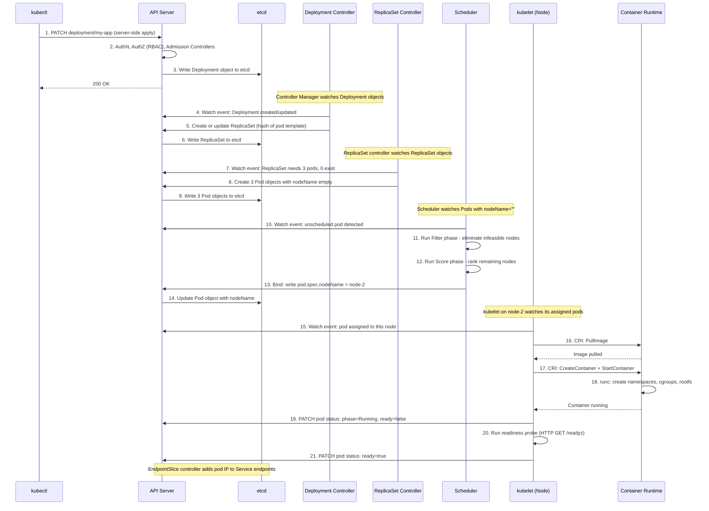
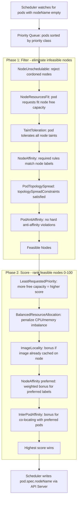
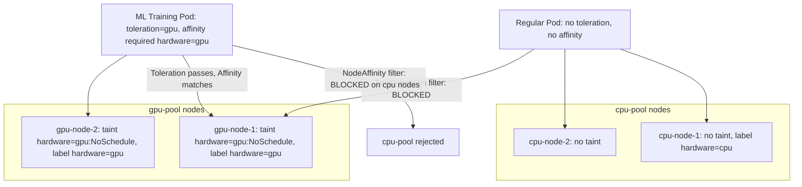

# Kubernetes Architecture & Internals

| File | Topics |
|------|--------|
| [README.md](./README.md) | Architecture, kubectl apply flow, scheduler, taints/affinity |
| [networking.md](./networking.md) | Services, ClusterIP internals, DNS, Ingress, NetworkPolicy |
| [workloads.md](./workloads.md) | Pod lifecycle, probes, QoS, rolling updates, StatefulSet, DaemonSet, Jobs |
| [storage.md](./storage.md) | PV/PVC/StorageClass, dynamic provisioning, CSI, volume snapshots |
| [autoscaling.md](./autoscaling.md) | HPA, VPA, KEDA, Cluster Autoscaler |
| [rbac.md](./rbac.md) | ServiceAccount, Role/ClusterRole, RoleBinding, auth chain |
| [eks-architecture.md](./eks-architecture.md) | EKS managed control plane, VPC CNI, IRSA, node groups |

---

## Architecture

Kubernetes has two logical planes: the **Control Plane** (the brain — decides what should happen) and the **Data Plane / Worker Nodes** (the muscle — makes it happen).



**Control Plane components and what they do:**

| Component | Role |
|-----------|------|
| **API Server** | Only component that reads/writes etcd. Every other component communicates through it. Runs AuthN → AuthZ → Admission → Validation on every request. |
| **etcd** | Raft-based distributed KV store. Stores all cluster state: nodes, pods, secrets, RBAC, endpoint slices. Keys are at `/registry/<type>/<namespace>/<name>`. |
| **Scheduler** | Watches for pods with `nodeName=""`. Runs Filter → Score → Bind. Writes `spec.nodeName` back to the pod via API Server. |
| **Controller Manager** | 50+ reconciliation loops in one binary. Deployment controller, ReplicaSet controller, Node controller, Job controller, EndpointSlice controller. |
| **Cloud Controller Manager** | Cloud-specific logic decoupled from core K8s. Provisions cloud LBs for `LoadBalancer` services, manages VPC routes for pod CIDRs. |

**Node components and what they do:**

| Component | Role |
|-----------|------|
| **kubelet** | Agent on every node. Watches pods assigned to this node. Calls CRI/CNI/CSI, runs probes, reports status back to API Server. |
| **kube-proxy** | Programs iptables/IPVS rules for Service ClusterIP routing. Does NOT proxy traffic itself — only sets up kernel NAT rules. |
| **Container Runtime (CRI)** | `containerd` or `CRI-O`. Pulls images, creates containers via `runc`, manages cgroups and namespaces. |
| **CNI Plugin** | Called by kubelet on pod creation. Sets up veth pair, assigns pod IP, configures routes. |
| **CSI Driver** | Called by kubelet to attach/mount persistent volumes into pod filesystem. |

---

## `kubectl apply -f deployment.yaml` — End-to-End Flow

What actually happens when you run this command? Here is every step, every component:



Key insights:
- `kubectl apply` uses **server-side apply** — the server tracks field ownership per manager, enabling safe multi-actor management
- Deployment controller never creates Pods directly — it creates ReplicaSets. ReplicaSet controller creates Pods. This is why rollback works: just point the Deployment at an older ReplicaSet
- Scheduler only writes `spec.nodeName` — it does not start containers. kubelet is the one that actually runs the container
- **Nothing communicates directly** — every component watches the API Server and reacts to state changes. This is the level-triggered reconciliation model

---

## Scheduler Internals

The scheduler's job: given an unscheduled pod, find the best node. It runs a **two-phase pipeline** implemented as a plugin framework.



### Filter Phase (Predicates)

| Plugin | What it checks |
|--------|---------------|
| `NodeUnschedulable` | Rejects nodes with `spec.unschedulable: true` (cordoned nodes) |
| `NodeResourcesFit` | Pod `requests` must fit: `node.allocatable - Σ(running pod requests) ≥ pod requests` |
| `TaintToleration` | Every `NoSchedule`/`NoExecute` taint on the node must have a matching toleration in the pod |
| `NodeAffinity` | `requiredDuringSchedulingIgnoredDuringExecution` rules must match node labels |
| `PodTopologySpread` | Enforces `topologySpreadConstraints` with `whenUnsatisfiable: DoNotSchedule` |
| `PodAntiAffinity` | Rejects nodes that violate hard (`required`) pod anti-affinity rules |
| `VolumeBinding` | Node must have access to all volumes the pod requests (zone matching for PVs) |

After filtering, if zero nodes remain → pod goes `Pending`. Events will show `FailedScheduling`.

### Score Phase (Priorities)

Each remaining node gets a score 0–100 from each plugin. Final score = weighted sum.

**LeastRequestedPriority** (most important for bin-packing vs spreading):

```
cpuScore  = (node.allocatable.cpu - Σ requests.cpu) / node.allocatable.cpu * 100
memScore  = (node.allocatable.mem - Σ requests.mem) / node.allocatable.mem * 100
nodeScore = (cpuScore + memScore) / 2
```

A node with MORE free resources scores HIGHER. This spreads pods across nodes.

**BalancedResourceAllocation**: penalizes nodes where CPU and memory utilization are imbalanced (e.g., 90% CPU but 10% memory used). Encourages balanced consumption.

**ImageLocality**: adds a small bonus if the container image is already cached on the node, reducing pull latency.

---

## Scheduler Worked Example

**Setup:**
- Node Alpha: 4 CPU allocatable, 8 GB allocatable. Currently running pods consuming 1 CPU, 2 GB.
- Node Beta: 8 CPU allocatable, 16 GB allocatable. Currently running pods consuming 1 CPU, 2 GB.
- New pod: `requests: {cpu: "1", memory: "4Gi"}`, `limits: {cpu: "2", memory: "6Gi"}`

> **Important:** The scheduler uses `requests` for placement decisions, not `limits`. Limits are enforced by the kernel (cgroups) at runtime, not by the scheduler.

### Filter Phase

| Check | Node Alpha | Node Beta |
|-------|-----------|----------|
| NodeResourcesFit (CPU) | Free: 4-1=3 CPU. Need: 1. ✅ | Free: 8-1=7 CPU. Need: 1. ✅ |
| NodeResourcesFit (Memory) | Free: 8-2=6 GB. Need: 4 GB. ✅ | Free: 16-2=14 GB. Need: 4 GB. ✅ |

Both nodes pass. Proceed to scoring.

### Score Phase — LeastRequestedPriority

**Node Alpha:**
```
cpuFraction  = (4 - 1 - 1) / 4   = 2/4   = 0.50
memFraction  = (8 - 2 - 4) / 8   = 2/8   = 0.25
score        = (0.50 + 0.25) / 2 * 100 = 37.5
```

**Node Beta:**
```
cpuFraction  = (8 - 1 - 1) / 8   = 6/8   = 0.75
memFraction  = (16 - 2 - 4) / 16 = 10/16 = 0.625
score        = (0.75 + 0.625) / 2 * 100 = 68.75
```

**Winner: Node Beta** with score ~68.75 vs Alpha's ~37.5.

### Q&A: Why does Node Beta win even though the pod fits on both?

**Q:** We have Node Alpha (4 CPU / 8 GB) and Node Beta (8 CPU / 16 GB). Our pod requests 1 CPU and 4 GB memory (limits: 2 CPU / 6 GB). Both nodes have enough room. Which node does the scheduler pick?

**A:** The scheduler picks **Node Beta**, and here's the exact reasoning:

The `LeastRequestedPriority` plugin scores nodes by how much free capacity they'd have *after* placing the pod. More free capacity = higher score. This **spreads** pods across nodes rather than packing them — leaving headroom for spikes, avoiding noisy-neighbor effects, and preserving rolling-update capacity.

Node Alpha after placement: 2/4 CPU used (50%), 6/8 GB used (75%). Low remaining fraction → low score (~37.5).
Node Beta after placement: 2/8 CPU used (25%), 6/16 GB used (37.5%). High remaining fraction → high score (~68.75).

**Critical detail about limits:** The `limits` (2 CPU / 6 GB) are irrelevant to scheduling. They are enforced by cgroups at runtime — if the container tries to use more than 2 CPU it gets throttled; if it exceeds 6 GB memory the kernel OOM-kills it. The scheduler only cares about `requests` because that is the reserved capacity on the node.

If you need the pod to land on Node Alpha instead, use `nodeSelector`, `nodeAffinity`, or a `PodTopologySpread` constraint with `maxSkew`.

---

## Taints, Tolerations & Node Affinity

These three mechanisms control which pods can/prefer to run on which nodes.

### Taints (node-side repellent)

A **taint** on a node says: "Don't schedule pods here unless the pod explicitly tolerates this."

| Effect | Meaning |
|--------|---------|
| `NoSchedule` | New pods without a matching toleration will NOT be scheduled here. Existing pods stay. |
| `PreferNoSchedule` | Scheduler tries to avoid placing pods here, but will if no other node fits. |
| `NoExecute` | New pods rejected AND existing pods without toleration are evicted (after optional `tolerationSeconds`). |

```bash
kubectl taint nodes gpu-node-1 hardware=gpu:NoSchedule
kubectl taint nodes gpu-node-1 hardware=gpu:NoSchedule-   # remove taint
```

### Tolerations (pod-side permission slip)

A **toleration** says: "I can tolerate this taint — don't block me because of it." It removes the barrier but does NOT attract the pod to that node.

```yaml
spec:
  tolerations:
    - key: "hardware"
      operator: "Equal"
      value: "gpu"
      effect: "NoSchedule"
```

### Node Affinity (pod-side attraction)

| Mode | Meaning |
|------|---------|
| `requiredDuringSchedulingIgnoredDuringExecution` | Hard rule — pod won't schedule if no node matches. |
| `preferredDuringSchedulingIgnoredDuringExecution` | Soft rule — scheduler tries to match but places elsewhere if needed. |

`IgnoredDuringExecution` means if the node's labels change after the pod is running, the pod is NOT evicted.

---

## GPU Node Group Scenario

**Objective:** `cpu-pool` nodes for general workloads, `gpu-pool` nodes for ML training only. ML pods must land only on GPU nodes; GPU nodes must not run regular workloads.

**Strategy:** Taint GPU nodes + add toleration to ML pod + add required node affinity to ML pod. All three are needed:
- Taint alone → blocks regular pods from GPU nodes ✅ but ML pod still might land on CPU nodes
- Toleration alone → removes the barrier but doesn't attract ✅
- Node affinity → actively forces ML pod onto GPU nodes ✅

**Step 1: Label and taint GPU nodes**

```bash
kubectl label nodes gpu-node-1 gpu-node-2 hardware=gpu
kubectl taint nodes gpu-node-1 gpu-node-2 hardware=gpu:NoSchedule
```

**Step 2: ML pod spec**

```yaml
apiVersion: apps/v1
kind: Deployment
metadata:
  name: ml-training
spec:
  replicas: 2
  selector:
    matchLabels:
      app: ml-training
  template:
    metadata:
      labels:
        app: ml-training
    spec:
      tolerations:
        - key: "hardware"
          operator: "Equal"
          value: "gpu"
          effect: "NoSchedule"
      affinity:
        nodeAffinity:
          requiredDuringSchedulingIgnoredDuringExecution:
            nodeSelectorTerms:
              - matchExpressions:
                  - key: hardware
                    operator: In
                    values:
                      - gpu
      containers:
        - name: trainer
          image: my-org/ml-trainer:v1
          resources:
            limits:
              nvidia.com/gpu: 1
              memory: "16Gi"
              cpu: "4"
            requests:
              nvidia.com/gpu: 1
              memory: "16Gi"
              cpu: "4"
```


