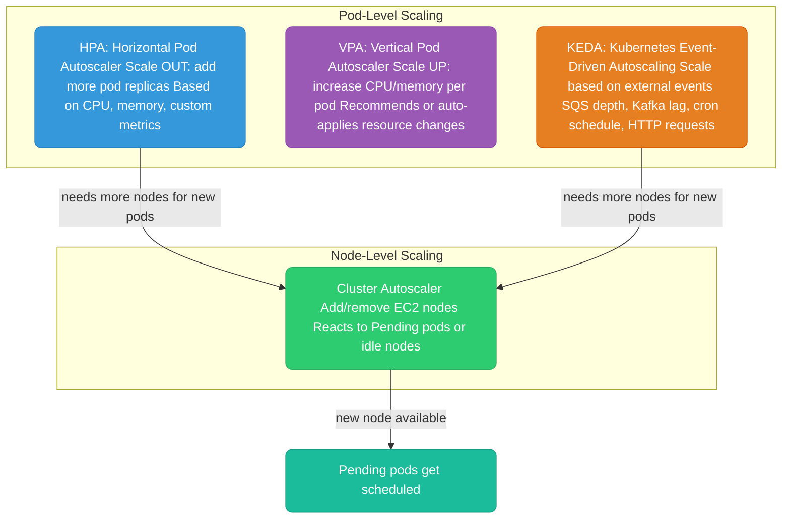
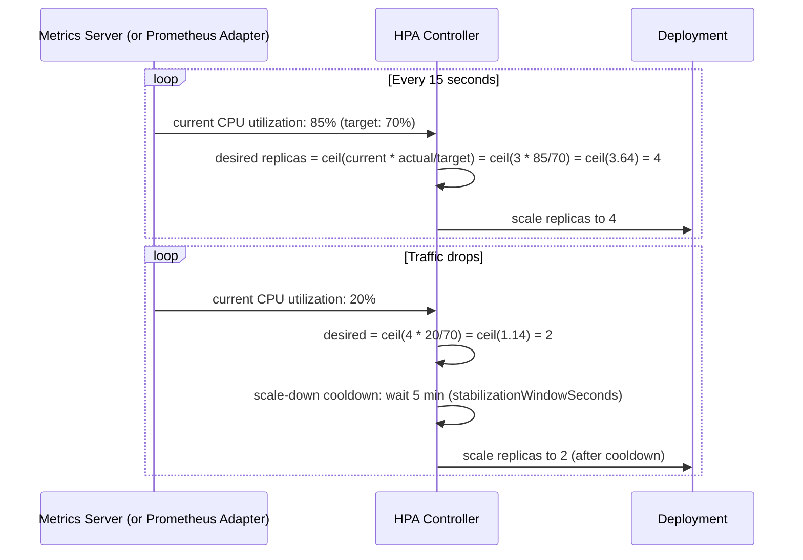
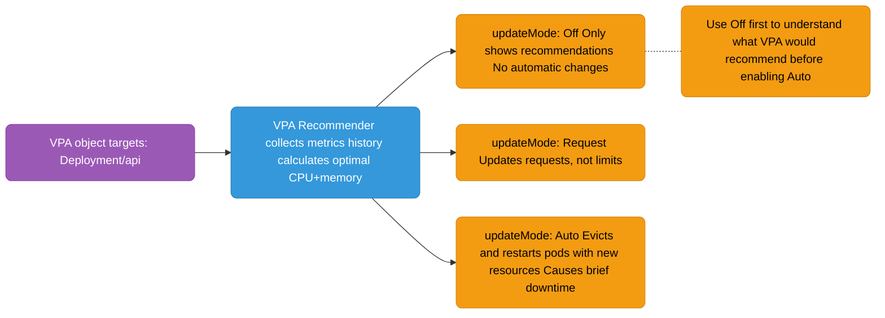
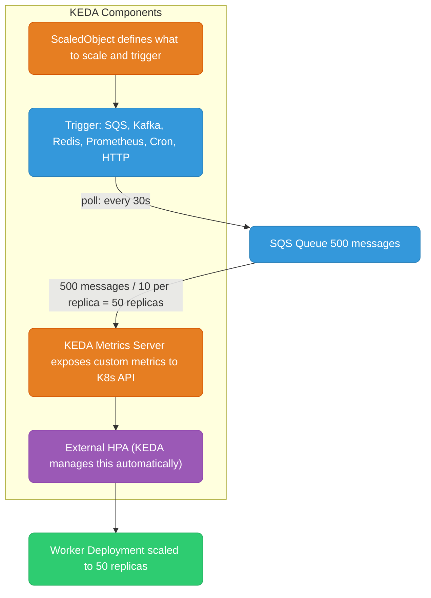

# Kubernetes Autoscaling

---

## Autoscaling Layers



---

## HPA — Horizontal Pod Autoscaler

HPA watches a metric and adjusts the number of pod replicas to keep the metric at the target.



```yaml
apiVersion: autoscaling/v2
kind: HorizontalPodAutoscaler
metadata:
  name: api-hpa
spec:
  scaleTargetRef:
    apiVersion: apps/v1
    kind: Deployment
    name: api
  minReplicas: 2
  maxReplicas: 20
  metrics:
    # CPU — most common
    - type: Resource
      resource:
        name: cpu
        target:
          type: Utilization
          averageUtilization: 70   # keep CPU at 70% average across all pods
    # Memory (less common — memory doesn't release easily)
    - type: Resource
      resource:
        name: memory
        target:
          type: AverageValue
          averageValue: 400Mi
  behavior:
    scaleDown:
      stabilizationWindowSeconds: 300   # wait 5min before scaling down (avoid flapping)
      policies:
        - type: Percent
          value: 25                     # scale down at most 25% of pods per minute
          periodSeconds: 60
    scaleUp:
      stabilizationWindowSeconds: 0    # scale up immediately
      policies:
        - type: Percent
          value: 100                   # can double pod count per 15s
          periodSeconds: 15
```

**HPA formula:** `desiredReplicas = ceil(currentReplicas × currentMetricValue / targetMetricValue)`

**HPA requires:** Metrics Server installed in the cluster (or custom metrics adapter for non-CPU metrics). EKS ships Metrics Server as an add-on.

---

## VPA — Vertical Pod Autoscaler

VPA analyzes historical resource usage and recommends (or applies) better `requests` and `limits`.



```yaml
apiVersion: autoscaling.k8s.io/v1
kind: VerticalPodAutoscaler
metadata:
  name: api-vpa
spec:
  targetRef:
    apiVersion: apps/v1
    kind: Deployment
    name: api
  updatePolicy:
    updateMode: "Off"    # start with Off: see recommendations without disruption
  resourcePolicy:
    containerPolicies:
      - containerName: api
        minAllowed:
          cpu: 100m
          memory: 128Mi
        maxAllowed:
          cpu: 4
          memory: 4Gi
```

**HPA + VPA conflict:** Don't use both on the same metric. If using HPA on CPU, set VPA to `Off` or use VPA only for memory recommendations. They will fight each other on CPU.

---

## KEDA — Kubernetes Event-Driven Autoscaling

KEDA extends HPA to scale on any external event source — queue depth, Kafka consumer lag, HTTP request rate, cron schedule.



```yaml
apiVersion: keda.sh/v1alpha1
kind: ScaledObject
metadata:
  name: sqs-worker-scaler
spec:
  scaleTargetRef:
    name: sqs-worker
  minReplicaCount: 0      # KEDA can scale to ZERO (unlike HPA min=1)
  maxReplicaCount: 50
  triggers:
    - type: aws-sqs-queue
      metadata:
        queueURL: https://sqs.us-east-1.amazonaws.com/123456789/my-queue
        queueLength: "10"    # target: 10 messages per worker pod
        awsRegion: us-east-1
      authenticationRef:
        name: keda-aws-credentials   # IRSA or secret ref
---
# Scale on Kafka consumer lag
  triggers:
    - type: kafka
      metadata:
        bootstrapServers: kafka:9092
        consumerGroup: my-consumer-group
        topic: events
        lagThreshold: "100"   # scale up when lag > 100 messages per partition
---
# Scale to zero at night, back up in morning (cron)
  triggers:
    - type: cron
      metadata:
        timezone: Asia/Kolkata
        start: "0 9 * * 1-5"    # 9 AM weekdays
        end: "0 20 * * 1-5"     # 8 PM weekdays
        desiredReplicas: "5"
```

**Scale-to-zero** is KEDA's killer feature. HPA minimum is 1 replica. KEDA can scale to 0 when there's no work and back up when events arrive. Perfect for batch workers, overnight jobs, dev environments.

---

## Cluster Autoscaler

Cluster Autoscaler (CA) scales the number of EC2 nodes in the cluster. It reacts to two signals:

```mermaid
graph TD
    classDef ca fill:#2ecc71,stroke:#27ae60,color:#fff,rx:8
    classDef node fill:#34495e,stroke:#2c3e50,color:#fff,rx:8
    classDef asg fill:#e67e22,stroke:#d35400,color:#fff,rx:8
    classDef pod fill:#3498db,stroke:#2980b9,color:#fff,rx:8

    subgraph ScaleOut["Scale OUT: add nodes"]
        PENDING["Pods stuck in Pending InsufficientResource or unschedulable"]:::pod
        CA_OUT["Cluster Autoscaler finds a node group that could fit the pod triggers ASG scale-out"]:::ca
        ASG_OUT["ASG: launches new EC2 node"]:::asg
        NEW_NODE["New node joins cluster Pending pods get scheduled"]:::node
        PENDING --> CA_OUT --> ASG_OUT --> NEW_NODE
    end

    subgraph ScaleIn["Scale IN: remove idle nodes"]
        IDLE["Node utilization < 50% for 10 min (default)"]:::node
        CA_IN["Cluster Autoscaler checks: can all pods fit elsewhere?"]:::ca
        SAFE{Safe to remove?}
        DRAIN["Cordon + drain node Evict pods (respects PDB)"]:::ca
        ASG_IN["ASG: terminate EC2 node"]:::asg
        IDLE --> CA_IN --> SAFE
        SAFE -->|"Yes"| DRAIN --> ASG_IN
        SAFE -->|"No (PDB blocks, non-evictable pod)"| SKIP["Skip this node"]:::node
    end
```



**CA setup in EKS (via Helm):**
```yaml
# values for cluster-autoscaler chart
autoDiscovery:
  clusterName: my-cluster
awsRegion: us-east-1

# Tuning
extraArgs:
  scale-down-delay-after-add: "10m"        # wait 10m after adding before scaling down
  scale-down-unneeded-time: "10m"          # node must be unneeded for 10m before removal
  skip-nodes-with-local-storage: "false"   # allow removing nodes with emptyDir pods
  expander: "least-waste"                   # pick node group that wastes least resources
```

**PodDisruptionBudget interaction:** CA respects PDBs. If draining a node would violate `minAvailable`, CA skips that node. Always set PDBs for production workloads to prevent CA from breaking your availability.

**Karpenter** (AWS alternative to Cluster Autoscaler): provisions nodes in ~30s (vs CA's 2-5 min), uses a declarative `NodePool` model, can provision diverse instance types and Spot/On-Demand mix more intelligently. Increasingly the recommended choice for EKS.
