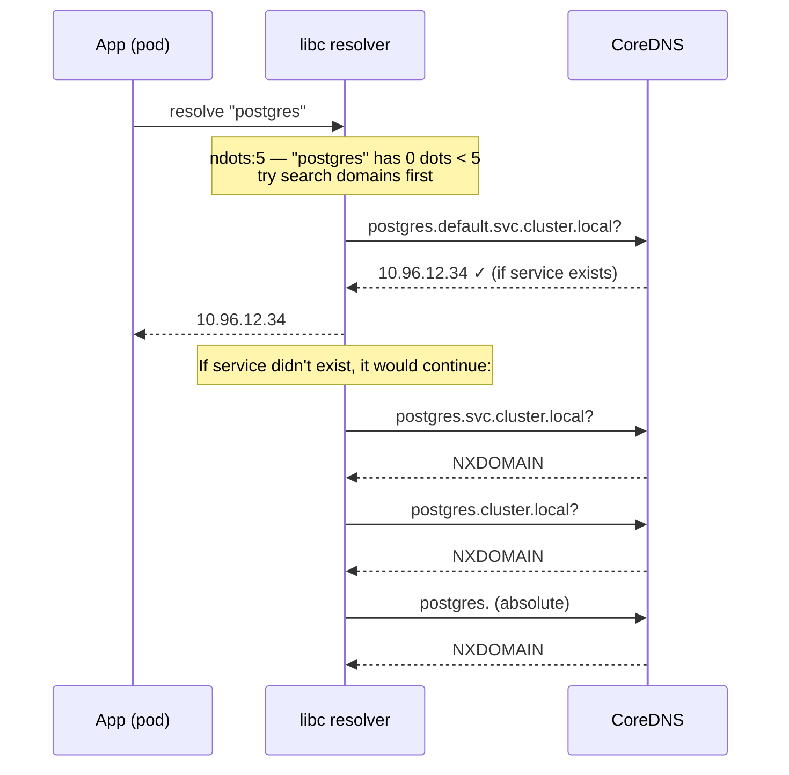

# CoreDNS

CoreDNS is the cluster DNS server in every Kubernetes cluster since 1.13. It replaced kube-dns (dnsmasq + kubedns + sidecar). It runs as a Deployment in `kube-system`, fronted by a Service with a stable ClusterIP that all pods use for DNS.

---

## How Pod DNS Resolution Works

Every pod gets `/etc/resolv.conf` auto-injected by kubelet:

```
nameserver 10.96.0.10        ← CoreDNS ClusterIP
search default.svc.cluster.local svc.cluster.local cluster.local
options ndots:5
```

When a pod does `curl postgres`:



**Best case:** 1 DNS query (service found on first search domain).
**Worst case:** 4–5 queries for a name that doesn't exist as a K8s service.

---

## The ndots:5 Problem

`ndots:5` means: if the hostname has **fewer than 5 dots**, the resolver tries all search domains before attempting the name as-is.

**Concrete example — `curl https://api.external.com/v1/data`:**
- `api.external.com` has 2 dots < 5
- Resolver tries: `api.external.com.default.svc.cluster.local` → NXDOMAIN
- Then: `api.external.com.svc.cluster.local` → NXDOMAIN
- Then: `api.external.com.cluster.local` → NXDOMAIN
- Finally: `api.external.com.` → answer

That's **4 DNS queries** for every outbound HTTPS call. At 1000 RPS this is 4000 DNS queries/sec extra load on CoreDNS.

### Fixes

**Fix 1 — Use FQDN (trailing dot):**
```bash
# In app config: always use FQDN for K8s services
postgres.default.svc.cluster.local.   # trailing dot = absolute, no search
```

**Fix 2 — Reduce ndots in pod spec:**
```yaml
spec:
  dnsConfig:
    options:
      - name: ndots
        value: "2"   # only search if fewer than 2 dots
  # Now "postgres" still searches (0 dots < 2)
  # But "api.external.com" (2 dots) goes direct — no search domain iteration
```

**Fix 3 — Use fully qualified service names in app config:**
```
DB_HOST=postgres.default.svc.cluster.local
```

---

## Corefile — CoreDNS Configuration

CoreDNS config lives in a ConfigMap:

```bash
kubectl get configmap coredns -n kube-system -o yaml
```

Default Corefile:

```
.:53 {
    errors                        # log errors to stdout
    health {                      # /health endpoint on :8080
       lameduck 5s                # wait 5s after marking unhealthy before shutting down
    }
    ready                         # /ready endpoint on :8181 — returns 200 when all plugins ready
    kubernetes cluster.local in-addr.arpa ip6.arpa {  # handle cluster.local DNS
       pods insecure              # enable pod DNS records (insecure = no verification)
       fallthrough in-addr.arpa ip6.arpa  # pass reverse lookups to next plugin
       ttl 30                     # TTL for cluster.local records
    }
    prometheus :9153              # expose metrics at /metrics
    forward . /etc/resolv.conf {  # forward non-cluster queries to node's resolver
       max_concurrent 1000
    }
    cache 30                      # cache all responses for 30s
    loop                          # detect forwarding loops, panic if found
    reload                        # hot-reload Corefile on ConfigMap change
    loadbalance                   # round-robin DNS (randomize A record order)
}
```

### Plugin reference

| Plugin | Purpose |
|--------|---------|
| `errors` | Log error responses |
| `health` | Liveness endpoint `/health` on :8080 |
| `ready` | Readiness endpoint `/ready` on :8181 |
| `kubernetes` | Serve DNS for cluster services/pods |
| `prometheus` | Metrics endpoint :9153 |
| `forward` | Forward upstream queries |
| `cache` | Response caching with TTL |
| `loop` | Detect + break forwarding loops |
| `reload` | Watch ConfigMap, hot-reload without restart |
| `loadbalance` | Randomize record order for basic LB |

---

## Custom Forwarding

Forward a specific domain to an internal DNS server:

```
.:53 {
    errors
    kubernetes cluster.local in-addr.arpa ip6.arpa {
        pods insecure
        fallthrough in-addr.arpa ip6.arpa
    }
    # Forward corp.example.com to internal DNS
    forward corp.example.com 10.0.1.53 {
        prefer_udp
    }
    # Forward everything else to public resolvers
    forward . 8.8.8.8 8.8.4.4 {
        max_concurrent 1000
        health_check 5s
    }
    cache 30
    loop
    reload
    loadbalance
}
```

```bash
# Apply the new ConfigMap — reload plugin picks it up automatically
kubectl apply -f coredns-configmap.yaml
# Verify reload happened:
kubectl logs -n kube-system -l k8s-app=kube-dns | grep "Reloading"
```

---

## Caching

The `cache` plugin caches all DNS responses in memory.

```
cache 30          # 30s TTL for positive responses, 15s for NXDOMAIN (half of positive)
# or
cache {
    success 9984 300 60    # max entries, max TTL, min TTL for positive
    denial 9984 300 5      # max entries, max TTL, min TTL for NXDOMAIN
    prefetch 10 1m 10%     # prefetch entries accessed >10 times before 10% of TTL remains
}
```

**Effect:** `service.namespace.svc.cluster.local` first lookup hits K8s API → cached for 30s → subsequent lookups served from memory without hitting API server.

---

## dnsPolicy Options

| Policy | Behaviour |
|--------|---------|
| `ClusterFirst` (default) | Use CoreDNS. Non-cluster names forwarded upstream. |
| `ClusterFirstWithHostNet` | Same as ClusterFirst but for pods using `hostNetwork: true` |
| `Default` | Use the **node's** `/etc/resolv.conf` — no cluster DNS |
| `None` | No DNS config injected — you must set `dnsConfig` manually |

```yaml
spec:
  dnsPolicy: "None"
  dnsConfig:
    nameservers:
      - 10.96.0.10
    searches:
      - svc.cluster.local
      - cluster.local
    options:
      - name: ndots
        value: "2"
      - name: timeout
        value: "2"
      - name: attempts
        value: "3"
```

---

## Scaling CoreDNS

Default: 2 replicas. Under heavy load you'll see CoreDNS CPU spike and DNS latency rise.

```bash
# Scale manually
kubectl scale deployment coredns -n kube-system --replicas=4

# Or use CoreDNS Autoscaler (proportional to nodes/cores)
kubectl get configmap coredns-autoscaler -n kube-system -o yaml
# Data: {"linear":{"coresPerReplica":256,"nodesPerReplica":16,"min":2}}
```

**Anti-affinity** (spread replicas across nodes — do not let both CoreDNS pods land on same node):
```yaml
# Already set by default in most clusters — verify:
kubectl get deployment coredns -n kube-system -o jsonpath='{.spec.template.spec.affinity}'
```

---

## Debugging DNS

```bash
# Test from inside a pod
kubectl run dnstest --rm -it --image=busybox --restart=Never -- sh
nslookup kubernetes                           # should resolve
nslookup my-svc.my-namespace.svc.cluster.local
nslookup google.com                           # external resolution

# Check resolv.conf
kubectl exec <pod> -- cat /etc/resolv.conf

# CoreDNS logs (set log plugin in Corefile to enable query logging)
kubectl logs -n kube-system -l k8s-app=kube-dns --tail=100

# CoreDNS metrics (if Prometheus is scraping)
# coredns_dns_requests_total
# coredns_dns_responses_total{rcode="NXDOMAIN"}
# coredns_forward_requests_duration_seconds_bucket

# Check CoreDNS pod health
kubectl get pods -n kube-system -l k8s-app=kube-dns
kubectl describe pod -n kube-system -l k8s-app=kube-dns

# Validate ConfigMap syntax before applying
docker run --rm -v $(pwd)/Corefile:/Corefile coredns/coredns:1.11.1 -conf /Corefile -dryrun
```

---

## Common Failure Modes

| Symptom | Cause | Fix |
|---------|-------|-----|
| 5s timeout on DNS then success | UDP packet dropped, resolver retries after 5s timeout | Check conntrack table full: `sysctl net.netfilter.nf_conntrack_max`; use TCP for DNS |
| NXDOMAIN storm | App retrying DNS in tight loop on failure | Fix app to cache NXDOMAIN, use exponential backoff |
| CoreDNS OOMKilled | Too many cached entries or high QPS | Increase memory limit; reduce cache size; scale replicas |
| `dial tcp: lookup X: no such host` | Service doesn't exist, or wrong namespace in FQDN | `kubectl get svc -A | grep X` |
| DNS works locally, fails in pod | NetworkPolicy blocks UDP/TCP 53 to kube-dns | Add egress rule: allow UDP 53 to `kube-system` namespace |

**conntrack full → 5s DNS timeout** — this is the most insidious:
```bash
# On the node:
sysctl net.netfilter.nf_conntrack_count
sysctl net.netfilter.nf_conntrack_max
# If count ≈ max: table full, new UDP flows dropped → 5s timeout

# Fix: increase nf_conntrack_max
sysctl -w net.netfilter.nf_conntrack_max=1048576
# Or: use nodeLocalDNS cache (runs on every node, uses link-local IP, bypasses conntrack)
```

**NodeLocal DNSCache** — the best fix for DNS at scale:
```
Each node runs a DNS cache DaemonSet on a link-local IP (169.254.20.10).
Pods resolve to this local cache first (no conntrack, no network hop).
Cache misses forward to CoreDNS. Reduces CoreDNS load by ~60-80%.
```
