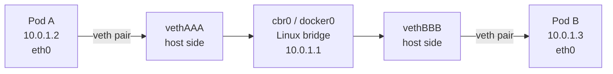
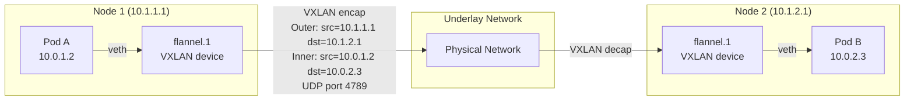
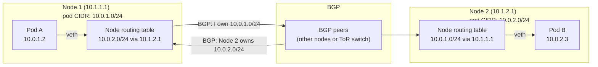
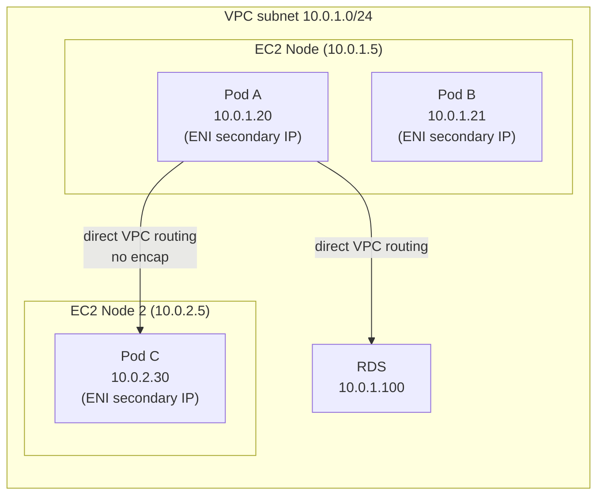

# Cross-Node Pod Networking

The Kubernetes networking model has three rules:
1. Every pod can reach every other pod without NAT
2. Nodes can reach pods without NAT
3. A pod sees its own IP the same way others see it

How this is implemented depends on the CNI plugin. Three patterns: overlay, direct routing, flat (VPC CNI).

---

## 1. Same-Node: Pod-to-Pod



**Packet walk:**
1. Pod A sends to `10.0.1.3` → kernel looks up routing table → route via `eth0` (default)
2. Packet exits Pod A's netns through the veth pair → appears on host side as `vethAAA`
3. Linux bridge (`cbr0`) sees the packet, looks up MAC table → forwards to `vethBBB`
4. Packet enters Pod B's netns through `vethBBB` → arrives at Pod B's `eth0`

```bash
# Inspect on a node
ip link show type veth          # list all veth pairs
brctl show cbr0                 # list bridge + attached veths
ip route                        # node routing table
```

---

## 2. Cross-Node: Overlay (VXLAN) — Flannel

Used when the underlay network can't route pod CIDRs (most cloud VPCs without CNI help, on-prem).



**VXLAN encapsulation adds:**
- Outer Ethernet header (14 bytes)
- Outer IP header (20 bytes)
- Outer UDP header (8 bytes, dst port 4789)
- VXLAN header (8 bytes)
- **Total overhead: 50 bytes** per packet

**MTU implication:** If the underlay MTU is 1500, pod MTU must be set to **1450** (1500 - 50). Flannel sets this automatically on the `flannel.1` interface. Wrong MTU → packets silently fragmented or dropped.

```bash
# Check pod MTU
kubectl exec <pod> -- ip link show eth0 | grep mtu

# On the node: inspect the VXLAN interface
ip -d link show flannel.1
ip route | grep flannel    # routes for each remote node's pod CIDR

# Test MTU: ping with DF bit set and large payload
ping -M do -s 1450 10.0.2.3   # if fails → MTU problem
```

---

## 3. Cross-Node: Direct Routing (Calico BGP)

No encapsulation. Each node announces its pod CIDR to other nodes via BGP. The underlay routes packets between nodes directly.



**Packet walk:**
1. Pod A sends to `10.0.2.3`
2. Node 1 routing table: `10.0.2.0/24 via 10.1.2.1` (learned from BGP)
3. Packet sent to Node 2's IP — **no encapsulation, full MTU available**
4. Node 2 routing table: `10.0.2.3 via vethXXX` → forwarded to Pod B

**Requirement:** The underlay network must either:
- Support BGP (ToR switches in bare metal)
- Allow route injection (AWS VPC with `--disable-pod-vpc-route-table-management=false`)

```bash
# Check BGP peers (calicoctl)
calicoctl node status

# Inspect Calico routes injected into node
ip route | grep bird   # Bird is the BGP daemon Calico uses

# Check encapsulation mode
calicoctl get felixconfiguration default -o yaml | grep encapsulation
```

---

## 4. VPC CNI Flat Network (AWS)

Every pod gets a **real ENI IP** from the VPC subnet. No overlay, no BGP — pods are first-class citizens in the VPC.



**How it works:**
1. `aws-node` DaemonSet runs on every node
2. It pre-allocates **secondary IPs** on the node's ENIs (or creates additional ENIs)
3. When a pod is created, the CNI plugin assigns one of the pre-allocated IPs to the pod
4. VPC routing table already knows these IPs belong to this EC2 instance

**Benefits:**
- Zero encapsulation overhead — same performance as EC2-to-EC2
- Pod IP directly reachable from RDS, ElastiCache, on-prem via VPN
- Security Groups work per-pod (with Security Groups for Pods feature)
- No MTU penalty

**Limitation: IP exhaustion**

Each EC2 instance can hold a limited number of ENI secondary IPs (based on instance type):
```bash
# Check how many IPs are available
kubectl describe node <node> | grep eni

# m5.large: 3 ENIs × 10 IPs = 30 pods max (minus 1 per ENI for node = 27)
# Fix 1: use larger instance types
# Fix 2: enable prefix delegation (/28 prefix per ENI slot = 16 IPs per slot)
```

**Prefix delegation** (recommended for large clusters):
```yaml
# Enable in aws-node DaemonSet env vars:
ENABLE_PREFIX_DELEGATION: "true"
WARM_PREFIX_TARGET: "1"
# Each ENI slot now holds a /28 (16 IPs) instead of 1 IP
# m5.large: 3 ENIs × (9 slots × 16 IPs) = 432 pods max
```

```bash
# Check current IP allocation
kubectl get node <node> -o json | jq '.metadata.annotations["vpc.amazonaws.com/node-capacity-suffix-ip-block"]'

# Check aws-node logs for IP allocation issues
kubectl logs -n kube-system -l k8s-app=aws-node --tail=50
```

---

## 5. MTU Summary

| CNI | Encap overhead | Recommended pod MTU |
|-----|---------------|-------------------|
| Flannel VXLAN | 50 bytes | 1450 |
| Calico IPIP | 20 bytes | 1480 |
| Calico BGP (no encap) | 0 bytes | 1500 |
| AWS VPC CNI | 0 bytes | 9001 (jumbo frames on EC2) |
| Cilium VXLAN | 50 bytes | 1450 |
| Cilium native routing | 0 bytes | 1500 |

```bash
# Check current MTU on a pod
kubectl exec <pod> -- cat /sys/class/net/eth0/mtu

# Test effective MTU with DF bit
kubectl exec <pod> -- ping -M do -s 1440 <other-pod-ip>
# Increase -s until it fails → that's your effective MTU

# Check CNI's configured MTU
cat /etc/cni/net.d/10-flannel.conflist | jq '.plugins[0].mtu'
```

---

## 6. Inspecting the Network on a Node

```bash
# All veth pairs (one per pod)
ip link show type veth

# Routing table (how pod CIDRs are reached)
ip route

# ARP/neighbor table
ip neigh

# Pod IP to veth mapping
for veth in $(ls /sys/class/net | grep veth); do
  peer=$(ip link show $veth | grep -o 'veth[0-9a-f]*' | tail -1)
  echo "$veth ↔ $peer"
done

# Which pod owns a veth (Linux netns approach)
nsenter --net=/proc/$(pgrep -f pause)/net ip addr show eth0
```
