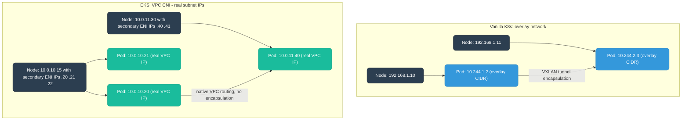
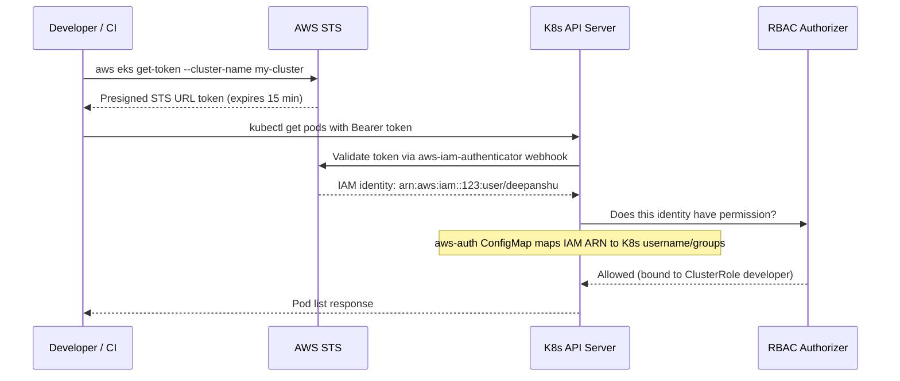
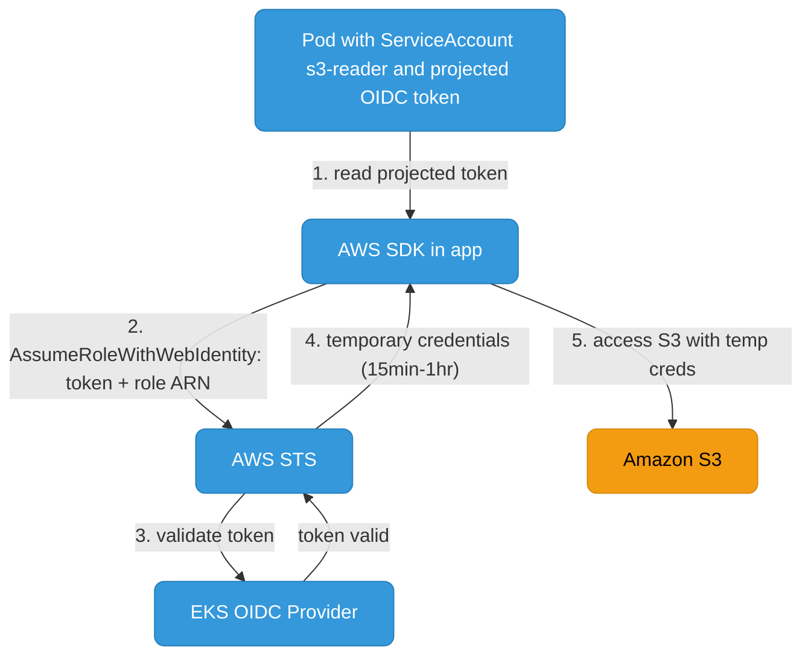

# EKS Architecture

Amazon EKS (Elastic Kubernetes Service) runs Kubernetes with AWS managing the control plane. Understanding where the boundary is between what AWS owns and what you own is critical for networking, security, and debugging.

---

## EKS vs Vanilla Kubernetes

| Aspect | Vanilla K8s | EKS |
|--------|------------|-----|
| Control plane | You run and manage | AWS runs, fully managed, multi-AZ HA |
| etcd | You manage, backup | AWS managed, encrypted at rest |
| API Server endpoint | You expose | `https://<hash>.gr7.<region>.eks.amazonaws.com` |
| Upgrades | Manual | Managed (you trigger, AWS applies) |
| Worker nodes | Any machine | EC2 (managed node groups, self-managed, or Fargate) |
| Node IAM | Manual | Instance profile (managed node group) or IRSA (pod-level) |
| Cluster auth | `kubeconfig` + certs | AWS IAM → `aws eks get-token` → K8s RBAC |
| Networking | CNI of your choice | AWS VPC CNI (pods get real VPC IPs) |
| Load balancers | Cloud controller manager | AWS Load Balancer Controller (ALB/NLB) |

---

## Architecture: AWS-Managed vs Customer-Managed

```mermaid
graph TD
    classDef blue fill:#3498db,stroke:#2980b9,color:#fff,rx:8
    classDef green fill:#2ecc71,stroke:#27ae60,color:#fff,rx:8
    classDef red fill:#e74c3c,stroke:#c0392b,color:#fff,rx:8
    classDef orange fill:#e67e22,stroke:#d35400,color:#fff,rx:8
    classDef purple fill:#9b59b6,stroke:#8e44ad,color:#fff,rx:8
    classDef teal fill:#1abc9c,stroke:#16a085,color:#fff,rx:8
    classDef dark fill:#2c3e50,stroke:#1a252f,color:#fff,rx:8
    classDef yellow fill:#f39c12,stroke:#d68910,color:#000,rx:8
    classDef k8s fill:#326ce5,stroke:#254ea8,color:#fff,rx:8
    classDef aws fill:#ff9900,stroke:#cc7a00,color:#000,rx:8
    subgraph AWSAccount["AWS Managed Account (opaque to you)"]
        subgraph CPVPC["EKS Control Plane VPC (AWS-owned, not visible)"]
            APISERVER["API Server: Multi-AZ HA, auto-scaled by AWS"]:::dark
            ETCD["etcd: AWS managed, KMS encrypted, auto-backed-up"]:::k8s
            SCHEDULER["kube-scheduler: managed by AWS"]:::purple
            CM["kube-controller-manager: managed by AWS"]:::purple
            CCM["AWS Cloud Controller Manager: provisions ELBs and routes"]:::blue
        end
    end

    subgraph YourAccount["Your AWS Account"]
        subgraph YourVPC["Your VPC (10.0.0.0/16)"]
            subgraph ENIBridge["Cross-Account ENI Bridge"]
                ENI_CP["AWS-injected ENI in your subnet (10.0.1.50): how API Server reaches kubelets"]:::teal
            end
            subgraph PubSubnet["Public Subnets (10.0.0.0/24, 10.0.1.0/24)"]
                ALB["AWS Load Balancer (ALB/NLB): terminates external traffic"]:::red
                NAT["NAT Gateway: outbound internet for private nodes"]:::orange
            end
            subgraph PrivSubnet["Private Subnets (10.0.10.0/24, 10.0.11.0/24)"]
                subgraph Node1["EC2 Worker Node 1 (10.0.10.15)"]
                    KUBELET1["kubelet: registers with API Server via cross-account ENI"]:::dark
                    KPROXY1["kube-proxy: iptables/IPVS rules"]:::blue
                    VPCCNI1["aws-node VPC CNI DaemonSet: assigns VPC IPs to pods"]:::teal
                    POD1["Pod: my-app IP 10.0.10.20 (real VPC IP)"]:::teal
                    POD2["Pod: my-app IP 10.0.10.21"]:::blue
                    COREDNS["Pod: coredns IP 10.0.10.22"]:::teal
                end
                subgraph Node2["EC2 Worker Node 2 (10.0.11.30)"]
                    KUBELET2["kubelet"]:::k8s
                    VPCCNI2["aws-node VPC CNI"]:::teal
                    POD3["Pod: my-app IP 10.0.11.40 (real VPC IP)"]:::teal
                    POD4["Pod: aws-load-balancer-controller"]:::purple
                end
            end
        end
        IAM["AWS IAM OIDC Provider: IRSA pod-to-role mapping"]:::blue
        ECR["Amazon ECR: container image registry"]:::yellow
        CW["CloudWatch: Container Insights and control plane logs"]:::yellow
    end

    APISERVER <-->|"HTTPS via cross-account ENI"| ENI_CP
    ENI_CP <-->|"in-VPC traffic"| KUBELET1
    ENI_CP <-->|"in-VPC traffic"| KUBELET2
    ALB -->|"routes to pod IPs"| POD1
    ALB --> POD3
    POD1 -->|"outbound via NAT"| NAT
    VPCCNI1 -->|"assigns secondary ENI IPs"| POD1
    IAM -.->|"OIDC: pod assumes role via projected SA token"| POD4
    ECR -.->|"image pull"| Node1
```



### The Cross-Account ENI — How Control Plane Reaches Nodes

This is the most important networking concept in EKS. The API Server lives in AWS's VPC, but it needs to reach `kubelet` on your nodes (for exec, logs, port-forward). AWS solves this by injecting an **ENI (Elastic Network Interface)** directly into your subnet. This ENI has an IP in your private subnet and is managed entirely by AWS — you can see it in your EC2 console but should not modify it.

When the API Server needs to reach `kubelet` on `10.0.10.15:10250`, it goes through its side of the ENI → your subnet → node's private IP. The traffic never leaves AWS's network, but it crosses account/VPC boundaries via this ENI.

**Cluster endpoint access modes:**

| Mode | API Server reachable from | Use case |
|------|--------------------------|----------|
| Public | Internet (filtered by CIDR allow-list) | Dev, CI from outside VPC |
| Private | Within your VPC only (via ENI) | Production — never expose to internet |
| Public + Private | Both | Transition/hybrid |

---

## VPC CNI — Why EKS Pods Get Real VPC IPs

Vanilla Kubernetes uses an overlay network (VXLAN/IPIP) where pod IPs are in a separate CIDR that's NAT'd at the node. EKS uses the **AWS VPC CNI plugin** (`aws-node` DaemonSet) which assigns **real VPC subnet IPs to pods**.



How VPC CNI works:
1. `aws-node` DaemonSet attaches secondary ENIs to each EC2 node (up to `max_ENIs` per instance type)
2. Each secondary ENI gets multiple secondary private IPs
3. When a pod is created, `aws-node` assigns one of these secondary IPs directly to the pod's `eth0`
4. Because these are real VPC IPs, pod-to-pod traffic across nodes uses normal VPC routing — no overlay, no encapsulation

**Implication:** Pod IP exhaustion is a real concern. If your subnet has 256 IPs and nodes pre-allocate secondary IPs, you can run out. Solution: use `/16` or `/18` subnets for worker nodes, enable **custom networking** to use a secondary CIDR (`100.64.0.0/16`), or enable **prefix delegation** (each ENI IP prefix = `/28` = 16 IPs, massively increasing pod density).

---

## IAM Authentication & IRSA

### Cluster Authentication Flow



The **aws-auth ConfigMap** (legacy) or **EKS Access Entries** (new, recommended) maps IAM principals to Kubernetes RBAC subjects:

```yaml
# aws-auth ConfigMap (legacy approach)
apiVersion: v1
kind: ConfigMap
metadata:
  name: aws-auth
  namespace: kube-system
data:
  mapRoles: |
    - rolearn: arn:aws:iam::123456789:role/eks-node-group-role
      username: system:node:{{EC2PrivateDNSName}}
      groups:
        - system:bootstrappers
        - system:nodes
    - rolearn: arn:aws:iam::123456789:role/ci-deploy-role
      username: ci-deployer
      groups:
        - deployers
```

### IRSA — IAM Roles for Service Accounts

IRSA lets individual pods assume IAM roles without putting AWS credentials in the pod or sharing node IAM permissions across all pods on a node.



```yaml
apiVersion: v1
kind: ServiceAccount
metadata:
  name: s3-reader
  namespace: default
  annotations:
    eks.amazonaws.com/role-arn: arn:aws:iam::123456789:role/my-app-s3-read-role
---
spec:
  serviceAccountName: s3-reader
  containers:
    - name: app
      env:
        - name: AWS_REGION
          value: us-east-1
```

The IAM role's trust policy must allow the cluster's OIDC provider to assume it:

```json
{
  "Statement": [{
    "Effect": "Allow",
    "Principal": {
      "Federated": "arn:aws:iam::123456789:oidc-provider/oidc.eks.us-east-1.amazonaws.com/id/XXXX"
    },
    "Action": "sts:AssumeRoleWithWebIdentity",
    "Condition": {
      "StringEquals": {
        "oidc.eks.us-east-1.amazonaws.com/id/XXXX:sub": "system:serviceaccount:default:s3-reader"
      }
    }
  }]
}
```

---

## Node Groups: Managed vs Self-Managed vs Fargate

| Feature | Managed Node Group | Self-Managed | Fargate |
|---------|-------------------|--------------|---------|
| AMI updates | AWS handles, you trigger | You manage | AWS handles |
| Node visibility | EC2 instances in your account | EC2 instances | No nodes (serverless) |
| Draining on upgrade | Automatic (respects PDB) | Manual | N/A |
| GPU support | Yes | Yes | No |
| DaemonSets | Yes | Yes | No (sidecar injection only) |
| Spot instances | Yes | Yes | Yes (Fargate Spot) |
| Cost model | EC2 pricing | EC2 pricing | Per-pod vCPU+memory |
| Best for | Most workloads | Custom AMI, kernel config | Batch, small isolated pods |

**Fargate limitation:** No DaemonSets. Since there are no nodes (pods run on AWS micro-VMs), `aws-node` CNI DaemonSet, `kube-proxy` DaemonSet, and monitoring DaemonSets don't run. AWS handles pod networking separately. CloudWatch Container Insights uses sidecar injection via Fluent Bit.

---

## EKS Add-ons

| Add-on | What it does | Why it matters |
|--------|-------------|----------------|
| `vpc-cni` (`aws-node`) | Assigns VPC IPs to pods | Core networking — don't let it get out of date |
| `kube-proxy` | iptables/IPVS service routing | Keeps node service rules in sync |
| `coredns` | In-cluster DNS | `my-svc.my-ns.svc.cluster.local` resolution |
| `aws-ebs-csi-driver` | Provisions EBS volumes for PVCs | Required since K8s 1.23 (in-tree deprecated) |
| `aws-efs-csi-driver` | Shared EFS mounts | Multi-AZ shared storage |
| `adot` | Metrics/traces collection | Feeds X-Ray and CloudWatch |

---

## EKS Control Plane Logs

Enable in cluster config. Logged to CloudWatch log group `/aws/eks/<cluster>/cluster`:

| Log type | What it contains | Use for |
|----------|-----------------|---------|
| `api` | All API Server requests | Audit trail, who-did-what |
| `audit` | K8s audit log (create/delete/patch) | Security investigation |
| `authenticator` | IAM auth webhook decisions | Debugging auth failures |
| `controllerManager` | Controller reconciliation events | Debugging object not created |
| `scheduler` | Scheduling decisions and failures | Debugging `Pending` pods |

```bash
aws logs filter-log-events \
  --log-group-name /aws/eks/my-cluster/cluster \
  --log-stream-name-prefix kube-scheduler \
  --filter-pattern "my-pending-pod" \
  --region us-east-1
```
