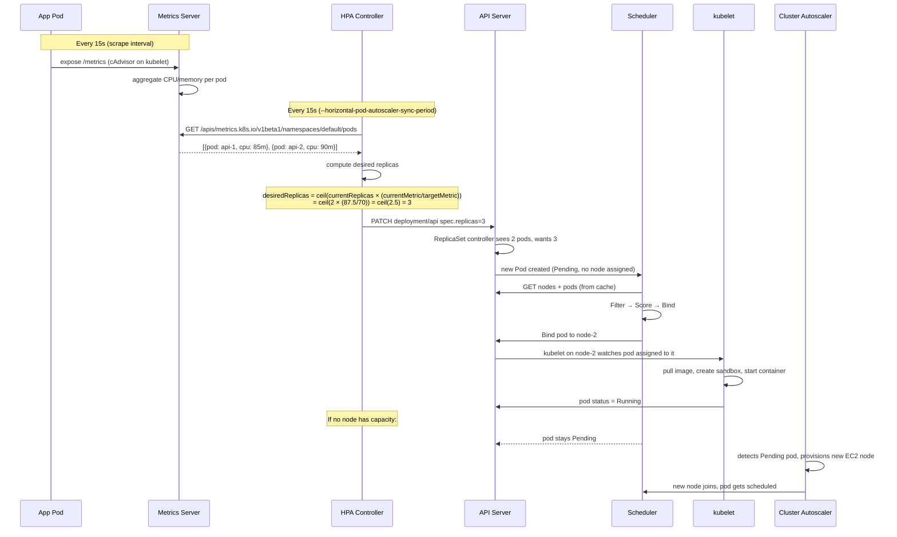
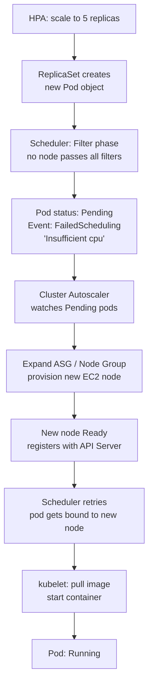
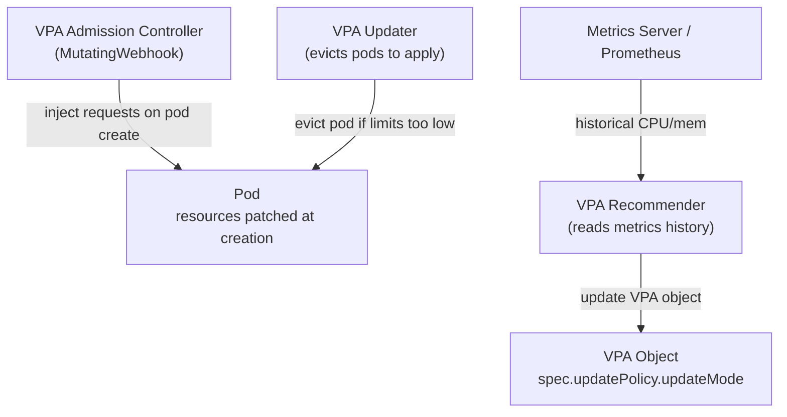
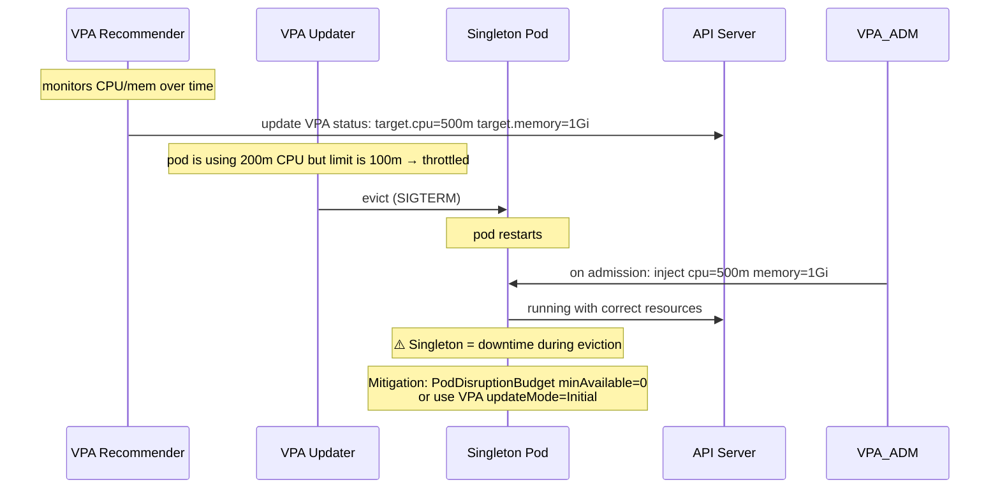

# HPA and VPA — Deep Internals

## HPA — Horizontal Pod Autoscaler

### Every Stage Internals



### The Math

```
desiredReplicas = ceil( currentReplicas × (currentValue / targetValue) )

Example: 3 pods, CPU target 70%, current average 90%
desiredReplicas = ceil(3 × 90/70) = ceil(3.86) = 4

Scale-down: 4 pods, CPU 20%
desiredReplicas = ceil(4 × 20/70) = ceil(1.14) = 2
BUT: scale-down waits stabilizationWindowSeconds (default 300s)
to avoid flapping
```

### HPA QoS Classes and Behaviour

```yaml
apiVersion: autoscaling/v2
kind: HorizontalPodAutoscaler
spec:
  scaleTargetRef:
    apiVersion: apps/v1
    kind: Deployment
    name: api
  minReplicas: 2
  maxReplicas: 20
  metrics:
  - type: Resource
    resource:
      name: cpu
      target:
        type: Utilization
        averageUtilization: 70

  behavior:
    scaleUp:
      stabilizationWindowSeconds: 0      # scale up immediately
      policies:
      - type: Pods
        value: 4                         # add at most 4 pods per 60s
        periodSeconds: 60
      - type: Percent
        value: 100                       # or double pods per 60s
        periodSeconds: 60
      selectPolicy: Max                  # use whichever is larger

    scaleDown:
      stabilizationWindowSeconds: 300    # wait 5min before scaling down
      policies:
      - type: Pods
        value: 1                         # remove at most 1 pod per 60s
        periodSeconds: 60
```

### What Happens When No Node is Available



### Debugging HPA

```bash
# See current HPA state
kubectl get hpa -n <namespace>
# NAME   REFERENCE         TARGETS         MINPODS  MAXPODS  REPLICAS
# api    Deployment/api    85%/70%         2        20       4

# Describe for events and conditions
kubectl describe hpa api -n <namespace>
# Conditions:
#   AbleToScale    True   SucceededGetScale
#   ScalingActive  True   ValidMetricFound
#   ScalingLimited False  DesiredWithinRange

# Check metrics server is working
kubectl top pods -n <namespace>
# If this fails → HPA will show <unknown>

# Events that matter
kubectl get events -n <namespace> | grep HPA
# SuccessfulRescale: New size: 4; reason: cpu resource utilization above target
```

---

## VPA — Vertical Pod Autoscaler

### Why VPA?

HPA adds more pods. VPA makes each pod bigger (more CPU/memory). Use when:
- **Singleton workloads** — only one instance can run (leader-elected, stateful, CronJob)
- **Memory-bound** workloads — memory doesn't decrease with more replicas (ML model loaded in memory)
- **Right-sizing** — you don't know the right requests/limits; start with VPA in `Off` mode for recommendations

### VPA Architecture



Three components:
1. **Recommender** — watches pod resource usage history, computes `lowerBound`, `target`, `upperBound`
2. **Updater** — evicts pods that are too far from target (so Admission Controller can inject new values on restart)
3. **Admission Controller** — patches `resources` on pod creation (Mutating webhook)

### VPA Update Modes

```yaml
apiVersion: autoscaling.k8s.io/v1
kind: VerticalPodAutoscaler
metadata:
  name: api-vpa
spec:
  targetRef:
    apiVersion: apps/v1
    kind: Deployment
    name: api
  updatePolicy:
    updateMode: "Auto"    # Off | Initial | Recreate | Auto
  resourcePolicy:
    containerPolicies:
    - containerName: api
      minAllowed:
        cpu: 100m
        memory: 128Mi
      maxAllowed:
        cpu: 4
        memory: 4Gi
      controlledResources: ["cpu", "memory"]
```

| Mode | What it does |
|------|-------------|
| `Off` | Recommendations only — no changes applied. Use first to baseline. |
| `Initial` | Sets requests at pod creation, never touches running pods |
| `Recreate` | Evicts pods to apply new recommendations (causes restart) |
| `Auto` | Same as Recreate today; future: in-place update |

### VPA for Singleton Applications



**Singleton + VPA caveat:** Every Updater eviction = restart = downtime for singleton. Mitigations:
1. Use `updateMode: Initial` — recommendations applied at next natural restart only
2. Use `updateMode: Off` + manually apply recommendations during maintenance window
3. Use `minAvailable: 0` in PDB to allow the eviction but schedule the restart yourself

### Checking VPA Recommendations

```bash
kubectl describe vpa api-vpa
# Status:
#   Recommendation:
#     Container Recommendations:
#       Container Name: api
#       Lower Bound:
#         Cpu:     100m
#         Memory:  256Mi
#       Target:                  ← use this for requests
#         Cpu:     400m
#         Memory:  768Mi
#       Uncapped Target:
#         Cpu:     400m
#         Memory:  768Mi
#       Upper Bound:             ← use this for limits
#         Cpu:     2
#         Memory:  2Gi
```

### HPA + VPA: Can You Use Both?

**Not on the same metric.** If both target CPU:
- VPA increases pod CPU → pods use less CPU → HPA scales in → fewer pods → more load per pod → VPA increases again → loop

**Safe combination:**
- HPA on custom metric (RPS, queue depth) + VPA on CPU/memory
- Or: VPA in `Off` mode (recommendations only) + HPA on CPU (you apply VPA recommendations manually)
