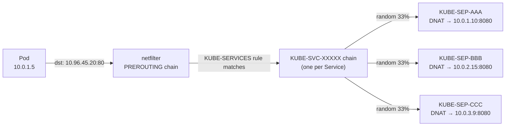
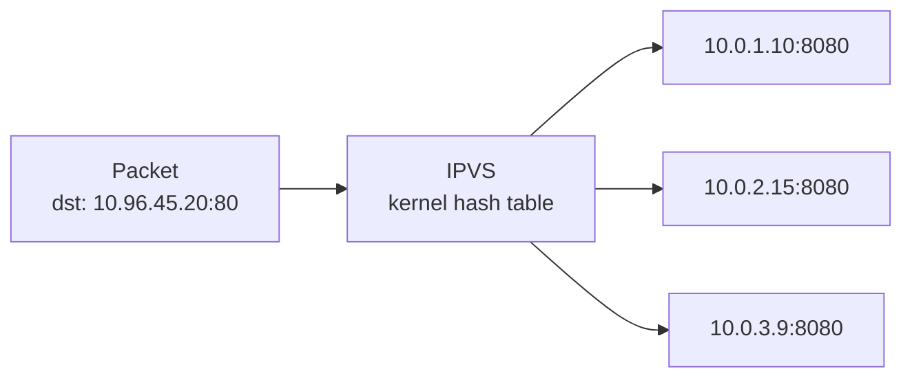
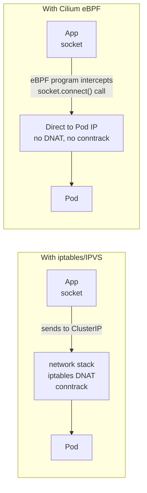

# kube-proxy Modes

kube-proxy runs as a DaemonSet on every node. Its job: watch Services and EndpointSlices from the API server and program the local kernel to implement the ClusterIP virtual IP abstraction.

---

## 1. iptables Mode (default)

kube-proxy writes iptables NAT rules in the `KUBE-SERVICES` chain. When a packet is sent to a ClusterIP, netfilter intercepts it in `PREROUTING` and randomly rewrites the destination to one of the pod IPs.



**The O(n) problem:**

Every packet traverses the chain linearly until a matching rule is found. With 10,000 services and ~3 endpoints each → **30,000 iptables rules** evaluated per packet. kube-proxy CPU spikes every time rules are rewritten (any endpoint change = full rewrite of affected chains).

```bash
# Count iptables rules
iptables-save | grep -c KUBE

# Inspect a service's rules
iptables-save | grep KUBE-SVC-$(kubectl get svc my-svc -o jsonpath='{..uid}' | head -c8 | tr '[:lower:]' '[:upper:]')

# Watch conntrack table size (iptables mode creates a conntrack entry per connection)
sysctl net.netfilter.nf_conntrack_count
sysctl net.netfilter.nf_conntrack_max
# If count ≈ max → new connections dropped silently
```

**conntrack issue:** Every new connection through a ClusterIP creates a conntrack entry to remember the DNAT mapping for the return path. At high connection rates, the conntrack table fills → `nf_conntrack: table full, dropping packet`.

---

## 2. IPVS Mode

IPVS (IP Virtual Server) is a Linux kernel module originally built for load balancers. It uses **hash tables** instead of linear rule chains → O(1) lookup regardless of service count.



**Load balancing algorithms (vs iptables which is only random):**

| Algorithm | Flag | When to use |
|-----------|------|------------|
| Round Robin | `rr` | Default, equal weight |
| Least Connection | `lc` | Route to pod with fewest active connections |
| Destination Hash | `dh` | Sticky by destination IP |
| Source Hash | `sh` | Sticky by source IP (session persistence) |
| Shortest Expected Delay | `sed` | Fewest connections + lowest weight |
| Never Queue | `nq` | Send to idle server, else SED |

```bash
# Enable IPVS mode (edit kube-proxy ConfigMap)
kubectl edit configmap kube-proxy -n kube-system
# Set: mode: "ipvs"
# Set: ipvs.scheduler: "lc"

# Required kernel modules (load before switching)
modprobe ip_vs ip_vs_rr ip_vs_wrr ip_vs_sh nf_conntrack

# Inspect IPVS rules after enabling
ipvsadm -Ln
# TCP  10.96.45.20:80 rr
#   -> 10.0.1.10:8080        Masq    1      0          0
#   -> 10.0.2.15:8080        Masq    1      0          0

# Stats per service
ipvsadm -Ln --stats

# Connection count per backend
ipvsadm -Lnc
```

**When to switch to IPVS:**
- > 1000 Services in the cluster
- kube-proxy CPU usage is high (> 20% sustained)
- Need connection-aware load balancing (least-connection)
- Seeing iptables rule rewrite latency during deployments

---

## 3. Cilium / eBPF — No kube-proxy

Cilium replaces kube-proxy entirely. Instead of iptables or IPVS, it uses **eBPF programs loaded at socket level** — load balancing happens before packets even enter the network stack.



**How it works:**
1. Cilium loads eBPF programs at the **tc (traffic control) ingress/egress hooks** and at the **socket layer** (BPF_PROG_TYPE_SOCK_OPS)
2. When an app calls `connect()` to a ClusterIP, the socket-level eBPF program rewrites the destination to a real pod IP **before** the packet is constructed
3. No DNAT, no conntrack entry needed for the NAT mapping

**Install without kube-proxy:**
```bash
# Helm install with kube-proxy replacement
helm install cilium cilium/cilium \
  --namespace kube-system \
  --set kubeProxyReplacement=true \
  --set k8sServiceHost=<API_SERVER_IP> \
  --set k8sServicePort=6443
```

**Hubble — eBPF-based observability:**
```bash
# Install Hubble UI
cilium hubble enable --ui

# Observe flows in real time
hubble observe --namespace default

# See what's hitting a service
hubble observe --to-service my-svc

# Show dropped packets (NetworkPolicy violations)
hubble observe --verdict DROPPED
```

**L7 NetworkPolicy (Cilium-specific):**
```yaml
# iptables can only filter L3/L4 — Cilium can filter by HTTP path, gRPC method
apiVersion: cilium.io/v2
kind: CiliumNetworkPolicy
spec:
  endpointSelector:
    matchLabels:
      app: api
  ingress:
  - fromEndpoints:
    - matchLabels:
        app: frontend
    toPorts:
    - ports:
      - port: "8080"
      rules:
        http:
        - method: "GET"
          path: "/api/v1/.*"   # only allow GET /api/v1/*
```

---

## 4. Comparison

| | iptables | IPVS | Cilium/eBPF |
|--|---------|------|------------|
| Mechanism | netfilter NAT rules | kernel LB hash table | eBPF socket-level |
| Lookup complexity | O(n) per packet | O(1) | O(1), before packet created |
| conntrack | Yes — per connection | Yes — per connection | No (socket-level rewrite) |
| LB algorithms | Random only | rr, lc, dh, sh, sed, nq | Random, Maglev consistent hash |
| NetworkPolicy L7 | No | No | Yes (HTTP, gRPC, Kafka) |
| Observability | iptables counters | ipvsadm stats | Hubble: per-flow visibility |
| Max services | ~5,000 practical | 100,000+ | 100,000+ |
| Production maturity | Very high (default) | High | High (CNCF graduated) |
| kube-proxy needed | Yes | Yes | No |
| When to use | Small clusters, simplicity | Medium-large clusters | Large scale, need L7 policy |

---

## 5. Debugging

### iptables mode
```bash
# Count rules
iptables-save | wc -l

# Find service rules
iptables-save | grep KUBE-SERVICES

# Check conntrack table pressure
conntrack -S   # shows inserts, found, invalid, ignore, delete stats
conntrack -L | wc -l   # current entries

# Flush conntrack for a specific IP (emergency)
conntrack -D -d 10.96.45.20
```

### IPVS mode
```bash
# Check kernel modules loaded
lsmod | grep ip_vs

# List all virtual services + backends
ipvsadm -Ln

# Connection stats
ipvsadm -Ln --stats

# Verify kube-proxy is in IPVS mode
kubectl get configmap kube-proxy -n kube-system -o yaml | grep mode
```

### Cilium
```bash
# Overall health
cilium status

# Check kube-proxy replacement is active
cilium status | grep KubeProxyReplacement

# Endpoint status
cilium endpoint list

# Observe live traffic
hubble observe -n my-namespace --last 100

# Debug a specific pod's connectivity
cilium policy trace --src-k8s-pod my-namespace/pod-a --dst-k8s-pod my-namespace/pod-b --dport 8080
```
