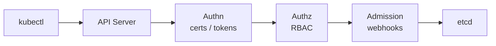

# kubectl Cheatsheet

## kubectl Request Flow



---

## 1. Context and Cluster Switching

```bash
# List contexts
kubectl config get-contexts

# Switch context
kubectl config use-context <context-name>

# Show current context
kubectl config current-context

# Set default namespace for context
kubectl config set-context --current --namespace=<ns>

# Rename context
kubectl config rename-context old-name new-name

# kubectx (faster switching)
kubectx                    # list contexts
kubectx <context-name>     # switch
kubectx -                  # switch to previous
kubens <namespace>         # switch namespace
```

---

## 2. Pod Operations

```bash
# List pods
kubectl get pods
kubectl get pods -A                          # all namespaces
kubectl get pods -o wide                     # with node/IP
kubectl get pods --field-selector=status.phase=Running

# Describe
kubectl describe pod <pod>

# Logs
kubectl logs <pod>
kubectl logs <pod> -c <container>            # specific container
kubectl logs <pod> -f                        # follow
kubectl logs <pod> --previous               # crashed container
kubectl logs -l app=myapp                    # by label

# Exec
kubectl exec -it <pod> -- bash
kubectl exec -it <pod> -c <container> -- sh

# Port-forward
kubectl port-forward pod/<pod> 8080:80
kubectl port-forward svc/<svc> 8080:80
kubectl port-forward deploy/<deploy> 8080:80

# Copy files
kubectl cp <pod>:/path/file ./local-file
kubectl cp ./local-file <pod>:/path/file
```

---

## 3. Deployment Operations

```bash
# Rollout
kubectl rollout status deploy/<name>
kubectl rollout history deploy/<name>
kubectl rollout history deploy/<name> --revision=2
kubectl rollout undo deploy/<name>
kubectl rollout undo deploy/<name> --to-revision=2
kubectl rollout pause deploy/<name>
kubectl rollout resume deploy/<name>

# Scale
kubectl scale deploy/<name> --replicas=5
kubectl autoscale deploy/<name> --min=2 --max=10 --cpu-percent=70

# Update image
kubectl set image deploy/<name> <container>=<image>:<tag>

# Annotate revision (for history)
kubectl annotate deploy/<name> \
  kubernetes.io/change-cause="v2.1.0 hotfix"
```

---

## 4. Debugging

```bash
# Ephemeral debug container (K8s 1.23+)
kubectl debug -it <pod> --image=busybox --target=<container>

# Debug by copying pod with new image
kubectl debug <pod> -it --copy-to=debug-pod --image=ubuntu

# Events (sorted by time)
kubectl get events --sort-by='.lastTimestamp'
kubectl get events -n <ns> --field-selector=involvedObject.name=<pod>

# Resource usage
kubectl top pods
kubectl top pods --sort-by=memory
kubectl top nodes

# API resources
kubectl api-resources
kubectl api-resources --namespaced=true
kubectl explain pod.spec.containers
kubectl explain --recursive pod.spec
```

---

## 5. Resource Management

```bash
# Apply / delete
kubectl apply -f manifest.yaml
kubectl apply -f ./dir/
kubectl delete -f manifest.yaml
kubectl delete pod <pod> --grace-period=0 --force

# Patch
kubectl patch deploy <name> -p '{"spec":{"replicas":3}}'
kubectl patch pod <pod> --type=json \
  -p='[{"op":"replace","path":"/spec/containers/0/image","value":"nginx:1.25"}]'

# Label / annotate
kubectl label pod <pod> env=prod
kubectl label pod <pod> env-              # remove label
kubectl annotate pod <pod> note="debug"

# Taint / toleration
kubectl taint node <node> key=value:NoSchedule
kubectl taint node <node> key=value:NoSchedule-   # remove
```

**Follow-up: `kubectl apply` vs `kubectl replace` vs `kubectl patch`**

| Command | How it works | When to use |
|---------|-------------|-------------|
| `kubectl apply -f` | 3-way merge: desired + last-applied + live. Creates if missing. | Default for everything — idempotent, GitOps-safe |
| `kubectl replace -f` | Full replace of the live object. Fails if resource doesn't exist. | When you want to overwrite completely (no merge) |
| `kubectl replace --force -f` | Delete + recreate. **Causes downtime.** | Immutable fields changed (e.g., pod selector) |
| `kubectl patch -p` | Merge-patch a specific field. Does not require full manifest. | Quick in-place fix (replicas, image) without editing a file |
| `kubectl patch --type=json` | RFC 6902 JSON Patch — precise field operations (add/remove/replace/move) | Scripted automation needing exact field targeting |

**Key rule:** `apply` is declarative and safe for CI/CD. `replace` is imperative and overwrites. `replace --force` destroys pods — never use in production without understanding the downtime.

**Follow-up: `kubectl rollout restart` — what does it do and when to use it?**

```bash
kubectl rollout restart deployment/<name>   # triggers rolling restart of all pods
```

It sets an annotation `kubectl.kubernetes.io/restartedAt: <timestamp>` on the pod template, which changes the template hash → Kubernetes treats it as a new spec → triggers a rolling update that replaces all pods one by one.

**When to use:**
- ConfigMap or Secret was updated (K8s does not auto-restart pods when mounted config changes)
- Need to force pod re-creation to pick up node-level changes (updated DaemonSet config, rotated certificates)
- Clearing a stuck state without changing the actual spec

```bash
# Restart vs delete-pod comparison
kubectl delete pod <pod>          # restarts ONE pod immediately (abrupt)
kubectl rollout restart deploy    # restarts ALL pods via rolling update (controlled, respects maxUnavailable)
```

**Always use `rollout restart` over manually deleting pods** when you want zero-downtime and the PDB/rollingUpdate strategy to apply.

---

## 6. Namespace Operations

```bash
# List / create / delete
kubectl get namespaces
kubectl create namespace <ns>
kubectl delete namespace <ns>

# Run everything scoped to a namespace
kubectl -n <ns> get all
kubectl -n <ns> get pods,svc,deploy,cm,secret

# Copy secret across namespaces
kubectl get secret <name> -n src \
  -o yaml | sed 's/namespace: src/namespace: dst/' \
  | kubectl apply -f -
```

---

## 7. One-liner Power Commands

```bash
# Get ALL resources in a namespace
kubectl get all -n <ns>
kubectl api-resources --verbs=list --namespaced -o name \
  | xargs -I{} kubectl get {} -n <ns> --ignore-not-found

# Watch pods live
kubectl get pods -w
kubectl get pods --watch-only

# JSONPath
kubectl get pods -o jsonpath='{.items[*].metadata.name}'
kubectl get node <node> \
  -o jsonpath='{.status.conditions[?(@.type=="Ready")].status}'

# Custom columns
kubectl get pods \
  -o custom-columns=NAME:.metadata.name,NODE:.spec.nodeName,STATUS:.status.phase

# Pods on a specific node
kubectl get pods --all-namespaces \
  --field-selector=spec.nodeName=<node>

# Sort by restart count
kubectl get pods -A --sort-by='.status.containerStatuses[0].restartCount'

# Decode a secret
kubectl get secret <name> -o jsonpath='{.data.password}' | base64 -d

# Dry-run apply (server-side)
kubectl apply -f manifest.yaml --dry-run=server

# Diff before apply
kubectl diff -f manifest.yaml

# Force replace (destroys and recreates)
kubectl replace --force -f manifest.yaml

# Quickly create resources
kubectl create deploy nginx --image=nginx:1.25 --replicas=2
kubectl expose deploy nginx --port=80 --type=ClusterIP
kubectl create cm my-config --from-file=config.yaml
kubectl create secret generic my-secret \
  --from-literal=password=s3cr3t
```
