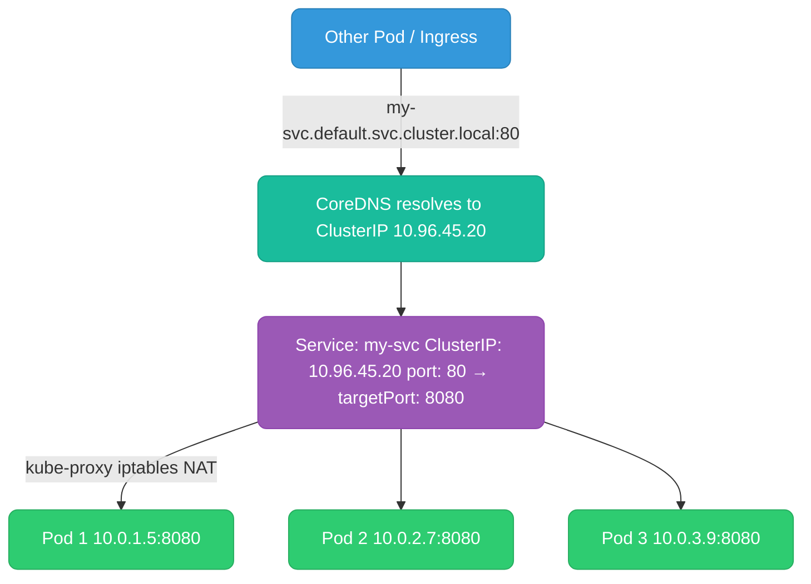
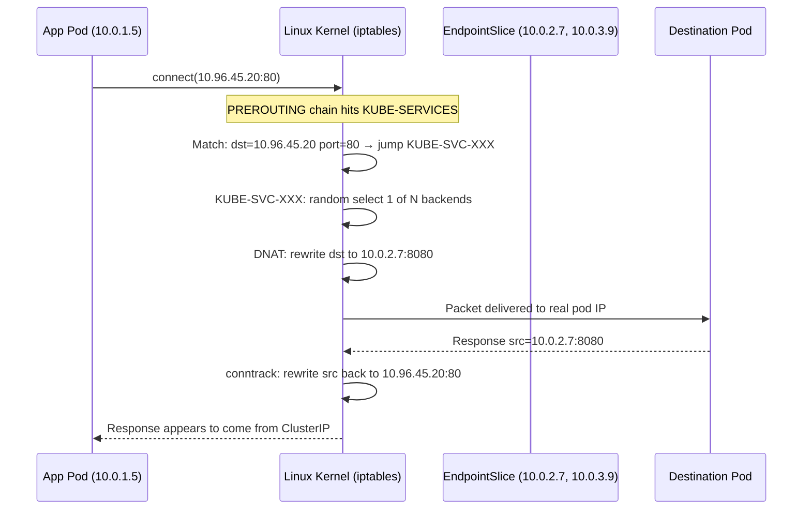
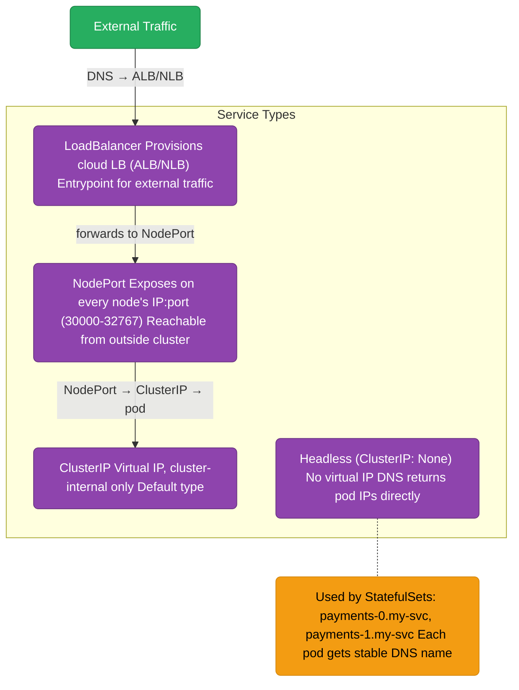
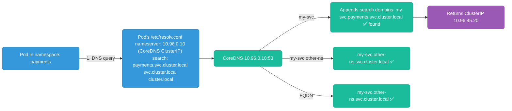
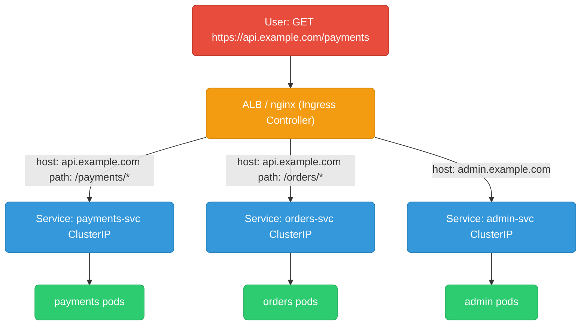
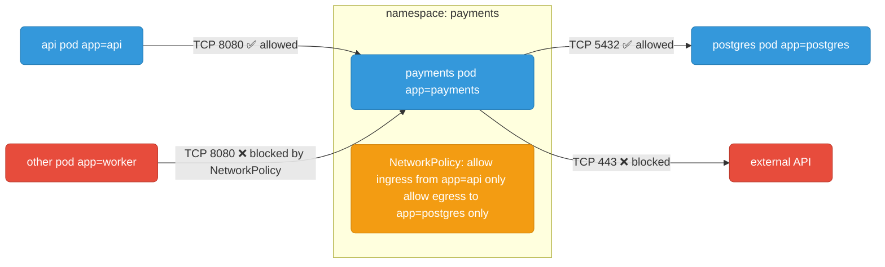

# Kubernetes Networking

---

## Services — The Stable Endpoint Abstraction

Pods are ephemeral — they die and get new IPs. A **Service** is a stable virtual IP (ClusterIP) that load-balances to a dynamic set of pods selected by label.



---

## ClusterIP Internals — How kube-proxy Programs iptables

ClusterIP is **not** a real IP with a process listening on it. It's a virtual IP that exists only in iptables NAT rules. When a packet hits the ClusterIP, the kernel rewrites the destination to one of the backend pod IPs before sending.



**iptables chain hierarchy:**
```
PREROUTING
  └── KUBE-SERVICES
        └── KUBE-SVC-XXXXXXXX  (per Service)
              ├── KUBE-SEP-AAAA  (endpoint 1, 33% probability)
              ├── KUBE-SEP-BBBB  (endpoint 2, 50% of remaining)
              └── KUBE-SEP-CCCC  (endpoint 3, 100% of remaining)
                    └── DNAT to pod IP:port
```

**IPVS mode** (alternative to iptables): creates a virtual server in the kernel's IPVS table instead. Scales better for large clusters (1000s of services) — O(1) lookup vs O(N) iptables scan.

---

## Service Types



| Type | Access | Use case |
|------|--------|----------|
| `ClusterIP` | Inside cluster only | Service-to-service communication |
| `NodePort` | `<NodeIP>:<30000-32767>` | Dev/testing, bare-metal clusters |
| `LoadBalancer` | Cloud LB public IP | Production external traffic |
| `Headless` | DNS → pod IPs directly | StatefulSets, service discovery |
| `ExternalName` | CNAME to external DNS | Database in RDS, external service aliasing |

---

## DNS in Kubernetes



**DNS name formats:**

| Format | Resolves to | Notes |
|--------|------------|-------|
| `my-svc` | ClusterIP (same namespace) | Search domain appended |
| `my-svc.other-ns` | ClusterIP in other-ns | Cross-namespace |
| `my-svc.other-ns.svc.cluster.local` | ClusterIP (FQDN) | Explicit, always works |
| `payments-0.my-headless-svc.ns.svc.cluster.local` | Pod IP directly | StatefulSet pod DNS |
| `_http._tcp.my-svc.ns.svc.cluster.local` | SRV record | Port discovery |

**ndots:5** — pods have `ndots:5` in resolv.conf. Names with fewer than 5 dots trigger search domain expansion before trying as-is. `api.example.com` (3 dots) tries `api.example.com.payments.svc.cluster.local` first, then falls through. Use FQDN with trailing dot for external names to skip search: `api.example.com.`

---

## Ingress

Ingress is an HTTP(S) reverse proxy configuration. An Ingress resource defines routing rules; an **Ingress Controller** (nginx, AWS ALB Controller, Traefik) implements them.



```yaml
apiVersion: networking.k8s.io/v1
kind: Ingress
metadata:
  name: api-ingress
  annotations:
    kubernetes.io/ingress.class: "alb"
    alb.ingress.kubernetes.io/scheme: "internet-facing"
    alb.ingress.kubernetes.io/certificate-arn: "arn:aws:acm:..."
spec:
  rules:
    - host: api.example.com
      http:
        paths:
          - path: /payments
            pathType: Prefix
            backend:
              service:
                name: payments-svc
                port:
                  number: 80
          - path: /orders
            pathType: Prefix
            backend:
              service:
                name: orders-svc
                port:
                  number: 80
  tls:
    - hosts: [api.example.com]
      secretName: api-tls-cert
```

---

## NetworkPolicy — Pod-Level Firewall

By default, all pods can talk to all pods. NetworkPolicy restricts this at the CNI level (Calico, Cilium enforce policies; vanilla flannel does not).



```yaml
apiVersion: networking.k8s.io/v1
kind: NetworkPolicy
metadata:
  name: payments-policy
  namespace: payments
spec:
  podSelector:
    matchLabels:
      app: payments       # this policy applies to payments pods
  policyTypes: [Ingress, Egress]
  ingress:
    - from:
        - podSelector:
            matchLabels:
              app: api    # only allow from api pods
      ports:
        - port: 8080
  egress:
    - to:
        - podSelector:
            matchLabels:
              app: postgres
      ports:
        - port: 5432
    - to:                 # allow DNS (always needed)
        - namespaceSelector: {}
      ports:
        - port: 53
          protocol: UDP
```

**Important:** If you apply a NetworkPolicy to a pod, ALL traffic not explicitly allowed is denied. Don't forget to allow DNS (port 53 UDP) in egress — pods will break without it.
