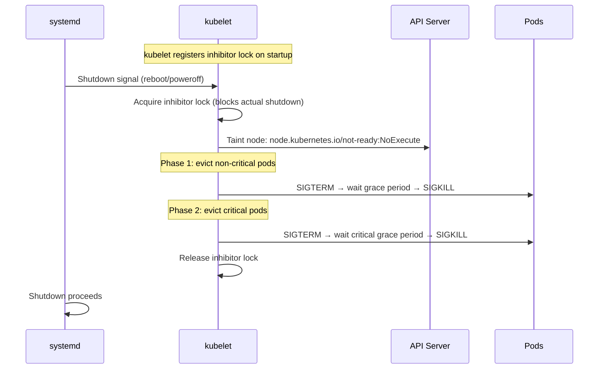
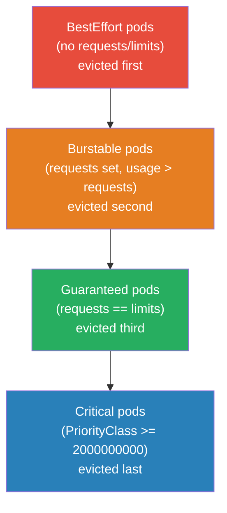
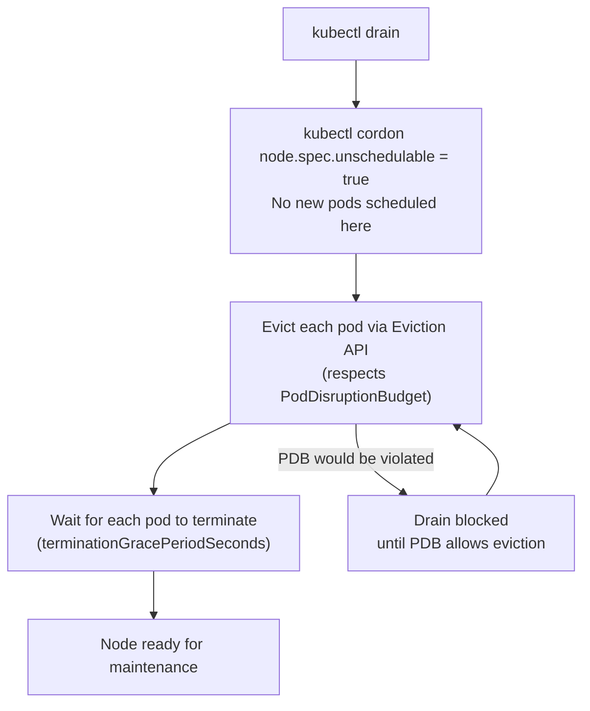

# Node Shutdown and Eviction

---

## 1. Graceful Node Shutdown (kubelet-initiated)

When a node receives a shutdown signal (systemd `shutdown.target`), kubelet intercepts it via a **systemd inhibitor lock** and evicts pods before allowing the OS to proceed.



**kubelet configuration:**
```yaml
# /var/lib/kubelet/config.yaml
shutdownGracePeriod: 30s              # total time for all pods to terminate
shutdownGracePeriodCriticalPods: 10s  # of the above, reserved for critical pods
```

**Timeline with defaults:**
```
t=0s:  Shutdown signal received
t=0s:  kubelet acquires inhibitor, begins eviction
t=0s:  Non-critical pods get SIGTERM (20s window = 30s - 10s)
t=20s: Non-critical pods get SIGKILL (if still running)
t=20s: Critical pods get SIGTERM (10s window)
t=30s: Critical pods get SIGKILL
t=30s: Inhibitor released, OS shuts down
```

```bash
# Check kubelet config for shutdown settings
ssh <node>
cat /var/lib/kubelet/config.yaml | grep -i shutdown

# Verify inhibitor lock is registered
systemd-inhibit --list | grep kubelet

# Watch eviction events during shutdown
kubectl get events --field-selector reason=Evicted -A -w
```

---

## 2. Pod Eviction Ordering

During node shutdown (and kubelet-initiated eviction), pods are evicted in priority order:



**PriorityClass determines "critical":**

| PriorityClass | Value | Examples |
|---------------|-------|---------|
| `system-node-critical` | 2000001000 | kubelet, kube-proxy, CNI |
| `system-cluster-critical` | 2000000000 | CoreDNS, metrics-server |
| (user pods) | < 1000000000 | Your workloads |

```yaml
# Protect your pod from early eviction
apiVersion: scheduling.k8s.io/v1
kind: PriorityClass
metadata:
  name: high-priority
value: 1000000
globalDefault: false
---
spec:
  priorityClassName: high-priority
```

---

## 3. Node Drain (Voluntary Eviction)

`kubectl drain` is the controlled, human-initiated version of node shutdown. Used for maintenance, node upgrades, and cluster autoscaler scale-down.



```bash
# Full drain command
kubectl drain <node-name> \
  --ignore-daemonsets \        # DaemonSet pods can't be evicted (managed by DS controller)
  --delete-emptydir-data \     # evict pods using emptyDir (data will be lost)
  --timeout=5m \               # fail if drain takes longer than 5 min
  --grace-period=30            # override pod terminationGracePeriodSeconds

# Uncordon after maintenance
kubectl uncordon <node-name>

# Check what's blocking drain
kubectl get pdb -A             # list PodDisruptionBudgets
kubectl describe pdb <name>    # check minAvailable vs current ready pods
```

**Why drain blocks:**
```
PDB: minAvailable=2, current ready=2 → drain would take 1 → violates PDB → blocked
Fix: wait for replacement pod to come up on another node, then drain proceeds
```

---

## 4. Non-Graceful Node Shutdown

If a node dies abruptly (power cut, kernel panic, `kill -9 kubelet`), the node object stays in the cluster but kubelet is gone. Pods on that node stay in `Terminating` forever — the API server is waiting for kubelet to confirm deletion, which never comes.

```bash
# Pods stuck Terminating on dead node
kubectl get pods --field-selector spec.nodeName=<dead-node>

# Old manual fix (still works)
kubectl delete pod <pod> --grace-period=0 --force

# Better: delete the node object
kubectl delete node <dead-node>
# → node lifecycle controller adds not-ready/unreachable taint
# → pods get evicted after tolerationSeconds
```

**Kubernetes 1.28+ — out-of-service taint (GA):**
```bash
# Manually taint the dead node
kubectl taint node <dead-node> \
  node.kubernetes.io/out-of-service=nodeshutdown:NoExecute

# Effect: StatefulSet pods and pods with PVCs are immediately force-deleted
# and rescheduled on healthy nodes — even without kubelet confirmation
# This was the #1 StatefulSet recovery pain point before this feature
```

---

## 5. Node Lifecycle Taints

The node lifecycle controller automatically adds taints when conditions change. These taints trigger pod eviction via `tolerationSeconds`.

| Condition | Taint key | Auto-tolerationSeconds on pods |
|-----------|-----------|-------------------------------|
| `NotReady` | `node.kubernetes.io/not-ready` | 300s (default) |
| `Unreachable` | `node.kubernetes.io/unreachable` | 300s (default) |
| `MemoryPressure` | `node.kubernetes.io/memory-pressure` | — |
| `DiskPressure` | `node.kubernetes.io/disk-pressure` | — |
| `PIDPressure` | `node.kubernetes.io/pid-pressure` | — |
| `NetworkUnavailable` | `node.kubernetes.io/network-unavailable` | — |

**tolerationSeconds** controls how long a pod tolerates a taint before eviction:

```yaml
# Default toleration on all pods (injected by admission controller):
tolerations:
- key: node.kubernetes.io/not-ready
  operator: Exists
  effect: NoExecute
  tolerationSeconds: 300   # stay on not-ready node for 5 min before evicted

# For fast failover (stateless services):
tolerations:
- key: node.kubernetes.io/not-ready
  operator: Exists
  effect: NoExecute
  tolerationSeconds: 30    # evict in 30s

# For sticky workloads (StatefulSets, cache):
tolerations:
- key: node.kubernetes.io/not-ready
  operator: Exists
  effect: NoExecute
  tolerationSeconds: 600   # give node 10 min to recover before moving pod
```

```bash
# Check node conditions and taints
kubectl describe node <node> | grep -A10 Taints
kubectl describe node <node> | grep -A20 Conditions

# Watch node status changes
kubectl get nodes -w

# See eviction events
kubectl get events -A --field-selector reason=Evicted
kubectl get events -A | grep "Evicting\|Evicted\|Killing"
```

---

## 6. Kubelet Eviction Thresholds

kubelet watches node resources and evicts pods before the node itself runs out.

```yaml
# kubelet config: /var/lib/kubelet/config.yaml
evictionHard:
  memory.available: "200Mi"     # evict when < 200Mi free
  nodefs.available: "10%"       # evict when < 10% disk
  nodefs.inodesFree: "5%"       # evict when < 5% inodes
  imagefs.available: "15%"      # evict when < 15% image filesystem

evictionSoft:
  memory.available: "500Mi"     # warn when < 500Mi
evictionSoftGracePeriod:
  memory.available: "1m30s"     # only evict if soft threshold exceeded for 90s

evictionMinimumReclaim:
  memory.available: "100Mi"     # reclaim at least 100Mi per eviction round
```

**Eviction order within a QoS class:** pods using the most resources above their requests are evicted first.
