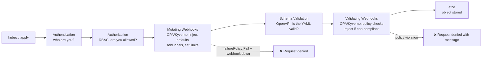
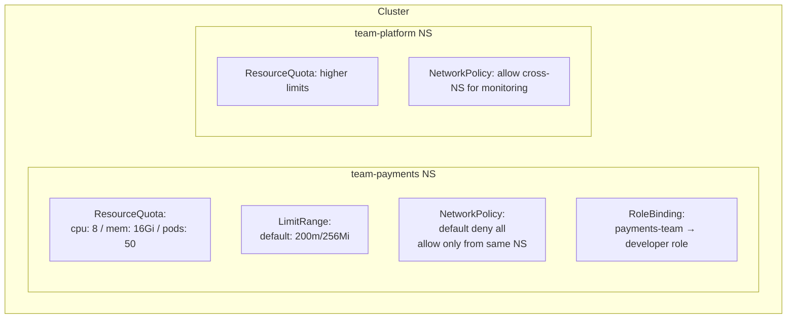

# Kubernetes Policy, Security, and Multi-Tenancy

---

## Admission Controllers — The Policy Enforcement Gate

Every `kubectl apply` request passes through the API server pipeline. Admission controllers are the last gate before the object is written to etcd.



Two tools dominate: **OPA/Gatekeeper** (declarative Rego policies) and **Kyverno** (K8s-native YAML policies). Both work as ValidatingWebhookConfiguration + MutatingWebhookConfiguration.

---

## OPA Gatekeeper

OPA (Open Policy Agent) + Gatekeeper implements K8s policy as code using the Rego language.

### Install

```bash
kubectl apply -f https://raw.githubusercontent.com/open-policy-agent/gatekeeper/release-3.14/deploy/gatekeeper.yaml
```

### ConstraintTemplate — defines a policy type

```yaml
# Define a new policy type: "must have required labels"
apiVersion: templates.gatekeeper.sh/v1
kind: ConstraintTemplate
metadata:
  name: requirelabels
spec:
  crd:
    spec:
      names:
        kind: RequireLabels
      validation:
        openAPIV3Schema:
          type: object
          properties:
            labels:
              type: array
              items:
                type: string

  targets:
  - target: admission.k8s.gatekeeper.sh
    rego: |
      package requirelabels

      violation[{"msg": msg}] {
        provided := {label | input.review.object.metadata.labels[label]}
        required := {label | label := input.parameters.labels[_]}
        missing := required - provided
        count(missing) > 0
        msg := sprintf("Missing required labels: %v", [missing])
      }
```

### Constraint — applies the policy to resources

```yaml
# Enforce that all Pods have "app" and "team" labels
apiVersion: constraints.gatekeeper.sh/v1beta1
kind: RequireLabels
metadata:
  name: require-pod-labels
spec:
  match:
    kinds:
    - apiGroups: [""]
      kinds: ["Pod"]
    namespaces: ["production", "staging"]   # only enforce in these namespaces
  parameters:
    labels: ["app", "team"]
```

```bash
# Test: create a pod without labels → should be denied
kubectl run nginx --image=nginx -n production
# Error: [require-pod-labels] Missing required labels: {"app", "team"}

# Audit: find existing violations
kubectl get requirelabels.constraints.gatekeeper.sh -o yaml
# status.violations lists all existing objects that violate
```

---

## Kyverno — K8s-Native Policies (No Rego)

Kyverno uses pure YAML — no new language to learn. Policies are Kubernetes resources.

### Install

```bash
helm install kyverno kyverno/kyverno -n kyverno --create-namespace
```

### Validate — reject non-compliant resources

```yaml
apiVersion: kyverno.io/v1
kind: ClusterPolicy
metadata:
  name: require-labels
spec:
  validationFailureAction: Enforce   # Enforce=block, Audit=warn only
  rules:
  - name: check-team-label
    match:
      any:
      - resources:
          kinds: ["Pod"]
          namespaces: ["production"]
    validate:
      message: "Pod must have 'team' label"
      pattern:
        metadata:
          labels:
            team: "?*"   # must exist and be non-empty
```

### Mutate — auto-inject fields

```yaml
apiVersion: kyverno.io/v1
kind: ClusterPolicy
metadata:
  name: add-default-labels
spec:
  rules:
  - name: inject-team-label
    match:
      any:
      - resources:
          kinds: ["Pod"]
    mutate:
      patchStrategicMerge:
        metadata:
          labels:
            +(managed-by): kyverno   # + prefix = only add if missing
```

### Generate — create resources automatically

```yaml
# Auto-create a NetworkPolicy when a new Namespace is created
apiVersion: kyverno.io/v1
kind: ClusterPolicy
metadata:
  name: default-deny-networkpolicy
spec:
  rules:
  - name: default-deny
    match:
      any:
      - resources:
          kinds: ["Namespace"]
    generate:
      apiVersion: networking.k8s.io/v1
      kind: NetworkPolicy
      name: default-deny-all
      namespace: "{{request.object.metadata.name}}"
      data:
        spec:
          podSelector: {}
          policyTypes: ["Ingress", "Egress"]
```

### OPA/Gatekeeper vs Kyverno

| | OPA/Gatekeeper | Kyverno |
|--|---------------|---------|
| Policy language | Rego (new language to learn) | YAML (K8s-native) |
| Mutate support | Limited | Full |
| Generate support | No | Yes |
| Learning curve | High | Low |
| Ecosystem | Large (OPA used beyond K8s) | K8s-only |
| Best for | Complex policies, non-K8s too | K8s-only teams, quick adoption |

---

## Multi-Tenancy — Namespace Isolation

K8s multi-tenancy means multiple teams share one cluster safely. Each team gets namespaces with enforced isolation.



### ResourceQuota per namespace

```yaml
apiVersion: v1
kind: ResourceQuota
metadata:
  name: payments-quota
  namespace: team-payments
spec:
  hard:
    requests.cpu: "8"
    requests.memory: 16Gi
    limits.cpu: "16"
    limits.memory: 32Gi
    pods: "50"
    services: "10"
    persistentvolumeclaims: "5"
    count/deployments.apps: "20"
```

### LimitRange — defaults for pods without requests

```yaml
apiVersion: v1
kind: LimitRange
metadata:
  name: default-limits
  namespace: team-payments
spec:
  limits:
  - type: Container
    default:          # applied if no limits set
      cpu: "500m"
      memory: "256Mi"
    defaultRequest:   # applied if no requests set
      cpu: "100m"
      memory: "128Mi"
    max:              # hard ceiling per container
      cpu: "4"
      memory: "4Gi"
```

### Network isolation per team

```yaml
# Default deny all — add to every namespace
apiVersion: networking.k8s.io/v1
kind: NetworkPolicy
metadata:
  name: default-deny-all
  namespace: team-payments
spec:
  podSelector: {}
  policyTypes: ["Ingress", "Egress"]
---
# Allow intra-namespace traffic
apiVersion: networking.k8s.io/v1
kind: NetworkPolicy
metadata:
  name: allow-same-namespace
  namespace: team-payments
spec:
  podSelector: {}
  ingress:
  - from:
    - podSelector: {}    # any pod in THIS namespace
  egress:
  - to:
    - podSelector: {}
---
# Allow egress to DNS (CoreDNS in kube-system)
apiVersion: networking.k8s.io/v1
kind: NetworkPolicy
metadata:
  name: allow-dns
  namespace: team-payments
spec:
  podSelector: {}
  egress:
  - to:
    - namespaceSelector:
        matchLabels:
          kubernetes.io/metadata.name: kube-system
    ports:
    - port: 53
      protocol: UDP
```

---

## Pod Security — PSA, seccomp, AppArmor

### Pod Security Admission (PSA) — built-in since K8s 1.25

Replaces the deprecated PodSecurityPolicy. Three levels applied at namespace level.

```yaml
# Label a namespace to enforce Pod Security Standards
apiVersion: v1
kind: Namespace
metadata:
  name: team-payments
  labels:
    pod-security.kubernetes.io/enforce: restricted    # block violations
    pod-security.kubernetes.io/warn: restricted       # warn on violations
    pod-security.kubernetes.io/audit: restricted      # log violations
```

| Level | What it blocks |
|-------|---------------|
| `privileged` | Nothing — all pods allowed |
| `baseline` | Most known privesc: privileged, hostPID, hostNetwork, hostPath |
| `restricted` | Everything in baseline + must run as non-root, no host ports, seccomp required |

### seccomp — restrict syscalls

```yaml
spec:
  securityContext:
    seccompProfile:
      type: RuntimeDefault   # use container runtime's default profile
      # or: type: Localhost, localhostProfile: profiles/my-profile.json
  containers:
  - name: app
    securityContext:
      allowPrivilegeEscalation: false
      runAsNonRoot: true
      runAsUser: 65534
      readOnlyRootFilesystem: true
      capabilities:
        drop: ["ALL"]    # drop ALL Linux capabilities
        add: ["NET_BIND_SERVICE"]  # add back only what's needed
```

### AppArmor — restrict file/network access

```yaml
# Apply AppArmor profile to a container
metadata:
  annotations:
    container.apparmor.security.beta.kubernetes.io/app: localhost/my-profile
    # or: runtime/default  (use container runtime's default)
    # or: unconfined       (no AppArmor — avoid in production)
```

---

## Full Security Checklist per Namespace

```bash
# 1. Apply PSA restricted label
kubectl label namespace team-payments \
  pod-security.kubernetes.io/enforce=restricted

# 2. Create ResourceQuota
kubectl apply -f quota.yaml -n team-payments

# 3. Create LimitRange (so pods without requests get defaults)
kubectl apply -f limitrange.yaml -n team-payments

# 4. Create default NetworkPolicies (deny-all + allow-same-ns + allow-dns)
kubectl apply -f network-policies.yaml -n team-payments

# 5. Create Kyverno/Gatekeeper policies (require labels, block latest tag)
kubectl apply -f policies.yaml

# 6. RBAC: bind team to Role (not ClusterRole)
kubectl create rolebinding payments-dev \
  --role=developer \
  --group=payments-team \
  -n team-payments

# Verify: check what a team member can do
kubectl auth can-i create deployments \
  --namespace team-payments \
  --as-group payments-team \
  --as bob@company.com
```
