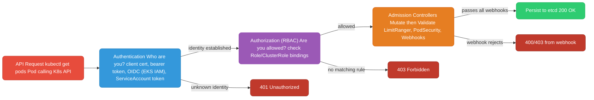
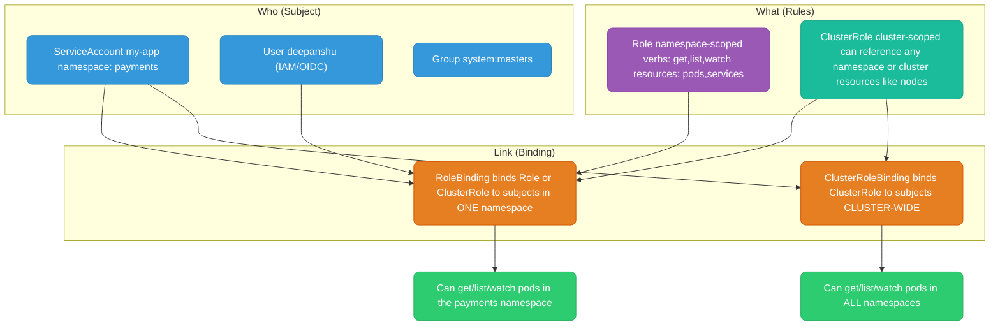
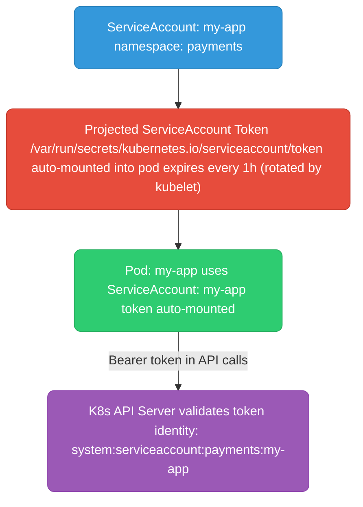
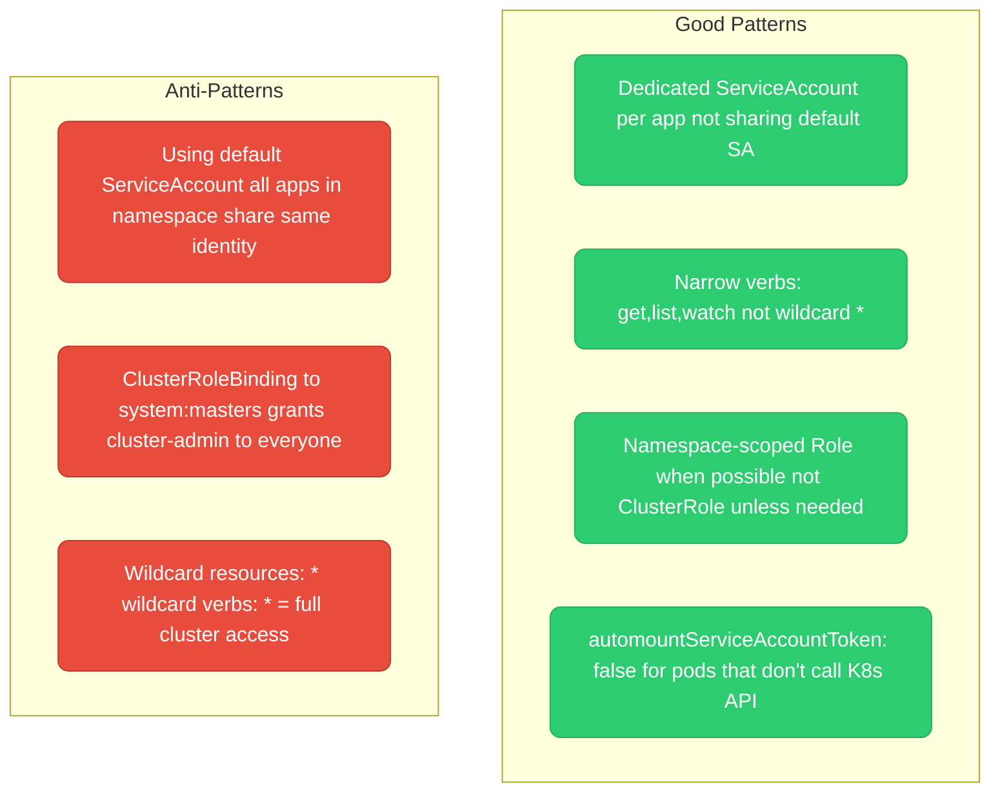

# Kubernetes RBAC

---

## Auth Chain: Every Request to the API Server



---

## RBAC Building Blocks



---

## ServiceAccount

A ServiceAccount is a Kubernetes identity for pods. Every pod runs as a ServiceAccount. If you don't specify one, it runs as the `default` ServiceAccount in its namespace.



```yaml
apiVersion: v1
kind: ServiceAccount
metadata:
  name: my-app
  namespace: payments
  annotations:
    # IRSA: also allows pod to assume AWS IAM role
    eks.amazonaws.com/role-arn: arn:aws:iam::123456789:role/my-app-s3-role
automountServiceAccountToken: true   # default — set false if pod doesn't call K8s API
```

---

## Role and ClusterRole

```yaml
# Role — namespaced (only works within payments namespace)
apiVersion: rbac.authorization.k8s.io/v1
kind: Role
metadata:
  name: pod-reader
  namespace: payments
rules:
  - apiGroups: [""]            # "" = core API group (pods, services, configmaps)
    resources: ["pods", "pods/log"]
    verbs: ["get", "list", "watch"]
  - apiGroups: ["apps"]        # apps group (deployments, replicasets)
    resources: ["deployments"]
    verbs: ["get", "list"]
---
# ClusterRole — cluster-scoped (works across all namespaces or for cluster resources)
apiVersion: rbac.authorization.k8s.io/v1
kind: ClusterRole
metadata:
  name: node-reader
rules:
  - apiGroups: [""]
    resources: ["nodes"]       # nodes are cluster-scoped, need ClusterRole
    verbs: ["get", "list", "watch"]
  - apiGroups: ["metrics.k8s.io"]
    resources: ["nodes", "pods"]
    verbs: ["get", "list"]
```

**Verbs reference:**

| Verb | HTTP | Description |
|------|------|-------------|
| `get` | GET + name | Get a specific resource |
| `list` | GET (collection) | List resources |
| `watch` | GET + watch=true | Stream updates |
| `create` | POST | Create resource |
| `update` | PUT | Replace resource |
| `patch` | PATCH | Partial update |
| `delete` | DELETE | Delete resource |
| `deletecollection` | DELETE (collection) | Delete many |
| `*` | all | Wildcard — all verbs |

---

## RoleBinding and ClusterRoleBinding

```yaml
# RoleBinding: grant Role to ServiceAccount IN one namespace
apiVersion: rbac.authorization.k8s.io/v1
kind: RoleBinding
metadata:
  name: my-app-pod-reader
  namespace: payments
subjects:
  - kind: ServiceAccount
    name: my-app
    namespace: payments
  - kind: User             # also works for users
    name: deepanshu
    apiGroup: rbac.authorization.k8s.io
roleRef:
  kind: Role
  name: pod-reader
  apiGroup: rbac.authorization.k8s.io
---
# ClusterRoleBinding: grant ClusterRole across ALL namespaces
apiVersion: rbac.authorization.k8s.io/v1
kind: ClusterRoleBinding
metadata:
  name: monitoring-cluster-reader
subjects:
  - kind: ServiceAccount
    name: prometheus
    namespace: monitoring
roleRef:
  kind: ClusterRole
  name: cluster-reader
  apiGroup: rbac.authorization.k8s.io
```

**Trick: ClusterRole + RoleBinding** — you can bind a ClusterRole via a RoleBinding to scope it to one namespace. Useful for reusable role definitions:

```yaml
# Define once as ClusterRole
kind: ClusterRole
metadata:
  name: app-role    # reusable template

---
# Bind in namespace A
kind: RoleBinding
metadata:
  namespace: payments    # scoped to payments only
roleRef:
  kind: ClusterRole
  name: app-role

---
# Bind in namespace B with same ClusterRole
kind: RoleBinding
metadata:
  namespace: orders      # scoped to orders only
roleRef:
  kind: ClusterRole
  name: app-role
```

---

## RBAC Patterns



**Debug RBAC issues:**
```bash
# Check what a ServiceAccount can do
kubectl auth can-i get pods \
  --as=system:serviceaccount:payments:my-app \
  -n payments

# List all permissions for a ServiceAccount
kubectl auth can-i --list \
  --as=system:serviceaccount:payments:my-app \
  -n payments

# Describe a RoleBinding to see who has what
kubectl describe rolebinding my-app-pod-reader -n payments

# Check if a specific action is allowed
kubectl auth can-i create deployments --as=system:serviceaccount:payments:my-app -n payments
```
