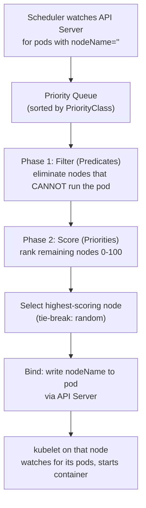
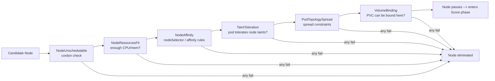
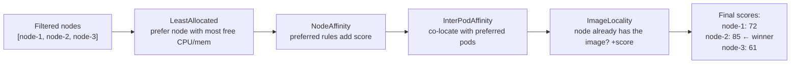
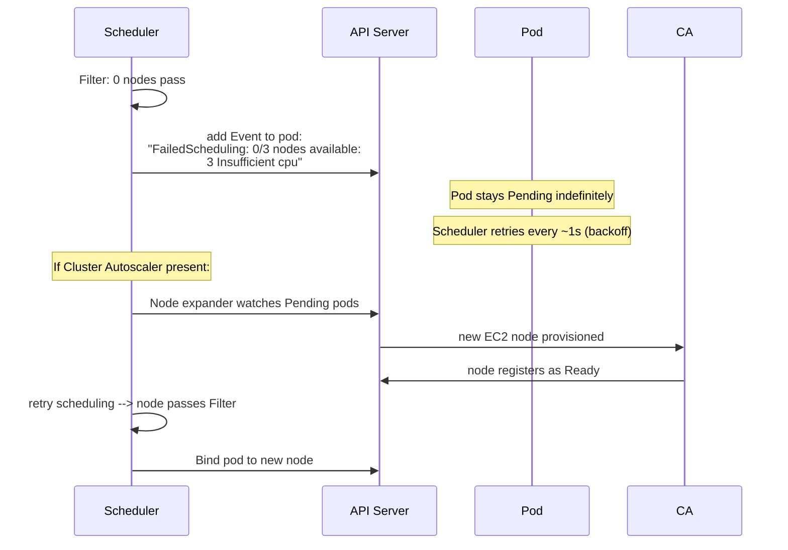
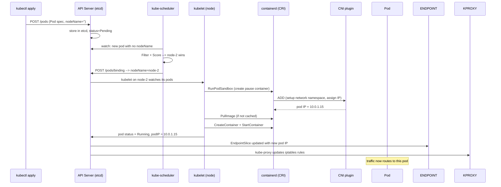

# Kubernetes Scheduler — Deep Internals

## How the Scheduler Works

The scheduler has one job: assign a `nodeName` to a Pod that has none. It runs a two-phase algorithm for every unscheduled pod.



---

## Phase 1: Filter Plugins

Every filter plugin runs for every node. A node is eliminated if **any** filter returns false.



Key filter plugins:

| Plugin | What it checks |
|--------|---------------|
| `NodeResourcesFit` | Node has enough `Allocatable - requested` CPU/memory |
| `NodeAffinity` | Pod's `nodeSelector` and `affinity.nodeAffinity` match node labels |
| `TaintToleration` | Pod's `tolerations` cover all node `taints` with `NoSchedule`/`NoExecute` |
| `PodTopologySpread` | `topologySpreadConstraints` — spread pods across zones/nodes |
| `VolumeBinding` | PVC's storageClass zone matches node's zone |
| `NodeUnschedulable` | Node is not cordoned |

---

## Phase 2: Score Plugins

Remaining nodes are scored 0-100 by each plugin. Final score = weighted sum.



| Plugin | Goal |
|--------|------|
| `LeastAllocated` | Spread load — pick the least-used node |
| `MostAllocated` | Bin-pack — fill nodes before using new ones (saves cost) |
| `NodeAffinity` | Honour preferred affinity rules |
| `ImageLocality` | Prefer nodes that already pulled the image (faster start) |
| `TaintToleration` | Nodes with matching tolerations get higher score |

---

## What Happens When No Node Passes Filter



### FailedScheduling events — what they mean

```bash
kubectl describe pod <pod> -n <namespace>
# Events:
#   Warning  FailedScheduling  0/3 nodes available:
#     3 Insufficient cpu                    → raise CPU requests or add nodes
#     3 node(s) had untolerated taint       → add toleration to pod
#     3 node(s) didn't match node affinity  → fix nodeSelector/affinity
#     1 pod has unbound PVC                 → PVC not bound, check StorageClass
#     3 node(s) didn't match topology       → spread constraints impossible
```

---

## Full Flow: Pod Scheduled to a Node



---

## Taints, Tolerations, and Affinity

### Taints — repel pods from nodes

```bash
# Taint a node (no GPU pods without toleration)
kubectl taint node gpu-node-1 nvidia.com/gpu=present:NoSchedule
#                             key=value:effect
# Effects: NoSchedule | PreferNoSchedule | NoExecute
```

### Tolerations — allow pods onto tainted nodes

```yaml
spec:
  tolerations:
  - key: "nvidia.com/gpu"
    operator: "Exists"
    effect: "NoSchedule"
```

### Node Affinity — attract pods to nodes

```yaml
spec:
  affinity:
    nodeAffinity:
      # Hard rule: pod MUST land on a node with this label
      requiredDuringSchedulingIgnoredDuringExecution:
        nodeSelectorTerms:
        - matchExpressions:
          - key: topology.kubernetes.io/zone
            operator: In
            values: ["us-east-1a", "us-east-1b"]

      # Soft rule: prefer nodes with this label, but not required
      preferredDuringSchedulingIgnoredDuringExecution:
      - weight: 100
        preference:
          matchExpressions:
          - key: node.kubernetes.io/instance-type
            operator: In
            values: ["m5.2xlarge"]
```

### Topology Spread Constraints — spread across zones

```yaml
spec:
  topologySpreadConstraints:
  - maxSkew: 1                          # max diff in pod count between zones
    topologyKey: topology.kubernetes.io/zone
    whenUnsatisfiable: DoNotSchedule   # or ScheduleAnyway
    labelSelector:
      matchLabels:
        app: api
```
