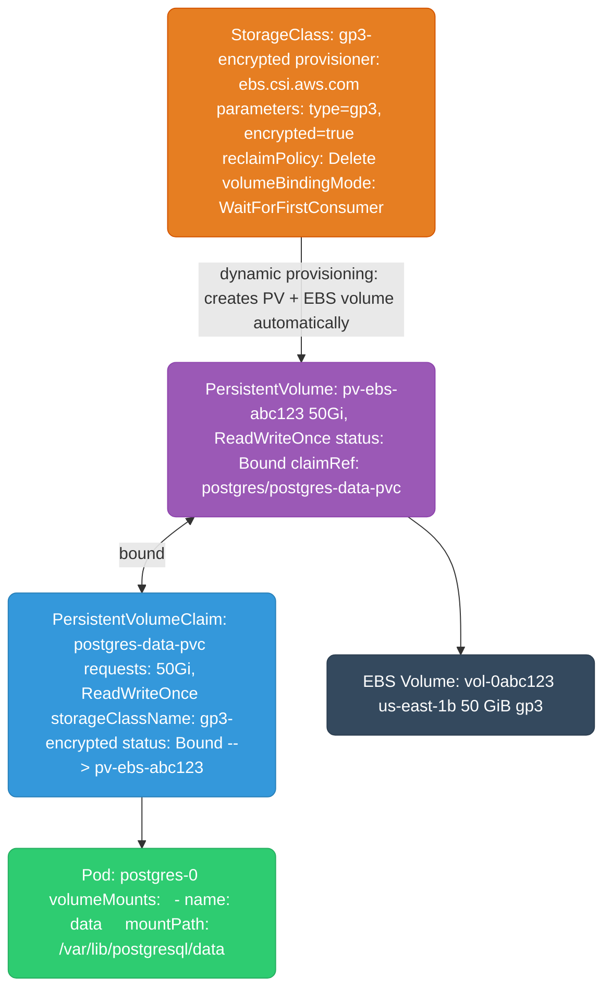
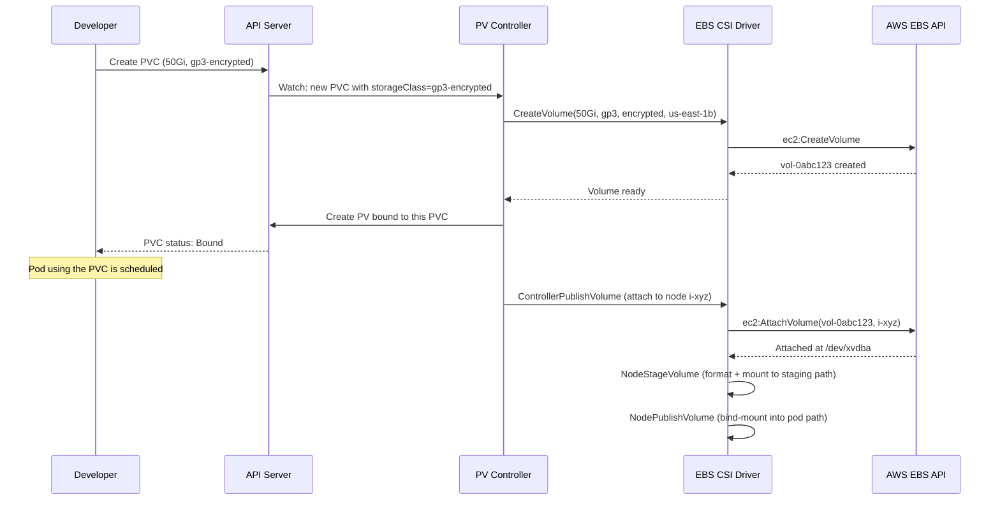
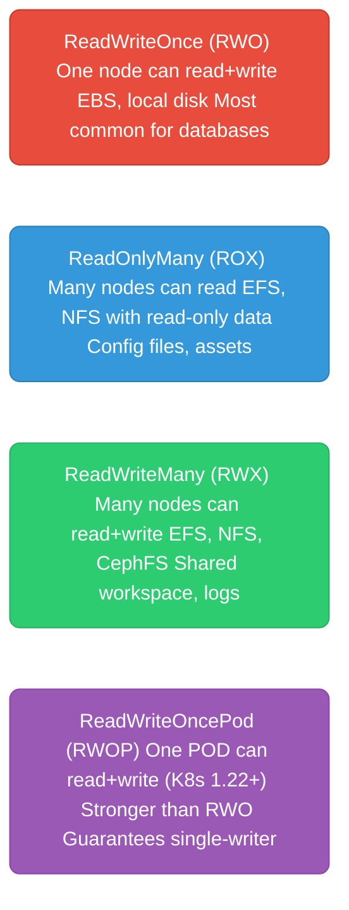
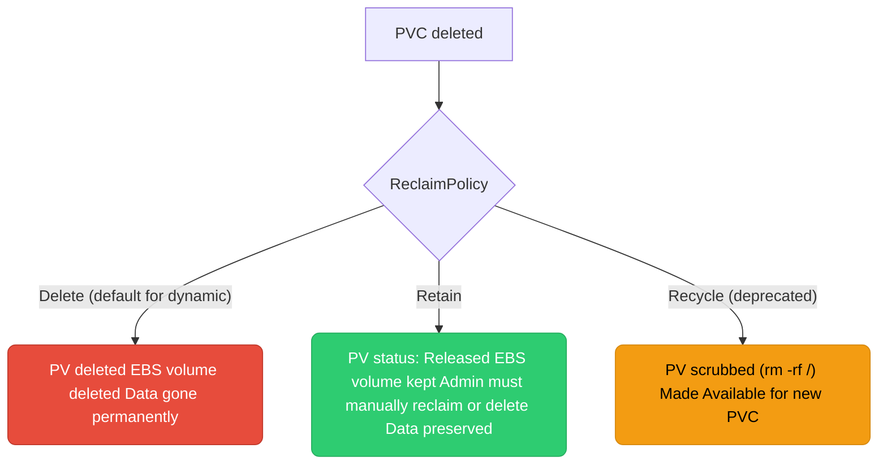
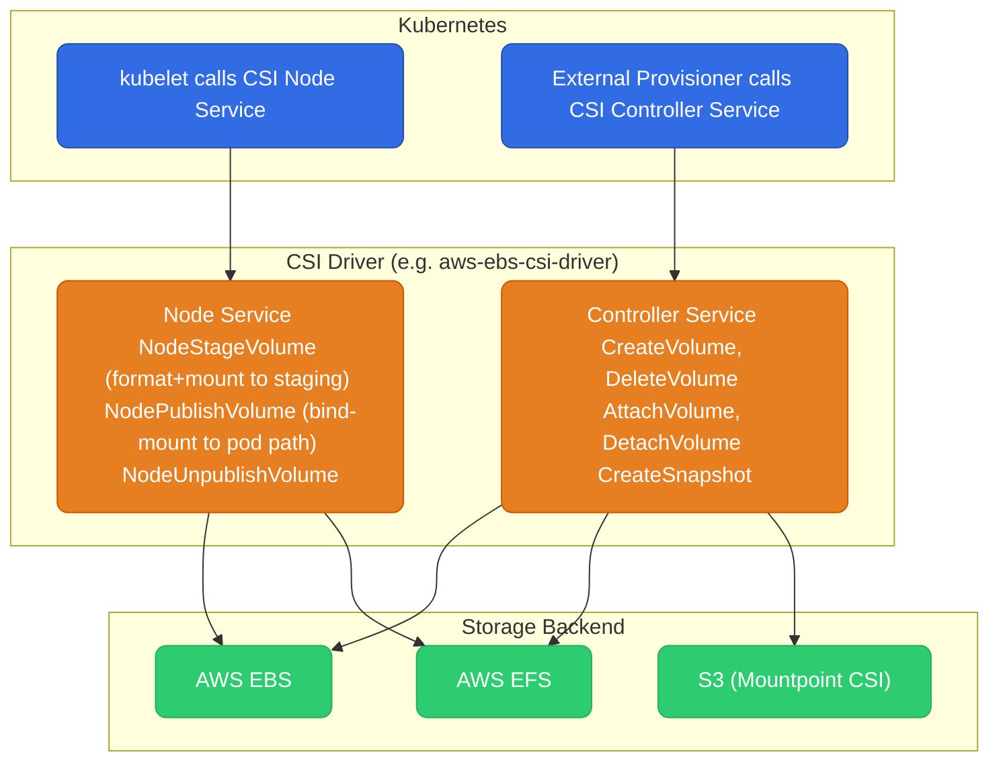

# Kubernetes Storage

---

## PV / PVC / StorageClass — The Three-Layer Model



**The three layers:**
- **StorageClass** — describes the type of storage (provisioner, disk type, encryption, reclaim policy). Created once by an admin, used by many PVCs.
- **PersistentVolume (PV)** — represents an actual piece of storage. Can be pre-provisioned by admin or dynamically created by the CSI driver when a PVC is created.
- **PersistentVolumeClaim (PVC)** — a pod's request for storage. Declares size and access mode. Kubernetes binds it to a matching PV.

---

## Dynamic Provisioning Flow



**volumeBindingMode: WaitForFirstConsumer** — PV/EBS not provisioned until a pod using the PVC is scheduled. Prevents EBS volumes in the wrong AZ. Always use this for EBS.

---

## Access Modes



| Access Mode | Storage backends | Use case |
|-------------|-----------------|----------|
| `ReadWriteOnce` | EBS, local disk | Single-pod databases (Postgres, MySQL) |
| `ReadOnlyMany` | EFS, NFS, S3 (via CSI) | Shared config, ML model serving |
| `ReadWriteMany` | EFS, NFS, CephFS, Portworx | Shared workspaces, legacy apps |
| `ReadWriteOncePod` | EBS, CSI drivers | Strict single-writer guarantee |

---

## Reclaim Policies

What happens to the PV (and underlying disk) when the PVC is deleted:



**Production rule:** Use `Retain` for databases in production. Use `Delete` for ephemeral/dev workloads. Never lose data accidentally.

```yaml
apiVersion: storage.k8s.io/v1
kind: StorageClass
metadata:
  name: gp3-retain
provisioner: ebs.csi.aws.com
parameters:
  type: gp3
  encrypted: "true"
reclaimPolicy: Retain             # keep EBS volume after PVC deletion
volumeBindingMode: WaitForFirstConsumer
allowVolumeExpansion: true        # allow resize without recreating
```

---

## CSI (Container Storage Interface)

CSI is the standard interface between Kubernetes and storage vendors. Any storage system (EBS, EFS, Ceph, NetApp, etc.) can implement the CSI spec to work with Kubernetes.



**Why CSI replaced in-tree drivers:** Before CSI, storage drivers were compiled into the Kubernetes binary. Updating a storage driver required a Kubernetes upgrade. CSI drivers are out-of-tree — deployed as pods, updated independently.

**Required CSI drivers in EKS (as add-ons):**
- `aws-ebs-csi-driver` — PVCs backed by EBS (gp3, io2). Required since K8s 1.23 (in-tree deprecated).
- `aws-efs-csi-driver` — PVCs backed by EFS (ReadWriteMany across AZs).
- `mountpoint-s3-csi-driver` — mount S3 buckets as a filesystem (read-heavy workloads, ML data).

---

## Volume Snapshots

```yaml
# Create a snapshot of a PVC
apiVersion: snapshot.storage.k8s.io/v1
kind: VolumeSnapshot
metadata:
  name: postgres-snapshot-2026-01-15
spec:
  volumeSnapshotClassName: csi-aws-vsc
  source:
    persistentVolumeClaimName: postgres-data-pvc

---
# Restore from snapshot into a new PVC
apiVersion: v1
kind: PersistentVolumeClaim
metadata:
  name: postgres-data-restored
spec:
  dataSource:
    name: postgres-snapshot-2026-01-15
    kind: VolumeSnapshot
    apiGroup: snapshot.storage.k8s.io
  accessModes: [ReadWriteOnce]
  resources:
    requests:
      storage: 50Gi
  storageClassName: gp3-retain
```

Use snapshots for: pre-upgrade database backups, cloning production data to staging, disaster recovery checkpoints.
