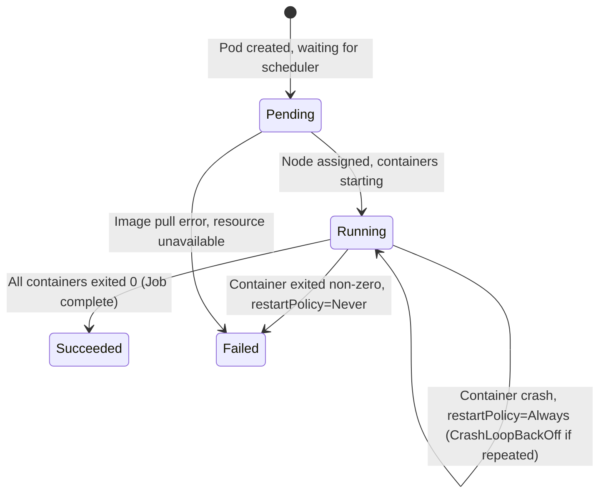
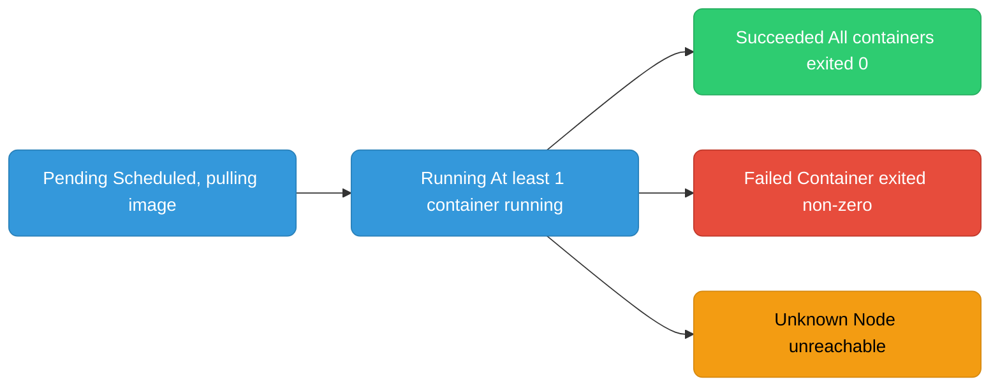
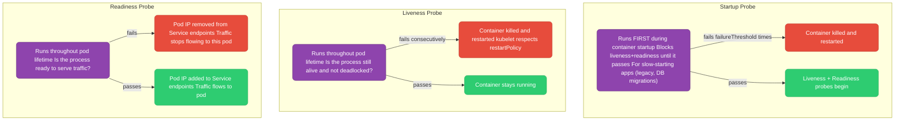
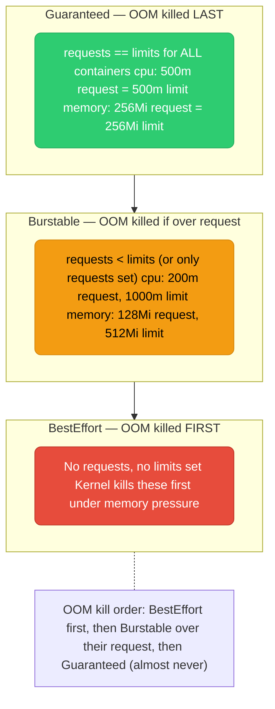
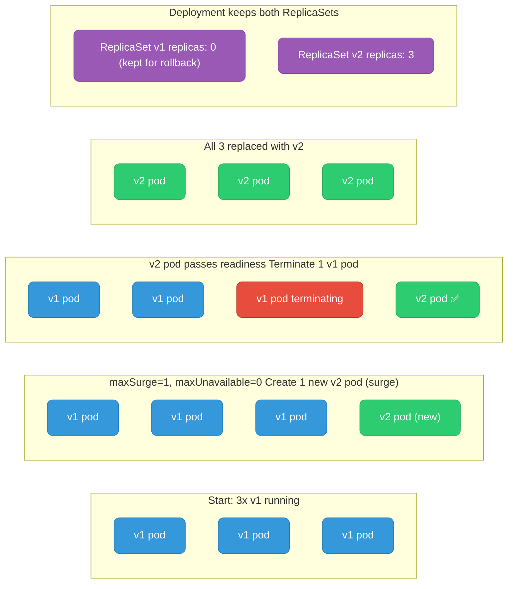
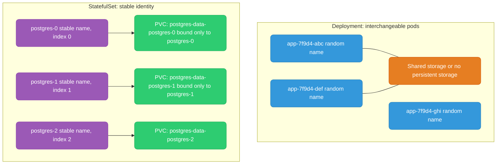
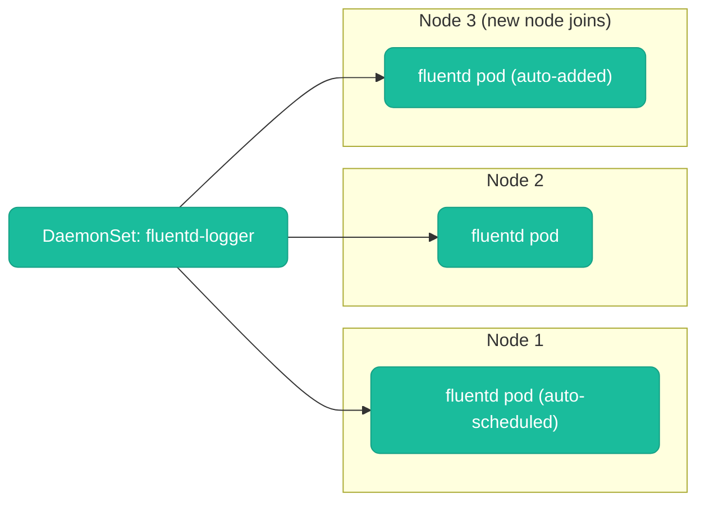
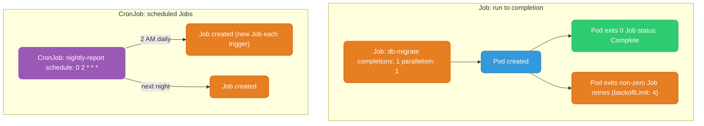

# Kubernetes Workloads

---

## Pod Lifecycle





**Container states within a Running pod:**

| State | Meaning |
|-------|---------|
| `Waiting` | Starting, pulling image, or CrashLoopBackOff |
| `Running` | Process is executing |
| `Terminated` | Process exited (check exitCode: 0=success, 137=OOMKilled, 1=error) |

**CrashLoopBackOff** — container keeps crashing. Kubernetes applies exponential backoff (10s → 20s → 40s → 80s → 160s → 5min cap) between restart attempts. Not a stuck state — it will keep retrying. Check logs with `kubectl logs <pod> --previous`.

---

## Probes

Probes are health checks kubelet runs against your container. Three types, each with a distinct purpose.



**Probe implementation types:**

```yaml
# HTTP GET — most common for web services
livenessProbe:
  httpGet:
    path: /healthz
    port: 8080
  initialDelaySeconds: 10   # wait before first probe (startup time)
  periodSeconds: 10          # probe every 10s
  failureThreshold: 3        # fail 3 times before action
  timeoutSeconds: 5

# TCP Socket — for non-HTTP (gRPC, databases)
readinessProbe:
  tcpSocket:
    port: 5432
  initialDelaySeconds: 5

# Exec — run command inside container
livenessProbe:
  exec:
    command: ["pg_isready", "-U", "postgres"]
  periodSeconds: 30

# gRPC (K8s 1.24+)
livenessProbe:
  grpc:
    port: 8080
    service: "liveness"
```

**Key probe interactions:**
- Liveness failure → container restart (pod stays, container restarts)
- Readiness failure → pod removed from service endpoints (pod stays running, just gets no traffic)
- Startup probe present → liveness and readiness are BLOCKED until startup passes

---

## QoS Classes

Kubernetes assigns a QoS class to every pod. This determines **OOM kill priority** when a node runs out of memory.



**Production recommendation:** Set both requests and limits for all containers. Use Guaranteed class for critical services (controllers, databases). Never run production workloads as BestEffort.

---

## Rolling Updates and Rollbacks



```yaml
spec:
  replicas: 3
  strategy:
    type: RollingUpdate
    rollingUpdate:
      maxSurge: 1         # max pods ABOVE desired (create new before deleting old)
      maxUnavailable: 0   # max pods BELOW desired (zero-downtime: never remove before replacement ready)
```

**Rollback:** The old ReplicaSet is never deleted (kept at 0 replicas). Rollback simply scales old RS back up and new RS back down:

```bash
kubectl rollout undo deployment/my-app                    # rollback to previous
kubectl rollout undo deployment/my-app --to-revision=3    # rollback to specific revision
kubectl rollout history deployment/my-app                  # see revision history
kubectl rollout status deployment/my-app                   # watch rollout progress
kubectl rollout pause deployment/my-app                    # pause mid-rollout (canary hold)
kubectl rollout resume deployment/my-app                   # resume
```

---

## StatefulSet vs Deployment



**StatefulSet guarantees:**

| Guarantee | Detail |
|-----------|--------|
| **Stable pod names** | `<name>-0`, `<name>-1`, `<name>-2` — never random |
| **Stable DNS** | `postgres-0.postgres-svc.ns.svc.cluster.local` (requires Headless Service) |
| **Stable storage** | Each pod gets its own PVC via `volumeClaimTemplates`. PVC survives pod deletion. |
| **Ordered startup** | Pods start in order: 0 → 1 → 2. Each must be Running+Ready before next starts. |
| **Ordered shutdown** | Pods stop in reverse order: 2 → 1 → 0. |

**When to use StatefulSet:** Databases (PostgreSQL, MySQL), distributed systems with leader election (Kafka, Zookeeper, etcd), any app that needs stable network identity or per-instance storage.

---

## DaemonSet

Runs exactly **one pod per node** (or per matching node). When new nodes join the cluster, DaemonSet automatically schedules a pod on them.



**Common DaemonSet use cases:** Log collectors (Fluentd, Fluent Bit), metrics agents (node-exporter), security agents (Falco), network plugins (CNI DaemonSets like aws-node), storage drivers.

DaemonSets can be constrained to specific nodes using `nodeSelector` or `affinity` — e.g., run GPU monitoring DaemonSet only on GPU nodes.

---

## Jobs and CronJobs



```yaml
apiVersion: batch/v1
kind: Job
metadata:
  name: db-migrate
spec:
  completions: 1       # how many successful completions needed
  parallelism: 1       # how many pods run in parallel
  backoffLimit: 4      # retry up to 4 times on failure
  activeDeadlineSeconds: 300  # kill if takes > 5 min
  template:
    spec:
      restartPolicy: Never    # Job pods must use Never or OnFailure
      containers:
        - name: migrate
          image: my-app:v2
          command: ["/app/server", "migrate"]
---
apiVersion: batch/v1
kind: CronJob
metadata:
  name: nightly-report
spec:
  schedule: "0 2 * * *"
  concurrencyPolicy: Forbid       # don't start new job if previous still running
  successfulJobsHistoryLimit: 3   # keep last 3 successful job records
  failedJobsHistoryLimit: 1
  jobTemplate:
    spec:
      template:
        spec:
          restartPolicy: OnFailure
          containers:
            - name: reporter
              image: my-app:v2
              command: ["/app/server", "report"]
```
