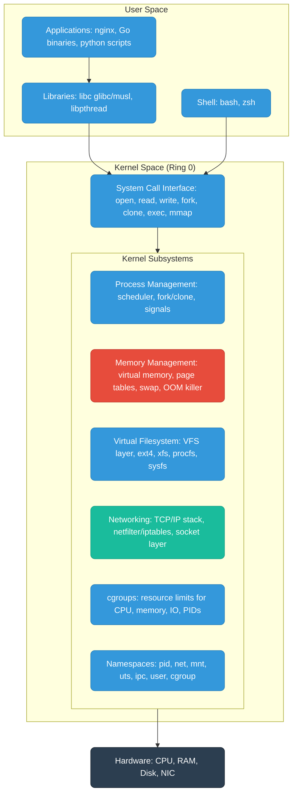
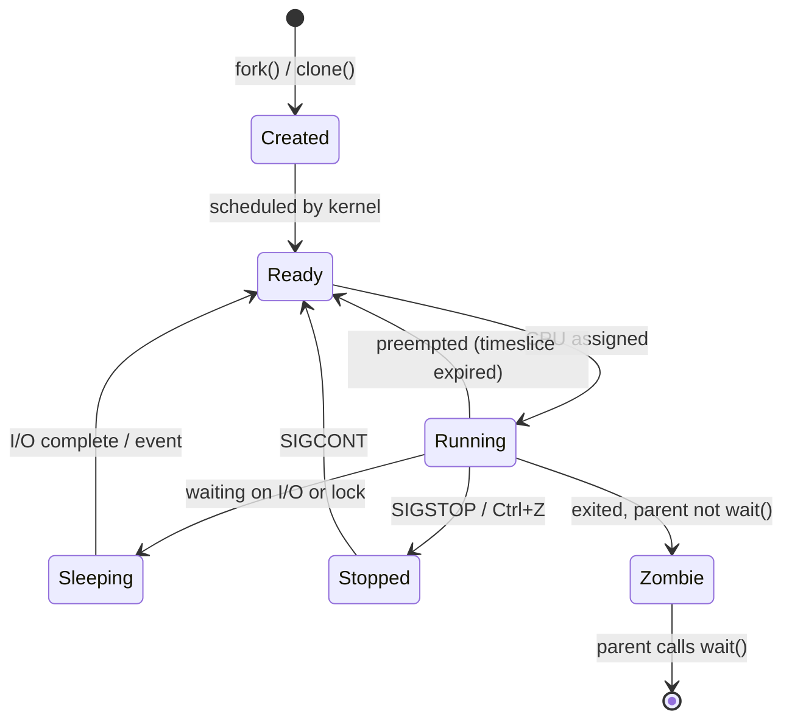
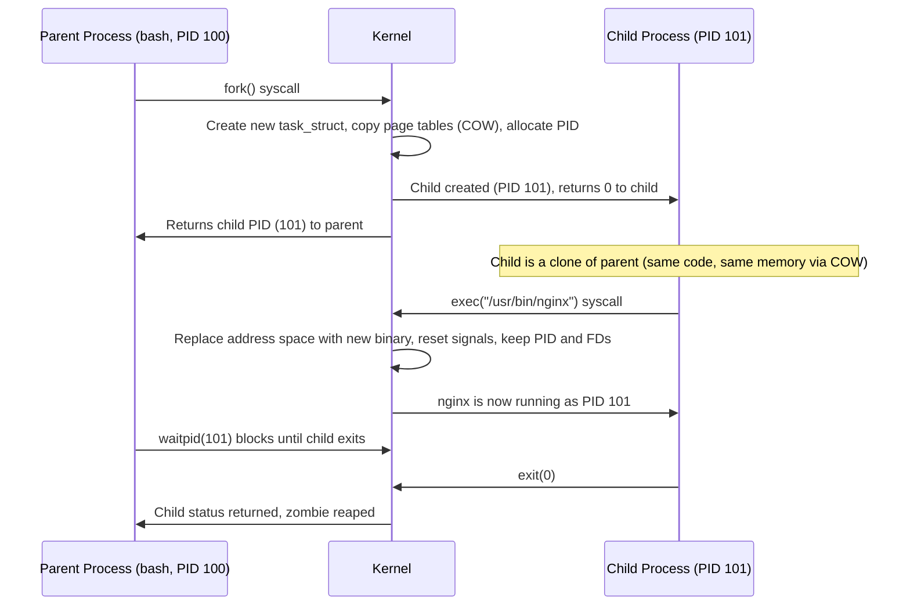
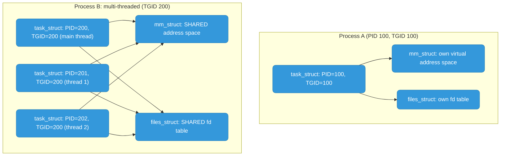
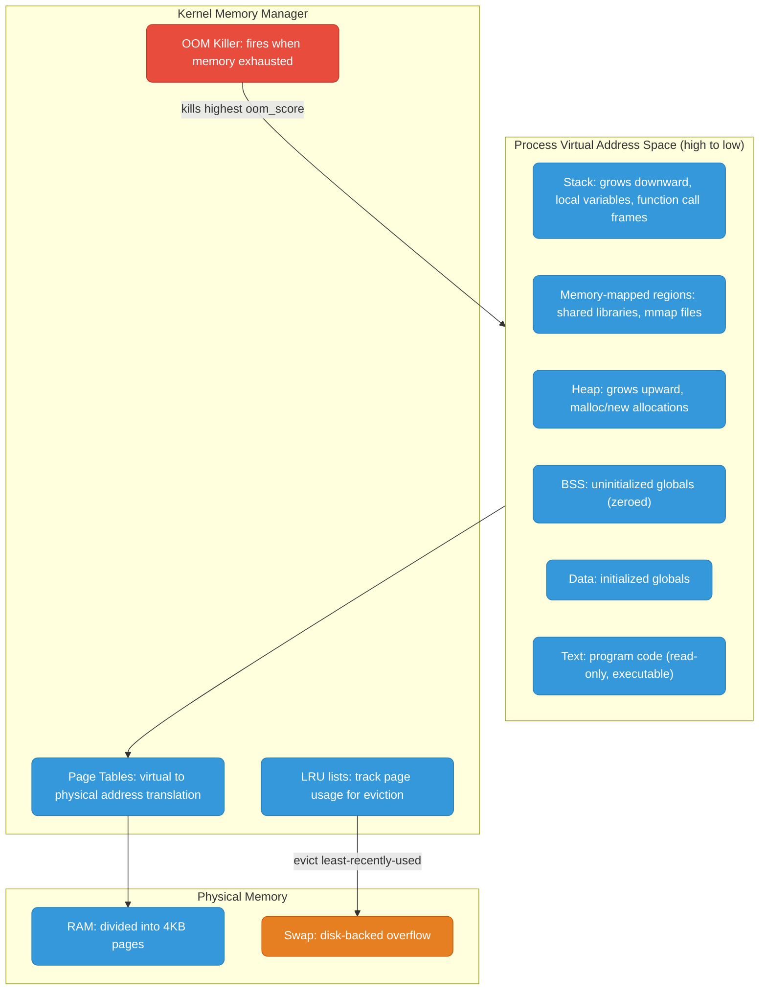
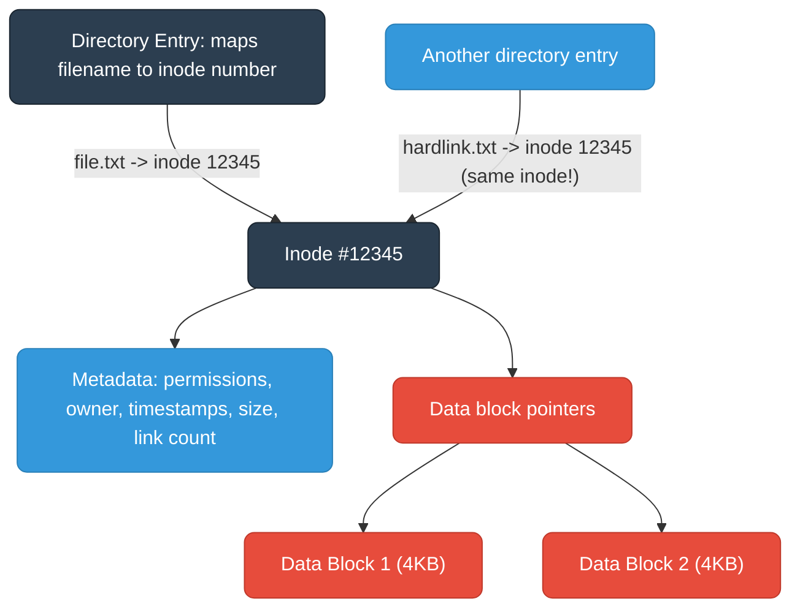
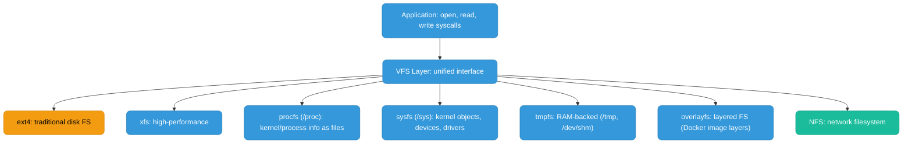
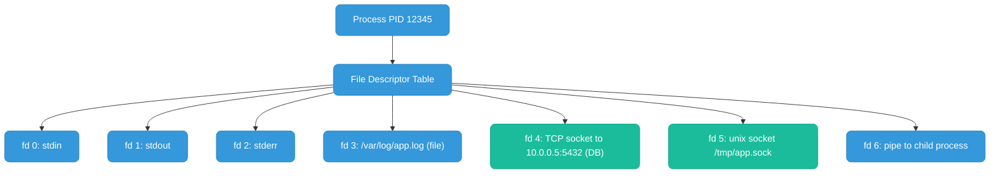
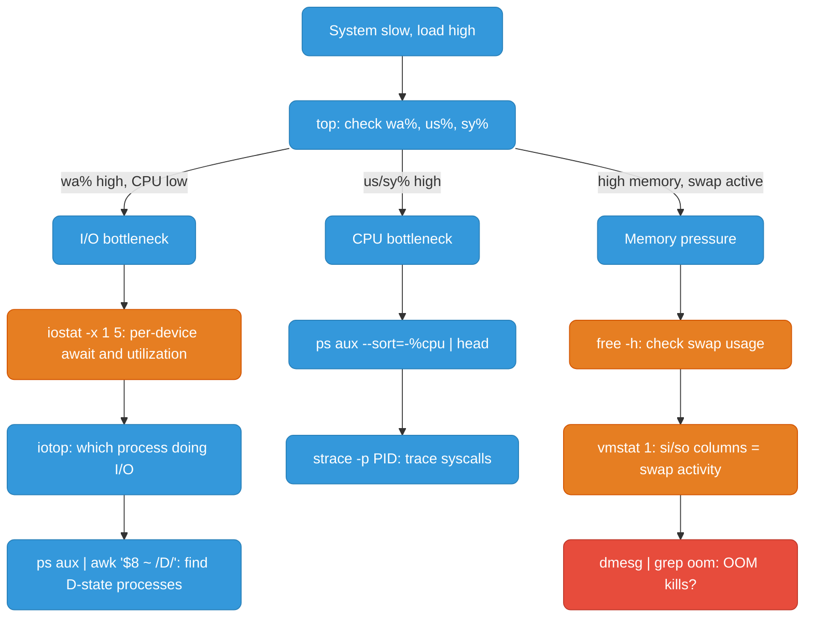

# Linux Internals

Everything — containers, Kubernetes, networking, storage — is built on Linux. This is the foundation layer.

| File | Topics |
|------|--------|
| [README.md](./README.md) | Kernel architecture, processes, memory, filesystem, load average, file descriptors, top metrics, /proc and /sys |
| [networking.md](./networking.md) | TCP/IP stack, sockets, accept queue, TCP states, TIME_WAIT, netfilter/iptables, kernel tuning |
| [io-models.md](./io-models.md) | Blocking I/O, select/poll, epoll, Go netpoller, io_uring |
| [scheduler.md](./scheduler.md) | CFS, vruntime, nice values, CPU affinity, context switches, Go GMP model |
| [boot.md](./boot.md) | BIOS/UEFI, GRUB, initramfs, systemd, unit files |
| [security.md](./security.md) | Capabilities, setuid, seccomp, AppArmor, SELinux, defense in depth |
| [containers-evolution.md](./containers-evolution.md) | chroot, BSD Jails, namespaces, cgroups, LXC, Docker |
| [commands.md](./commands.md) | grep, sed, awk, find, networking, processes, monitoring cheat sheet |

---

## Linux Kernel Architecture



User space programs interact with hardware only through the kernel via **system calls**. The kernel runs in privileged mode (Ring 0) and controls all hardware access, memory protection, and process isolation.

---

## Processes

A **process** is an instance of a running program. It has its own virtual address space, file descriptor table, PID, and execution context.

### Process Lifecycle



**Process States (from `ps` output):**

| State | Code | Meaning |
|-------|------|---------|
| Running | `R` | Currently executing on CPU or in run queue |
| Sleeping (Interruptible) | `S` | Waiting for event, can be woken by signal |
| Sleeping (Uninterruptible) | `D` | Blocked on I/O (disk/NFS), CANNOT be killed — not even SIGKILL |
| Stopped | `T` | Stopped by signal (SIGSTOP/SIGTSTP) |
| Zombie | `Z` | Exited but parent hasn't read exit status via `wait()` |

### Process Creation: fork() and exec()



**Copy-on-Write (COW):** After `fork()`, parent and child share the same physical memory pages. The kernel marks pages read-only. Only when one process writes does the kernel copy that page — avoiding expensive full copies for short-lived children.

### task_struct — The Kernel's View

In the Linux kernel, **both processes and threads** are represented by the same structure: `task_struct`. The difference:

| | Process | Thread |
|--|---------|--------|
| Created via | `fork()` or `clone()` without CLONE_VM | `clone()` with CLONE_VM, CLONE_FS, CLONE_FILES |
| Address space | Separate (COW copy of parent) | Shared with parent |
| File descriptors | Separate copy | Shared |
| PID | Unique PID | Own PID, shares TGID (thread group ID) with siblings |
| Crash isolation | One crashes, others unaffected | One thread crashes = whole process crashes |



### Zombie Processes

A zombie has finished (`exit()` called) but its entry remains in the process table because the parent hasn't called `wait()`.

- You can't kill a zombie — it's already dead.
- Zombies consume a PID and a tiny bit of kernel memory.
- **Fix:** Kill the parent (or fix it to `wait()` properly). When parent dies, `init` (PID 1) adopts and reaps the zombie.
- In containers: if PID 1 doesn't reap children, zombies accumulate. Use a proper init process (tini, dumb-init).

### Signals

| Signal | Number | Default Action | Catchable? | Use |
|--------|--------|---------------|------------|-----|
| SIGTERM | 15 | Terminate | Yes | Polite shutdown. Always try first. |
| SIGKILL | 9 | Terminate | **No** | Force kill. No cleanup. Last resort. |
| SIGINT | 2 | Terminate | Yes | Ctrl+C |
| SIGHUP | 1 | Terminate | Yes | Terminal hangup, often used to reload config |
| SIGSTOP | 19 | Stop | **No** | Pause process (cannot be caught) |
| SIGCONT | 18 | Continue | — | Resume stopped process |
| SIGSEGV | 11 | Core dump | Yes | Segmentation fault |
| SIGCHLD | 17 | Ignore | Yes | Child status changed |

**Always SIGTERM first, SIGKILL only if stuck.** In Kubernetes, kubelet sends SIGTERM, waits `terminationGracePeriodSeconds`, then SIGKILL.

---

## Memory Management



### Pages and Virtual Memory

RAM is divided into **pages** (4KB typically). Every virtual address is translated to a physical address via multi-level page tables.

**Page fault types:**
- **Minor fault:** Page in memory but not mapped (COW, first access) — kernel maps it, no disk I/O
- **Major fault:** Page in swap — kernel reads from disk → very slow

### Swap

When RAM is full, kernel moves least-recently-used pages to swap. It's orders of magnitude slower:
- RAM: ~100ns access
- SSD swap: ~100,000ns (1000x slower)
- HDD swap: ~10,000,000ns

**High swap usage = memory-starved system.** In containers, cgroups typically disable swap — OOM kill instead.

### OOM Killer

When no memory remains, kernel OOM killer selects a victim based on `oom_score` (higher = more likely killed, based mainly on memory usage).

```bash
cat /proc/<PID>/oom_score         # current score
echo -1000 > /proc/<PID>/oom_score_adj  # protect from OOM (-1000 = never kill)
dmesg | grep -i "oom\|killed"     # check for past OOM events
```

---

## Filesystem

### Inode Architecture



- **Filename is NOT in the inode** — it's in the directory entry
- **Running out of inodes** = cannot create files even with free disk space. Check: `df -i`
- **Hard link** — another name pointing to same inode. Can't cross filesystems. Survives original deletion.
- **Symlink** — separate file containing a path string. Breaks if target deleted. Can cross filesystems.

### Virtual Filesystem (VFS) Layer



---

## Load Average

Three values from `uptime`: **1-minute, 5-minute, 15-minute** averages.

**Load = runnable processes (R state) + uninterruptible sleep (D state)**

On an **N-core machine:**
- Load = N → 100% utilized
- Load < N → idle capacity
- Load > N → overloaded (processes queueing)

**Trend analysis:**
- 1min > 15min → load **increasing** (spike happening now)
- 1min < 15min → load **decreasing** (recovering)
- 1min ≈ 15min → stable

**High load + low CPU%?** → Processes in D state (disk I/O). Check `wa%` in top, run `iostat -x 1`.

---

## File Descriptors



Everything is a file descriptor: open files, sockets, pipes, devices.

- Per-process soft limit: `ulimit -n` (default 1024)
- System-wide max: `cat /proc/sys/fs/file-max`
- Critical for nginx, databases, high-connection services

```bash
lsof -p <PID> | wc -l              # count open FDs
ls -la /proc/<PID>/fd/             # list them
ulimit -n 65536                     # raise temporarily
# Permanent: /etc/security/limits.conf
```

---

## Debugging High Load



**Pattern recognition:**
- High load + low CPU + high wa% = **disk I/O bottleneck** (D-state processes piling up)
- High load + high us% = **CPU-bound** (optimize code or add cores)
- High load + high sy% = **syscall-heavy** (excessive context switches)
- High load + active swap = **memory pressure** (thrashing)


---

## top / htop Key Metrics

Understanding what each column means is essential for diagnosing production issues.

```
top - 19:31:01 up 42 days,  load average: 2.15, 1.88, 1.43
Tasks: 312 total,   2 running, 310 sleeping,   0 stopped,   1 zombie
%Cpu(s): 23.4 us,  8.1 sy,  0.0 ni, 62.3 id,  5.8 wa,  0.0 hi,  0.4 si
MiB Mem : 15823.4 total,  1204.2 free,  9812.6 used,  4806.6 buff/cache
MiB Swap:  2048.0 total,  1122.4 free,   925.6 used.  5210.8 avail Mem

  PID USER      PR  NI    VIRT    RES    SHR S  %CPU  %MEM     TIME+ COMMAND
12345 appuser   20   0  812332 412548  18432 R  89.4   2.5   4:12.34 go-server
```

| Column | Meaning | Red flag |
|--------|---------|----------|
|  | User CPU: time running your application code | High is normal if CPU-bound |
|  | System/kernel CPU: syscall overhead, context switches | High = too many syscalls or lock contention |
|  | IO wait: CPU idle while waiting for disk/NFS | **High = disk bottleneck** |
|  | Idle: truly unused CPU | Low = system under load |
|  | Resident Set Size: actual physical RAM in use | Close to limit = OOM risk |
|  | Virtual memory: all mapped address space (includes shared libs, unused pages) | Not meaningful for OOM — use RES |
|  | Process state: R=running, S=sleeping, D=uninterruptible, Z=zombie | D = stuck on IO |

**Quick diagnosis from top:**
-  high,  low → IO bottleneck. Run , 
-  high → Many context switches or syscalls. Run 
-  high, no wa → CPU-bound. Profile with pprof or perf
- Zombie count > 0 → Parent not calling . Check parent process.

---

## /proc and /sys

These are virtual filesystems — nothing is stored on disk. They expose live kernel state as readable files.

**** — process and kernel information:

| Path | Contents |
|------|----------|
|  | CPU model, cores, flags |
|  | Detailed memory breakdown (MemTotal, MemFree, Buffers, Cached, SwapUsed) |
|  | Current load averages + process counts |
|  | Process state, memory, signal masks |
|  | Exact command that started the process (null-byte separated) |
|  | Symlinks to every open file descriptor |
|  | Memory map: which libraries/files are mapped where |
|  | Which cgroup the process belongs to |
|  | OOM killer score (higher = more likely killed) |

**** (sysfs) — kernel objects, devices, runtime tuning:

| Path | Contents |
|------|----------|
|  | cgroup hierarchy — Docker/K8s set limits here |
|  | Block device tuning (scheduler, read-ahead) |
|  | THP settings (often disabled for databases) |
|  | Max socket backlog queue length |

       0
