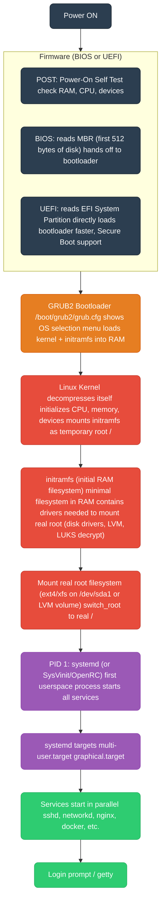
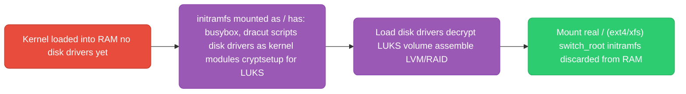
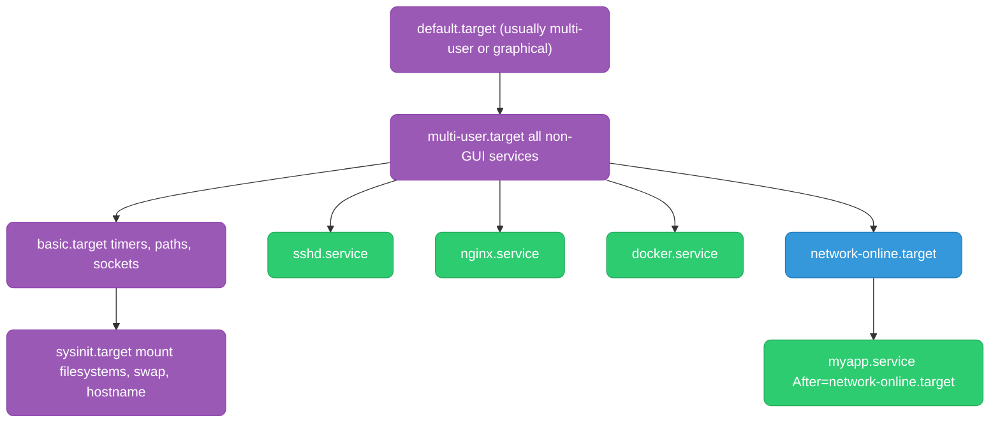

# Linux Boot Process

---

## BIOS/UEFI to Userspace



**BIOS vs UEFI:**
| | BIOS | UEFI |
|--|------|------|
| Partition table | MBR (max 2TB disk, 4 partitions) | GPT (max 9.4ZB, 128 partitions) |
| Boot code location | First 512 bytes of disk (MBR) | EFI System Partition (FAT32, /boot/efi) |
| Secure Boot | No | Yes (verifies bootloader signature) |
| Speed | Slower | Faster (parallel init) |
| Common on | Pre-2012 hardware | All modern hardware |

---

## initramfs and Why It Exists

The kernel can't mount the real root filesystem directly because it might need drivers that aren't compiled in (e.g., LUKS encryption, LVM, NFS root, specific disk drivers). initramfs is a temporary filesystem that provides those drivers.



```bash
# Inspect initramfs contents
lsinitrd /boot/initramfs-$(uname -r).img

# Rebuild after driver changes
dracut --force           # RHEL/CentOS
update-initramfs -u     # Debian/Ubuntu
```

---

## systemd

systemd is PID 1 — the init system that starts and manages all services. It replaced SysVinit for parallel service startup and better dependency management.



### Unit File Anatomy

```ini
# /etc/systemd/system/myapp.service
[Unit]
Description=My Go Application
After=network-online.target postgresql.service   # start after these
Requires=postgresql.service                       # hard dependency (fail if postgres fails)
Wants=redis.service                               # soft dependency (start redis if possible)

[Service]
Type=simple                    # exec: ExecStart is the main process
ExecStart=/usr/local/bin/myapp --config /etc/myapp/config.yaml
ExecReload=/bin/kill -HUP $MAINPID  # reload config on: systemctl reload myapp
WorkingDirectory=/opt/myapp
User=appuser
Group=appuser
Restart=on-failure             # restart if exits non-zero
RestartSec=5s                  # wait 5s before restart
StartLimitBurst=5              # max 5 restarts
StartLimitIntervalSec=30s      # within 30s window — then fail permanently

# Resource limits
LimitNOFILE=65536              # max open file descriptors
MemoryMax=512M                 # cgroup memory limit
CPUQuota=200%                  # max 2 CPU cores

# Security hardening
NoNewPrivileges=true           # process cannot gain extra privileges
PrivateTmp=true                # own /tmp (not shared with other services)
ProtectSystem=strict           # /usr, /boot, /etc read-only
ReadWritePaths=/var/lib/myapp  # only this path is writable

# Environment
Environment=APP_ENV=production
EnvironmentFile=/etc/myapp/env  # load from file

[Install]
WantedBy=multi-user.target     # enable for this target
```

### Essential systemctl Commands

```bash
systemctl start myapp
systemctl stop myapp
systemctl restart myapp
systemctl reload myapp          # reload config (sends ExecReload signal)
systemctl status myapp          # detailed status + last log lines
systemctl enable myapp          # auto-start on boot
systemctl disable myapp
systemctl daemon-reload         # reload unit files after editing
systemctl list-units --failed   # see broken services
systemctl list-dependencies myapp  # show dependency tree

# Logs
journalctl -u myapp -f          # follow logs
journalctl -u myapp --since "1 hour ago"
journalctl -u myapp -n 100      # last 100 lines
journalctl -p err -b            # errors since last boot
journalctl --disk-usage         # how much journal space used

# Boot analysis
systemd-analyze                 # total boot time
systemd-analyze blame           # which units took longest
systemd-analyze critical-chain  # critical path of boot
```

### Service Types

| Type | Meaning | Use for |
|------|---------|---------|
| `simple` | ExecStart process IS the service | Most daemons |
| `forking` | ExecStart forks, parent exits | Old-style daemons (nginx, apache) |
| `notify` | Process sends `sd_notify(READY=1)` when ready | Services that take time to init |
| `oneshot` | Process runs and exits (not a daemon) | Init scripts, migrations |
| `idle` | Like simple but waits until boot is done | Low-priority startup tasks |
