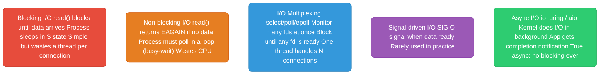
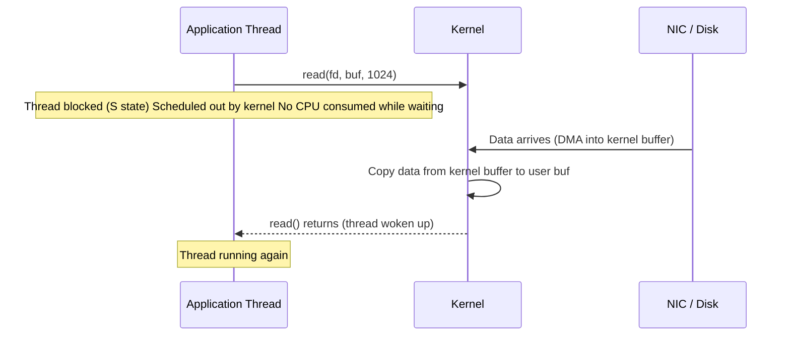
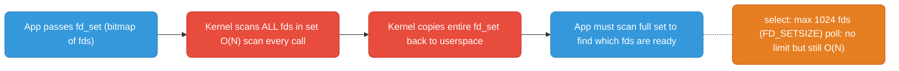
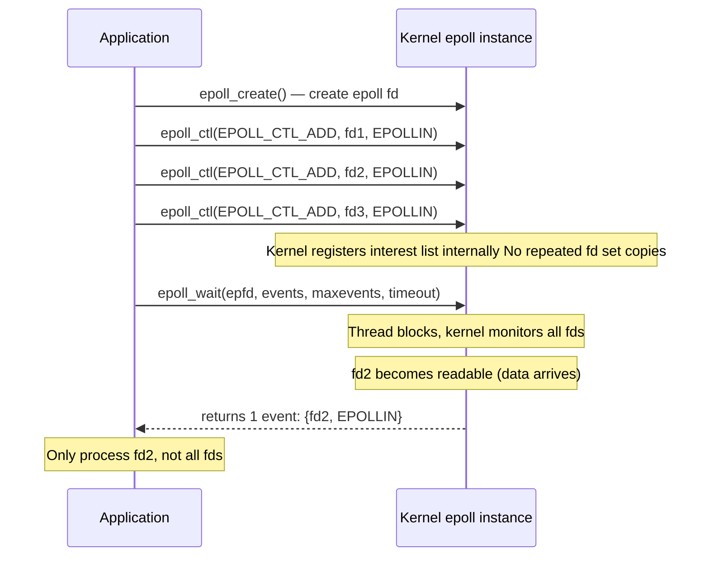
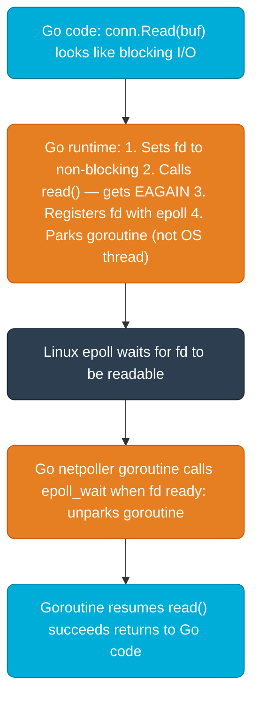
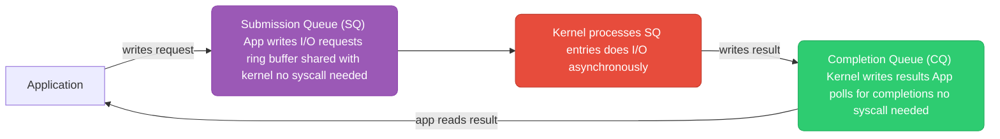

# Linux I/O Models

How applications wait for data — the foundation of every high-performance server.

---

## The Five I/O Models



---

## Blocking I/O — What Actually Happens



**The problem:** One thread blocked = one thread wasted. For 10,000 concurrent connections, you need 10,000 threads. Each thread costs ~8MB stack → 80GB RAM just for stacks. That's the C10K problem.

---

## select and poll — The Old Way



**select/poll problems:**
- O(N) scan of all fds on every call — scales poorly past 1000 fds
- `select` hard limit: 1024 fds
- Full fd set copied kernel↔userspace on every call
- App must re-scan entire set to find ready fds

---

## epoll — The Modern Way

epoll is O(1) for event notification regardless of how many fds you're watching. Used by nginx, Node.js, Redis, Go's netpoller.



**Why epoll is O(1):**
- Interest list stored in a red-black tree inside kernel — `epoll_ctl` is O(log N)
- Ready list is a separate linked list — when an fd becomes ready the kernel adds it directly
- `epoll_wait` returns only ready fds — app never scans unready ones

**Edge-triggered (EPOLLET) vs level-triggered (default):**
- **Level-triggered (default):** `epoll_wait` returns as long as data is available. Safe but can cause many wakeups.
- **Edge-triggered:** `epoll_wait` returns only when state changes (new data arrives). More efficient but you MUST read until `EAGAIN` or you'll miss data.

```c
// Adding fd with edge-triggered mode
struct epoll_event ev;
ev.events = EPOLLIN | EPOLLET;   // edge-triggered
ev.data.fd = client_fd;
epoll_ctl(epfd, EPOLL_CTL_ADD, client_fd, &ev);
```

---

## Go's Runtime Netpoller (Built on epoll)

Go doesn't expose epoll directly. Its runtime wraps it transparently — Go code looks blocking but is actually non-blocking underneath.



**The key insight:** One OS thread runs many goroutines. When a goroutine would block on I/O, the runtime parks it and switches to another goroutine on the same OS thread. The OS thread never actually blocks — it's always running some goroutine. This is how Go handles 100,000 concurrent connections with far fewer OS threads than connections.

---

## io_uring — True Async I/O (Linux 5.1+)



**Why io_uring is faster than epoll:**
- Zero-copy between app and kernel (shared ring buffers)
- Batched submissions — submit 100 I/O operations with one syscall (or zero with `SQPOLL`)
- Works for files, not just sockets (epoll doesn't work on regular files — `O_NONBLOCK` on files is a lie)
- No context switches in `SQPOLL` mode — kernel thread polls SQ continuously

**In Go:** Go 1.21+ has experimental io_uring support. Not yet default (as of 2025). Tokio (Rust) uses it heavily. For now, Go's epoll-based netpoller is excellent for most cases.

---

## Comparison

| Model | Syscall | Scalability | CPU when idle | Works for files? | Used by |
|-------|---------|-------------|--------------|-----------------|---------|
| Blocking | `read/write` | O(1) per conn, O(N) threads | Low | Yes | Simple servers |
| Non-blocking poll | `read` + busy loop | Poor (CPU waste) | High | Yes | Rarely used directly |
| select | `select` | O(N) fds | Low | Yes | Legacy code |
| poll | `poll` | O(N) fds | Low | Yes | Legacy code |
| epoll | `epoll_wait` | O(1) events | Low | No (sockets only) | nginx, Node.js, Go, Redis |
| io_uring | ring buffer | O(1), zero-copy | Very low | Yes | Tokio, newer Linux services |
