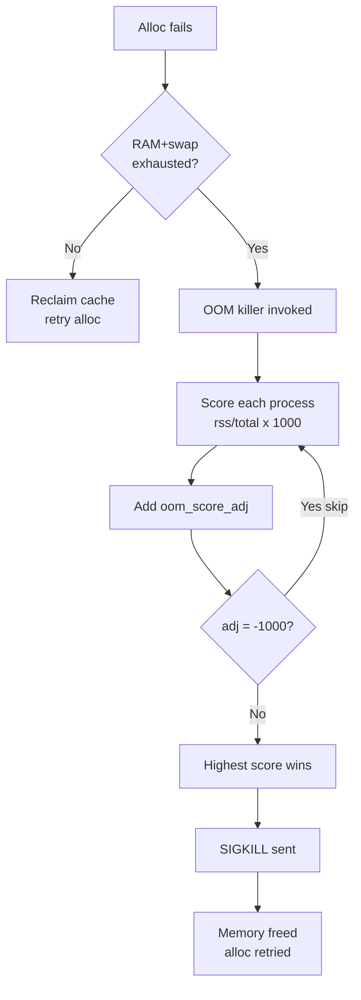
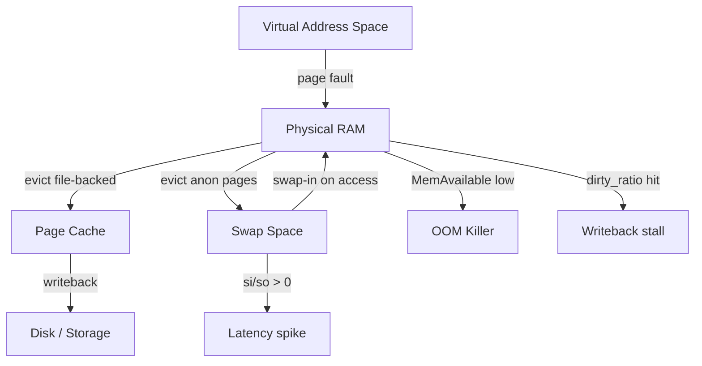

# Memory Tuning

## 1. /proc/meminfo — Key Fields

```bash
cat /proc/meminfo
```

```
MemTotal:       16384000 kB   # Total physical RAM
MemFree:          512000 kB   # Completely unused RAM
MemAvailable:    8192000 kB   # Estimated available for new processes
Buffers:          256000 kB   # Block device read cache (metadata)
Cached:          4096000 kB   # Page cache (file data)
SwapCached:        12000 kB   # Swap data also in RAM
Active:          6144000 kB   # Recently used, not easily reclaimable
Inactive:        3072000 kB   # LRU candidates for reclaim
Dirty:             64000 kB   # Modified pages not yet written to disk
Writeback:          8000 kB   # Pages being written to disk now
Slab:             512000 kB   # Kernel data structures
SReclaimable:     256000 kB   # Reclaimable slab (dentries/inodes)
SUnreclaim:       256000 kB   # Unreclaimable slab
```

**Critical distinction — MemFree vs MemAvailable:**

| Field | Meaning |
|-------|---------|
| `MemFree` | Pages with nothing in them — misleadingly low on healthy systems |
| `MemAvailable` | MemFree + reclaimable buffers/cache + part of slab. **Use this** to judge if memory is available for a new process |

> A server with MemFree=100MB but MemAvailable=8GB is healthy. The kernel uses free RAM for caching aggressively.

---

## 2. Swap and Swappiness

```bash
# Show swap usage
swapon --show
free -h

# Swappiness control
sysctl vm.swappiness
sysctl -w vm.swappiness=10
```

**vm.swappiness values:**

| Value | Behaviour |
|-------|-----------|
| `0` | Swap only to avoid OOM; never proactively |
| `10` | Low swap tendency; prefer to reclaim file cache (recommended for DBs) |
| `60` | Default; balanced |
| `100` | Swap aggressively; treat file cache and anon memory equally |

**Persist:**
```bash
echo "vm.swappiness = 10" >> /etc/sysctl.d/99-memory.conf
sysctl -p /etc/sysctl.d/99-memory.conf
```

**When swap is useful vs harmful:**
- Useful: cushion for rarely-accessed JVM heap; allows overcommit for fork-heavy workloads
- Harmful: database buffers getting swapped causes 100ms+ latency spikes; use `swappiness=1` for MySQL/PostgreSQL/Redis

---

## 3. OOM Killer

When physical memory + swap is exhausted, the kernel OOM killer selects and kills a process.

**Score calculation:**
```
oom_score = (process_rss / total_memory) × 1000
          + oom_score_adj
```

- Higher score → killed first
- `oom_score_adj` range: -1000 (never kill) to +1000 (always kill first)

```bash
# Check a process's OOM score
cat /proc/1234/oom_score
cat /proc/1234/oom_score_adj

# Protect critical process (e.g., sshd)
echo -1000 > /proc/$(pgrep sshd)/oom_score_adj

# Make process OOM target
echo 500 > /proc/$(pgrep myapp)/oom_score_adj

# Persist via unit file — in [Service] section:
# OOMScoreAdjust=-500
```

**Reading OOM events in dmesg:**
```bash
dmesg -T | grep -i "oom\|killed process\|out of memory"
```

```
Out of memory: Kill process 5432 (java) score 892 or sacrifice child
Killed process 5432 (java) total-vm:4194304kB, anon-rss:3145728kB
```

- `score 892` — oom_score at time of kill
- `anon-rss` — anonymous (heap/stack) RSS
- `total-vm` — virtual address space (larger than physical)



---

## 4. Dirty Pages

Dirty pages are modified memory pages not yet flushed to disk. Too many → data loss risk on crash. Too aggressive flushing → I/O spikes.

```bash
# Current dirty page stats
cat /proc/meminfo | grep -i dirty
grep -r "" /proc/sys/vm/dirty*
```

**Tuning parameters:**

| Parameter | Default | Meaning |
|-----------|---------|---------|
| `vm.dirty_ratio` | 20 | % of total memory: if exceeded, processes block waiting for writeback |
| `vm.dirty_background_ratio` | 10 | % of total memory: background writeback starts at this threshold |
| `vm.dirty_expire_centisecs` | 3000 | Pages dirty longer than 30s are written |
| `vm.dirty_writeback_centisecs` | 500 | Flush daemon wakes every 5s |

```bash
# Reduce for databases (minimize write spikes)
sysctl -w vm.dirty_ratio=5
sysctl -w vm.dirty_background_ratio=2

# Force flush all dirty pages now
sync && echo 3 > /proc/sys/vm/drop_caches
```

---

## 5. Transparent Huge Pages (THP)

THP automatically promotes 4KB pages to 2MB huge pages to reduce TLB pressure.

**Benefits:**
- Fewer TLB entries needed for large working sets
- Reduced page table walk overhead
- Beneficial for: in-memory analytics, scientific computing, large JVM heaps

**Problems:**
- `khugepaged` daemon compacts memory in background — causes latency spikes of 10-100ms
- Especially harmful for: Redis, MySQL, PostgreSQL, MongoDB, Cassandra

```bash
# Check current setting
cat /sys/kernel/mm/transparent_hugepage/enabled
# [always] madvise never

# Disable for databases
echo never > /sys/kernel/mm/transparent_hugepage/enabled
echo never > /sys/kernel/mm/transparent_hugepage/defrag
```

**Opt in selectively (recommended approach):**
```c
// In application code, use madvise for specific regions
madvise(ptr, size, MADV_HUGEPAGE);   // request THP
madvise(ptr, size, MADV_NOHUGEPAGE); // opt out
```

Set `/sys/kernel/mm/transparent_hugepage/enabled` to `madvise` — only allocate huge pages when explicitly requested.

---

## 6. Memory cgroups v2 — How K8s Limits Work

Kubernetes uses cgroups v2 to enforce memory limits on pods/containers.

```
/sys/fs/cgroup/
└── kubepods.slice/
    └── pod<uid>/
        └── <container-id>/
            ├── memory.max        ← hard limit (limits.memory)
            ├── memory.high       ← soft limit (triggers reclaim)
            ├── memory.current    ← current usage
            └── memory.oom.group  ← kill whole cgroup on OOM
```

```bash
# Check container memory limits from host
cat /sys/fs/cgroup/kubepods.slice/pod<uid>/<cid>/memory.max

# Current usage
cat /sys/fs/cgroup/kubepods.slice/pod<uid>/<cid>/memory.current

# OOM events for this cgroup
cat /sys/fs/cgroup/kubepods.slice/pod<uid>/<cid>/memory.events
```

**K8s limit mapping:**

| K8s field | cgroup file | Effect |
|-----------|-------------|--------|
| `resources.limits.memory` | `memory.max` | Hard limit; exceeding → OOM kill |
| `resources.requests.memory` | scheduling hint | No cgroup enforcement |
| — | `memory.high` | ~90% of limit; triggers aggressive reclaim before OOM |

**OOMKilled pod:** When a container exceeds `memory.max`, the kernel OOM killer kills the cgroup's processes. K8s reports `OOMKilled` in pod status and restarts the container if `restartPolicy: Always`.

---

## 7. Practical Commands

```bash
# Overview: total, used, free, shared, buff/cache, available
free -h

# Virtual memory stats every second (key: si/so = swap in/out)
vmstat 1
# si > 0 or so > 0 → active swapping → investigate

# Per-process memory summary (RSS, PSS, Swap)
cat /proc/1234/smaps_rollup

# Sort processes by RSS
ps aux --sort=-%mem | head -20

# Detailed memory map for a process
pmap -x 1234

# Page fault stats
ps -o pid,min_flt,maj_flt -p 1234
# maj_flt > 0 → page faults requiring disk I/O

# Check for memory pressure events
dmesg | grep -i "memory\|oom\|killed"
```

**vmstat key columns:**

| Column | Meaning |
|--------|---------|
| `r` | Runnable processes (if > CPUs → CPU saturated) |
| `b` | Processes blocked on I/O |
| `swpd` | Virtual memory used (total swap) |
| `si` | Swap in (from disk to RAM) — bad if > 0 |
| `so` | Swap out (from RAM to disk) — bad if > 0 |
| `bi` | Blocks read from disk |
| `bo` | Blocks written to disk |


