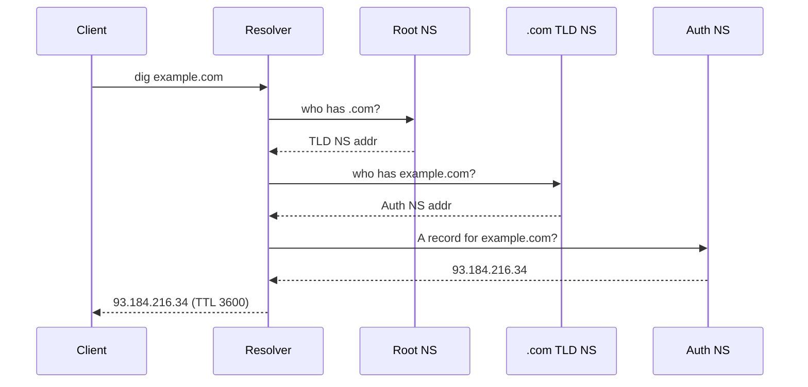
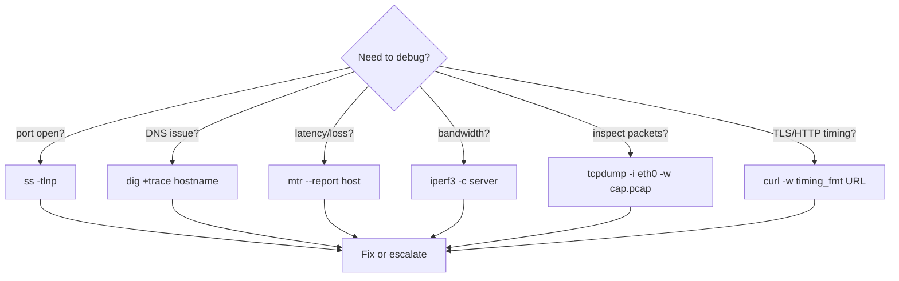

# Linux Network Debugging Tools

## 1. ss — Socket Statistics

Replacement for `netstat`. Reads directly from kernel via netlink.

```bash
# TCP listening sockets with PID and process name
ss -tlnp

# Summary: total sockets per state
ss -s

# All TCP sockets (established + time-wait etc.)
ss -tan

# Filter by state
ss -tan state established
ss -tan state time-wait
ss -tan state listening

# Filter by port
ss -tlnp sport = :80

# Show socket memory usage
ss -tm

# UDP
ss -ulnp
```

**Flag reference:**

| Flag | Meaning |
|------|---------|
| `-t` | TCP |
| `-u` | UDP |
| `-l` | Listening only |
| `-n` | Numeric (no DNS resolve) |
| `-p` | Show process (PID/name) |
| `-s` | Summary |
| `-a` | All states |

---

## 2. tcpdump — Packet Capture

```bash
# Capture on interface eth0, port 80, to file
tcpdump -i eth0 -w capture.pcap port 80

# Read from file
tcpdump -r capture.pcap

# HTTP GET requests only
tcpdump -i eth0 -A 'tcp port 80 and (tcp[((tcp[12:1] & 0xf0) >> 2):4] = 0x47455420)'

# DNS queries
tcpdump -i eth0 -n port 53

# Capture between two hosts
tcpdump -i eth0 host 10.0.0.1 and host 10.0.0.2

# Verbose TLS handshake
tcpdump -i eth0 -v port 443

# First 100 packets then stop
tcpdump -i eth0 -c 100 -w out.pcap

# Human-readable ASCII output
tcpdump -i eth0 -A port 8080
```

**Common filter syntax:**

```
host 1.2.3.4          → src or dst
src host 1.2.3.4
dst port 443
net 10.0.0.0/8
tcp and port 80
not port 22            → exclude SSH
```

---

## 3. curl -v — Timing Breakdown

```bash
# Full verbose: DNS, TCP, TLS, headers, body
curl -v https://example.com

# Timing breakdown with write-out
curl -o /dev/null -s -w "\
DNS lookup:     %{time_namelookup}s<br>\
TCP connect:    %{time_connect}s<br>\
TLS handshake:  %{time_appconnect}s<br>\
TTFB:           %{time_starttransfer}s<br>\
Total:          %{time_total}s<br>\
HTTP status:    %{http_code}<br>" https://example.com
```

**Timing fields:**

| Field | Measures |
|-------|---------|
| `time_namelookup` | DNS resolution |
| `time_connect` | TCP SYN+ACK (cumulative) |
| `time_appconnect` | TLS handshake complete (cumulative) |
| `time_pretransfer` | Ready to send request (cumulative) |
| `time_starttransfer` | TTFB — first byte received (cumulative) |
| `time_total` | Full transfer done |

> All times are cumulative from request start. Subtract previous phase to get per-phase duration.

```bash
# Follow redirects, show final URL
curl -Lv https://example.com

# Send custom headers
curl -H "Authorization: Bearer TOKEN" -v https://api.example.com/v1/data

# POST JSON
curl -X POST -H "Content-Type: application/json" -d '{"key":"val"}' https://api/endpoint
```

---

## 4. nc — Netcat

```bash
# Check if port is open (TCP)
nc -zv host.example.com 443

# Check UDP port
nc -zuv host.example.com 53

# Simple TCP server (listen)
nc -l 8080

# Connect to server
nc host.example.com 8080

# Port scan range
nc -zv host.example.com 20-25

# Send file
nc -l 9999 > received.txt          # receiver
nc host.example.com 9999 < file.txt # sender

# Timeout after 3s
nc -w 3 -zv host.example.com 443
```

---

## 5. iperf3 — Bandwidth Testing

```bash
# Start server
iperf3 -s

# Run client (TCP, default 10s)
iperf3 -c server-ip

# UDP test
iperf3 -c server-ip -u -b 100M   # target 100 Mbps

# Parallel streams
iperf3 -c server-ip -P 4

# Reverse (server sends to client)
iperf3 -c server-ip -R

# Custom duration
iperf3 -c server-ip -t 30

# JSON output
iperf3 -c server-ip -J
```

---

## 6. mtr / traceroute — Hop Latency

```bash
# mtr: live updating traceroute + packet loss per hop
mtr google.com

# Non-interactive report mode (100 packets)
mtr --report --report-cycles 100 google.com

# TCP mode (bypasses ICMP filters)
mtr --tcp --port 443 google.com

# Classic traceroute
traceroute google.com

# Use TCP SYN (more firewall-friendly)
traceroute -T -p 443 google.com

# Use ICMP
traceroute -I google.com
```

**Reading mtr output:**
- `Loss%` — packet loss at that hop (intermediate loss may be ICMP rate-limiting, not congestion)
- `Avg` — average RTT to hop
- High loss only at final hop → real issue; high loss at intermediate hop with no downstream loss → ICMP deprioritized

---

## 7. dig — DNS Debugging

```bash
# Basic lookup
dig example.com

# Short answer only
dig +short example.com

# Full recursive trace from root
dig +trace example.com

# Specific record type
dig example.com MX
dig example.com NS
dig example.com TXT
dig example.com AAAA

# Query specific nameserver
dig @8.8.8.8 example.com

# Reverse DNS (PTR)
dig -x 1.2.3.4

# Check DNSSEC
dig +dnssec example.com

# Query with timing
dig +stats example.com
```



---

## 8. ip — Route / Address / Neighbour

```bash
# Show all interfaces and IP addresses
ip addr show
ip addr show eth0

# Add/remove IP
ip addr add 192.168.1.10/24 dev eth0
ip addr del 192.168.1.10/24 dev eth0

# Routing table
ip route show
ip route get 8.8.8.8          # which route would be used?

# Add static route
ip route add 10.0.0.0/8 via 192.168.1.1 dev eth0

# Default gateway
ip route add default via 192.168.1.1

# ARP/neighbour table
ip neigh show
ip neigh flush dev eth0

# Link state
ip link show
ip link set eth0 up
ip link set eth0 down
```

---

## 9. TCP Tuning

```bash
# Current values
sysctl net.core.somaxconn
sysctl net.ipv4.tcp_rmem
sysctl net.ipv4.tcp_wmem

# Apply tuning (runtime)
sysctl -w net.core.somaxconn=65535
sysctl -w net.ipv4.tcp_rmem="4096 87380 16777216"
sysctl -w net.ipv4.tcp_wmem="4096 65536 16777216"
sysctl -w net.core.netdev_max_backlog=5000
sysctl -w net.ipv4.tcp_max_syn_backlog=8192
```

**Persist in `/etc/sysctl.conf` or `/etc/sysctl.d/99-tuning.conf`:**

```ini
net.core.somaxconn = 65535
net.ipv4.tcp_rmem = 4096 87380 16777216
net.ipv4.tcp_wmem = 4096 65536 16777216
net.core.netdev_max_backlog = 5000
net.ipv4.tcp_max_syn_backlog = 8192
net.ipv4.tcp_slow_start_after_idle = 0
net.ipv4.tcp_tw_reuse = 1
```

| Parameter | Effect |
|-----------|--------|
| `somaxconn` | Max completed connections in accept queue |
| `tcp_max_syn_backlog` | Max half-open (SYN) connections |
| `tcp_rmem` | min/default/max receive buffer per socket |
| `tcp_wmem` | min/default/max send buffer per socket |
| `tcp_tw_reuse` | Reuse TIME_WAIT sockets for new connections |


