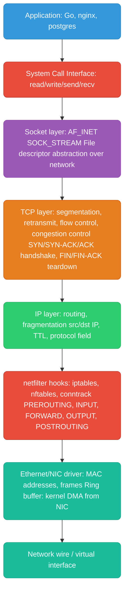
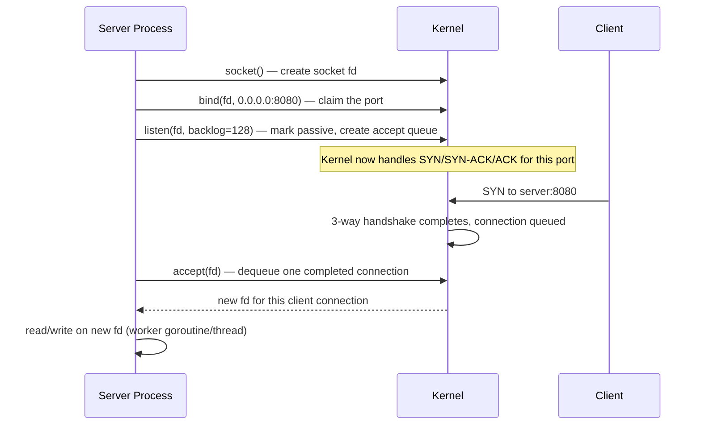
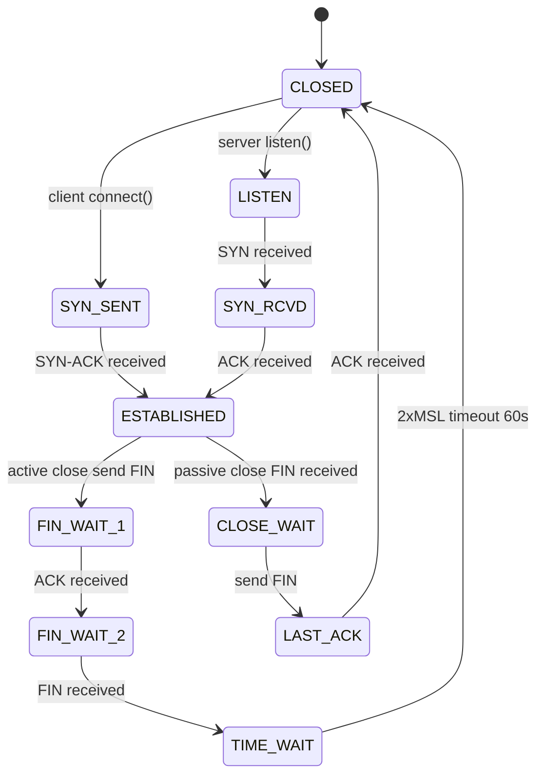
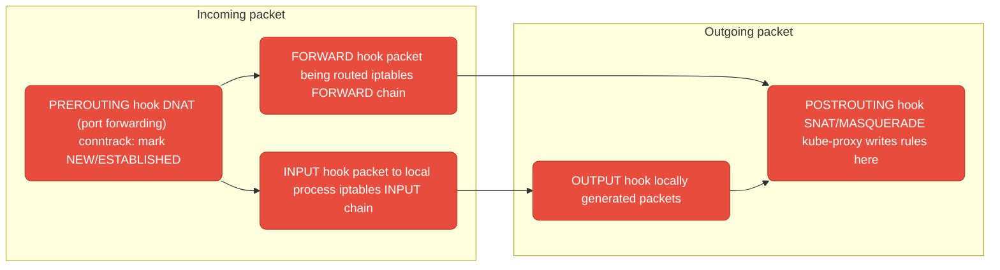

# Linux Networking Internals

---

## TCP/IP Stack in the Kernel



**Key layers:**
- **Socket** — the file descriptor your app holds. `fd = socket(AF_INET, SOCK_STREAM, 0)`. All I/O goes through kernel VFS after this.
- **TCP** — reliable, ordered, byte-stream. The kernel manages retransmits, ACKs, flow control (receive window), and congestion control (CUBIC/BBR algorithms).
- **IP** — best-effort delivery, routing decisions per packet based on routing table.
- **netfilter** — hooks at 5 points in the stack. iptables and nftables register rules here. conntrack tracks connection state for stateful firewalls and NAT.

---

## Sockets and the Accept Loop



**The accept queue (backlog):** The kernel completes the 3-way handshake and places fully established connections in the accept queue. `listen(fd, backlog)` sets the queue size. If your app is slow to call `accept()`, the queue fills → new connections get `ECONNREFUSED` or the SYN is silently dropped. Under load: `ss -lnt | grep :8080` — `Recv-Q` shows queued connections.

**`SO_REUSEPORT`:** Multiple processes/threads can bind the same port. The kernel load-balances incoming connections across all listeners. Used by nginx (one socket per worker process) and Go's `net.ListenConfig{Control: ...}`. Eliminates the single `accept()` bottleneck.

---

## TCP States and TIME_WAIT



**TIME_WAIT** is the most misunderstood TCP state. After active close, the socket stays in TIME_WAIT for `2 * MSL` (Maximum Segment Lifetime = 60s on Linux). Purpose:
1. Ensures the final ACK reaches the remote side (if lost, remote retransmits FIN)
2. Prevents old packets from a dead connection being mistaken for a new one

**Why it causes problems:** High-throughput services (proxies, load balancers) cycling many short-lived connections accumulate thousands of TIME_WAIT sockets. Each holds a local port. Port range: 32768-60999 (28231 ports). Exhaust them → `EADDRNOTAVAIL`.

**Fixes:**
```bash
# Check TIME_WAIT count
ss -s | grep TIME-WAIT

# Allow reuse of TIME_WAIT sockets for new connections (safe for clients)
sysctl -w net.ipv4.tcp_tw_reuse=1

# Expand ephemeral port range
sysctl -w net.ipv4.ip_local_port_range="1024 65535"

# Enable TCP timestamps (required for tw_reuse to work safely)
sysctl -w net.ipv4.tcp_timestamps=1
```

---

## netfilter and iptables

netfilter is the Linux kernel framework for packet filtering, NAT, and connection tracking. iptables is the userspace tool that programs netfilter rules.



**conntrack:** Tracks the state of every connection (NEW, ESTABLISHED, RELATED, INVALID). Stateful firewall rules use conntrack — "allow ESTABLISHED,RELATED" means replies to outbound connections are automatically allowed without an explicit inbound rule. `cat /proc/net/nf_conntrack` shows current table.

**Kubernetes uses netfilter heavily:** kube-proxy writes DNAT rules in PREROUTING (ClusterIP → pod IP) and MASQUERADE rules in POSTROUTING (pod IP → node IP for external traffic).

---

## Kernel TCP Tuning

Critical settings for high-connection services (nginx, databases, load balancers):

```bash
# /etc/sysctl.conf or applied via sysctl -w

# Accept queue size — how many completed connections kernel queues before app accepts
net.core.somaxconn = 65535           # system max (default: 4096)
net.ipv4.tcp_max_syn_backlog = 65535 # SYN queue size (incomplete handshakes)

# TIME_WAIT handling
net.ipv4.tcp_tw_reuse = 1            # reuse TIME_WAIT sockets for outbound connections
net.ipv4.ip_local_port_range = 1024 65535  # ephemeral port range

# Buffer sizes — critical for throughput
net.core.rmem_max = 134217728        # 128MB max receive buffer
net.core.wmem_max = 134217728        # 128MB max send buffer
net.ipv4.tcp_rmem = 4096 87380 134217728   # min/default/max
net.ipv4.tcp_wmem = 4096 65536 134217728

# Connection keepalive — detect dead connections
net.ipv4.tcp_keepalive_time = 60     # start probes after 60s idle (default: 7200s!)
net.ipv4.tcp_keepalive_intvl = 10    # probe every 10s
net.ipv4.tcp_keepalive_probes = 5    # 5 failed probes → close connection

# File descriptors (sockets are fds)
fs.file-max = 1000000                # system-wide fd limit
```

**Why `somaxconn` matters:** If your service gets a burst of connections and `accept()` can't keep up, the kernel silently drops new SYNs once the accept queue is full. `ss -lnt` shows `Recv-Q` — if it's consistently at your backlog limit, raise `somaxconn` and optimize your accept loop.
