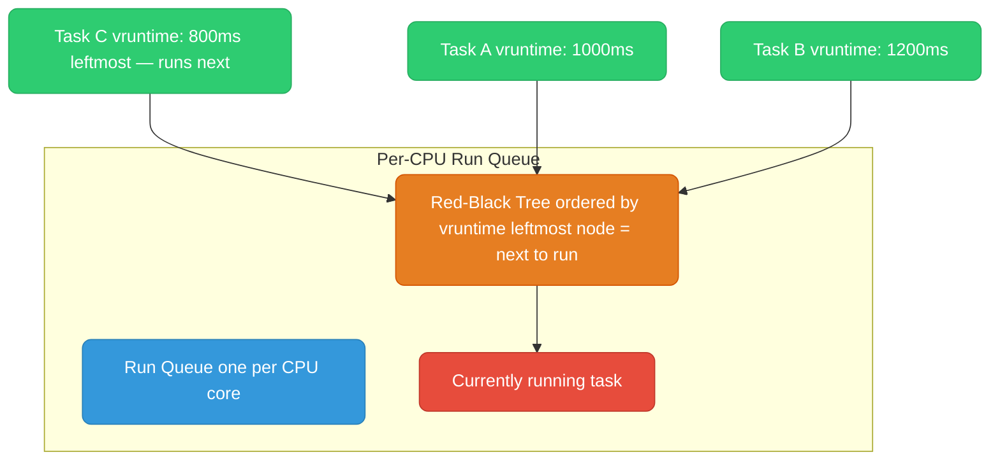
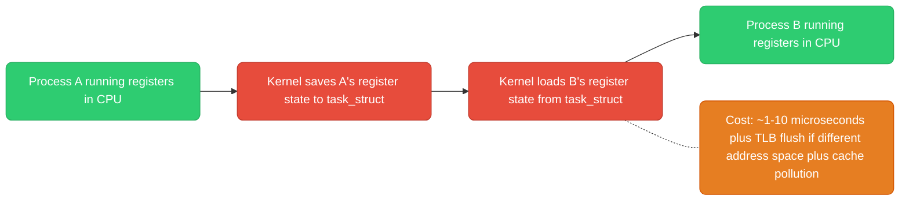
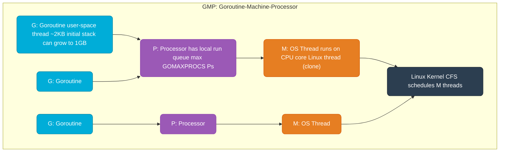

# Linux Scheduler

---

## CFS — Completely Fair Scheduler

Linux's default process scheduler since kernel 2.6.23. Goal: give every runnable process a fair share of CPU time.



**vruntime (virtual runtime):**
- Each task tracks `vruntime` — how much CPU time it has consumed, weighted by priority
- CFS always picks the task with the smallest `vruntime` (leftmost node in the red-black tree)
- Nice value modifies how fast `vruntime` advances: nice -20 (highest priority) → vruntime advances slowly → gets scheduled more often

**Scheduling latency (`sysctl kernel.sched_latency_ns`, default 6ms):** CFS guarantees every runnable task gets CPU within this window. With 10 tasks, each gets 0.6ms per cycle.

---

## Nice Values and Priority


```bash
# Start process with lower priority (background batch job)
nice -n 10 ./my-batch-job

# Change priority of running process
renice -n 5 -p <PID>

# Check priority (NI column in top/ps)
ps -o pid,ni,pri,cmd -p <PID>
```

**Real-time priorities** (bypass CFS entirely):
- `SCHED_FIFO` / `SCHED_RR` — fixed priority, preempts CFS tasks. Used by audio daemons, real-time systems.
- `chrt -f 50 ./realtime-app` — run with FIFO scheduling at priority 50

---

## CPU Affinity

Pin a process/thread to specific CPU cores. Useful for: reducing cache misses (L1/L2 cache is per-core), isolating latency-sensitive workloads, NUMA-aware placement.

```bash
# Pin process to cores 0 and 1
taskset -c 0,1 ./my-app

# Pin running process
taskset -c 2,3 -p <PID>

# Check current affinity
taskset -cp <PID>

# In Go: use GOMAXPROCS and runtime.LockOSThread()
# For CPU-intensive goroutines that need to stay on one core
```

**NUMA (Non-Uniform Memory Access):** Multi-socket servers have memory banks local to each CPU socket. Accessing memory on the remote socket takes ~2x longer. `numactl --cpubind=0 --membind=0 ./app` forces both process and memory allocation to NUMA node 0.

---

## Context Switches

A context switch is the CPU saving one process's state (registers, instruction pointer, stack pointer) and loading another's.



**Voluntary vs involuntary:**
- **Voluntary:** process calls `sleep()`, `read()` (blocks), `mutex_lock()` (contended)
- **Involuntary:** time slice expires, higher-priority task becomes runnable

```bash
# Count context switches per second (cs column)
vmstat 1

# Per-process context switches
cat /proc/<PID>/status | grep ctxt
# voluntary_ctxt_switches:   1234
# nonvoluntary_ctxt_switches: 56
```

High `nonvoluntary_ctxt_switches` = process is being preempted often = CPU-bound. High `voluntary_ctxt_switches` = process blocks often = I/O-bound.

---

## Go's Goroutine Scheduler (GMP Model)

Go implements its own user-space scheduler on top of the Linux CFS scheduler.



**How it works:**
- **G (Goroutine):** user-space coroutine with a small stack. Millions can exist.
- **P (Processor):** logical processor, has a local run queue of Gs. Count = `GOMAXPROCS` (default: number of CPU cores).
- **M (Machine):** OS thread. Runs Gs from a P's queue. Usually M count ≈ P count, but can grow if Gs block on syscalls.

**Work stealing:** If P1's queue is empty, it steals half of P2's queue. Keeps all cores busy.

**Goroutine preemption:** Go 1.14+ supports async preemption — a goroutine can be preempted at any safe point (via signals), not just at function calls. Prevents one tight loop from starving other goroutines.

**GOMAXPROCS = 1:** All goroutines run on one OS thread. No parallelism, only concurrency. Useful for debugging race conditions.

```bash
# Set at runtime
export GOMAXPROCS=4

# Or in code
runtime.GOMAXPROCS(runtime.NumCPU())

# View scheduler trace
GODEBUG=schedtrace=1000 ./myapp   # print scheduler state every 1000ms
GODEBUG=scheddetail=1 ./myapp     # verbose goroutine scheduling
```
