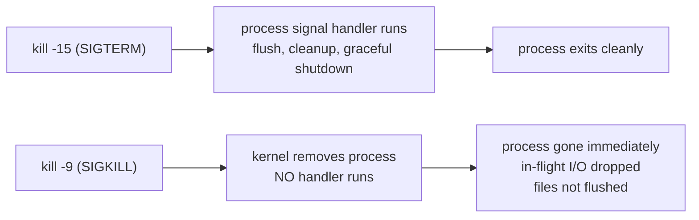
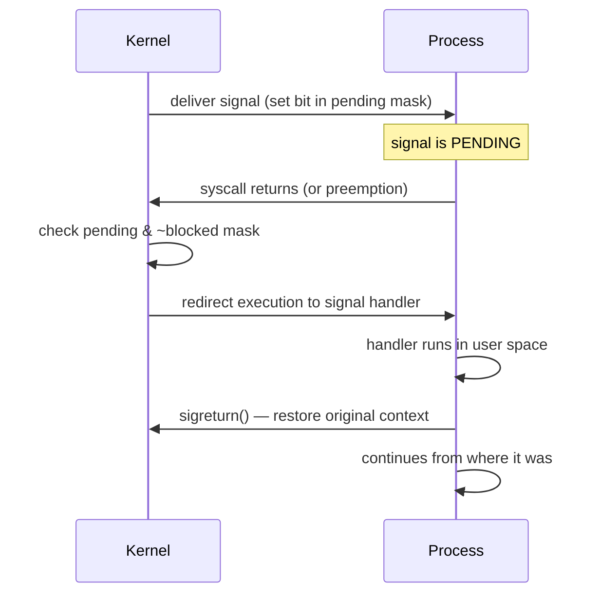
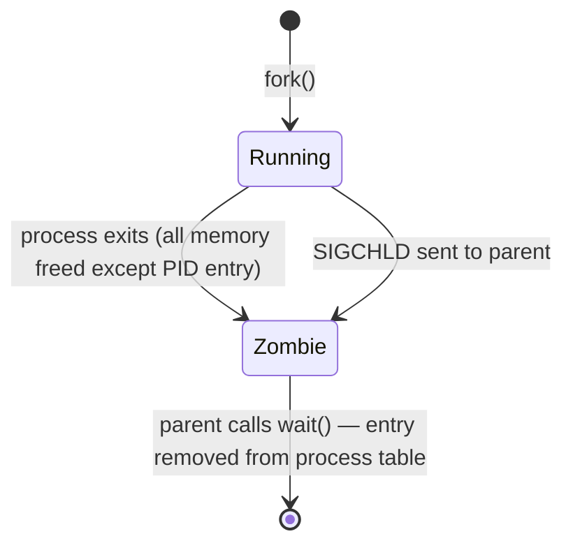

# Linux Signals

A signal is a software interrupt sent to a process by the kernel or another process. It's the primary mechanism for async process notification.

---

## Common Signals

| Signal | Number | Default action | Meaning |
|--------|--------|---------------|---------|
| `SIGHUP` | 1 | Terminate | Terminal hangup; used to reload config |
| `SIGINT` | 2 | Terminate | Keyboard interrupt (Ctrl+C) |
| `SIGQUIT` | 3 | Core dump | Quit with core dump (Ctrl+\\) |
| `SIGKILL` | 9 | Terminate | **Uncatchable.** Kernel kills immediately |
| `SIGUSR1` | 10 | Terminate | User-defined signal 1 |
| `SIGUSR2` | 12 | Terminate | User-defined signal 2 |
| `SIGPIPE` | 13 | Terminate | Write to broken pipe |
| `SIGTERM` | 15 | Terminate | Polite termination request (catchable) |
| `SIGCHLD` | 17 | Ignore | Child process stopped or terminated |
| `SIGSTOP` | 19 | Stop | **Uncatchable.** Pause process |
| `SIGCONT` | 18 | Continue | Resume stopped process |
| `SIGSEGV` | 11 | Core dump | Segmentation fault (invalid memory) |
| `SIGBUS` | 7 | Core dump | Bus error (misaligned memory access) |

---

## SIGTERM vs SIGKILL



**Rule:** Always try SIGTERM first. Give 30s. Then SIGKILL.

```bash
kill -15 <pid>      # SIGTERM — ask politely
sleep 30
kill -9 <pid>       # SIGKILL — force if still alive

# One-liner grace period
kill -15 <pid> && sleep 30 && kill -9 <pid> 2>/dev/null
```

**Why SIGKILL can't be caught:**
SIGKILL and SIGSTOP are handled entirely by the kernel scheduler — the process never gets CPU time to run a handler. This is intentional: it guarantees a way to always terminate a hung process.

---

## Signal Handling Internals



**When is a signal delivered?**
A signal becomes pending when sent. It's delivered when the process next transitions from kernel space to user space (syscall return or interrupt return). A sleeping process (in `select`, `read`, etc.) is woken up early — the syscall returns `EINTR`.

---

## Signal Masks

A process can **block** signals (add to the signal mask). Blocked signals stay pending until unblocked.

```bash
# View current signal masks for a process
cat /proc/1234/status | grep Sig
# SigBlk: 0000000000000000  ← blocked signals (bitmask, each bit = signal number)
# SigIgn: 0000000000001000  ← ignored (bit 12 = SIGPIPE ignored)
# SigCgt: 0000000180000000  ← caught (has handler installed)
# SigPnd: 0000000000000000  ← pending (sent but not yet delivered)

# Decode bitmask: bit N = signal N+1
# 0x1000 = bit 12 = signal 13 = SIGPIPE
python3 -c "mask=0x1000; [print(i+1) for i in range(64) if mask & (1<<i)]"
```

**In Go:**
```go
// Go runtime installs handlers for SIGSEGV, SIGBUS, SIGFPE
// and blocks SIGPROF for its own GC/scheduler use.
// To handle SIGTERM:
ch := make(chan os.Signal, 1)
signal.Notify(ch, syscall.SIGTERM, syscall.SIGINT)
<-ch  // block until signal
// do cleanup
```

---

## SIGCHLD and Zombie Processes

When a child process exits, the kernel sends SIGCHLD to the parent. The parent must call `wait()` or `waitpid()` to collect the exit status — only then is the zombie reaped.



```bash
# Default: SIGCHLD is ignored → parent never calls wait() → zombies accumulate
# Fix: explicitly handle SIGCHLD
# In shell scripts:
trap 'wait' SIGCHLD

# In C: use SA_NOCLDWAIT flag or signal(SIGCHLD, SIG_DFL) with waitpid
# In Go: os/exec.Cmd.Wait() handles this automatically
```

---

## Graceful Shutdown Pattern (Go)

```go
func main() {
    srv := &http.Server{Addr: ":8080"}

    go srv.ListenAndServe()

    quit := make(chan os.Signal, 1)
    signal.Notify(quit, syscall.SIGTERM, syscall.SIGINT)
    <-quit

    ctx, cancel := context.WithTimeout(context.Background(), 30*time.Second)
    defer cancel()
    srv.Shutdown(ctx)  // waits for in-flight requests, then stops
}
```

**Kubernetes graceful shutdown sequence:**
1. Pod gets SIGTERM (from `terminationGracePeriodSeconds` countdown start)
2. App starts draining (stop accepting, finish in-flight)
3. After `terminationGracePeriodSeconds` (default 30s) → SIGKILL
4. Set `preStop` hook if you need extra time before SIGTERM

---

## Sending Signals

```bash
kill -TERM <pid>         # by PID
kill -9 <pid>            # SIGKILL
killall -TERM nginx       # by name (all matching)
pkill -TERM -u www-data   # by user
pkill -f "python app.py"  # match full command line

# Send to process group (all children too)
kill -TERM -<pgid>

# Check what signals a process handles
kill -0 <pid>            # test if process exists (no signal sent)
```

---

## Signal Tracing with strace

```bash
# Watch signals being received
strace -e signal -p 1234

# Output example:
# --- SIGTERM {si_signo=SIGTERM, si_code=SI_USER, si_pid=5678} ---
# rt_sigreturn()  = 0
```
