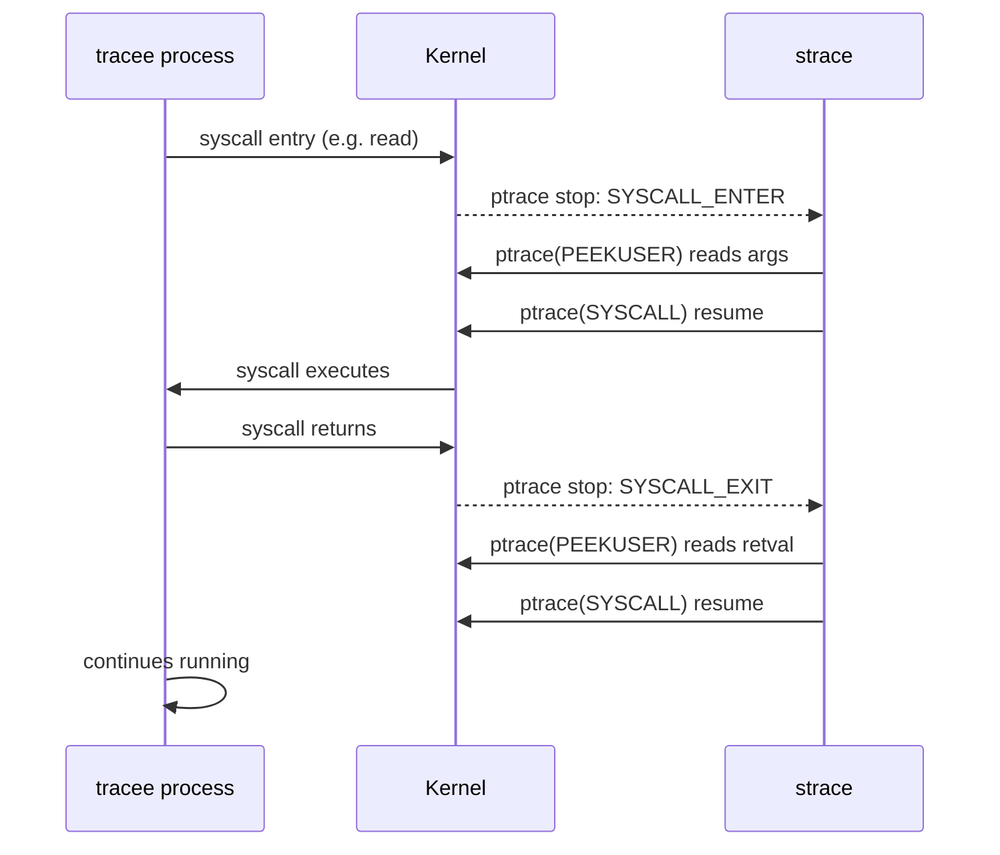
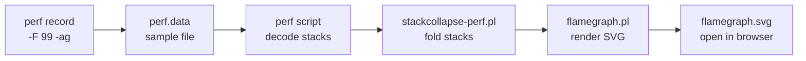
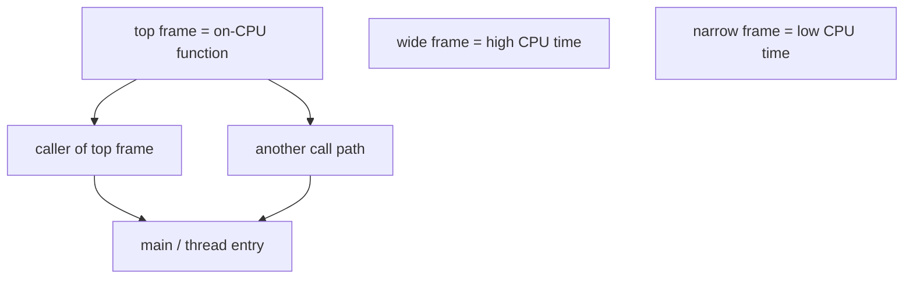

# strace, perf and Profiling

## 1. strace — Syscall Interception

strace uses the `ptrace(2)` syscall to intercept every system call made by a process. The kernel pauses the tracee at each syscall entry/exit, allowing strace to inspect arguments and return values.

```bash
# Trace a new process
strace ls /tmp

# Attach to running process by PID
strace -p 1234

# Filter: only open/read/write syscalls
strace -e trace=openat,read,write ls

# Count syscalls (summary table)
strace -c ls /tmp

# Show time spent per syscall
strace -T ls /tmp

# Trace child processes (fork/exec)
strace -f nginx -g daemon off

# Trace with timestamps
strace -t ls          # wall clock time
strace -tt ls         # microseconds
strace -ttt ls        # epoch microseconds

# Write output to file (essential for -f)
strace -f -o trace.txt nginx

# Network syscalls only
strace -e trace=network curl http://example.com

# File syscalls only
strace -e trace=file myapp
```

**Real examples:**

```bash
# Why is my process hung?
strace -p $(pgrep myapp) -e trace=all

# What files does it open at startup?
strace -e openat ./myapp 2>&1 | grep -v ENOENT

# Find slow syscalls (>1ms)
strace -T ./myapp 2>&1 | awk -F'<' '$2+0 > 0.001'

# Count syscalls during a test
strace -c -p 1234   # Ctrl-C to stop and print summary
```



> **Production warning:** strace adds ~10-100x overhead. On live systems, use `-c` for aggregated stats or attach briefly. Use `perf trace` for lower overhead.

---

## 2. perf stat — Hardware Counters

`perf stat` measures hardware performance counters (PMU) via kernel perf_event subsystem.

```bash
# Basic stats for a command
perf stat ls /tmp

# Attach to running PID
perf stat -p 1234

# Run for 5 seconds then report
perf stat -p 1234 sleep 5

# Specific events
perf stat -e cycles,instructions,cache-misses,branch-misses ls

# Repeat 3 times for variance
perf stat -r 3 ./mybenchmark
```

**Example output:**
```
 Performance counter stats for 'ls /tmp':

       2,345,678  cycles                    #  1.23 GHz
       1,890,123  instructions              #  0.81  insn per cycle (IPC)
          12,456  cache-misses              #  2.3% of all cache refs
           8,901  branch-misses             #  0.4% of all branches

       0.001234 seconds time elapsed
```

**Key metrics:**

| Metric | Good | Investigate if |
|--------|------|---------------|
| IPC (insn/cycle) | > 1.5 | < 0.5 (memory-bound?) |
| Cache miss rate | < 1% | > 10% (working set too large) |
| Branch miss rate | < 1% | > 5% (unpredictable branches) |
| Cycles/instruction | < 1 | > 3 (pipeline stalls) |

```bash
# Memory bandwidth events
perf stat -e LLC-loads,LLC-load-misses,LLC-stores ./myapp

# TLB events
perf stat -e dTLB-loads,dTLB-load-misses ./myapp
```

---

## 3. perf top — Live Hot Functions

```bash
# Live view of CPU-consuming functions system-wide
perf top

# For specific PID
perf top -p 1234

# Show kernel symbols too
perf top -a

# Specific event (cache misses)
perf top -e cache-misses

# Update every 2 seconds
perf top -d 2
```

**Navigation:** Arrow keys to select, Enter to annotate (assembly view), `q` to quit.

---

## 4. perf record + report — Flame Graph Pipeline

```bash
# Sample at 99Hz for 30s (freq avoids lockstep with 100Hz timer)
perf record -F 99 -g ./myapp

# Sample running process
perf record -F 99 -g -p 1234 sleep 30

# System-wide sampling
perf record -F 99 -ag sleep 30

# View interactive report (TUI)
perf report

# Dump raw text for flame graph
perf report --stdio --no-header -n -q > perf_report.txt
```

**Full flame graph pipeline (Brendan Gregg's method):**

```bash
# 1. Record with stack traces
perf record -F 99 -ag -o perf.data sleep 30

# 2. Export to folded format
git clone https://github.com/brendangregg/FlameGraph
perf script -i perf.data | \
    ./FlameGraph/stackcollapse-perf.pl > out.folded

# 3. Generate SVG
./FlameGraph/flamegraph.pl out.folded > flamegraph.svg

# 4. Open in browser
open flamegraph.svg
```



---

## 5. Flame Graphs — How to Read



**Axes:**
- **X-axis:** Aggregate CPU time (width = % of samples). Left-to-right order is alphabetical, NOT time sequence.
- **Y-axis:** Stack depth. Bottom = thread entry point, top = on-CPU function.

**What to look for:**

| Pattern | Meaning |
|---------|---------|
| Wide frame at top | Hot function — optimize this |
| Wide tower | Deep call chain all consuming CPU |
| Flat wide plateau | Single function dominating |
| Thin frames | Many different functions, no clear hotspot |

**Brendan Gregg methodology:**
1. Look for the **widest frames near the top** — these are the actual CPU consumers
2. Trace down the stack to find which code path called into the hot function
3. Off-CPU flame graphs (perf + sleep analysis) show blocking time — different tool
4. Differential flame graphs compare before/after a change

---

## 6. perf trace — Lightweight Syscall Tracer

`perf trace` uses eBPF/tracepoints instead of ptrace — much lower overhead than strace.

```bash
# Trace syscalls for a command
perf trace ls /tmp

# Attach to PID
perf trace -p 1234

# Summary (like strace -c)
perf trace -s -p 1234 sleep 5

# Only specific syscalls
perf trace -e openat,read,write ls

# Filter by pid and syscall
perf trace --pid 1234 -e sendto

# Show timing
perf trace -T ls
```

**strace vs perf trace:**

| | strace | perf trace |
|---|--------|-----------|
| Mechanism | ptrace (per-process) | tracepoints/eBPF (kernel) |
| Overhead | ~10-100x | ~2-5x |
| Attach to running | Yes | Yes |
| Child tracing (-f) | Yes | Yes |
| Production safe | No | Cautious yes |
| Output format | Detailed | Concise |
