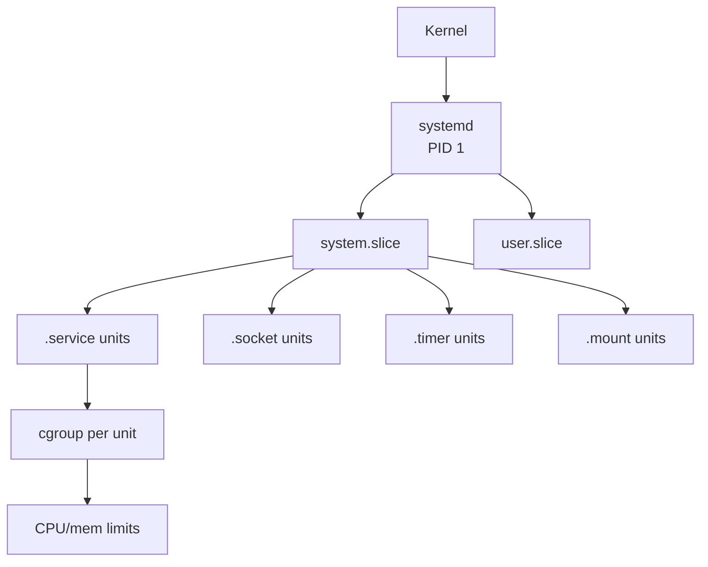
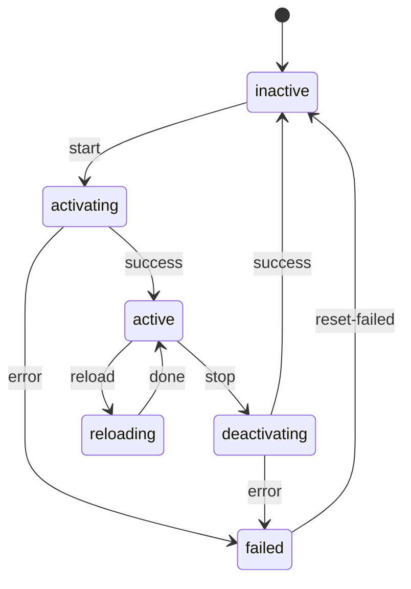
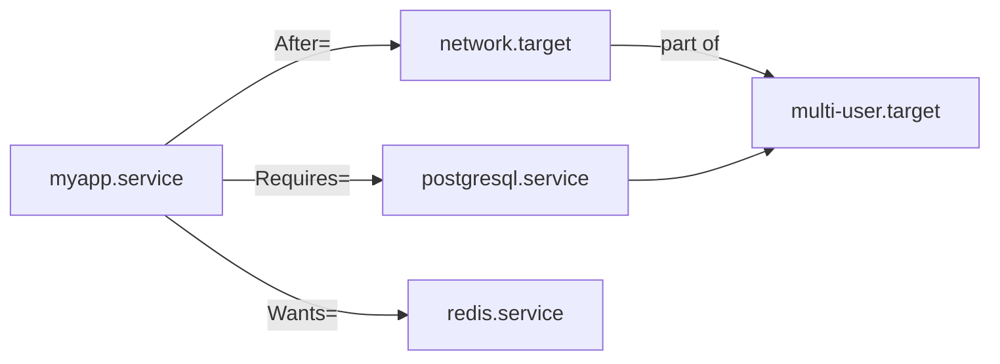

# systemd

## 1. Architecture

systemd is PID 1 — the first process started by the kernel. It initializes userspace, manages services, and reaps orphaned processes.

**Unit types:**

| Type | Extension | Purpose |
|------|-----------|---------|
| service | `.service` | Daemon/process lifecycle |
| socket | `.socket` | Socket activation (inetd-style) |
| timer | `.timer` | Scheduled jobs (cron replacement) |
| mount | `.mount` | Filesystem mount points |
| target | `.target` | Grouping/synchronization point |
| path | `.path` | File/directory change trigger |
| device | `.device` | udev device availability |

**cgroups integration:** Every service gets its own cgroup slice. systemd uses this to track all processes belonging to a unit (including forks), enforce resource limits (CPU/memory), and cleanly kill the entire process tree on stop.

```
systemd (PID 1)
└── system.slice
    ├── nginx.service    → cgroup: /system.slice/nginx.service
    ├── mysql.service    → cgroup: /system.slice/mysql.service
    └── user.slice
        └── user-1000.slice
```



---

## 2. Unit File Structure

Unit files live in `/etc/systemd/system/` (admin) or `/lib/systemd/system/` (packages).

```ini
[Unit]
Description=My App Server
Documentation=https://example.com/docs
After=network.target postgresql.service
Requires=postgresql.service
Wants=redis.service
ConditionPathExists=/etc/myapp/config.yml

[Service]
Type=simple            # simple|forking|oneshot|notify|idle
ExecStart=/usr/bin/myapp --config /etc/myapp/config.yml
ExecReload=/bin/kill -HUP $MAINPID
ExecStop=/bin/kill -TERM $MAINPID
Restart=on-failure     # no|always|on-failure|on-abnormal
RestartSec=5s
User=myapp
Group=myapp
WorkingDirectory=/var/lib/myapp
Environment=APP_ENV=production
EnvironmentFile=/etc/myapp/env
StandardOutput=journal
StandardError=journal
LimitNOFILE=65536
MemoryMax=512M
CPUQuota=50%
KillMode=mixed         # control-group|process|mixed|none
TimeoutStartSec=30
TimeoutStopSec=30

[Install]
WantedBy=multi-user.target
```

**Key `Type=` values:**

| Type | Behaviour |
|------|-----------|
| `simple` | ExecStart is the main process (default) |
| `forking` | Process forks; parent exits; use PIDFile= |
| `oneshot` | Runs once and exits; RemainAfterExit=yes useful |
| `notify` | Process calls `sd_notify(READY=1)` when ready |

---

## 3. Service Lifecycle & systemctl Commands



```bash
# Basic control
systemctl start nginx
systemctl stop nginx
systemctl restart nginx
systemctl reload nginx          # send SIGHUP, no downtime
systemctl enable nginx          # create symlink → start at boot
systemctl disable nginx
systemctl mask nginx            # symlink to /dev/null, unoverridable
systemctl unmask nginx

# Inspection
systemctl status nginx          # state, PID, last log lines
systemctl is-active nginx       # exit 0 if active
systemctl is-enabled nginx
systemctl list-units --type=service --state=failed
systemctl list-units --type=service --all
systemctl cat nginx             # show unit file
systemctl show nginx            # all properties as key=value
systemctl edit nginx            # create drop-in override

# Daemon reload after editing unit files
systemctl daemon-reload
```

---

## 4. Dependency Ordering



| Directive | Meaning |
|-----------|---------|
| `After=` | Start order only — wait for listed units to start first |
| `Before=` | Start order only — this unit starts before listed units |
| `Requires=` | Hard dependency — if dependency fails, this unit fails |
| `Wants=` | Soft dependency — dependency failure does not stop this unit |
| `BindsTo=` | Like Requires= + if dependency stops, this stops too |
| `PartOf=` | Propagate stop/restart from parent to this unit |
| `Conflicts=` | Cannot run simultaneously |

> `After=` and `Requires=` are independent. `Requires=A` without `After=A` means both start in parallel but this unit fails if A fails.

---

## 5. Timers (cron replacement)

Every timer needs a matching `.service` unit with the same base name.

```ini
# /etc/systemd/system/backup.timer
[Unit]
Description=Daily backup timer

[Timer]
OnCalendar=daily              # or: Mon-Fri 09:00
Persistent=true               # run missed jobs after downtime
RandomizedDelaySec=300        # spread load across 5 min window
AccuracySec=1s                # wake precision

[Install]
WantedBy=timers.target
```

```ini
# /etc/systemd/system/backup.service
[Unit]
Description=Daily backup job

[Service]
Type=oneshot
ExecStart=/usr/local/bin/backup.sh
```

```bash
systemctl enable --now backup.timer
systemctl list-timers --all          # next trigger times
```

**OnCalendar syntax:**

```
daily              → 00:00:00 every day
hourly             → *:00:00
Mon-Fri 09:00      → weekdays at 9am
*-*-1 00:00        → 1st of every month
2024-06-15 12:30   → specific datetime
```

---

## 6. journalctl Flags

```bash
# Follow a unit's logs (like tail -f)
journalctl -u nginx -f

# Logs since last boot
journalctl -b

# Logs from two boots ago
journalctl -b -2

# Time range
journalctl --since "2024-01-01 00:00" --until "2024-01-02 00:00"
journalctl --since "1 hour ago"

# Priority filter (emerg/alert/crit/err/warning/notice/info/debug)
journalctl -p err           # err and above
journalctl -p warning..err  # range

# Combine
journalctl -u nginx -p err --since "today" -f

# Output formats
journalctl -u nginx -o json-pretty    # structured JSON
journalctl -u nginx -o short-iso      # ISO timestamps

# Disk usage
journalctl --disk-usage
journalctl --vacuum-size=500M
```

---

## 7. Boot Analysis with systemd-analyze

```bash
# Total boot time
systemd-analyze

# Per-unit breakdown sorted by time
systemd-analyze blame

# Critical path chain
systemd-analyze critical-chain

# Critical path for a specific unit
systemd-analyze critical-chain nginx.service

# Export SVG boot timeline
systemd-analyze plot > boot.svg

# Check unit file syntax
systemd-analyze verify /etc/systemd/system/myapp.service
```

**Example output:**
```
Startup finished in 1.2s (kernel) + 3.4s (initrd) + 8.9s (userspace) = 13.5s

blame:
  4.201s apt-daily.service
  2.914s dev-sda1.device
  1.630s NetworkManager-wait-online.service
  ...
```

> To speed up boot: mask `apt-daily.service`, disable `NetworkManager-wait-online.service` if not needed, and check for slow `ExecStartPre=` scripts.
