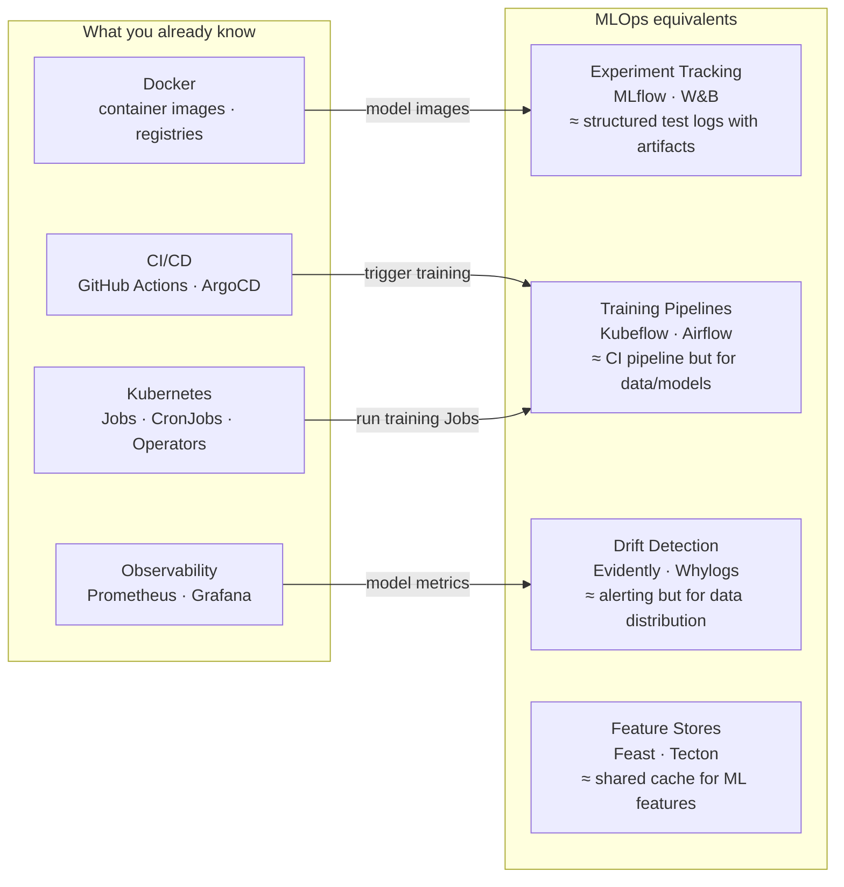

# MLOps — Machine Learning Operations

MLOps applies DevOps/GitOps principles to ML: version control for data and models, automated retraining pipelines, and production monitoring beyond CPU/memory.

---

## How MLOps Relates to What You Know



---

## Files

| File | Topics |
|------|--------|
| [experiment-tracking.md](./experiment-tracking.md) | MLflow runs/experiments/registry, W&B sweeps, artifact versioning, model promotion |
| [training-pipelines.md](./training-pipelines.md) | Kubeflow Pipelines components/DAGs, Airflow operators, retraining triggers, K8s Jobs |
| [data-drift.md](./data-drift.md) | Evidently reports, feature drift detection, retraining triggers, shadow scoring, A/B testing |
| [feature-stores.md](./feature-stores.md) | Feast architecture, online vs offline store, point-in-time joins, training/serving skew |

---

## The ML Lifecycle (DevOps Analogy)

| DevOps concept | MLOps equivalent |
|---------------|-----------------|
| `git commit` | Log experiment run (params + metrics) |
| Container image tag | Model version in registry |
| Staging environment | Model in "Staging" registry stage |
| Production deploy | Promote model to "Production" stage |
| CI pipeline | Training pipeline (data → model) |
| Smoke test | Model evaluation gate (accuracy > threshold) |
| Rollback | Revert model registry to previous version |
| Dependency lock file | `requirements.txt` + data snapshot hash |
| Feature flag | A/B traffic split between model versions |

---

## Learning Path

```
1. experiment-tracking.md   → understand how models are versioned (start here)
2. training-pipelines.md    → build automated training workflows on K8s
3. data-drift.md            → monitor production, trigger retraining
4. feature-stores.md        → advanced: shared feature layer for training/serving consistency
```
