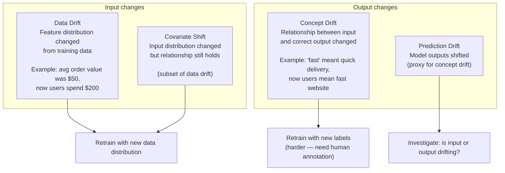
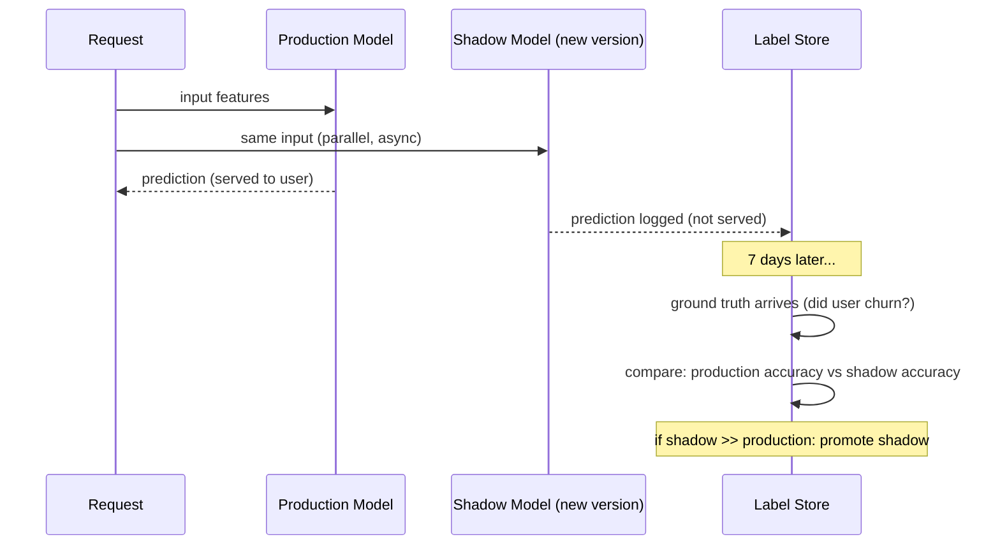

# Data Drift, Model Monitoring & Retraining Triggers

Monitoring a model in production requires more than Prometheus metrics. The model can degrade silently — same CPU/memory, but wrong answers — because the world changed.

---

## Types of Drift



---

## Evidently — Data and Model Monitoring

Evidently generates HTML reports and JSON metrics comparing a reference dataset (training) against current production data.

### Install

```bash
pip install evidently
```

### Generate a drift report

```python
import pandas as pd
from evidently.report import Report
from evidently.metric_preset import DataDriftPreset, DataQualityPreset
from evidently.metrics import ColumnDriftMetric

# Reference = training data (what the model was trained on)
reference_data = pd.read_parquet("s3://my-data/training/reference.parquet")

# Current = last 24h of production requests (with features logged)
current_data = pd.read_parquet("s3://my-data/production/last_24h.parquet")

# Generate report
report = Report(metrics=[
    DataDriftPreset(),           # checks all features for drift
    DataQualityPreset(),         # null rates, min/max, distribution
    ColumnDriftMetric(column_name="user_age"),     # specific feature
    ColumnDriftMetric(column_name="purchase_amount"),
])

report.run(reference_data=reference_data, current_data=current_data)
report.save_html("drift_report.html")

# Extract metrics programmatically
result = report.as_dict()
drift_score = result["metrics"][0]["result"]["dataset_drift"]
drifted_features = result["metrics"][0]["result"]["number_of_drifted_columns"]
print(f"Drift detected: {drift_score}, drifted features: {drifted_features}")
```

### Run as a K8s CronJob

```yaml
apiVersion: batch/v1
kind: CronJob
metadata:
  name: drift-monitor
  namespace: ml-monitoring
spec:
  schedule: "0 6 * * *"    # daily at 6am
  jobTemplate:
    spec:
      template:
        spec:
          containers:
          - name: drift-check
            image: myrepo/drift-monitor:v1.2
            env:
            - name: REFERENCE_PATH
              value: "s3://my-data/training/reference.parquet"
            - name: CURRENT_PATH
              value: "s3://my-data/production/yesterday.parquet"
            - name: DRIFT_THRESHOLD
              value: "0.3"
            - name: WEBHOOK_URL
              value: "http://pipeline-trigger/webhooks/drift-detected"
          restartPolicy: OnFailure
```

```python
# monitor.py — inside the CronJob container
import sys, requests, pandas as pd
from evidently.report import Report
from evidently.metric_preset import DataDriftPreset

reference = pd.read_parquet(os.environ["REFERENCE_PATH"])
current = pd.read_parquet(os.environ["CURRENT_PATH"])
threshold = float(os.environ["DRIFT_THRESHOLD"])

report = Report(metrics=[DataDriftPreset()])
report.run(reference_data=reference, current_data=current)
result = report.as_dict()

drift_share = result["metrics"][0]["result"]["share_of_drifted_columns"]

if drift_share > threshold:
    print(f"DRIFT DETECTED: {drift_share:.2%} of features drifted")
    requests.post(os.environ["WEBHOOK_URL"], json={
        "drift_score": drift_share,
        "feature": "dataset",
        "timestamp": datetime.utcnow().isoformat(),
    })
    sys.exit(0)   # drift detected but handled — exit 0 (not a job failure)

print(f"No significant drift: {drift_share:.2%}")
```

---

## Statistical Tests Used by Evidently

| Test | Metric type | What it detects |
|------|------------|----------------|
| **Kolmogorov-Smirnov** | Continuous (float) | Distribution shift |
| **Chi-squared** | Categorical | Category proportion change |
| **Jensen-Shannon divergence** | Both | Probability distribution distance |
| **Population Stability Index (PSI)** | Both | Industry standard for credit models |
| **Wasserstein distance** | Continuous | Earth mover's distance |

Evidently auto-selects the right test based on column type. You can override:

```python
from evidently.calculations.stattests import ks_stat_test, chi_stat_test

ColumnDriftMetric(
    column_name="user_age",
    stattest=ks_stat_test,
    stattest_threshold=0.05,   # p-value threshold
)
```

---

## Shadow Scoring — Detecting Concept Drift

Data drift = inputs changed. Concept drift = correct answer for same input changed. You can only detect concept drift with **ground truth labels** — which arrive delayed (e.g., did the customer actually churn?).



```python
# Shadow scoring pattern in FastAPI
@app.post("/predict")
async def predict(features: dict):
    # Serve production model
    prod_prediction = production_model.predict(features)

    # Shadow: run new model async, log results but don't serve
    asyncio.create_task(
        log_shadow_prediction(shadow_model, features, prod_prediction)
    )

    return {"prediction": prod_prediction}

async def log_shadow_prediction(shadow_model, features, prod_pred):
    shadow_pred = shadow_model.predict(features)
    await metrics_store.log({
        "timestamp": datetime.utcnow(),
        "features_hash": hash(str(features)),
        "prod_prediction": prod_pred,
        "shadow_prediction": shadow_pred,
    })
```

---

## A/B Testing Model Versions

Route a percentage of production traffic to the new model version:

```yaml
# KServe canary — 10% to new model
apiVersion: serving.kserve.io/v1beta1
kind: InferenceService
metadata:
  name: churn-model
spec:
  predictor:
    canaryTrafficPercent: 10     # 10% to v2
    model:
      storageUri: "s3://models/churn-v1/"
```

```python
# Track A/B metrics in Prometheus
from prometheus_client import Counter, Histogram

predictions = Counter("model_predictions_total", "Predictions by version",
                       labelnames=["model_version"])
accuracy = Histogram("model_accuracy", "Prediction accuracy by version",
                     labelnames=["model_version"])

# After ground truth arrives:
def record_outcome(version: str, correct: bool):
    predictions.labels(model_version=version).inc()
    accuracy.labels(model_version=version).observe(1.0 if correct else 0.0)
```

```promql
# A/B accuracy comparison
sum(rate(model_accuracy_sum[1h])) by (model_version)
/
sum(rate(model_accuracy_count[1h])) by (model_version)
```

---

## Monitoring Stack Summary

```
Production request logging → feature store / data lake (S3)
       ↓ (daily batch)
Evidently CronJob → drift report → webhook if threshold exceeded
       ↓ (if drift)
Training pipeline triggered → new model trained + evaluated
       ↓ (if accuracy gate passes)
Model registered in Staging → shadow test against production
       ↓ (if shadow accuracy > production)
Promote to Production (via MLflow API or ArgoCD + model URI update)
```

---

## Key Metrics to Alert On

| Metric | How to measure | Alert |
|--------|---------------|-------|
| Feature drift score | Evidently PSI / KS | > 0.25 |
| Prediction distribution shift | Distribution of model outputs | KS p-value < 0.05 |
| Model accuracy (if labels available) | Correct / total | Drop > 5% from baseline |
| Null rate in features | % of null values per feature | Spike > 3× baseline |
| Request volume | Prometheus `rate(predictions_total[5m])` | Drop > 30% (upstream issue) |
| TTFT / latency | vLLM metrics | p99 > SLO |
