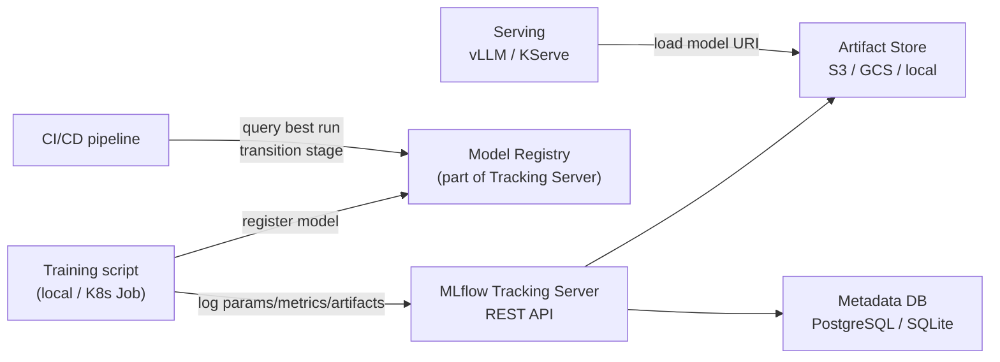

# Experiment Tracking & Model Registry

Experiment tracking is structured logging for ML: instead of a test report, you record the hyperparameters, metrics, and model artifacts of every training run so you can reproduce and compare them.

---

## Core Concepts

```
Experiment  ←  named group  (e.g. "llama3-finetune-customer-support")
  └── Run   ←  one execution (lr=0.001, batch=32, val_loss=0.23, model.pt)
  └── Run
  └── Run   ←  best run → register to Model Registry as version 3

Model Registry  ←  separate from runs
  └── Model: "customer-support-llm"
        └── Version 1  (Staging)
        └── Version 2  (Staging)
        └── Version 3  (Production)  ← promoted from best run
```

The **registry** is the gate to production. A run logs training results; the registry tracks what's deployed.

---

## MLflow

### Architecture



### Install on K8s

```bash
helm repo add community-charts https://community-charts.github.io/helm-charts
helm install mlflow community-charts/mlflow \
  --namespace mlflow --create-namespace \
  --set backendStore.postgres.enabled=true \
  --set artifactRoot.s3.enabled=true \
  --set artifactRoot.s3.bucket=my-mlflow-artifacts \
  --set serviceAccount.annotations."eks\.amazonaws\.com/role-arn"=arn:aws:iam::123:role/mlflow-s3
```

### Logging a training run

```python
import mlflow
import mlflow.pytorch

mlflow.set_tracking_uri("http://mlflow.mlflow.svc.cluster.local:5000")
mlflow.set_experiment("llama3-finetune-v2")

with mlflow.start_run(run_name="lr-0.001-batch-32") as run:
    # Log hyperparameters
    mlflow.log_params({
        "learning_rate": 0.001,
        "batch_size": 32,
        "epochs": 10,
        "model_name": "meta-llama/Meta-Llama-3-8B",
    })

    for epoch in range(10):
        train_loss, val_loss = train_epoch(model, data)

        # Log metrics per step
        mlflow.log_metrics({
            "train_loss": train_loss,
            "val_loss": val_loss,
        }, step=epoch)

    # Log model artifact
    mlflow.pytorch.log_model(
        model,
        artifact_path="model",
        registered_model_name="customer-support-llm",  # auto-registers
    )

    # Log any file (confusion matrix, eval report)
    mlflow.log_artifact("eval_report.json")

print(f"Run ID: {run.info.run_id}")
print(f"Artifact URI: {run.info.artifact_uri}")
```

### Model Registry — promotion workflow

```python
from mlflow import MlflowClient

client = MlflowClient("http://mlflow.mlflow.svc.cluster.local:5000")

# Find best run by val_loss
runs = client.search_runs(
    experiment_ids=["1"],
    filter_string="metrics.val_loss < 0.25",
    order_by=["metrics.val_loss ASC"],
    max_results=1,
)
best_run = runs[0]

# Register the best run's model
model_version = client.create_model_version(
    name="customer-support-llm",
    source=f"{best_run.info.artifact_uri}/model",
    run_id=best_run.info.run_id,
    description=f"Trained on {date.today()}, val_loss={best_run.data.metrics['val_loss']:.4f}",
)

# Transition to Staging
client.transition_model_version_stage(
    name="customer-support-llm",
    version=model_version.version,
    stage="Staging",        # None → Staging → Production → Archived
    archive_existing_versions=False,
)

# After validation in staging, promote to Production
client.transition_model_version_stage(
    name="customer-support-llm",
    version=model_version.version,
    stage="Production",
    archive_existing_versions=True,  # archive old production version
)
```

### Load a production model in serving

```python
# Always load by stage alias, not by version number
# This way promoting to Production automatically updates the serving code
model = mlflow.pytorch.load_model(
    "models:/customer-support-llm/Production"
)
```

---

## Weights & Biases (W&B)

W&B is the SaaS alternative to MLflow — richer visualisation, collaborative, zero-infra.

```python
import wandb

wandb.init(
    project="llama3-finetune",
    name="lr-0.001-batch-32",
    config={
        "learning_rate": 0.001,
        "batch_size": 32,
        "model": "meta-llama/Meta-Llama-3-8B",
    }
)

for epoch in range(10):
    train_loss, val_loss = train_epoch(model, data)
    wandb.log({"train_loss": train_loss, "val_loss": val_loss}, step=epoch)

# Save model artifact
artifact = wandb.Artifact("customer-support-llm", type="model")
artifact.add_file("model.pt")
wandb.log_artifact(artifact)

wandb.finish()
```

### W&B Sweeps — hyperparameter search

W&B Sweeps run parallel training jobs testing different hyperparameter combinations (grid, random, or Bayesian search):

```yaml
# sweep.yaml
program: train.py
method: bayes          # bayesian optimization (smarter than random)
metric:
  name: val_loss
  goal: minimize
parameters:
  learning_rate:
    min: 0.0001
    max: 0.01
  batch_size:
    values: [16, 32, 64]
  dropout:
    values: [0.1, 0.2, 0.3]
```

```bash
# Create sweep
wandb sweep sweep.yaml   # returns sweep ID

# Launch N agents (each runs one hyperparameter combination)
wandb agent <sweep-id> --count 10
```

Each agent runs `train.py`, W&B assigns it different hyperparameters, logs results, and updates the Bayesian model to suggest better parameters for the next run.

---

## MLflow vs W&B

| | MLflow | W&B |
|--|--------|-----|
| Hosting | Self-hosted (K8s) | SaaS (wandb.ai) |
| Cost | Free (infra only) | Free tier, paid for teams |
| Model registry | Built-in | Built-in |
| Sweep / HPO | Optuna integration | Native sweeps (Bayesian) |
| Visualisation | Basic | Rich, collaborative |
| Integration | Any Python | Any Python |
| Best for | On-prem/self-hosted teams | Teams wanting zero infra |

### W&B Model Registry

W&B has a separate Model Registry (different from the Artifacts tab) with staging/production aliases:

```python
import wandb

# 1. Log model artifact during training
run = wandb.init(project="my-project")
artifact = wandb.Artifact("customer-support-llm", type="model")
artifact.add_file("model.pt")
artifact.add_file("tokenizer/")
run.log_artifact(artifact)
wandb.finish()

# 2. Link artifact to the Model Registry with an alias
api = wandb.Api()
artifact = api.artifact("my-org/my-project/customer-support-llm:v3")

# Link to registry collection
artifact.link("my-org/model-registry/customer-support-llm",
              aliases=["staging"])   # aliases: staging, production, v1.2.3

# 3. Promote to production (remove staging alias, add production)
artifact = api.artifact("my-org/model-registry/customer-support-llm:staging")
artifact.aliases = ["production"]   # replaces all aliases
artifact.save()

# 4. Fetch production model in serving code
production = api.artifact("my-org/model-registry/customer-support-llm:production")
production.download(root="./model")  # downloads to local dir
```

**W&B Registry vs MLflow Registry comparison:**

| | W&B Model Registry | MLflow Model Registry |
|--|-------------------|----------------------|
| Stage names | Custom aliases (any string) | Fixed: Staging/Production/Archived |
| Webhooks | Yes — trigger CI/CD on alias change | No (use MLflow plugins) |
| Access control | RBAC at collection level | Per-model permissions |
| Cross-project | Yes (central registry across all projects) | Per-MLflow-server only |
| Lineage | Full run → artifact → registry trace | Run → model version |

```bash
# W&B CLI: list all versions in registry
wandb artifact ls my-org/model-registry/customer-support-llm

# Trigger deploy on alias promotion (webhook → GitHub Actions)
# W&B → Settings → Webhooks → add endpoint
# Payload includes: artifact name, alias added/removed, version
```

---

## Model Artifact Versioning Best Practices

```
✅ Always log the git commit hash as a param (reproducibility)
✅ Log the training data version/hash (know exactly what data produced this model)
✅ Log eval metrics before registering (never register a run without validation)
✅ Use stage aliases (Production/Staging) not version numbers in serving code
✅ Archive old Production version when promoting new one
❌ Never store model weights in git — use the artifact store
❌ Never hardcode a model version number in serving — use stage alias
```
