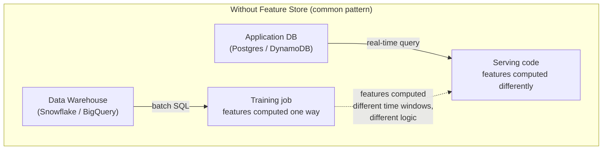
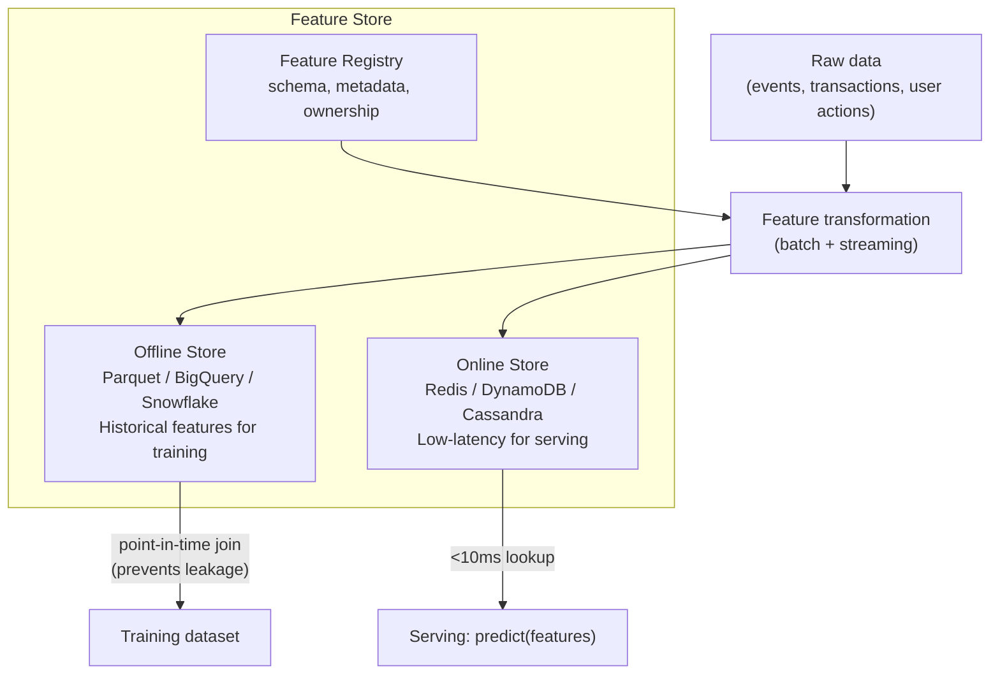

# Feature Stores

A feature store solves one problem: **training-serving skew** — the model trains on one version of a feature and serves predictions using a different version, silently degrading accuracy.

---

## The Problem Without a Feature Store



The training feature `avg_order_value_30d` is computed over a 30-day window from the data warehouse. The serving feature is computed over the last 100 records from Postgres. These are different — model gets different inputs at training vs serving time → accuracy degrades silently.

---

## Feature Store Architecture



Both training and serving read from the same feature definitions → identical features guaranteed.

---

## Online vs Offline Store

| | Offline Store | Online Store |
|--|---------------|-------------|
| Storage | Parquet / BigQuery / Redshift | Redis / DynamoDB / Cassandra |
| Latency | Seconds to minutes | < 10ms |
| Scale | Petabytes (all history) | Gigabytes (latest values only) |
| Use case | Training dataset generation | Real-time inference |
| Access pattern | Full scan / range query | Point lookup by entity ID |

The **online store contains only the latest feature values**. If you need `user_123`'s `avg_order_value_30d` at inference time, the online store has the pre-computed current value — no need to query the data warehouse.

---

## Feast — Open-Source Feature Store

### Install on K8s

```bash
pip install feast[redis,aws]

# Initialize a feature repo
feast init my-feature-repo
cd my-feature-repo
```

### Define features

```python
# feature_repo/features.py
from datetime import timedelta
from feast import Entity, FeatureView, Field, FileSource
from feast.types import Float64, Int64, String

# Entity = the primary key your features are about
user = Entity(name="user_id", description="User identifier")

# Source = where raw feature data lives
user_stats_source = FileSource(
    path="s3://my-data/features/user_stats.parquet",
    timestamp_field="event_timestamp",   # for point-in-time joins
)

# FeatureView = a group of related features from a source
user_stats = FeatureView(
    name="user_stats",
    entities=[user],
    ttl=timedelta(days=7),      # features expire after 7 days
    schema=[
        Field(name="avg_order_value_30d", dtype=Float64),
        Field(name="order_count_90d", dtype=Int64),
        Field(name="days_since_last_order", dtype=Int64),
        Field(name="preferred_category", dtype=String),
    ],
    source=user_stats_source,
    online=True,    # also materialized to online store
)
```

### Materialize features to online store

```bash
# Apply feature definitions to registry
feast apply

# Materialize: copy latest features from offline → online store (Redis)
# Run this as a CronJob — e.g., every hour
feast materialize-incremental $(date -u +"%Y-%m-%dT%H:%M:%S")
```

```yaml
# K8s CronJob for materialization
apiVersion: batch/v1
kind: CronJob
metadata:
  name: feast-materialize
spec:
  schedule: "0 * * * *"    # every hour
  jobTemplate:
    spec:
      template:
        spec:
          containers:
          - name: feast
            image: myrepo/feast:v1.0
            command:
            - feast
            - materialize-incremental
            - $(date -u +"%Y-%m-%dT%H:%M:%S")
            env:
            - name: FEAST_REPO_PATH
              value: /app/feature_repo
          restartPolicy: OnFailure
```

### Training: get historical features with point-in-time join

```python
from feast import FeatureStore
import pandas as pd

store = FeatureStore(repo_path="./feature_repo")

# Entity dataframe: what entities and when (prevents future leakage)
entity_df = pd.DataFrame({
    "user_id": ["user_1", "user_2", "user_3"],
    "event_timestamp": ["2024-01-15", "2024-01-15", "2024-01-15"],
})

# Feast retrieves feature values AS OF the event_timestamp
# This prevents data leakage: no future data used in training
training_df = store.get_historical_features(
    entity_df=entity_df,
    features=[
        "user_stats:avg_order_value_30d",
        "user_stats:order_count_90d",
        "user_stats:preferred_category",
    ],
).to_df()

# training_df has features as they existed at each event_timestamp
# No leakage, identical computation to what serving will use
```

### Serving: get online features (< 10ms)

```python
# At inference time — same feature definitions, different store
online_features = store.get_online_features(
    features=[
        "user_stats:avg_order_value_30d",
        "user_stats:order_count_90d",
        "user_stats:preferred_category",
    ],
    entity_rows=[{"user_id": "user_123"}],
).to_dict()

# Pass to model
prediction = model.predict(online_features)
```

---

## Point-in-Time Join — Preventing Data Leakage

Without point-in-time correctness, your training data uses future information that won't be available at serving time:

```
User placed order on Jan 15.
Feature: avg_order_value_30d as of Jan 15 = $45 (correct — only past 30 days)

Without PIT join: feature value = avg over ALL orders including future ones = $62 (leakage)
With PIT join:    feature value = avg over orders before Jan 15 = $45 (correct)
```

This is why the feature store — not a manual SQL join — handles feature retrieval for training. The timestamp-aware join is the core correctness guarantee.

---

## Training-Serving Skew — The Key Problem to Solve

| Cause | Detection | Fix |
|-------|-----------|-----|
| Different computation logic | Compare feature distributions between training and serving | Use same feature definitions in both |
| Different time windows | A/B test shows model worse than expected | Point-in-time join in feature store |
| Stale online features | Drift in online feature values vs offline | Reduce materialization interval |
| Missing features at serving | High null rate in serving logs | Add default values + monitoring |

```python
# Detect skew: compare feature stats between training and serving
from evidently.metric_preset import DataDriftPreset

training_features = store.get_historical_features(...).to_df()
serving_features = pd.read_parquet("s3://logs/serving-features-last-week.parquet")

report = Report(metrics=[DataDriftPreset()])
report.run(reference_data=training_features, current_data=serving_features)
# If significant drift: training-serving skew is present
```

---

## When to Use a Feature Store

```
✅ Use when:
  - Multiple models share the same features (don't recompute)
  - Training-serving skew is causing model degradation
  - Feature computation is expensive (30-day aggregations, graph features)
  - Compliance requires reproducible feature values for audit

❌ Skip when:
  - Single model, simple features (just pass raw fields)
  - Features are just the raw DB columns (no transformation)
  - Small team, early stage — add later when skew becomes a problem
```
