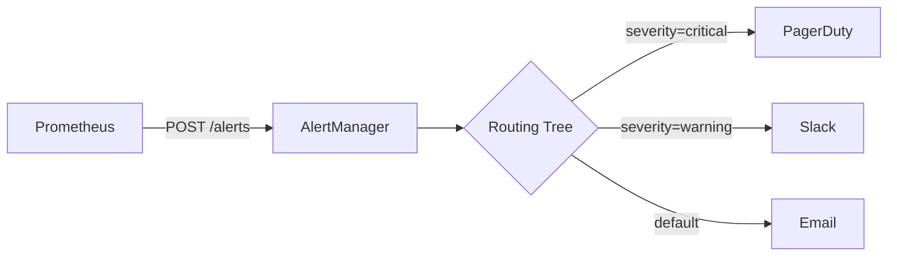
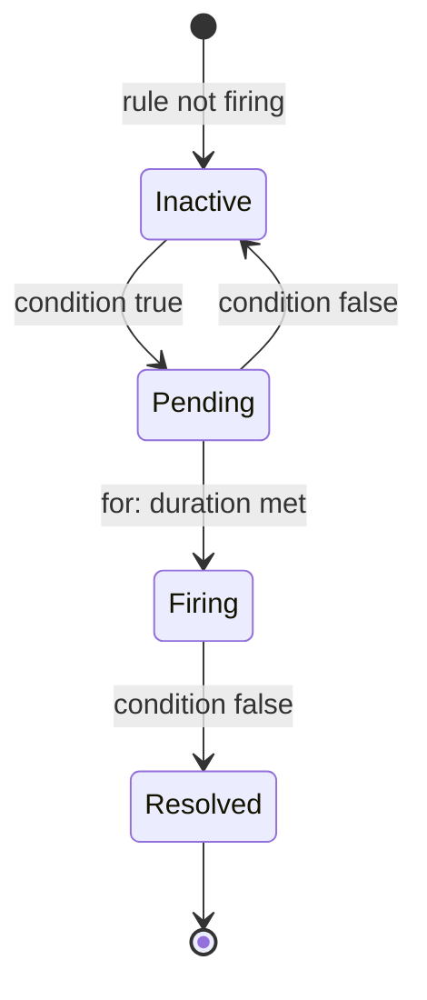
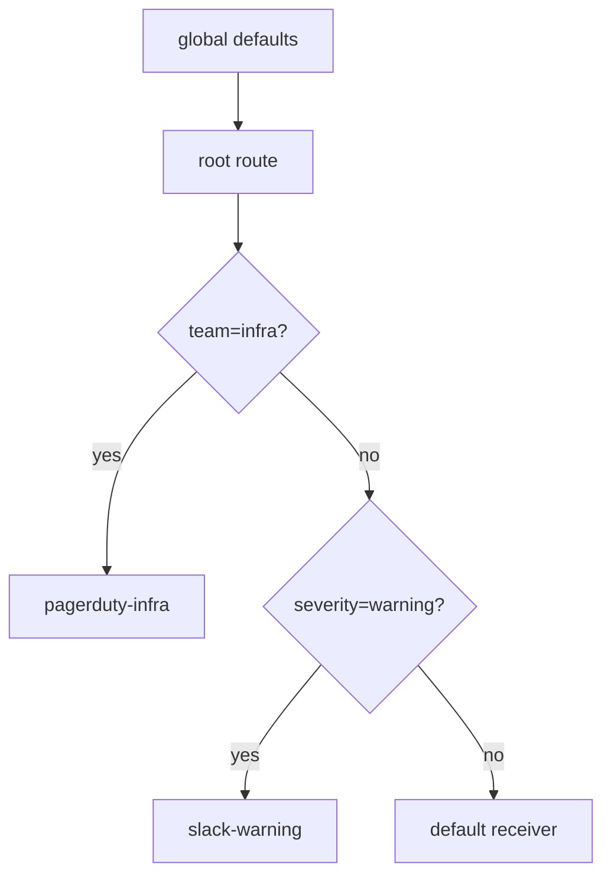

# AlertManager

## 1. Architecture

Prometheus evaluates rules and pushes firing alerts to AlertManager, which deduplicates, groups, routes, and dispatches notifications.



## 2. Alert Lifecycle

An alert transitions through states based on the `for:` duration in the rule and whether it resolves.



| State | Meaning |
|-------|---------|
| Inactive | Rule condition is false |
| Pending | Condition true, waiting `for:` duration |
| Firing | Duration exceeded — alert sent |
| Resolved | Condition cleared, resolve notification sent |

## 3. Routing Tree

Routes are evaluated top-down; first match wins. Each route can override `receiver`, `group_by`, and timing.



**Config example:**

```yaml
route:
  receiver: default-receiver
  group_by: [alertname, cluster]
  group_wait: 30s
  group_interval: 5m
  repeat_interval: 4h
  routes:
    - matchers:
        - severity = critical
      receiver: pagerduty-critical
      continue: false
    - matchers:
        - severity = warning
      receiver: slack-warning
```

## 4. Grouping

| Parameter | Purpose | Typical Value |
|-----------|---------|---------------|
| `group_by` | Labels that form a notification group | `[alertname, cluster, namespace]` |
| `group_wait` | Wait before sending first notification | `30s` |
| `group_interval` | Wait before sending added/resolved alerts | `5m` |
| `repeat_interval` | Re-notify if still firing | `4h` |

Grouping prevents alert storms: 100 pods failing → 1 grouped notification.

## 5. Inhibition

Suppress derived/symptom alerts when the root cause is already firing. Inhibition rules match a **source** alert and silence matching **target** alerts.

```yaml
inhibit_rules:
  - source_matchers:
      - alertname = "NodeDown"
    target_matchers:
      - alertname =~ "Pod.*"
    equal: [cluster, node]
```

If `NodeDown` fires for `node=worker-1`, all `Pod*` alerts on the same node are silenced.

## 6. Silences

Silences mute alerts matching a set of matchers for a time window. Created via UI or `amtool`.

**Types:**

| Type | Example use |
|------|-------------|
| Time-based | Maintenance window (Sat 02:00–04:00) |
| Matcher-based | Mute specific service during deploy |

```bash
# Create silence for 2 hours on a specific service
amtool silence add alertname="HighErrorRate" service="payments" \
  --duration=2h --comment="Deploying payments v2.3"

# List active silences
amtool silence query

# Expire a silence
amtool silence expire <silence-id>
```

## 7. Complete alertmanager.yml

```yaml
global:
  resolve_timeout: 5m
  smtp_smarthost: 'smtp.example.com:587'
  smtp_from: 'alertmanager@example.com'
  smtp_auth_username: 'alertmanager'
  smtp_auth_password: 'secret'
  pagerduty_url: 'https://events.pagerduty.com/v2/enqueue'

templates:
  - '/etc/alertmanager/templates/*.tmpl'

route:
  receiver: default-email
  group_by: [alertname, cluster, namespace]
  group_wait: 30s
  group_interval: 5m
  repeat_interval: 4h
  routes:
    - matchers:
        - severity = critical
      receiver: pagerduty-critical
      group_wait: 10s
      repeat_interval: 1h
      continue: false

    - matchers:
        - severity = warning
      receiver: slack-warning
      group_wait: 1m
      repeat_interval: 8h
      continue: false

    - matchers:
        - alertname = Watchdog
      receiver: null-receiver

receivers:
  - name: null-receiver

  - name: pagerduty-critical
    pagerduty_configs:
      - routing_key: '<PAGERDUTY_INTEGRATION_KEY>'
        description: '{{ template "pagerduty.default.description" . }}'
        severity: critical
        details:
          firing: '{{ .Alerts.Firing | len }}'
          cluster: '{{ .CommonLabels.cluster }}'

  - name: slack-warning
    slack_configs:
      - api_url: 'https://hooks.slack.com/services/XXX/YYY/ZZZ'
        channel: '#alerts-warning'
        title: '[{{ .Status | toUpper }}] {{ .CommonLabels.alertname }}'
        text: >-
          {{ range .Alerts }}
          *Alert:* {{ .Annotations.summary }}
          *Severity:* {{ .Labels.severity }}
          *Details:* {{ range .Labels.SortedPairs }} {{ .Name }}={{ .Value }} {{ end }}
          {{ end }}
        send_resolved: true

  - name: default-email
    email_configs:
      - to: 'oncall@example.com'
        send_resolved: true

inhibit_rules:
  - source_matchers:
      - severity = critical
    target_matchers:
      - severity = warning
    equal: [alertname, cluster, namespace]

  - source_matchers:
      - alertname = NodeDown
    target_matchers:
      - alertname =~ "Pod.*"
    equal: [node]
```

## 8. Debugging

**Config validation:**
```bash
amtool check-config /etc/alertmanager/alertmanager.yml
```

**Query active alerts:**
```bash
# All firing alerts
amtool alert query

# Filter by label
amtool alert query severity=critical

# Against a specific AlertManager
amtool alert query --alertmanager.url=http://alertmanager:9093
```

**API endpoints:**
```bash
# List all alerts (v2 API)
curl http://alertmanager:9093/api/v2/alerts | jq .

# List active silences
curl http://alertmanager:9093/api/v2/silences | jq .

# AlertManager status
curl http://alertmanager:9093/api/v2/status | jq .

# Reload config (SIGHUP or POST)
curl -X POST http://alertmanager:9093/-/reload
```

**Common issues:**

| Problem | Check |
|---------|-------|
| Alerts not routing | `amtool config routes test severity=critical` |
| Silence not working | Verify matcher syntax with `amtool silence query` |
| No notifications sent | Check `amtool alert query` — alert must be in AM first |
| Config errors on reload | `amtool check-config` before applying |
