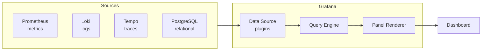
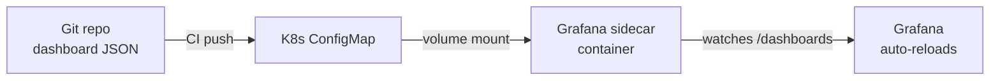

# Grafana

## 1. Architecture & Data Sources

Grafana is a visualization layer that queries data sources and renders panels. It does not store metrics — it proxies queries to backends.



| Data Source | Query Language | Best For |
|-------------|---------------|---------|
| Prometheus | PromQL | Metrics, counters, gauges |
| Loki | LogQL | Log streams, structured logs |
| Tempo | TraceQL | Distributed traces, spans |
| PostgreSQL | SQL | Business data, audit logs |

## 2. Panel Types

| Panel | Use When |
|-------|---------|
| Time series | Metrics over time (latency, RPS, CPU) |
| Stat | Single current value with threshold color |
| Gauge | Value within a min/max range (SLO burn) |
| Table | Multi-dimensional comparison, top-N |
| Heatmap | Latency distribution over time |
| Logs | Log stream output from Loki |

**Picking the right panel:**
- Trending over time → Time series
- "Is it OK right now?" → Stat or Gauge
- "Which pods are slowest?" → Table
- "Where are latency outliers?" → Heatmap
- "What did the app log?" → Logs

## 3. Variables

Variables make dashboards reusable across environments, clusters, and services.

```
Dashboard URL: /d/abc?var-cluster=prod&var-namespace=payments
```

**Query variable** — populated from a data source:
```promql
# Variable: cluster
# Query (Prometheus label_values):
label_values(kube_node_info, cluster)
```

**Custom variable** — static list:
```
name: env
values: dev,staging,prod
```

**Interval variable** — for `$__interval` in rate() calls:
```
name: interval
values: 1m,5m,10m,30m
auto: true
```

Use in panels:
```promql
rate(http_requests_total{cluster="$cluster", namespace="$namespace"}[$interval])
```

## 4. USE Method Dashboard

Per resource (CPU, memory, disk, network):

| Row | Metric | PromQL sketch |
|-----|--------|--------------|
| Utilization | % busy | `rate(node_cpu_seconds_total{mode!="idle"}[5m])` |
| Saturation | Run-queue / pressure | `node_pressure_cpu_waiting_seconds_total` |
| Errors | Hardware / kernel errors | `node_disk_io_time_seconds_total` |

**Layout (4 rows × 3 panels):**
```
[CPU Util]  [CPU Saturation]  [CPU Errors]
[Mem Util]  [Mem Saturation]  [OOM Kills ]
[Disk Util] [Disk Saturation] [Disk Errors]
[Net Util]  [Net Saturation]  [Net Errors ]
```

Each panel uses `$node` variable to filter by host.

## 5. RED Method Dashboard

Per service/endpoint:

| Panel | Metric | PromQL sketch |
|-------|--------|--------------|
| Rate | Requests/sec | `sum(rate(http_requests_total[$interval])) by (service)` |
| Errors | Error rate % | `sum(rate(http_requests_total{status=~"5.."}[$interval])) / sum(rate(http_requests_total[$interval]))` |
| Duration | P50/P95/P99 latency | `histogram_quantile(0.99, sum(rate(http_request_duration_seconds_bucket[$interval])) by (le, service))` |

**Layout:**
```
[RPS - all services (time series)]
[Error Rate % (time series)]        [Top errors by service (table)]
[P50 latency] [P95 latency] [P99 latency]
```

## 6. SLO Dashboard

```
SLO: 99.9% availability over 30-day rolling window
Error budget: 0.1% = ~43 minutes/month
```

| Panel | Formula |
|-------|---------|
| Availability % | `1 - (errors / total)` over 30d |
| Error budget remaining | `budget_total - errors_consumed` |
| Burn rate (1h) | `error_rate_1h / (1 - SLO_target)` |
| Burn rate (6h) | same, 6h window |
| Budget exhaustion forecast | linear projection |

**Burn rate thresholds (Google SRE):**

| Window | Burn rate | Action |
|--------|-----------|--------|
| 1h | > 14x | Page immediately |
| 6h | > 6x | Page |
| 3d | > 1x | Ticket |

```promql
# 1-hour burn rate
(
  sum(rate(http_requests_total{status=~"5.."}[1h]))
  /
  sum(rate(http_requests_total[1h]))
) / (1 - 0.999)
```

## 7. Provisioning Dashboards as Code



**ConfigMap:**
```yaml
apiVersion: v1
kind: ConfigMap
metadata:
  name: grafana-dashboards
  labels:
    grafana_dashboard: "1"   # sidecar watches this label
data:
  red-dashboard.json: |
    { "title": "RED Dashboard", ... }
```

**Grafana Helm values:**
```yaml
grafana:
  sidecar:
    dashboards:
      enabled: true
      label: grafana_dashboard
      searchNamespace: ALL
  datasources:
    datasources.yaml:
      apiVersion: 1
      datasources:
        - name: Prometheus
          type: prometheus
          url: http://prometheus-server:9090
          isDefault: true
        - name: Loki
          type: loki
          url: http://loki:3100
```

Grafana sidecar watches all ConfigMaps with `grafana_dashboard: "1"` and hot-reloads dashboards without restart.

## 8. Alerting

Grafana-native alerting (Grafana 9+) replaces the old panel-level alerts.

**Components:**

| Component | Role |
|-----------|------|
| Alert rule | PromQL/LogQL condition with `for:` duration |
| Contact point | Destination (Slack, PagerDuty, email, webhook) |
| Notification policy | Routes alerts to contact points by labels |
| Silence | Mutes matching alerts for a time range |

**Contact point (Slack):**
```yaml
# provisioning/alerting/contact-points.yaml
apiVersion: 1
contactPoints:
  - orgId: 1
    name: slack-oncall
    receivers:
      - uid: slack-oncall-uid
        type: slack
        settings:
          url: 'https://hooks.slack.com/services/XXX/YYY/ZZZ'
          recipient: '#alerts'
          title: '{{ .CommonLabels.alertname }}'
```

**Notification policy:**
```yaml
# provisioning/alerting/notification-policies.yaml
apiVersion: 1
policies:
  - orgId: 1
    receiver: slack-oncall
    group_by: [alertname, cluster]
    routes:
      - receiver: pagerduty-critical
        matchers:
          - severity = critical
```

**Alert rule (provisioning):**
```yaml
apiVersion: 1
groups:
  - orgId: 1
    name: RED Alerts
    folder: SRE
    interval: 1m
    rules:
      - title: High Error Rate
        condition: C
        for: 5m
        labels:
          severity: warning
        annotations:
          summary: "Error rate above 1% for {{ $labels.service }}"
        data:
          - refId: A
            datasourceUid: prometheus
            model:
              expr: sum(rate(http_requests_total{status=~"5.."}[5m])) by (service)
          - refId: C
            datasourceUid: __expr__
            model:
              type: threshold
              conditions:
                - evaluator: { params: [0.01], type: gt }
                  query: { params: [A] }
```
