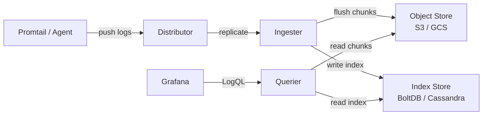

# Loki Log Aggregation

## 1. Architecture



**vs Elasticsearch:** Loki stores raw log lines as compressed chunks — no full-text index. Queries filter by labels first, then grep log content. Much cheaper storage; slower ad-hoc text search.

| | Loki | Elasticsearch |
|---|---|---|
| Index | Labels only | Full-text (inverted index) |
| Storage cost | Low (S3/GCS) | High |
| Query speed | Fast on label filters | Fast on any field |
| Schema | Schema-free | Mapping required |

---

## 2. Labels vs Log Content

```mermaid
flowchart TD
    Q[LogQL Query] --> L{Label selector}
    L -->|narrows stream| S[Log stream<br/>job=api, ns=prod]
    S --> F[Filter log content<br/>|= error]
    F --> R[Results]

    style L fill:#2d6a4f,color:#fff
    style F fill:#1d3557,color:#fff
```

**Good labels** (low cardinality):
- `job`, `namespace`, `pod`, `env`, `level`

**Bad labels** (high cardinality — avoid!):
- `request_id`, `user_id`, `trace_id`, `ip`

High-cardinality labels = millions of streams = Loki OOM / slow queries. Put these values in log content, not labels.

---

## 3. LogQL

### Log queries (filter streams)
```logql
# All error logs from api jobs
{job=~"api.*"} |= "error"

# Exclude health checks, parse JSON, filter status
{namespace="prod"} != "healthz" | json | status >= 500

# Pattern parser
{job="nginx"} | pattern `<ip> - - [<ts>] "<method> <path> <_>" <status> <_>`

# Logfmt parser
{job="app"} | logfmt | level="error" | duration > 1s
```

### Metric queries (aggregate over time)
```logql
# Request rate per job
rate({job="api"}[5m])

# Error rate percentage
sum(rate({job="api"} |= "error" [5m])) / sum(rate({job="api"}[5m])) * 100

# 99th percentile latency (from parsed field)
quantile_over_time(0.99, {job="api"} | json | unwrap latency_ms [5m])
```

### Parsers summary
| Parser | Use case |
|---|---|
| `json` | Structured JSON logs |
| `logfmt` | `key=value` format |
| `pattern` | Fixed positional format |
| `regexp` | Custom regex with named groups |

---

## 4. Promtail Config

```yaml
server:
  http_listen_port: 9080

positions:
  filename: /tmp/positions.yaml

clients:
  - url: http://loki:3100/loki/api/v1/push

scrape_configs:
  - job_name: app-logs
    static_configs:
      - targets: [localhost]
        labels:
          job: app
          env: prod
          __path__: /var/log/app/*.log

    pipeline_stages:
      # 1. Parse JSON from log line
      - json:
          expressions:
            level: level
            msg: message
            ts: timestamp

      # 2. Promote parsed fields to labels
      - labels:
          level:

      # 3. Parse timestamp
      - timestamp:
          source: ts
          format: RFC3339

      # 4. Replace log output with just the message
      - output:
          source: msg
```

**Pipeline stage order:** `json/regex` → `labels` → `timestamp` → `output`

---

## 5. Retention and Storage

```
chunks (compressed log data)  →  S3 / GCS / filesystem
index (label → chunk mapping) →  BoltDB Shipper (single-node)
                                  Cassandra / BigTable (cluster)
```

**Retention config (loki.yaml):**
```yaml
limits_config:
  retention_period: 30d   # global default

compactor:
  retention_enabled: true
  working_directory: /loki/compactor
  shared_store: s3
```

Per-tenant retention via `overrides` if multi-tenant.

---

## 6. Correlating Logs with Traces

In Grafana, add a **derived field** to the Loki datasource:

1. Datasource → Loki → Derived Fields
2. **Regex:** `trace_id=(\w+)`
3. **Name:** `TraceID`
4. **URL:** `http://tempo:3200/trace/${__value.raw}`

Now every log line with `trace_id=abc123` gets a clickable link to Tempo. Works with any tracing backend (Tempo, Jaeger, Zipkin).

```logql
# Find the trace_id in logs first
{job="api"} | json | trace_id != ""
```
