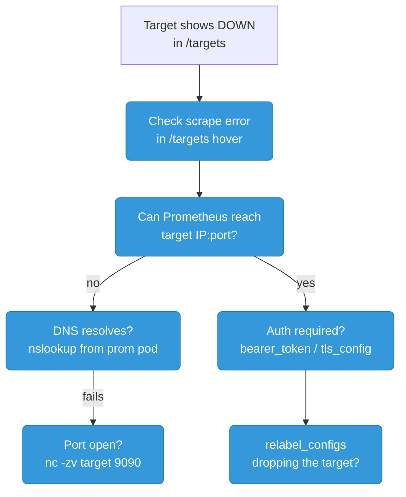
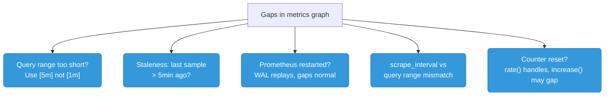
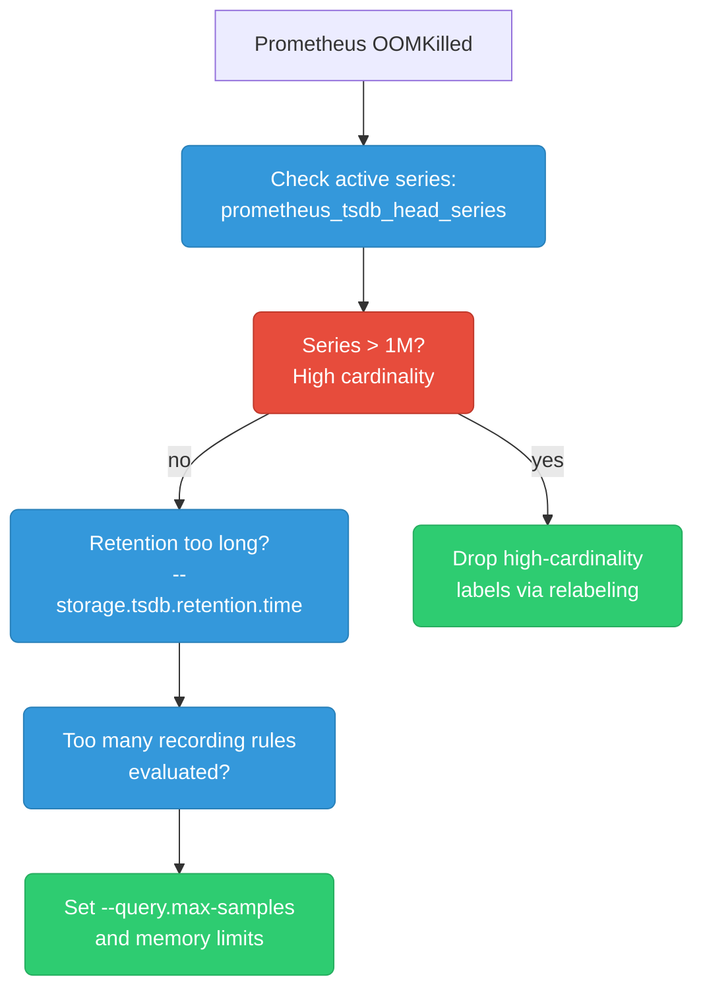
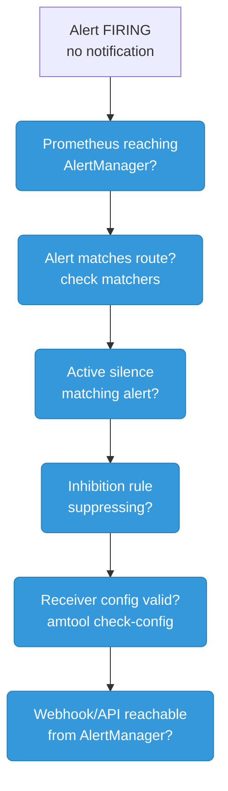
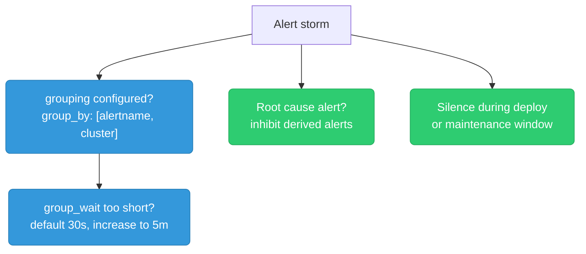
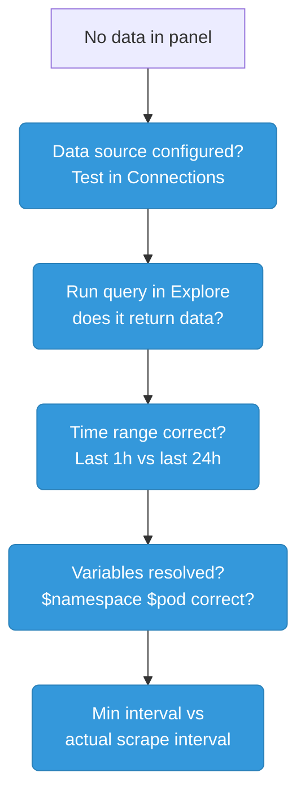
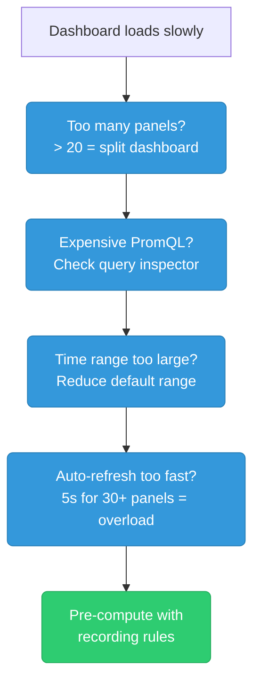
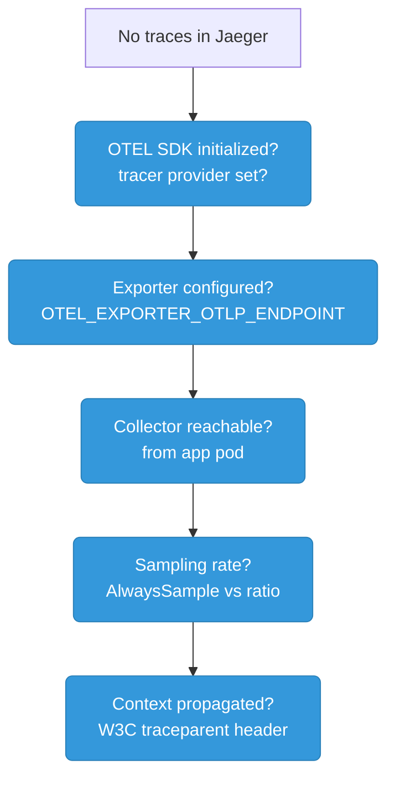
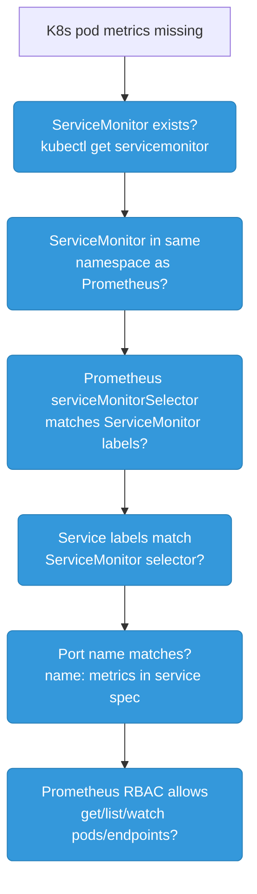

# Monitoring & Observability Debugging Scenarios

---

## Prometheus: Target Shows as DOWN

**Symptom:** Prometheus UI `/targets` shows a target as `DOWN`. No metrics from that service.



```bash
# Check error message on target (hover over error in /targets)
# Common errors:
# "connection refused"    → app not running on that port
# "context deadline exceeded" → scrape_timeout too short or app slow
# "tls: certificate"      → TLS config mismatch
# "401 Unauthorized"      → missing bearer_token or basic_auth

# Test scrape manually from Prometheus pod
kubectl exec -n monitoring deploy/prometheus -- \
  wget -qO- http://my-service:8080/metrics | head -20

# Check if ServiceMonitor selector matches service labels
kubectl get servicemonitor -n monitoring my-app -o yaml | grep selector
kubectl get svc -n my-app --show-labels

# Check Prometheus config for the job
kubectl exec -n monitoring deploy/prometheus -- \
  wget -qO- http://localhost:9090/api/v1/targets | jq '.data.activeTargets[] | select(.health=="down")'
```

**Prevention:** Add a `BlackboxProber` synthetic probe to catch targets going down before Prometheus scrape fails. Use `up == 0` as a P2 alert with `for: 5m`. In K8s: ensure ServiceMonitor `namespaceSelector` and `selector` are correct in staging before prod deploy — `up` going to 0 after a deploy means something regressed in the `/metrics` endpoint.

---

## Prometheus: Metrics Missing / Gaps in Graphs

**Symptom:** Graph shows gaps or `no data` even though the target is UP.



```promql
-- Check if target is being scraped
up{job="my-app"}

-- Check last scrape time
scrape_duration_seconds{job="my-app"}

-- Check for counter resets
resets(http_requests_total{job="my-app"}[1h])

-- Verify metric exists at all
{__name__=~"http_requests.*", job="my-app"}
```

**Common cause:** `rate()` with a range window smaller than `2 × scrape_interval`. If scrape is every 30s, use `[2m]` minimum, not `[1m]`.

```yaml
# Fix: align query range with scrape interval
# scrape_interval: 30s → use [2m] or [5m] in rate()
# scrape_interval: 60s → use [5m] in rate()
```

**Prevention:** Standardize on a single `scrape_interval` cluster-wide (30s recommended). Document the rule: always use `rate()[Xm]` where X ≥ 2 × scrape_interval. Add recording rules for the most-used `rate()` expressions — recording rules pre-compute at consistent intervals, eliminating scrape-window mismatch gaps.

---

## Prometheus: High Memory / OOM Killed

**Symptom:** Prometheus pod OOMKilled. Memory keeps growing.



```promql
-- Active time series (>1M = investigate)
prometheus_tsdb_head_series

-- Top metrics by series count
topk(10, count by (__name__)({__name__=~".+"}))

-- Memory used by head block
prometheus_tsdb_head_chunks_storage_size_bytes

-- Total chunks in memory
prometheus_tsdb_head_chunks
```

```bash
# Check /tsdb-status in Prometheus UI for top cardinality contributors

# Reduce memory:
# 1. Drop high-cardinality labels with metric_relabel_configs
# 2. Reduce retention: --storage.tsdb.retention.time=15d
# 3. Use recording rules to pre-aggregate before storing
# 4. Increase memory limit and resource requests
```

**Prevention:** Monitor `prometheus_tsdb_head_series` — alert when it exceeds 2M series (typical OOM threshold is 3-4M). Add `metric_relabel_configs` to drop unused high-cardinality metrics at ingest time. Use Thanos or Mimir for long-term storage so Prometheus retention can stay at 2-7 days, reducing TSDB head size.

---

## Prometheus: PromQL Query Slow / Times Out

**Symptom:** Grafana dashboard shows "query timed out" or takes 30s+ to load.

```mermaid
graph TD
    classDef check fill:#3498db,stroke:#2980b9,color:#fff,rx:6
    classDef fix fill:#2ecc71,stroke:#27ae60,color:#fff,rx:6

    START["Query slow or timeout"]
    RANGE["Time range too large?<br/>Reduce to 6h or 24h"]:::check
    REGEX["Regex label matchers?<br/>{__name__=~\".+\"} is brutal"]:::check
    NOINDEX["No index matcher?<br/>Always filter by job/instance"]:::check
    RECORD["Create recording rule<br/>for expensive query"]:::fix
    STEP["Reduce resolution:<br/>increase step interval"]:::fix

    START --> RANGE --> NOINDEX
    START --> REGEX --> RECORD
    START --> STEP
```

```promql
-- BAD: scans all series
rate({__name__=~"http.*"}[5m])

-- GOOD: specific job narrows down
rate(http_requests_total{job="api"}[5m])

-- BAD: huge time range with fine step
-- In Grafana: 90 days range + 15s step = millions of data points

-- Convert expensive query to recording rule:
-- groups:
--   - name: api_rules
--     rules:
--     - record: job:http_requests:rate5m
--       expr: rate(http_requests_total[5m])
```

```bash
# Check query stats in Prometheus UI /query-analysis
# Or enable query logging:
# --query.log-file=/var/log/prometheus/queries.log
```

**Prevention:** Create recording rules for any query used in a dashboard panel or alert rule — dashboards hitting raw high-cardinality `rate()` over long ranges are the #1 cause of slow queries. Use Thanos Query Frontend with query splitting and result caching to handle range queries > 1 day without hammering Prometheus directly.

---

## AlertManager: Alerts Firing But No Notifications

**Symptom:** Alert shows `FIRING` in Prometheus but no Slack/PagerDuty notification received.



```bash
# 1. Check AlertManager received the alert
curl http://alertmanager:9093/api/v2/alerts | jq '.[] | {labels, status}'

# 2. Check active silences
curl http://alertmanager:9093/api/v2/silences | jq '.[] | select(.status.state=="active")'

# 3. Validate config
amtool check-config /etc/alertmanager/alertmanager.yml

# 4. Test routing (which receiver would this alert go to?)
amtool config routes test \
  --config.file=/etc/alertmanager/alertmanager.yml \
  alertname=HighErrorRate severity=critical

# 5. Test notification manually
amtool alert add alertname=TestAlert severity=warning --annotation summary="test"

# 6. Check AlertManager logs
kubectl logs -n monitoring deploy/alertmanager | grep -i "error\|warn\|notify"
```

**Prevention:** Test the full alerting pipeline end-to-end in staging on every change: fire a synthetic alert via `amtool`, verify it routes to the right receiver. Store AlertManager config in Git with CI validation (`amtool config check`). Use `amtool config routes test` to validate routing logic before deploying.

---

## AlertManager: Alert Storm / Too Many Notifications

**Symptom:** Hundreds of notifications firing at once. On-call engineer gets paged for every pod.



```yaml
# Fix: proper grouping
route:
  group_by: ['alertname', 'cluster', 'namespace']
  group_wait: 5m        # wait 5m to collect more alerts before sending
  group_interval: 5m    # wait 5m between updates to same group
  repeat_interval: 4h   # resend if still firing after 4h

  # Fix: inhibit pod alerts when node is down
inhibit_rules:
  - source_matchers: [alertname="NodeDown"]
    target_matchers: [alertname=~"Pod.*"]
    equal: [node]
```

**Prevention:** Design `group_by` with `['alertname', 'cluster', 'service']` from day one — never group by individual pod/instance. Add inhibition rules for every parent-child alert relationship (node down → pod alerts, deployment degraded → individual pod alerts). Set `group_wait: 30s` and `group_interval: 5m` to batch rapid-fire alerts into one notification.

---

## Grafana: Dashboard Shows "No Data"

**Symptom:** Grafana panel shows "No data" even though data exists in Prometheus.



```bash
# Debug in Grafana Explore tab — run raw PromQL query
# Check if variable values are resolving correctly
# Panel → Edit → Query Inspector → show raw request/response

# Common causes:
# 1. Data source URL wrong (http vs https, wrong port)
# 2. Time range doesn't overlap with data
# 3. Variable $job has no value selected (shows "All" but query needs specific value)
# 4. Metric name changed in app and dashboard not updated
# 5. min_interval in panel > scrape_interval → coarsens data away
```

**Prevention:** Use Grafana dashboard-as-code (grafonnet or Terraform grafana provider) — metric name changes in the app trigger a CI check that validates dashboard queries still return data. Pin dashboard variables to specific values in CI snapshot tests. Add `min_interval` equal to your scrape interval in all panels.

---

## Grafana: Dashboard Loads Slowly

**Symptom:** Dashboard takes 30s+ to load. Browser tab spinning.



```bash
# Panel → Edit → Query Inspector → Stats tab shows query time
# Grafana → Settings → Performance: enable query caching

# Fix: recording rule for expensive dashboard query
# Instead of: sum(rate(http_requests_total[5m])) by (service)
# Create: record: service:http_requests:rate5m
#         expr: sum(rate(http_requests_total[5m])) by (service)
# Dashboard uses: service:http_requests:rate5m (instant, no computation)
```

**Prevention:** Every dashboard panel that will be on a TV screen or loaded frequently must use a recording rule — not a raw `rate()` on high-cardinality metrics. Set Grafana `max_data_points` per panel to match expected resolution. Use Thanos Query Frontend with query result caching to serve repeated identical queries from cache.

---

## Loki: Logs Not Appearing

**Symptom:** LogQL query returns no results. Expected logs are missing.

```mermaid
graph TD
    classDef check fill:#3498db,stroke:#2980b9,color:#fff,rx:6
    classDef fix fill:#2ecc71,stroke:#27ae60,color:#fff,rx:6

    START["No logs in Loki"]
    PROMTAIL["Promtail running?<br/>kubectl get pods -n monitoring"]:::check
    TARGETS["Promtail scraping<br/>correct pods?"]:::check
    LABELS["Labels match query?<br/>{namespace=\"prod\"}"]:::check
    PARSE["Log format parsed?<br/>json/logfmt pipeline stage"]:::check
    INGEST["Loki ingester healthy?<br/>check distributor metrics"]:::check

    START --> PROMTAIL --> TARGETS --> LABELS --> PARSE --> INGEST
```

```bash
# Check Promtail targets
kubectl port-forward -n monitoring ds/promtail 9080:9080
curl http://localhost:9080/targets  # shows which pods are being tailed

# Check Promtail logs for errors
kubectl logs -n monitoring ds/promtail | grep -i "error\|warn\|drop"

# Verify labels match your query exactly
# Loki is strict: {namespace="prod"} ≠ {namespace="production"}

# Check if logs are being dropped (rate limit)
kubectl logs -n monitoring deploy/loki | grep "rate limit\|drop"

# Test push directly to Loki
curl -H "Content-Type: application/json" -XPOST \
  http://loki:3100/loki/api/v1/push \
  --data-raw '{"streams":[{"stream":{"job":"test"},"values":[["'$(date +%s%N)'","test log line"]]}]}'

# Then query:
curl "http://loki:3100/loki/api/v1/query_range" \
  --data-urlencode 'query={job="test"}' \
  --data-urlencode 'start='$(date -d '5 minutes ago' +%s%N) \
  --data-urlencode 'end='$(date +%s%N)
```

**Prevention:** Add a log pipeline smoke test in CI: deploy a test pod that writes a known log line, query Loki after 60s and assert the line appears. Monitor `loki_ingester_streams_created_total` and Promtail `promtail_sent_entries_total` — if sent > ingested, pipeline has a drop. Alert on Promtail pod restarts.

---

## Loki: High Cardinality Labels Causing OOM

**Symptom:** Loki OOMKilled or very slow queries. Too many unique label combinations.

```
Bad labels (high cardinality):
  {pod="api-7f8b9c-xk2pq"}     ← pod name changes on every deploy
  {request_id="abc-123"}        ← unique per request
  {user_id="usr_456"}           ← millions of users

Good labels (low cardinality):
  {namespace="prod"}
  {app="api"}
  {env="production"}
  {level="error"}
```

```yaml
# Fix: strip high-cardinality labels in Promtail pipeline
- pipeline_stages:
  - labeldrop:
    - pod          # don't use pod name as label
    - container_id # unique per container instance
  - labels:
      app:         # keep these (low cardinality)
      namespace:
      level:
```

**Prevention:** Enforce a Loki label allowlist in Promtail pipeline config from day one — never expose `container_id`, `pod_ip`, or request-ID-style values as labels. Monitor `loki_ingester_streams_created_total` — alert when unique stream count exceeds 10,000. Review new label additions in code review.

---

## OpenTelemetry: Traces Not Appearing in Jaeger

**Symptom:** App is instrumented but no traces show up in Jaeger/Tempo.



```bash
# Check OTEL env vars in pod
kubectl exec deploy/my-app -- env | grep OTEL

# Required env vars:
# OTEL_EXPORTER_OTLP_ENDPOINT=http://otel-collector:4317
# OTEL_SERVICE_NAME=my-service
# OTEL_TRACES_SAMPLER=parentbased_always_on  (or traceidratio)

# Test collector reachability from app pod
kubectl exec deploy/my-app -- nc -zv otel-collector 4317

# Check collector logs for received/dropped spans
kubectl logs deploy/otel-collector | grep -i "traces\|span\|drop\|error"

# Check collector pipeline config
# receivers: [otlp]  exporters: [jaeger]  pipelines: traces: receivers:[otlp] exporters:[jaeger]

# Enable debug exporter in collector to see spans
# exporters:
#   debug:
#     verbosity: detailed
```

**Prevention:** Add a trace smoke test in CI: send a synthetic span to the collector, query Jaeger API and assert it appears within 30s. Monitor `otelcol_exporter_sent_spans` vs `otelcol_exporter_send_failed_spans` — alert if failed > 0 for > 5 min. Use tail sampling to ensure 100% of error traces are captured regardless of overall sampling rate.

---

## Monitoring Stack: Prometheus Can't Scrape K8s Pods

**Symptom:** Pods exist and are running, but no metrics in Prometheus for them.



```bash
# Check ServiceMonitor exists
kubectl get servicemonitor -A

# Check Prometheus operator has picked it up
kubectl logs -n monitoring deploy/prometheus-operator | grep "ServiceMonitor\|sync"

# Verify selector chain:
# Prometheus.spec.serviceMonitorSelector → ServiceMonitor.metadata.labels
# ServiceMonitor.spec.selector → Service.metadata.labels
# Service.spec.ports[].name → ServiceMonitor.spec.endpoints[].port

# Check Prometheus RBAC
kubectl auth can-i get pods --as=system:serviceaccount:monitoring:prometheus

# View Prometheus config (after operator processes it)
kubectl exec -n monitoring prometheus-0 -- \
  cat /etc/prometheus/config_out/prometheus.env.yaml | grep -A5 "job_name"
```

**Prevention:** Use the Prometheus Operator and define ServiceMonitors alongside each service deployment — scrape config travels with the code, not managed separately. Add a CI check that validates ServiceMonitor selector labels match the Service labels in the same PR. Alert on `absent(up{job="my-service"})` — fires if the job disappears entirely from Prometheus's target list.

---

## Quick Reference: Monitoring Debugging Commands

| Problem | First command | What to look for |
|---------|--------------|-----------------|
| Prometheus target DOWN | Check error in `/targets` UI | `connection refused`, `401`, `timeout` |
| Missing metrics | `up{job="..."}` in PromQL | Returns 0 = scrape failing |
| High memory | `prometheus_tsdb_head_series` | > 1M series = cardinality issue |
| Slow queries | Panel → Query Inspector → Stats | Query time > 5s |
| Alert not notifying | `amtool config routes test` | Which receiver matches |
| Alert storm | Check `group_by` config | Missing grouping keys |
| No Grafana data | Grafana Explore → run query directly | Data source connectivity |
| No Loki logs | Promtail `/targets` endpoint | Pod not being tailed |
| Loki OOM | Check label count | High-cardinality labels |
| No OTEL traces | Check `OTEL_EXPORTER_OTLP_ENDPOINT` | Collector unreachable |
