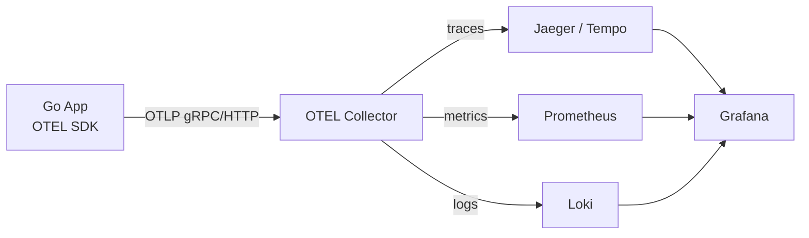
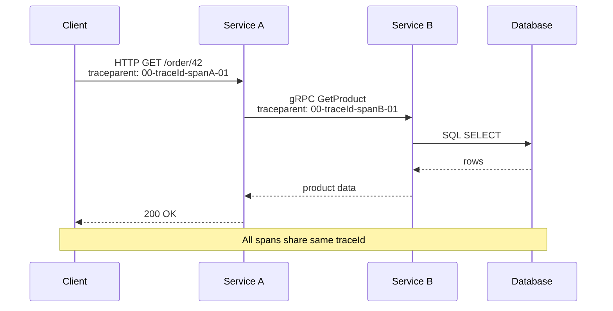
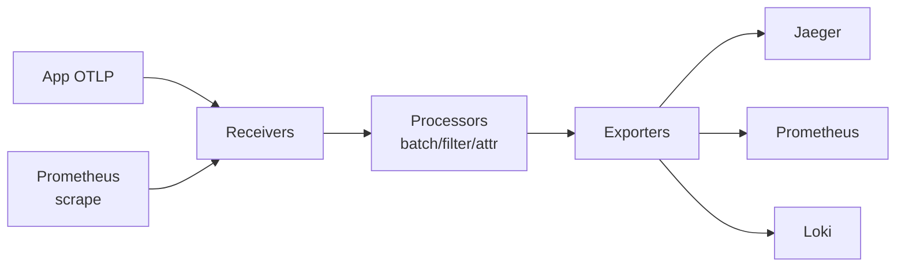

# OpenTelemetry

## Three Pillars

| Signal | What it is | Backend |
|--------|-----------|---------|
| **Traces** | End-to-end request flow across services | Jaeger, Tempo, Zipkin |
| **Metrics** | Numeric measurements over time | Prometheus, Mimir |
| **Logs** | Structured event records | Loki, Elasticsearch |

**Correlation** — inject `trace_id` and `span_id` into structured logs so a log line links back to the exact trace:
```json
{"level":"error","trace_id":"4bf92f3577b34da6","span_id":"00f067aa0ba902b7","msg":"db timeout"}
```

---

## Architecture



---

## Trace Propagation



### Span Anatomy
```
TraceID: 4bf92f3577b34da6a3ce929d0e0e4736
SpanID:  00f067aa0ba902b7
Parent:  a3ce929d0e0e4736   (nil for root span)
Name:    "HTTP GET /order/{id}"
Start:   2024-01-01T10:00:00.000Z
End:     2024-01-01T10:00:00.043Z
Status:  OK
Attributes:
  http.method = GET
  http.url    = /order/42
  http.status_code = 200
Events:
  - name: "cache miss", timestamp: T+2ms
Baggage: user.tier=premium  (propagated to all downstream spans)
```

### Sampling Strategies

| Strategy | How | Use |
|----------|-----|-----|
| **Head (probabilistic)** | Decision at root span; 1-10% sampled | Low overhead, misses rare errors |
| **Head (rate-limiting)** | Max N traces/sec | Predictable cost |
| **Tail** | Buffer all spans; decide after root completes | Can sample 100% of errors |
| **Parent-based** | Inherit parent's sampling decision | Consistent across services |

---

## Metrics: OTEL vs Prometheus

| Aspect | OTEL | Prometheus |
|--------|------|-----------|
| Data model | OTLP (protobuf) | Text exposition |
| Push vs pull | Push (to collector) | Pull (scrape) |
| Histogram | Explicit bounds or exponential | Fixed buckets |
| Exemplars | Built-in (link metrics → trace) | Supported |
| Aggregation | In SDK or collector | In PromQL |
| Temporality | Delta or cumulative | Cumulative only |

OTEL metrics exported via Prometheus exporter endpoint look identical to native Prometheus metrics.

---

## Auto vs Manual Instrumentation

**Auto-instrumentation** — zero-code, wraps stdlib/frameworks:
```go
// HTTP auto-instrumentation via otelhttp
mux := http.NewServeMux()
handler := otelhttp.NewHandler(mux, "my-service")
http.ListenAndServe(":8080", handler)

// Database via otelsql
db, _ = otelsql.Open("postgres", dsn,
    otelsql.WithAttributes(semconv.DBSystemPostgreSQL))
```

**Manual instrumentation** — full control over span names, attributes, events:
```go
ctx, span := tracer.Start(ctx, "processOrder",
    trace.WithAttributes(
        attribute.String("order.id", orderID),
        attribute.Int("order.items", len(items)),
    ),
)
defer span.End()

if err != nil {
    span.RecordError(err)
    span.SetStatus(codes.Error, err.Error())
}
span.AddEvent("payment.processed", trace.WithAttributes(
    attribute.String("payment.method", "card"),
))
```

---

## Go OTEL SDK Example

```go
package main

import (
    "context"
    "log"
    "net/http"
    "time"

    "go.opentelemetry.io/otel"
    "go.opentelemetry.io/otel/attribute"
    "go.opentelemetry.io/otel/exporters/otlp/otlptrace/otlptracegrpc"
    "go.opentelemetry.io/otel/metric"
    "go.opentelemetry.io/otel/sdk/resource"
    sdktrace "go.opentelemetry.io/otel/sdk/trace"
    semconv "go.opentelemetry.io/otel/semconv/v1.21.0"
    "go.opentelemetry.io/contrib/instrumentation/net/http/otelhttp"
    "go.opentelemetry.io/otel/exporters/prometheus"
    sdkmetric "go.opentelemetry.io/otel/sdk/metric"
)

func initTracer(ctx context.Context) (*sdktrace.TracerProvider, error) {
    exp, err := otlptracegrpc.New(ctx,
        otlptracegrpc.WithEndpoint("otel-collector:4317"),
        otlptracegrpc.WithInsecure(),
    )
    if err != nil {
        return nil, err
    }
    res := resource.NewWithAttributes(
        semconv.SchemaURL,
        semconv.ServiceName("order-service"),
        semconv.ServiceVersion("1.0.0"),
    )
    tp := sdktrace.NewTracerProvider(
        sdktrace.WithBatcher(exp),
        sdktrace.WithResource(res),
        sdktrace.WithSampler(sdktrace.ParentBased(
            sdktrace.TraceIDRatioBased(0.1))), // 10% sampling
    )
    otel.SetTracerProvider(tp)
    return tp, nil
}

func initMeter() (*sdkmetric.MeterProvider, error) {
    exp, err := prometheus.New()
    if err != nil {
        return nil, err
    }
    mp := sdkmetric.NewMeterProvider(sdkmetric.WithReader(exp))
    otel.SetMeterProvider(mp)
    return mp, nil
}

func main() {
    ctx := context.Background()

    tp, _ := initTracer(ctx)
    defer tp.Shutdown(ctx)

    mp, _ := initMeter()
    defer mp.Shutdown(ctx)

    tracer := otel.Tracer("order-service")
    meter  := otel.Meter("order-service")

    reqCounter, _ := meter.Int64Counter("http.requests.total",
        metric.WithDescription("Total HTTP requests"))

    latency, _ := meter.Float64Histogram("http.request.duration",
        metric.WithUnit("s"))

    mux := http.NewServeMux()
    mux.HandleFunc("/order", func(w http.ResponseWriter, r *http.Request) {
        start := time.Now()
        ctx, span := tracer.Start(r.Context(), "handle.order",
            trace.WithAttributes(attribute.String("http.method", r.Method)),
        )
        defer span.End()

        // business logic ...
        processOrder(ctx, tracer)

        reqCounter.Add(ctx, 1, metric.WithAttributes(
            attribute.String("method", r.Method),
            attribute.Int("status", 200),
        ))
        latency.Record(ctx, time.Since(start).Seconds())
        w.WriteHeader(http.StatusOK)
    })

    // Wrap with OTEL HTTP middleware (adds server span automatically)
    http.ListenAndServe(":8080", otelhttp.NewHandler(mux, "order-service"))
}

func processOrder(ctx context.Context, tracer trace.Tracer) {
    _, span := tracer.Start(ctx, "processOrder")
    defer span.End()
    time.Sleep(10 * time.Millisecond)
}
```

---

## OTEL Collector Config



```yaml
# otel-collector-config.yaml
receivers:
  otlp:
    protocols:
      grpc:
        endpoint: 0.0.0.0:4317
      http:
        endpoint: 0.0.0.0:4318
  prometheus:
    config:
      scrape_configs:
        - job_name: "self"
          static_configs:
            - targets: ["localhost:8888"]

processors:
  batch:
    timeout: 5s
    send_batch_size: 1024
  memory_limiter:
    limit_mib: 512
  resource:
    attributes:
      - key: env
        value: production
        action: insert
  filter/drop_debug:
    traces:
      span:
        - 'attributes["http.target"] == "/healthz"'

exporters:
  jaeger:
    endpoint: jaeger:14250
    tls:
      insecure: true
  prometheus:
    endpoint: "0.0.0.0:8889"
  loki:
    endpoint: http://loki:3100/loki/api/v1/push
  otlp/tempo:
    endpoint: tempo:4317
    tls:
      insecure: true

service:
  pipelines:
    traces:
      receivers:  [otlp]
      processors: [memory_limiter, filter/drop_debug, batch]
      exporters:  [jaeger, otlp/tempo]
    metrics:
      receivers:  [otlp, prometheus]
      processors: [memory_limiter, batch]
      exporters:  [prometheus]
    logs:
      receivers:  [otlp]
      processors: [batch]
      exporters:  [loki]
```
