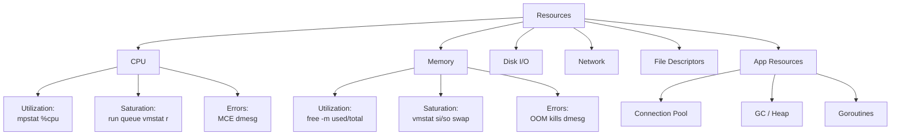
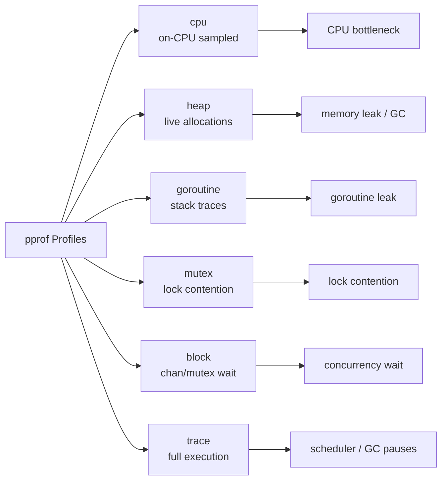

# Performance Debugging Guide

## 1. The USE Method

For every resource: **Utilization**, **Saturation**, **Errors**.

| Resource | Utilization | Saturation | Errors |
|---|---|---|---|
| CPU | `mpstat`, `top` %cpu | run-queue (`vmstat r`) | machine-check errors |
| Memory | `free -m` used/total | swap-in rate (`vmstat si/so`) | OOM kills (`dmesg`) |
| Disk I/O | `iostat %util` | await / queue depth | `iostat` err fields |
| Network | `sar -n DEV` %ifutil | drops (`netstat -s`) | `ip -s link` errors |
| File Descriptors | open/limit ratio | blocked on fd alloc | `EMFILE` errors |
| Goroutines (Go) | active / total | blocked goroutines | panics / timeouts |
| Thread Pool | active threads | pending work queue | rejected tasks |
| DB Conn Pool | active / pool size | waiting-for-conn time | conn refused errors |

```
Utilization  = busy_time / total_time  (aim < 70% sustained)
Saturation   = queue length or wait time (any > 0 is a signal)
Errors       = error events per second
```



---

## 2. The RED Method

For every **service endpoint**: **Rate**, **Errors**, **Duration**.

| Signal | Meaning | Prometheus Metric |
|---|---|---|
| Rate | requests per second | `rate(http_requests_total[5m])` |
| Errors | error rate (4xx/5xx) | `rate(http_requests_total{code=~"5.."}[5m])` |
| Duration | latency percentiles | `histogram_quantile(0.99, rate(http_request_duration_seconds_bucket[5m]))` |

### Implementing RED in Prometheus (Go)

```go
import (
    "github.com/prometheus/client_golang/prometheus"
    "github.com/prometheus/client_golang/prometheus/promauto"
)

var (
    reqTotal = promauto.NewCounterVec(prometheus.CounterOpts{
        Name: "http_requests_total",
        Help: "Total HTTP requests",
    }, []string{"method", "path", "status"})

    reqDuration = promauto.NewHistogramVec(prometheus.HistogramOpts{
        Name:    "http_request_duration_seconds",
        Buckets: prometheus.DefBuckets,
    }, []string{"method", "path"})
)

func Middleware(next http.Handler) http.Handler {
    return http.HandlerFunc(func(w http.ResponseWriter, r *http.Request) {
        start := time.Now()
        rw := &statusRecorder{ResponseWriter: w, status: 200}
        next.ServeHTTP(rw, r)
        dur := time.Since(start).Seconds()
        reqTotal.WithLabelValues(r.Method, r.URL.Path, strconv.Itoa(rw.status)).Inc()
        reqDuration.WithLabelValues(r.Method, r.URL.Path).Observe(dur)
    })
}
```

Prometheus alert rules:
```yaml
- alert: HighErrorRate
  expr: rate(http_requests_total{status=~"5.."}[5m]) / rate(http_requests_total[5m]) > 0.05
  for: 2m

- alert: HighLatencyP99
  expr: histogram_quantile(0.99, rate(http_request_duration_seconds_bucket[5m])) > 1.0
  for: 5m
```

---

## 3. Brendan Gregg 60-Second Linux Checklist

Run these in order. Each takes ~1 second. Total: ~60s.

### `uptime`
```
load average: 1.68, 0.75, 0.39
```
- **Look for**: load average trend. Rising = saturation. Values > CPU count = run-queue saturation.

### `dmesg | tail -20`
- **Look for**: OOM kills (`Out of memory: Kill process`), disk errors (`I/O error`), NIC resets, kernel panics.

### `vmstat 1`
```
r  b   swpd   free   buff  cache   si   so    bi    bo   in   cs us sy id wa st
2  0      0 182932  13340 504936    0    0     0   208 1265 2059 24  5 71  0  0
```
- `r` = run queue (> CPU count = CPU saturation)
- `si/so` = swap in/out (any > 0 = memory pressure)
- `us/sy` = user/kernel CPU time
- `wa` = I/O wait (> 5% = disk bottleneck)

### `mpstat -P ALL 1`
- **Look for**: single CPU at 100% (single-threaded bottleneck), imbalanced CPU usage.

### `pidstat 1`
- **Look for**: which processes consume CPU. `%wait` = off-CPU blocked time.

### `iostat -xz 1`
```
Device  r/s  w/s  rkB/s  wkB/s  await  %util
sda     0.0  8.0    0.0   64.0    2.5   1.2
```
- `%util` > 60% = disk saturation
- `await` = avg I/O latency (ms). > 10ms is notable.
- `r_await` vs `w_await` = separate read/write latency.

### `free -m`
```
             total  used  free  shared  buff/cache  available
Mem:          7982  4516   182     312        3283       2892
```
- **Look for**: `available` near 0 = memory pressure. `swap used` > 0 = swapping.

### `sar -n DEV 1`
- **Look for**: `%ifutil` on network interfaces. Packets/s near NIC limit.

### `sar -n TCP,ETCP 1`
```
active/s  passive/s  iseg/s  oseg/s  | atmptf/s  estres/s  retrans/s
```
- `retrans/s` > 0 = network congestion or packet loss.
- `atmptf/s` = failed TCP connection attempts.

### `top`
- **Look for**: Overall CPU summary, top processes by CPU and MEM. `wa%` for I/O wait. Press `1` for per-CPU view.

---

## 4. Go pprof Profiles

### Profile Types

| Profile | What it measures | When to use |
|---|---|---|
| `cpu` | on-CPU time (sampled at 100Hz) | CPU bottleneck |
| `heap` | live heap allocations | memory leak, GC pressure |
| `goroutine` | goroutine stack traces | goroutine leak |
| `mutex` | mutex contention time | lock bottleneck |
| `block` | blocking on chan/mutex/syscall | concurrency bottleneck |
| `trace` | full execution trace | scheduler, GC pauses |



### Capturing Profiles

**Enable HTTP endpoint** (add to main):
```go
import _ "net/http/pprof"

go func() {
    log.Println(http.ListenAndServe("localhost:6060", nil))
}()
```

**CPU profile (30 seconds)**:
```bash
go tool pprof http://localhost:6060/debug/pprof/profile?seconds=30
# or save to file:
curl -o cpu.prof http://localhost:6060/debug/pprof/profile?seconds=30
go tool pprof cpu.prof
```

**Heap profile**:
```bash
go tool pprof http://localhost:6060/debug/pprof/heap
# inuse_space (default): currently live objects
# alloc_space: all allocations (use -alloc_space flag)
go tool pprof -alloc_space http://localhost:6060/debug/pprof/heap
```

**Goroutine profile**:
```bash
go tool pprof http://localhost:6060/debug/pprof/goroutine
# raw stack dump (human readable):
curl http://localhost:6060/debug/pprof/goroutine?debug=2
```

**Mutex / Block profiles** (must enable first):
```go
runtime.SetMutexProfileFraction(1)  // sample every mutex event
runtime.SetBlockProfileRate(1)       // sample every block event (expensive!)
```
```bash
go tool pprof http://localhost:6060/debug/pprof/mutex
go tool pprof http://localhost:6060/debug/pprof/block
```

**Execution trace**:
```bash
curl -o trace.out http://localhost:6060/debug/pprof/trace?seconds=5
go tool trace trace.out
```

**In-process (benchmark / test)**:
```go
// In a test:
f, _ := os.Create("cpu.prof")
pprof.StartCPUProfile(f)
defer pprof.StopCPUProfile()

// Heap snapshot:
f, _ := os.Create("heap.prof")
pprof.WriteHeapProfile(f)
```

### Reading a Flame Graph

```bash
go tool pprof -http=:8080 cpu.prof
# Opens browser with flame graph at /ui/flamegraph
```

- **X-axis**: alphabetical order (NOT time). Width = % of total samples.
- **Y-axis**: call stack depth. Top frame = leaf (where CPU is spent).
- **Wide boxes at top**: hot functions — investigate these first.
- **`runtime.mallocgc`** wide = allocation pressure.
- **`runtime.gcBgMarkWorker`** wide = GC overhead.
- Use `top10` in pprof CLI to see cumulative vs flat time.
- `flat` = time in function itself. `cum` = time including callees.

---

## 5. bpftrace One-Liners

```bash
# Syscall latency by syscall name (microseconds)
bpftrace -e 'tracepoint:raw_syscalls:sys_enter { @start[tid] = nsecs; }
tracepoint:raw_syscalls:sys_exit /@start[tid]/ {
  @latency_us[probe] = hist((nsecs - @start[tid]) / 1000); delete(@start[tid]); }'

# Disk I/O latency histogram (microseconds)
bpftrace -e 'tracepoint:block:block_rq_issue { @start[args->sector] = nsecs; }
tracepoint:block:block_rq_complete /@start[args->sector]/ {
  @disk_lat_us = hist((nsecs - @start[args->sector]) / 1000);
  delete(@start[args->sector]); }'

# TCP retransmits with source/dest
bpftrace -e 'tracepoint:tcp:tcp_retransmit_skb {
  printf("%s -> %s<br>", ntop(args->saddr), ntop(args->daddr)); }'

# Off-CPU time (blocked time) by stack
bpftrace -e 'tracepoint:sched:sched_switch /prev->state/ {
  @start[prev->pid] = nsecs; }
tracepoint:sched:sched_switch /@start[next->pid]/ {
  @offcpu_us[kstack] = hist((nsecs - @start[next->pid]) / 1000);
  delete(@start[next->pid]); }'
```

---

## 6. Application-Level Debugging

### Connection Pool Saturation

```go
// Expose pool stats as Prometheus gauges
db.SetMaxOpenConns(25)
db.SetMaxIdleConns(5)
db.SetConnMaxLifetime(5 * time.Minute)

// Monitor with:
stats := db.Stats()
// stats.WaitCount     → total waits for connection
// stats.WaitDuration  → total time waited
// stats.MaxIdleClosed → connections closed due to idle limit
// stats.InUse         → currently in use

poolWaiting.Set(float64(stats.WaitCount))
```

Signs of saturation: `WaitDuration` growing, timeouts acquiring connections, `InUse` == `MaxOpenConnections`.

### GC Pressure

```bash
# Enable GC trace
GODEBUG=gctrace=1 ./myapp
# Output: gc 14 @2.345s 3%: 0.5+12+0.3 ms clock, 4+8/12/0+2 ms cpu, 45->48->24 MB, 50 MB goal

# Fields: gc_num  @elapsed  cpu%  stop-the-world+concurrent+stw ms  heap_before->heap_after->live  goal
```

```go
// Read GC stats programmatically
var stats runtime.MemStats
runtime.ReadMemStats(&stats)
// stats.NumGC         → total GC cycles
// stats.PauseNs       → circular buffer of pause times
// stats.HeapInuse     → bytes in in-use spans
// stats.HeapReleased  → bytes returned to OS
```

High GC pressure signals: pause time > 1ms, `NumGC` > 10/sec, heap oscillates wildly.

Fix: reduce allocations (sync.Pool, pre-allocate slices), increase `GOGC` (default 100 = GC when heap doubles).

### Goroutine Leak Detection

```bash
# Check goroutine count over time
curl -s http://localhost:6060/debug/pprof/goroutine?debug=1 | head -5
# goroutine profile: total 4231  ← watch this number grow
```

```go
// In tests, use goleak
import "go.uber.org/goleak"

func TestMyFunc(t *testing.T) {
    defer goleak.VerifyNone(t)
    // test code
}
```

Common leak patterns:
- Channel send/receive with no goroutine on the other end
- `http.Client` request without timeout (blocks on read forever)
- Ticker/Timer never stopped
- goroutine waiting on context that's never cancelled

---

## Debugging Decision Flow

```mermaid
flowchart TD
    START([Symptom reported]) --> Q1{High latency<br/>or low throughput?}
    Q1 -->|Latency| Q2{CPU high?}
    Q1 -->|Throughput| Q3{Error rate high?}

    Q2 -->|Yes| CPU_PROF[CPU pprof<br/>flame graph]
    Q2 -->|No| Q4{I/O wait high?}
    Q4 -->|Yes| DISK[iostat + bpftrace<br/>disk latency]
    Q4 -->|No| Q5{Goroutines growing?}
    Q5 -->|Yes| GR_PROF[goroutine pprof<br/>leak detection]
    Q5 -->|No| BLOCK[block/mutex pprof<br/>contention]

    Q3 -->|Yes| LOGS[Check logs<br/>error details]
    Q3 -->|No| Q6{Memory growing?}
    Q6 -->|Yes| HEAP[heap pprof<br/>alloc_space]
    Q6 -->|No| Q7{Network issues?}
    Q7 -->|Yes| NET[sar + bpftrace<br/>TCP retransmits]
    Q7 -->|No| POOL[Check conn pool<br/>db.Stats()]
```
