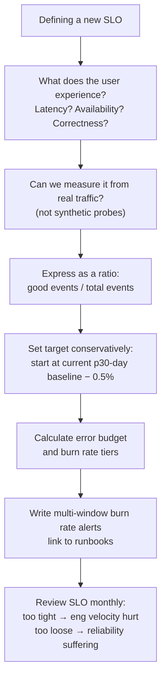

# SLI / SLO / Error Budgets

The Google SRE framework for measuring and managing reliability.

---

## Definitions

| Term | Definition | Example |
|------|-----------|---------|
| **SLI** (Service Level Indicator) | The actual measurement — a ratio of good events to total events | `good_requests / total_requests` |
| **SLO** (Service Level Objective) | The target you commit to — SLI must be ≥ this over a window | 99.9% of requests succeed over 30 days |
| **SLA** (Service Level Agreement) | A contractual SLO with financial penalty if breached | External customer contract |
| **Error Budget** | `(1 - SLO) × window` — how much failure you're allowed | 0.1% × 30 days = 43.2 minutes |

---

## SLI Design

A good SLI is a **ratio**: `valid_good_events / valid_total_events`.

### Availability SLI (most common)

```promql
# SLI: fraction of requests that succeed (non-5xx)
sum(rate(http_requests_total{status!~"5.."}[5m]))
/
sum(rate(http_requests_total[5m]))
```

### Latency SLI

```promql
# SLI: fraction of requests faster than 300ms
sum(rate(http_request_duration_seconds_bucket{le="0.3"}[5m]))
/
sum(rate(http_request_duration_seconds_count[5m]))
```

### Saturation SLI (queue-based)

```promql
# SLI: fraction of time queue depth is below threshold
1 - (
  sum(rate(job_queue_depth_seconds_total{depth!="0"}[5m]))
  / sum(rate(job_queue_depth_seconds_total[5m]))
)
```

### What makes a bad SLI

| Bad SLI | Why bad | Better |
|---------|---------|--------|
| CPU utilization | Doesn't measure user experience | Request latency |
| Internal error count (absolute) | Not normalized, can't set a stable target | Error rate (ratio) |
| "Service is up" (binary) | Not granular, all-or-nothing | % requests succeeding |
| Probe from one region | Misses regional failures | Multi-region probe OR real user traffic |

---

## Error Budget Math

```
Error Budget = (1 - SLO_target) × window_seconds

Example: SLO = 99.9%, window = 30 days
  Error Budget = 0.001 × (30 × 24 × 3600)
               = 0.001 × 2,592,000
               = 2,592 seconds
               = 43.2 minutes
```

**Remaining error budget:**

```promql
# Error budget consumed (last 30 days)
1 - (
  sum(rate(http_requests_total{status!~"5.."}[30d]))
  /
  sum(rate(http_requests_total[30d]))
)

# Budget remaining % (if SLO = 0.999)
(
  (1 - 0.999) - (1 - avg_over_time(sli_availability[30d]))
)
/ (1 - 0.999)
```

---

## Multi-Window Multi-Burn-Rate Alerts

Simple threshold alerts on SLI are noisy. The Google SRE Workbook recommends alerting on **burn rate** — how fast you're consuming the error budget — across two time windows to reduce false positives.

### Burn Rate

```
Burn rate = current_error_rate / (1 - SLO)

SLO = 99.9%  →  (1 - SLO) = 0.001
If current error rate = 0.01 (1%)  →  burn rate = 0.01 / 0.001 = 10x
```

Burn rate **1x** = consuming budget at exactly the SLO pace (budget exhausted at end of window).
Burn rate **14.4x** = entire 30-day budget consumed in **2 hours**.

### The Four Alert Tiers

| Tier | Window | Burn Rate | Budget consumed if burns whole window | Urgency | Action |
|------|--------|-----------|--------------------------------------|---------|--------|
| P1 critical | 1h + 5m | > 14.4x | ~2% (2h alert) | Page immediately | Incident |
| P2 critical | 6h + 30m | > 6x | ~5% (6h alert) | Page | Investigate now |
| P3 warning | 1d + 2h | > 3x | ~10% (1d alert) | Ticket | Next business day |
| P4 info | 3d + 6h | > 1x | >10% | Log | Sprint backlog |

**Why two windows per tier?** Short window = fast detection, high false positive rate. Long window = slow detection, low false positive rate. Both must fire to page.

```yaml
# Example: P1 critical alert (Prometheus alerting rule)
groups:
- name: slo_alerts
  rules:
  - alert: HighErrorBudgetBurn
    expr: |
      (
        job:http_errors:rate1h{job="api"} > (14.4 * 0.001)
        and
        job:http_errors:rate5m{job="api"} > (14.4 * 0.001)
      )
    for: 2m
    labels:
      severity: critical
    annotations:
      summary: "High error budget burn rate (14.4x)"
      description: "Error rate {{ $value | humanizePercentage }} burning budget at 14.4x"
      runbook: "https://wiki/runbooks/api-high-error-rate"

  - alert: MediumErrorBudgetBurn
    expr: |
      (
        job:http_errors:rate6h{job="api"} > (6 * 0.001)
        and
        job:http_errors:rate30m{job="api"} > (6 * 0.001)
      )
    for: 15m
    labels:
      severity: critical
    annotations:
      summary: "Medium error budget burn rate (6x)"
```

### Recording Rules for Burn Rate

Pre-compute error rates at required windows (Prometheus evaluates these on interval, not at query time):

```yaml
groups:
- name: slo_recording_rules
  interval: 30s
  rules:
  # Error rate over each window
  - record: job:http_errors:rate5m
    expr: |
      sum(rate(http_requests_total{status=~"5.."}[5m])) by (job)
      /
      sum(rate(http_requests_total[5m])) by (job)

  - record: job:http_errors:rate30m
    expr: |
      sum(rate(http_requests_total{status=~"5.."}[30m])) by (job)
      /
      sum(rate(http_requests_total[30m])) by (job)

  - record: job:http_errors:rate1h
    expr: |
      sum(rate(http_requests_total{status=~"5.."}[1h])) by (job)
      /
      sum(rate(http_requests_total[1h])) by (job)

  - record: job:http_errors:rate6h
    expr: |
      sum(rate(http_requests_total{status=~"5.."}[6h])) by (job)
      /
      sum(rate(http_requests_total[6h])) by (job)
```

---

## SLO Dashboard (Grafana)

Key panels for an SLO dashboard:

```
Row 1: Current SLI value | Budget remaining % | Budget burn rate
Row 2: Error rate over time (with SLO line)
Row 3: Latency p50/p95/p99 (with SLO threshold line)
Row 4: Request rate (traffic signal — is low SLI low traffic or real errors?)
Row 5: Error budget burn rate over time (alert threshold lines at 1x, 6x, 14.4x)
```

```promql
# Budget remaining (0-1 range, panel threshold: red < 0.1)
(
  (1 - 0.999) - (
    1 - (
      sum(rate(http_requests_total{status!~"5.."}[30d]))
      / sum(rate(http_requests_total[30d]))
    )
  )
) / (1 - 0.999)

# Current burn rate (panel threshold: red > 14.4, orange > 6)
(
  1 - sum(rate(http_requests_total{status!~"5.."}[1h]))
    / sum(rate(http_requests_total[1h]))
) / 0.001
```

---

## SLO Decision Framework



**Common mistake:** Setting SLO at 99.99% before measuring baseline. If your actual baseline is 99.5%, a 99.99% SLO means your error budget is always exhausted and every deploy is blocked.

---

## SLO per Service Type

| Service type | Primary SLI | SLO starting point |
|---|---|---|
| User-facing API | Availability + p99 latency | 99.9% / < 500ms |
| Background job | Completion rate + job duration | 99.5% complete within 1h |
| Data pipeline | Freshness (data age) + completeness | Data < 15min old, 99.9% records |
| Storage | Durability + availability | 99.99% durability, 99.9% availability |
| Internal service | Availability | 99.5% (lower than user-facing) |
