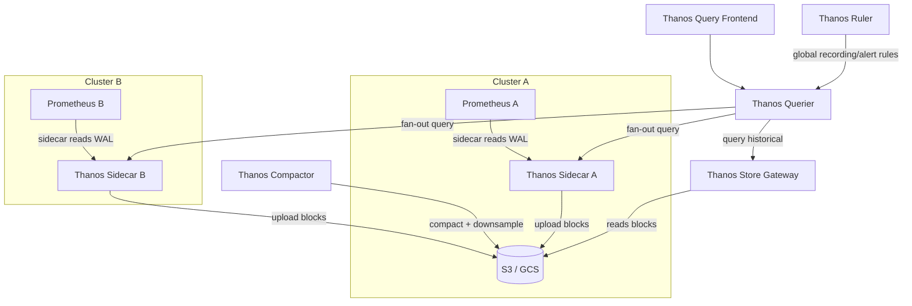
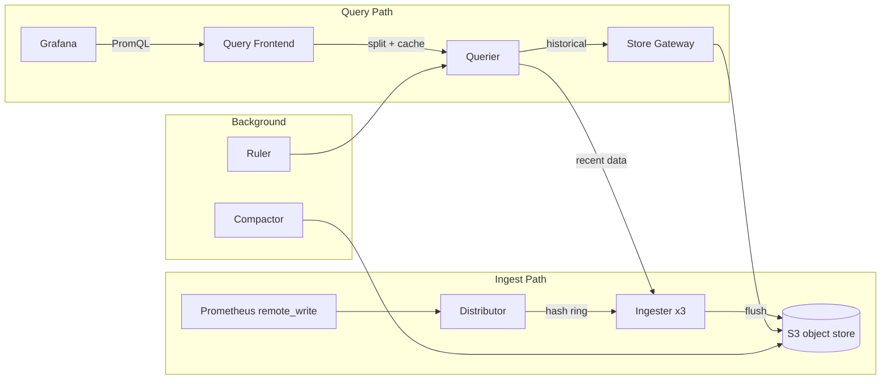

# Thanos and Mimir — Long-Term Metrics Storage

Prometheus stores data locally for 15 days by default. For long-term retention, global query across clusters, and high availability, you need Thanos or Mimir.

---

## The Problem Prometheus Alone Can't Solve

| Problem | Why Prometheus alone fails |
|---------|--------------------------|
| Data older than retention period | TSDB purges it |
| Query across multiple clusters | Each Prometheus is isolated |
| Prometheus HA (2 replicas scraping same targets) | Duplicate series, can't merge |
| Downsampling for long-range queries | Raw data is slow at 1-year range |
| Object storage cost efficiency | Local disk is expensive at scale |

---

## Thanos

Thanos extends Prometheus by adding components that bolt onto existing Prometheus instances.



### Components

| Component | Role |
|-----------|------|
| **Sidecar** | Runs next to each Prometheus. Exposes StoreAPI, uploads TSDB blocks to object storage |
| **Store Gateway** | Reads blocks from object storage, answers queries for historical data |
| **Querier** | Fan-out query engine — merges results from Sidecars + Store Gateway, deduplicates HA replicas |
| **Query Frontend** | Caching + query splitting layer in front of Querier. Splits long-range queries into parallelizable sub-queries |
| **Compactor** | Merges small TSDB blocks, applies downsampling (5m and 1h resolution for old data) |
| **Ruler** | Evaluates recording rules and alert rules globally (across all clusters) |
| **Receive** (alternative) | Push-based ingestion via remote_write — no sidecar needed |

### Deduplication

When two Prometheus replicas scrape the same targets (HA setup), both upload identical data. Thanos Querier deduplicates by matching `replica` label:

```yaml
# Prometheus HA: two replicas, identical config except replica label
global:
  external_labels:
    cluster: production
    replica: "0"   # replica "1" on the other instance
```

```bash
# Query with deduplication
thanos query --query.replica-label=replica
# Querier merges series with identical labels except the replica label
```

### Object Storage Config

```yaml
# thanos-storage-config.yaml (mounted as secret)
type: S3
config:
  bucket: my-thanos-metrics
  endpoint: s3.us-east-1.amazonaws.com
  region: us-east-1
  # Uses IRSA on EKS — no access key needed
```

### Downsampling

Thanos Compactor creates downsampled versions of old data:

| Data age | Resolution | Raw scrape interval |
|----------|-----------|---------------------|
| 0 – 40 hours | Raw (15s) | Kept as-is |
| 40h – 10 days | 5-minute | Aggregated to min/max/sum/count |
| 10 days+ | 1-hour | Further aggregated |

```bash
# Grafana/Thanos auto-selects resolution based on query range
# You can also explicitly request:
# step=5m → Thanos picks 5m downsampled if range > 40h
```

---

## Mimir (Grafana's Prometheus-compatible, horizontally scalable backend)

Mimir is a fully distributed, horizontally scalable TSDB. It implements the Prometheus remote_write and query API — drop-in replacement at scale.



### Key differences vs Thanos

| | Thanos | Mimir |
|-|--------|-------|
| Architecture | Bolt-on to Prometheus | Standalone distributed system |
| Ingest | Sidecar (pull) or Receive (push) | remote_write only (push) |
| Multi-tenancy | No (single tenant) | Yes — tenant per `X-Scope-OrgID` header |
| Horizontal scale | Limited (Querier/Store Gateway) | Full — every component scales independently |
| Consistency | Eventually consistent (block uploads) | Strong — ingester replication factor |
| Operational complexity | Lower (reuses Prometheus) | Higher (many components) |
| Best for | < 5 clusters, < 10M series | > 5 clusters, SaaS, millions of series |

### Mimir Multi-Tenancy

```yaml
# Prometheus remote_write with tenant header
remote_write:
  - url: http://mimir-distributor:8080/api/v1/push
    headers:
      X-Scope-OrgID: "team-platform"
```

```bash
# Query with tenant
curl -H "X-Scope-OrgID: team-platform" \
  "http://mimir-query-frontend:8080/prometheus/api/v1/query?query=up"
```

---

## Choosing Between Them

```
Small-medium (1-5 clusters, < 5M series, < 1 year retention)
  → Thanos with Sidecar + S3 + Store Gateway
  → Simplest to operate, reuses existing Prometheus

Large (5+ clusters, 5-50M series, multi-tenant)
  → Mimir
  → Purpose-built for scale

SaaS / platform team serving many teams
  → Mimir (multi-tenancy built-in)

Already on Grafana Cloud
  → Grafana Mimir (hosted)
```

---

## Hands-on: Thanos on EKS

```bash
# 1. Add external_labels to existing Prometheus ConfigMap
kubectl edit configmap prometheus-config -n monitoring
# Add:
# global:
#   external_labels:
#     cluster: production-us-east-1
#     replica: "0"

# 2. Deploy Thanos Sidecar alongside Prometheus
# (add as second container in Prometheus Deployment)
# - shares /data volume with Prometheus
# - uploads blocks every 2h

# 3. Create S3 bucket for blocks
aws s3 mb s3://my-thanos-blocks --region us-east-1

# 4. Deploy Store Gateway (reads historical from S3)
# 5. Deploy Querier (fan-out to Sidecar + Store Gateway)
# 6. Point Grafana at Thanos Querier instead of Prometheus directly

# Verify blocks are uploading
kubectl logs -n monitoring deployment/thanos-sidecar | grep "uploaded"

# Check Thanos Querier sees all stores
thanos tools bucket inspect \
  --objstore.config-file=storage.yaml \
  --output=table

# Query via Thanos (same PromQL as Prometheus)
curl "http://thanos-querier:9090/api/v1/query?query=up"
```

---

## Retention and Cost

```
Raw Prometheus (15 days, local disk):  $0.10/GB/month (EBS gp3)
Thanos on S3 (1 year):                $0.023/GB/month (S3 Standard)
  + downsampling reduces query cost for old data
  + lifecycle rules: move to S3-IA after 30 days → $0.0125/GB/month

Typical savings: 80-90% vs keeping data on Prometheus local disk
```

```yaml
# S3 lifecycle rule for cost optimization
aws s3api put-bucket-lifecycle-configuration \
  --bucket my-thanos-blocks \
  --lifecycle-configuration '{
    "Rules": [{
      "ID": "move-to-ia",
      "Status": "Enabled",
      "Filter": {"Prefix": ""},
      "Transitions": [{"Days": 30, "StorageClass": "STANDARD_IA"}]
    }]
  }'
```
