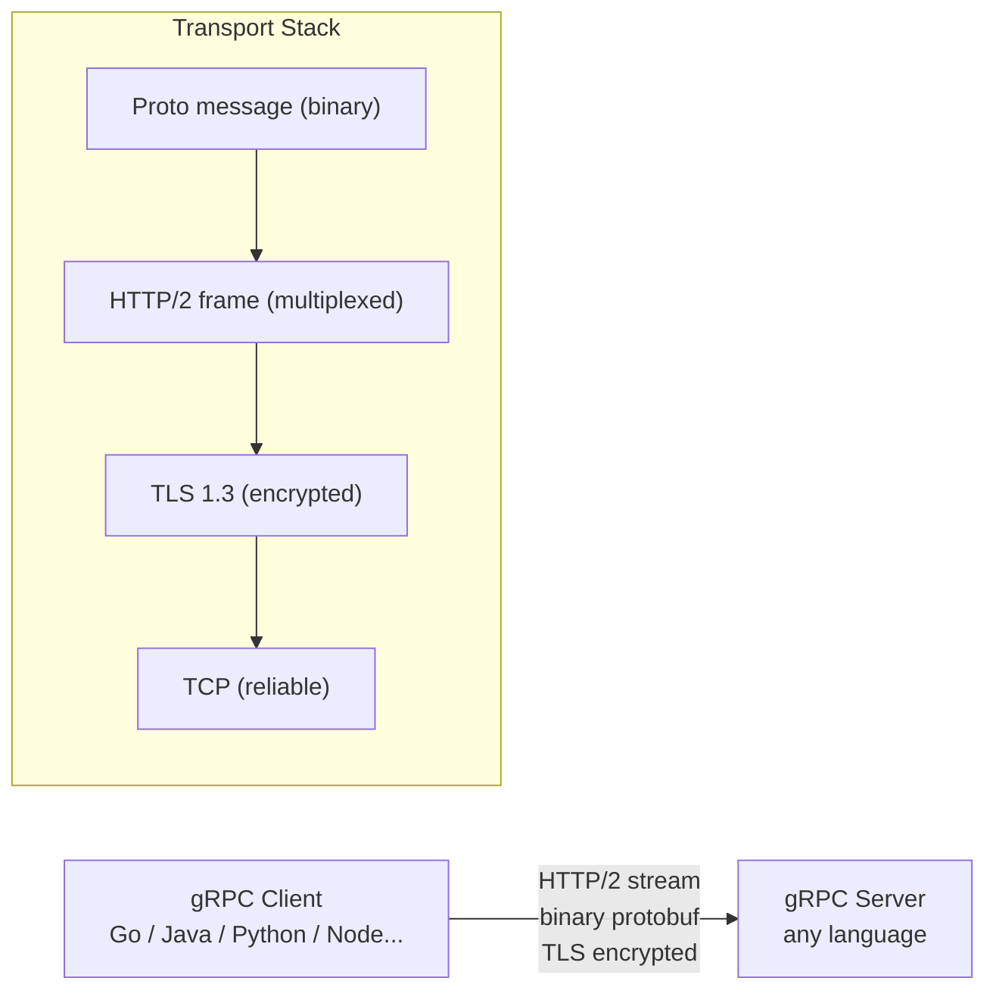
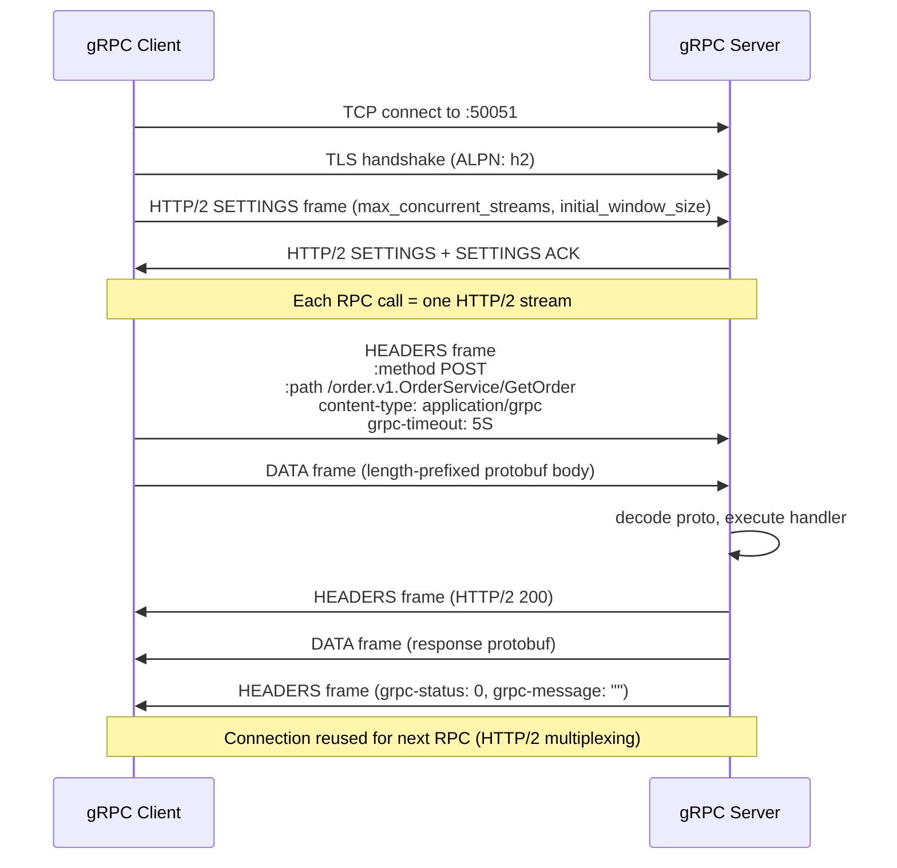
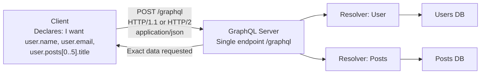
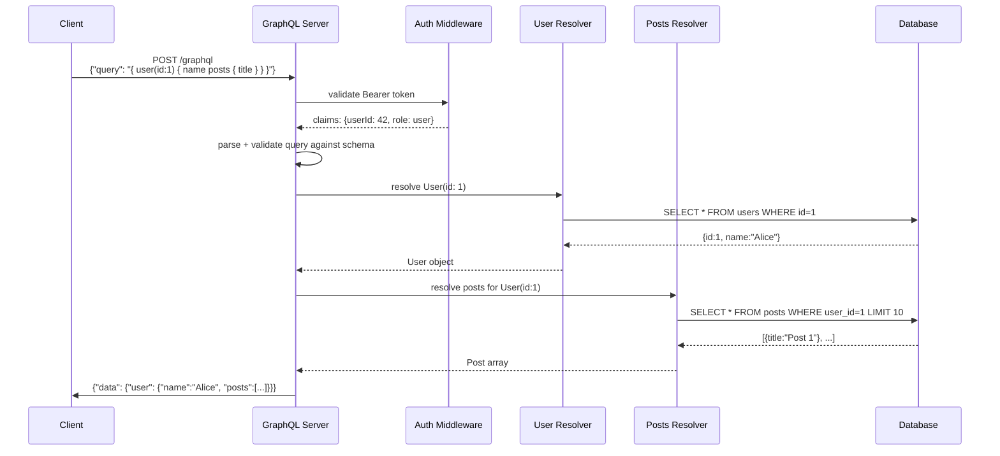
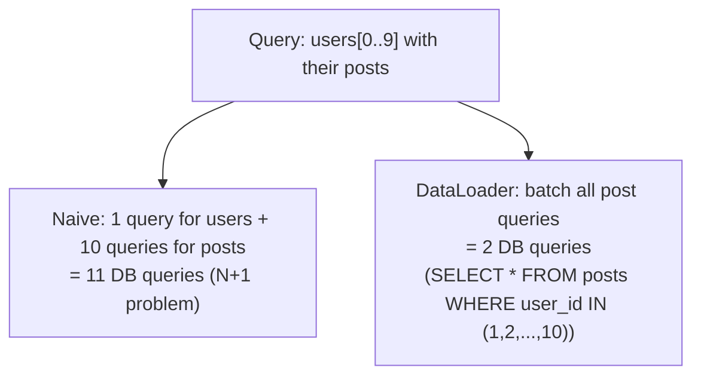

# gRPC and GraphQL

## gRPC

gRPC is a high-performance, open-source RPC framework. Built on **HTTP/2 + Protocol Buffers**. Created by Google, used internally at almost every major tech company.

### Architecture



### Protocol Buffer Encoding

JSON vs Protobuf — same data:

```json
{"userId": "123", "name": "Alice", "age": 30}
JSON: 38 bytes (text)
```

```protobuf
message User {
  string user_id = 1;
  string name = 2;
  int32 age = 3;
}
Protobuf: ~12 bytes (binary, field tags + varints)
```

**Why protobuf is smaller:** Fields encoded as tag-value pairs (`field_number << 3 | wire_type`). No field names in the wire format. Varints use fewer bytes for small numbers.

### Service Definition (.proto)

```protobuf
syntax = "proto3";
package order.v1;

// 4 RPC modes
service OrderService {
  // Unary: one request, one response
  rpc GetOrder(GetOrderRequest) returns (Order);

  // Server streaming: one request, stream of responses
  rpc ListOrders(ListOrdersRequest) returns (stream Order);

  // Client streaming: stream of requests, one response
  rpc BulkCreate(stream CreateOrderRequest) returns (BulkCreateResponse);

  // Bidirectional streaming: both sides stream
  rpc Chat(stream ChatMessage) returns (stream ChatMessage);
}

message GetOrderRequest {
  string order_id = 1;
}

message Order {
  string id = 1;
  string user_id = 2;
  double amount = 3;
  repeated string item_ids = 4;
  google.protobuf.Timestamp created_at = 5;
}
```

```bash
# Generate Go code from .proto
protoc --go_out=. --go-grpc_out=. order.proto
# Generates: order.pb.go (message types) + order_grpc.pb.go (client+server interfaces)
```

### gRPC Connection Flow



### gRPC Status Codes

```
OK (0)                 Success
CANCELLED (1)          Client cancelled the request
UNKNOWN (2)            Server error (unhandled exception)
INVALID_ARGUMENT (3)   Bad input (wrong type, missing field)
DEADLINE_EXCEEDED (4)  Timeout
NOT_FOUND (5)          Resource missing
ALREADY_EXISTS (6)     Conflict
PERMISSION_DENIED (7)  Authenticated but no permission
UNAUTHENTICATED (16)   No auth token
RESOURCE_EXHAUSTED (8) Rate limited
UNAVAILABLE (14)       Server down — safe to retry
INTERNAL (13)          Server bug
```

### gRPC vs REST Comparison

| Feature | REST/JSON | gRPC/Protobuf |
|---------|-----------|---------------|
| Protocol | HTTP/1.1 or HTTP/2 | HTTP/2 only |
| Serialization | Text JSON | Binary Protobuf |
| Schema | Optional (OpenAPI) | Mandatory (.proto) |
| Code generation | Manual / Swagger | `protoc` (both sides) |
| Streaming | SSE or WebSocket workarounds | Native (4 modes) |
| Browser support | Native | Needs grpc-web proxy |
| Payload size | 5-10× larger | Compact |
| Debugging | curl, browser devtools | grpcurl, grpc-ui |
| Best for | Public APIs, browser clients | Internal microservices |

```bash
# Test gRPC endpoints with grpcurl
grpcurl -plaintext localhost:50051 list
grpcurl -plaintext -d '{"order_id":"123"}' \
  localhost:50051 order.v1.OrderService/GetOrder
```

---

## GraphQL

GraphQL is a **query language for APIs** — clients specify exactly what data they need, nothing more.

### Architecture



### Query vs REST Comparison

**REST — over-fetching and under-fetching:**
```http
# Need user name + their 5 latest post titles
GET /users/123          → returns ALL user fields (over-fetch)
GET /users/123/posts    → returns ALL post fields (over-fetch)
                        → 2 round trips (under-fetch of related data)
```

**GraphQL — exactly what you need:**
```graphql
query {
  user(id: "123") {
    name
    email
    posts(limit: 5) {
      title
      publishedAt
    }
  }
}
```

Response:
```json
{
  "data": {
    "user": {
      "name": "Alice",
      "email": "alice@example.com",
      "posts": [
        {"title": "Post 1", "publishedAt": "2024-01-15"},
        {"title": "Post 2", "publishedAt": "2024-01-10"}
      ]
    }
  }
}
```

### Schema Definition Language (SDL)

```graphql
type User {
  id: ID!
  name: String!
  email: String!
  posts(limit: Int = 10, offset: Int = 0): [Post!]!
  createdAt: DateTime!
}

type Post {
  id: ID!
  title: String!
  body: String!
  author: User!
  publishedAt: DateTime
}

type Query {
  user(id: ID!): User
  users(filter: UserFilter): [User!]!
  post(id: ID!): Post
}

type Mutation {
  createUser(input: CreateUserInput!): User!
  updateUser(id: ID!, input: UpdateUserInput!): User!
  deleteUser(id: ID!): Boolean!
}

type Subscription {
  userCreated: User!           # real-time via WebSocket
  orderStatusChanged(orderId: ID!): Order!
}
```

### GraphQL Request Flow



### N+1 Problem and DataLoader



### GraphQL vs REST vs gRPC

| | REST | GraphQL | gRPC |
|--|------|---------|------|
| Query flexibility | Fixed endpoints | Client-defined queries | Fixed methods |
| Over-fetching | Common | Impossible | Impossible |
| Schema | Optional | Mandatory | Mandatory (.proto) |
| Real-time | SSE / WebSocket | Subscriptions over WS | Bidirectional streaming |
| Caching | HTTP cache headers | Complex (POST, persisted queries) | Per-method, application-level |
| Browser support | Native | Native | Needs grpc-web |
| Best for | Simple CRUD, public APIs | Complex data graphs, mobile | Internal high-performance services |
