# HTTP — Client-Server Communication, Versions, Methods, Headers

## HTTP Client-Server: What Actually Happens

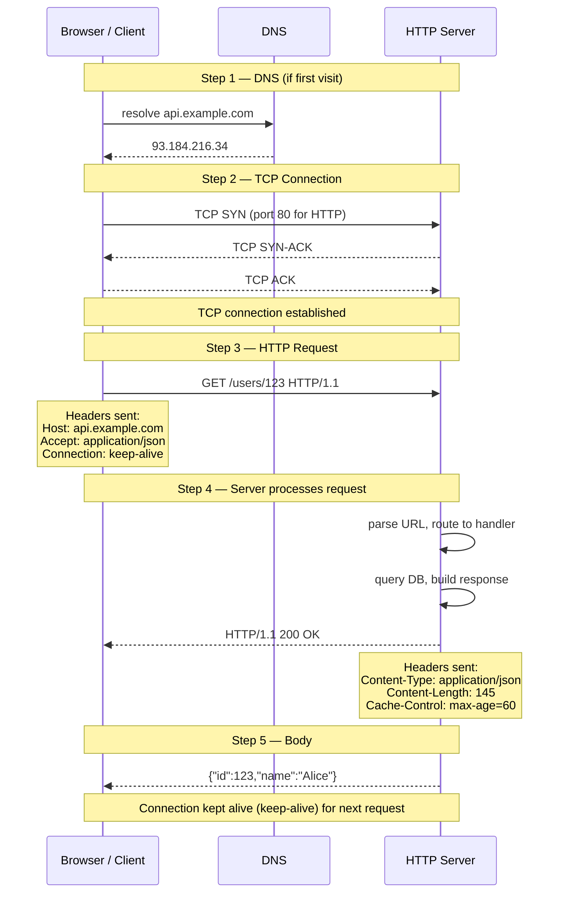

## HTTPS: Adding TLS Between TCP and HTTP

Plain HTTP sends everything as readable text — anyone on the network can read your passwords, cookies, and data. HTTPS wraps HTTP inside a TLS tunnel so all data is encrypted.

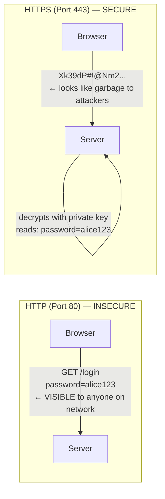

**What HTTPS adds on top of HTTP:**

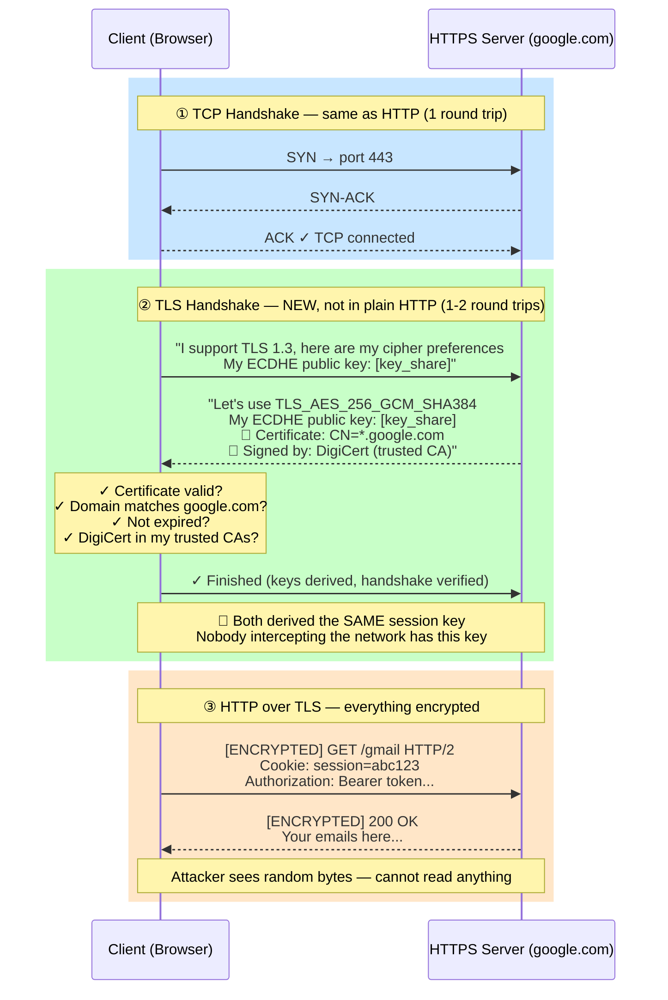

**The role of public and private keys:**

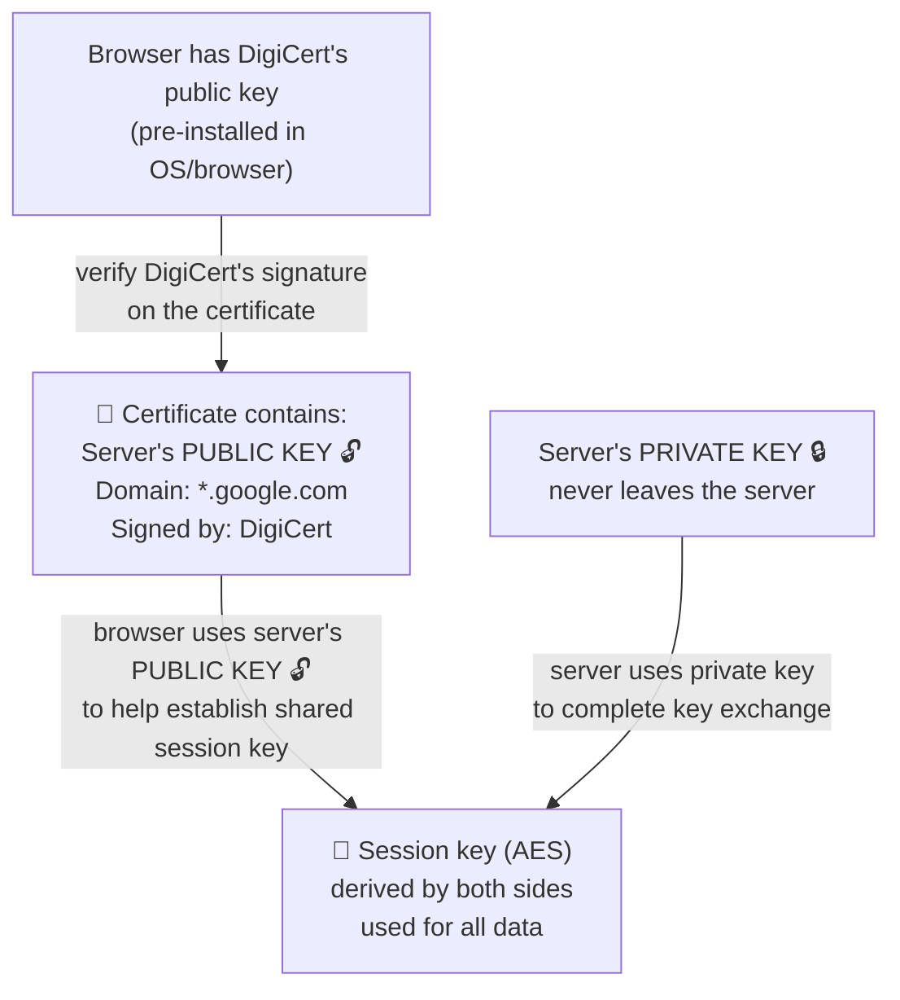


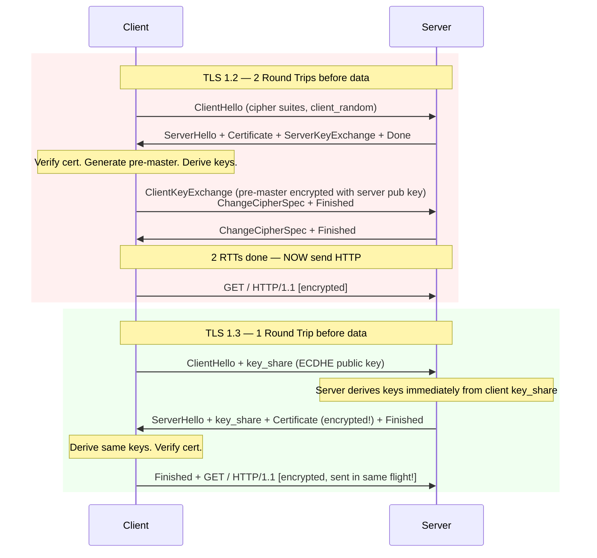

**Why TLS 1.3 is faster:**
- TLS 1.2: client must wait for server cert before deriving keys → 2 RTTs
- TLS 1.3: client sends its ECDHE key_share upfront → server derives keys in first message → **1 RTT**
- TLS 1.3 also encrypts the certificate (TLS 1.2 cert is plaintext on the wire)


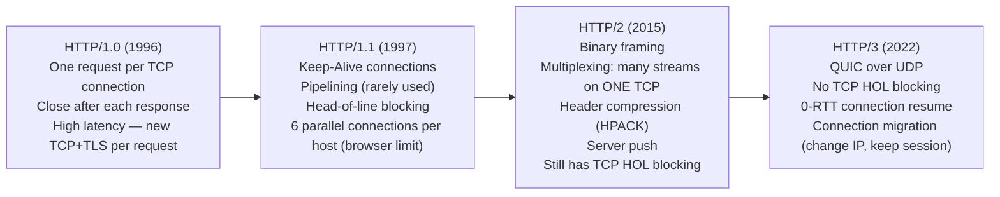

### Head-of-Line Blocking

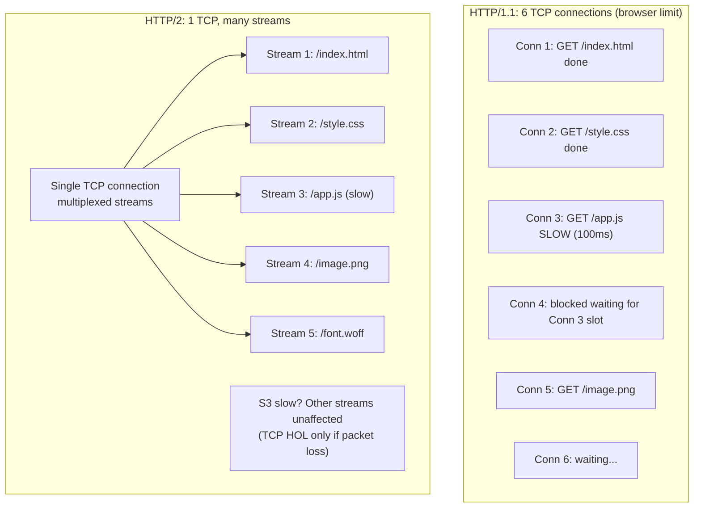

**HTTP/2 stream priority:** Each stream has a weight (1-256) and optional dependency. The server can prioritize CSS/JS over images. In practice, most servers use equal priority.

### HTTP/2 Binary Framing

```
HTTP/1.1 (text):                    HTTP/2 (binary frames):
GET /users HTTP/1.1                 HEADERS frame {
Host: api.example.com                 :method: GET
Accept: application/json              :path: /users
                                      :authority: api.example.com
                                      accept: application/json
                                    }
                                    DATA frame { body bytes }
```

Each HTTP/2 frame has:
- **Length** (3 bytes)
- **Type** (1 byte): HEADERS, DATA, SETTINGS, WINDOW_UPDATE, PING, GOAWAY
- **Flags** (1 byte): END_STREAM, END_HEADERS, PADDED, PRIORITY
- **Stream ID** (4 bytes): which request this belongs to (odd=client, even=server)

---

## TLS 1.2 vs TLS 1.3 — Visual Comparison

The core improvement in TLS 1.3: client sends its ECDHE key upfront, so the server derives encryption keys in the **first message** — saving one full round trip.

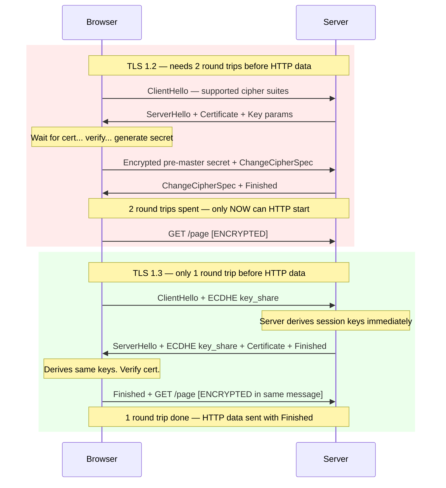

**Real-world impact at 50ms RTT:**
- TLS 1.2: 2 × 50ms = 100ms before first byte of response
- TLS 1.3: 1 × 50ms = 50ms before first byte of response
- TLS 1.3 0-RTT resumption: 0ms if reconnecting to same server within session window

---

## HTTP Request / Response Structure

```
Request:
GET /api/users?page=2 HTTP/2
Host: api.example.com
Authorization: Bearer eyJhbGc...
Accept: application/json
Content-Type: application/json
X-Request-ID: abc-123

{"filter": "active"}


Response:
HTTP/2 200 OK
Content-Type: application/json; charset=utf-8
Cache-Control: max-age=60, public
X-RateLimit-Remaining: 99
X-RateLimit-Reset: 1700000300

{"users": [...], "total": 150}
```

---

## HTTP Status Codes

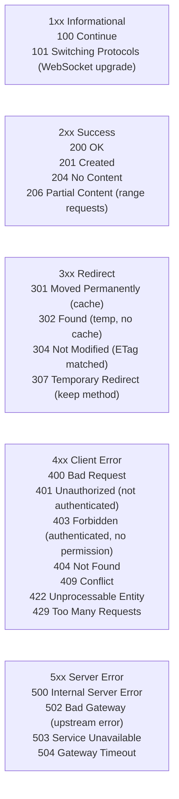

**401 vs 403:** 401 = you didn't authenticate (no token or invalid token). 403 = you authenticated but don't have permission.

**502 vs 503 vs 504:**
- 502: ALB/nginx got an invalid response from the upstream (app crashed, wrong protocol)
- 503: Service is down or overloaded (upstream refused connection)
- 504: Upstream timed out (app is alive but too slow)

---

## HTTP Methods

| Method | Idempotent | Safe | Body | Typical use |
|--------|-----------|------|------|-------------|
| GET | Yes | Yes | No | Read resource |
| POST | No | No | Yes | Create / trigger action |
| PUT | Yes | No | Yes | Full replace (create or overwrite) |
| PATCH | No | No | Yes | Partial update |
| DELETE | Yes | No | No | Delete resource |
| HEAD | Yes | Yes | No | Get headers only (check if modified) |
| OPTIONS | Yes | Yes | No | CORS preflight, list allowed methods |

**Idempotent** = calling it N times has same effect as calling it once. DELETE is idempotent (deleting already-deleted resource returns 404, not an error state). POST is not — calling POST twice creates two resources.

---

## Important HTTP Headers

### Request headers
```
Host: api.example.com              # required in HTTP/1.1+, which virtual host
Authorization: Bearer <token>      # auth credentials
Content-Type: application/json     # body format
Accept: application/json           # what formats client accepts
Accept-Encoding: gzip, br          # compression algorithms client supports
User-Agent: Mozilla/5.0...         # client identification
X-Request-ID: uuid                 # for distributed tracing
Cookie: session=abc123             # client sends stored cookies
```

### Response headers
```
Content-Type: application/json     # body format
Content-Encoding: gzip             # body is compressed
Cache-Control: max-age=3600, public # cache for 1 hour
ETag: "abc123"                     # content hash for conditional requests
Last-Modified: Wed, 21 Oct 2024    # when resource last changed
Set-Cookie: session=abc; Secure; HttpOnly; SameSite=Strict
X-RateLimit-Limit: 100             # rate limit max
X-RateLimit-Remaining: 87          # requests left
Strict-Transport-Security: max-age=31536000; includeSubDomains  # HSTS
Access-Control-Allow-Origin: *     # CORS
```

### Caching with ETag

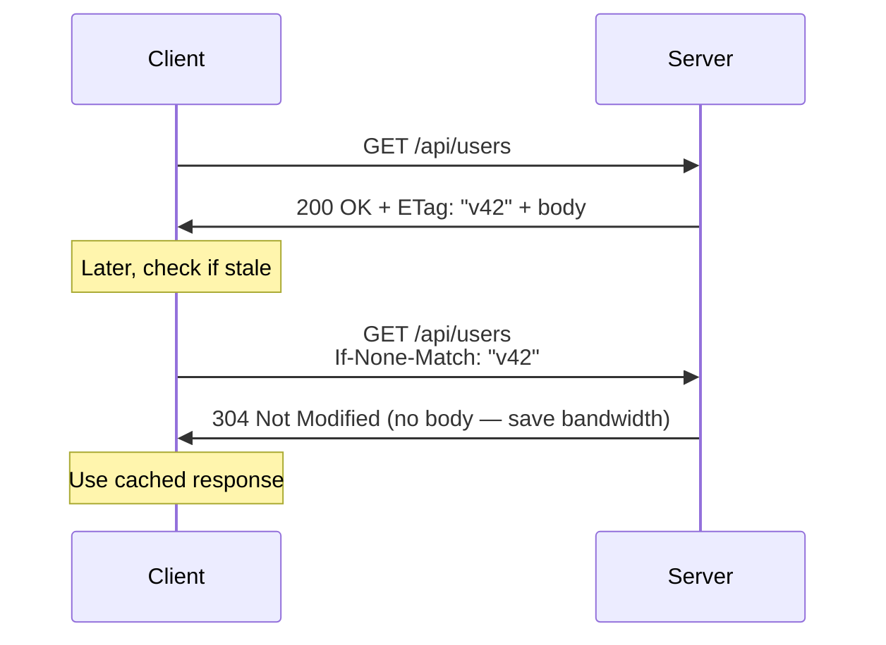

---

## CORS — Cross-Origin Resource Sharing

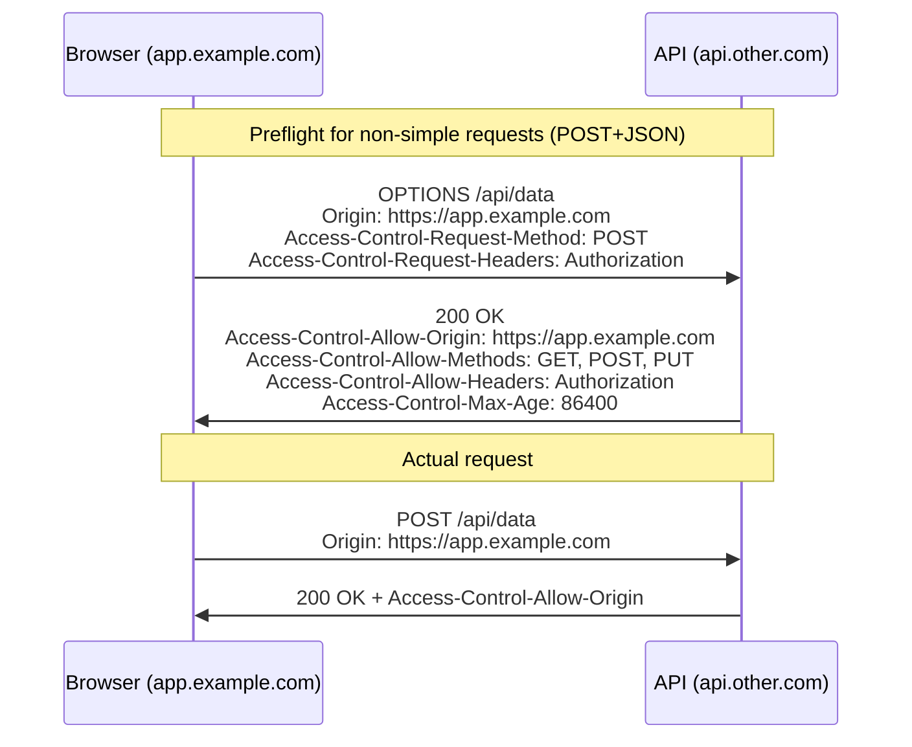

**Simple requests** (no preflight): GET/HEAD/POST with `Content-Type: text/plain` or `application/x-www-form-urlencoded` or `multipart/form-data`.

**Non-simple** (needs preflight): Any request with `Authorization` header, `Content-Type: application/json`, or methods like PUT/DELETE/PATCH.
