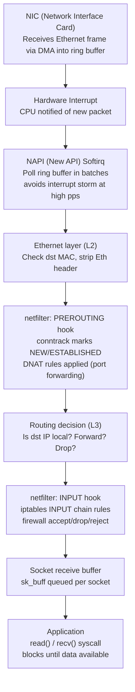
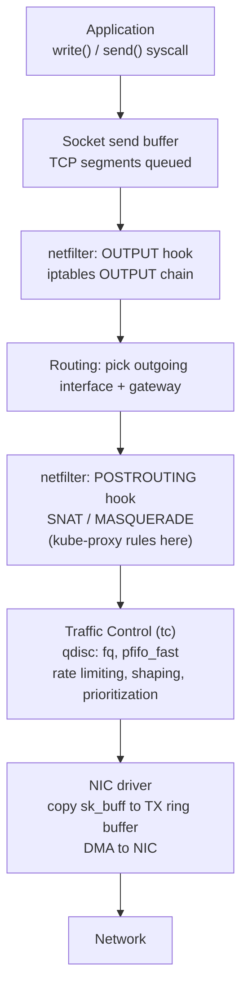
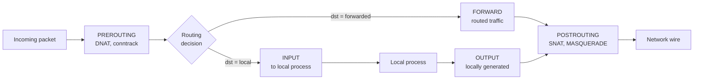
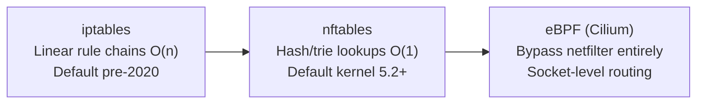
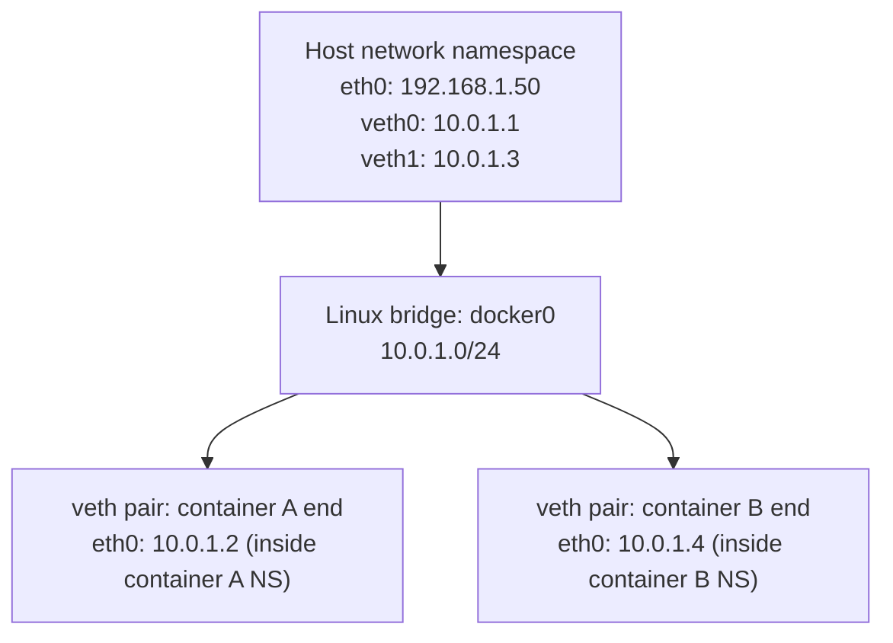
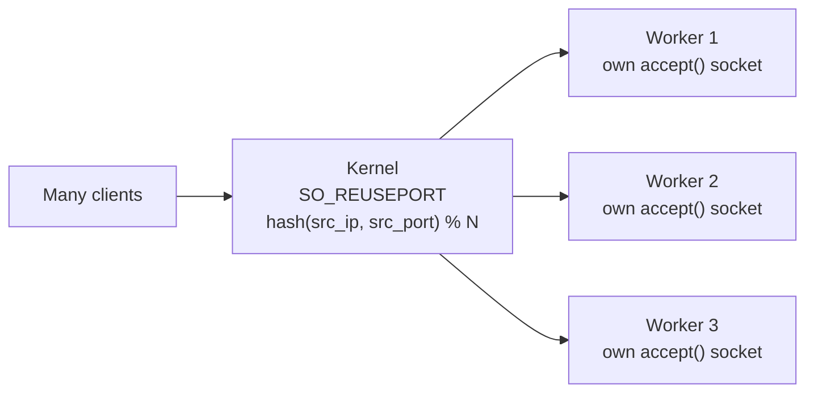

# Linux Networking Internals

How Linux handles network traffic — from NIC to application. Understanding this is essential for diagnosing performance issues, configuring firewalls, and running high-throughput services.

> For kernel TCP stack details (sockets, accept queue, TIME_WAIT, netfilter, TCP tuning), see also [`linux/networking.md`](../linux/networking.md).

---

## Linux Network Stack — Packet RX Path



**DMA (Direct Memory Access):** NIC writes packets directly to kernel memory without CPU involvement. CPU is interrupted only after a batch is written — not per-packet.

**sk_buff:** The kernel's packet representation. A single struct that travels through every layer, adding/removing headers without copying data (pointer manipulation only).

---

## Packet TX Path (Sending)



---

## netfilter Hook Points



**Five hooks — what each is used for:**

| Hook | Used for |
|------|---------|
| `PREROUTING` | DNAT (port forwarding, kube-proxy ClusterIP), conntrack entry creation |
| `INPUT` | Firewall rules for traffic destined for this host |
| `FORWARD` | Firewall rules for routed/forwarded traffic (bridges, containers, K8s pods) |
| `OUTPUT` | Rules for locally-generated traffic |
| `POSTROUTING` | SNAT/MASQUERADE (NAT outbound traffic, kube-proxy pod IP → node IP) |

---

## conntrack — Connection Tracking

conntrack maintains a state table for every connection. Stateful firewalls use this — "allow ESTABLISHED,RELATED" means reply packets are auto-allowed.

```bash
# View connection tracking table
cat /proc/net/nf_conntrack
# or
conntrack -L

# Example entry:
# ipv4 2 tcp 6 431999 ESTABLISHED \
#   src=10.0.1.5 dst=142.250.182.46 sport=52413 dport=443 \
#   src=142.250.182.46 dst=10.0.1.5 sport=443 dport=52413 \
#   [ASSURED] mark=0 zone=0

# conntrack table limits
sysctl net.netfilter.nf_conntrack_max          # default 131072
sysctl net.netfilter.nf_conntrack_count        # current entries

# Alert: if count approaches max, new connections get DROPPED silently
# This causes the infamous 5-second DNS timeout (UDP DNS hits full conntrack table)
```

**conntrack states:**
- `NEW` — first packet, no response seen
- `ESTABLISHED` — both directions seen
- `RELATED` — related to existing connection (FTP data connection, ICMP errors)
- `INVALID` — doesn't match any known connection

---

## iptables vs nftables vs eBPF



**K8s and iptables scale problem:** kube-proxy writes one iptables rule per Service endpoint. At 10,000 Services × 10 pods = 100,000 rules — every packet evaluated linearly → high CPU.

**Switch to IPVS or Cilium** at scale (see `kubernetes/kube-proxy-modes.md`).

---

## Network Namespaces (Containers)

Every container gets its own network namespace — isolated network stack including interfaces, routing table, iptables rules, and port space.



```bash
# List network namespaces
ip netns list

# Inspect a container's network namespace
PID=$(docker inspect --format '{{.State.Pid}}' my-container)
nsenter --net=/proc/$PID/ns/net ip addr     # see container's interfaces
nsenter --net=/proc/$PID/ns/net ss -tlnp    # see container's listening sockets

# Manually create a network namespace (for learning)
ip netns add test-ns
ip netns exec test-ns ip addr show
```

---

## Virtual Ethernet Pairs (veth)

A `veth` pair is two connected virtual interfaces — what goes in one end comes out the other. Used to connect a container's namespace to the host bridge.

```bash
# Create a veth pair
ip link add veth0 type veth peer name veth1

# Move veth1 into a network namespace
ip link set veth1 netns my-container

# Assign IPs
ip addr add 10.0.0.1/24 dev veth0
ip netns exec my-container ip addr add 10.0.0.2/24 dev veth1

# Bring both up
ip link set veth0 up
ip netns exec my-container ip link set veth1 up

# Now 10.0.0.1 <--> 10.0.0.2 are connected
```

---

## SO_REUSEPORT — High-Throughput Accept

By default, one process calls `accept()` on one socket — a single-threaded bottleneck. `SO_REUSEPORT` lets multiple processes/goroutines each bind the same port. The kernel load-balances incoming connections across all of them.



```bash
# Verify SO_REUSEPORT is in use (nginx, Go apps with SO_REUSEPORT)
ss -tlnp | grep :8080
# Multiple PIDs on same port = SO_REUSEPORT in use
```

---

## Key Networking Commands (Linux)

```bash
# Interface info
ip addr show                         # all interfaces and IPs
ip link show eth0                    # interface stats (errors, drops)
ethtool eth0                         # NIC speed, duplex, driver

# Routing
ip route show                        # routing table
ip route get 8.8.8.8                 # which interface/gateway for a specific dst
traceroute -n 8.8.8.8               # hop-by-hop path

# Connections
ss -tlnp                             # TCP listening sockets with PID
ss -tan | grep ESTABLISHED | wc -l   # established TCP count
ss -s                                # socket state summary
netstat -i                           # interface packet/error counts

# Packet capture
tcpdump -i eth0 port 443 -w cap.pcap # capture to file
tcpdump -i eth0 'tcp[tcpflags] & tcp-syn != 0'  # SYN packets only
tcpdump -i eth0 host 8.8.8.8        # traffic to/from specific host

# netfilter
iptables -L -n -v                    # all rules with packet counts
iptables -t nat -L PREROUTING -n -v  # NAT PREROUTING rules (kube-proxy)
conntrack -L | wc -l                 # conntrack table size

# Performance
ethtool -S eth0                      # NIC hardware counters (missed, dropped)
cat /proc/net/softnet_stat           # softirq drops (column 2 = drops)
```

---

## Common Linux Networking Issues

| Symptom | Likely cause | Check |
|---------|-------------|-------|
| Connections timing out silently | conntrack table full | `sysctl net.netfilter.nf_conntrack_count` vs max |
| DNS 5-second delay | conntrack full, UDP DNS dropped | same as above |
| High CPU on softirq | Network interrupt storm | `/proc/net/softnet_stat`, enable RSS/RPS |
| Packet drops at NIC | Ring buffer overflow | `ethtool -S eth0 \| grep drop`, increase ring: `ethtool -G eth0 rx 4096` |
| TCP connection refused | Port not listening / firewall | `ss -tlnp`, `iptables -L INPUT -n` |
| Port exhaustion | TIME_WAIT or ephemeral ports | `ss -s`, `sysctl net.ipv4.ip_local_port_range` |
